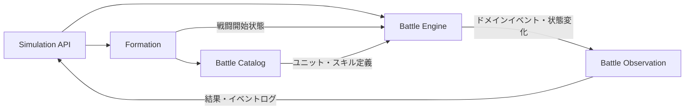

# 境界づけられたコンテキスト

## 目的

本書は、戦闘シミュレーションに関わるモデルの境界、責務および依存方向を定義する。

## 結論

現時点では、システム全体を単一の境界づけられたコンテキストである **Battle Simulation Context** とする。

本アプリケーションは戦闘シミュレーションだけを提供し、ユニット・スキルの管理、戦闘中のプレイヤー操作、過去の戦闘の検索や完全再現を扱わない。このため、編成、マスターデータ、イベントログを独立したコンテキストへ分割する積極的な理由はない。

ただし、モデルの責務を明確にするため、コンテキスト内部をモジュールへ分割する。

## コンテキスト境界

### コンテキストが受け取るもの

- 味方陣営のユニットIDと配置位置
- 敵陣営のユニットIDと配置位置
- 規定ターン数
- 各編成につき最大6件のメモリーID

### コンテキストが所有するもの

- ユニット、スキル、メモリーの定義
- 編成と配置の検証規則
- 戦闘開始時ステータスの算出規則
- ターン、行動順、スキル発動、効果解決の規則
- 勝敗判定
- 戦闘中に発生するイベントと状態履歴

### コンテキストが返すもの

- 勝敗と終了理由
- 終了ターン
- 最終戦闘状態
- 行動単位の詳細イベントログ
- イベント時点の状態または状態差分

## 内部モジュール

### Battle Catalog

ユニット、スキル、メモリーなど、アプリケーション内に保持する定義データを提供する。

責務：

- IDによる定義の解決
- ASの定義順の保持
- PSごとの発動タイミングと発動条件の保持
- 定義データ自体の整合性保証
- 戦闘開始に必要な不変データの提供

定義のCRUDは提供しない。戦闘中の可変状態も持たない。

### Formation

APIリクエストで受け取ったユニットと配置を検証し、戦闘開始可能な編成を組み立てる。

責務：

- 1～5体という人数制約
- 横3列、縦2列の配置制約
- 配置重複の防止
- 同一ユニットIDを持つ複数の参加枠を、別の戦闘ユニットとして生成
- 配置適性の判定
- 属性構成と編成ボーナスの計算
- コミカルの最適属性評価とクレバーボーナスの累積
- メモリー効果対象、固定値補正、割合補正の判定

Formationは独立したライフサイクルや永続化を持たず、戦闘シミュレーションへの入力としてのみ存在する。

### Battle Engine

本システムの中核ドメイン。戦闘開始状態を受け取り、勝敗が決まるまで状態を遷移させる。

責務：

- 戦闘、ターン、1行動のライフサイクル
- AP、PP、ユニットごとに異なる最大値を持つEXゲージの管理
- 行動順キューの生成、消費、部分再計算とAS・EXの行動種別予約
- ASの定義順による選択
- ドメインイベントとPSごとの発動タイミングを対応づけた発動条件判定
- PSの先制攻撃優先・速度順、1行動1回の制限、新規候補を直ちに処理する連鎖解決
- 3×4の共通座標、マンハッタン距離、前列、絶対的な左列によるターゲット選択
- 最終値切り捨て、最低1ダメージ、物理・EN区分を含むダメージ解決
- タイプ別シールド、リンクダメージ、付与時攻撃力を記録する継続ダメージの解決
- 重複あり・重複なし効果を合成した戦闘中ステータスの計算
- 効果インスタンスごとの行動・ターン単位期間、失効、重複なし効果の次点繰り上げ管理
- 設定した行動・ターン内では減算しないクールタイムと、開始・効果発動を別々の1行動とするチャージの管理
- 戦闘不能と勝敗の判定

行動順キューはターン開始時と、全員が1回ずつ行動してキューが空になった時点で生成する。生成時のEXゲージが満タンならEX、それ以外ならASを各ユニットの行動種別として予約する。行動速度が変化した場合は、キューに残っている未行動ユニットだけを新しい速度順に並べ直し、予約済みの行動種別は保持する。戦闘不能者はキューから即時に除去する。

1行動の間は、戦闘ユニットとPSの組み合わせからなる発動済み集合を保持する。PSは、Battle Engineが発行するドメインイベントと各PSの発動タイミングを照合して候補にする。PSから新しい候補が誘発された場合は既存候補より先に直ちに処理し、新しい連鎖を解決してから元の候補処理へ戻る。発動済み集合にあるPSは候補から除外して循環を防ぐ。スキル解決途中で使用者が戦闘不能になった場合、そのスキルの未解決の効果を中断する。

### Battle Observation

Battle Engineで確定したドメイン上の出来事を、APIレスポンス用のイベントログと状態履歴へ変換する。

責務：

- イベントへの通し番号および発生順の付与
- ターン、行動、発生源、対象の記録
- イベント前後の状態または状態差分の記録
- 最終結果の組み立て

ログは戦闘進行の事実を観測するものであり、ログ出力の都合でBattle Engineのルールを変更しない。

## モジュール間の依存方向

依存関係の原則：

- Battle EngineはHTTP、JSON、データベースなどの技術的関心事へ依存しない。
- Battle EngineはAPIリクエストを直接扱わず、検証済みの戦闘開始状態を扱う。
- Battle Catalogの定義を戦闘中に直接変更しない。
- Battle ObservationはBattle Engineが発行した事実を記録し、戦闘判断を行わない。

## コンテキスト内部で共有する言語

全モジュールは [01\_ユビキタス言語.md](./01_ユビキタス言語.md) の用語を使用する。

特に次の区別を維持する。

- ユニット定義と戦闘ユニット
- 編成時の配置と戦闘中の状態
- スキル使用とスキル効果の解決
- 1回のスキル発動と1行動
- ドメインイベントとAPI用イベントログ

## 外部との境界

### Simulation API

APIは外部表現をコンテキスト内の型へ変換する境界である。

- ユニットIDや配置値を値オブジェクトへ変換する。
- 入力形式の不備をドメインへ到達する前に拒否する。
- ドメイン上の検証エラーをAPIエラーへ変換する。
- 戦闘結果とログをレスポンス形式へ変換する。

### 永続化

現要件では戦闘の保存・検索および完全再現を必要としないため、戦闘集約を永続化するコンテキストやリポジトリは設けない。

アプリケーション内のマスターデータをファイル、コード、データベースのどれで保持するかはインフラストラクチャ上の判断であり、Battle Simulation Contextのモデルを変更しない。

## 将来分割を検討する条件

次の要件が追加された場合は、独立したコンテキストへの分割を再検討する。

| 追加要件                                   | 分割候補                       |
| ------------------------------------------ | ------------------------------ |
| 管理画面などからユニット・スキルを更新する | Battle Master Data Context     |
| 編成の保存、共有、検索を行う               | Formation Management Context   |
| 戦闘履歴の永続化、検索、統計集計を行う     | Battle History Context         |
| 乱数を含む戦闘を完全再生する               | Battle Replay Context          |
| 戦闘途中にプレイヤーが操作する             | Battle Session Contextの再設計 |

## 次の設計への申し送り

後続のドメインモデル設計では、Battle Engineを中心に以下を検討する。

- 戦闘全体を一つの集約として整合性を保つ範囲
- 行動予定とPS連鎖を扱うイベントキュー
- 戦闘状態と不変な定義データの分離
- ログへ公開するドメインイベント
- [02\_仕様確認事項.md](./02_仕様確認事項.md) の保留事項が不変条件へ与える影響
