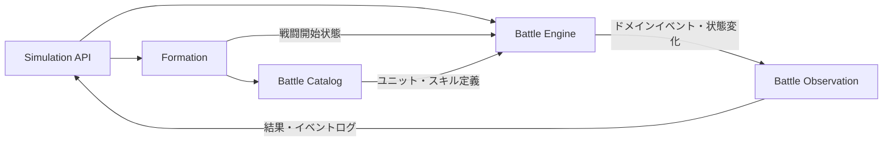

# 境界づけられたコンテキスト

## 目的

本書は、戦闘シミュレーションに関わるモデルの境界、責務および依存方向を定義する。

## 結論

現時点では、システム全体を単一の境界づけられたコンテキストである **Battle Simulation Context** とする。

本アプリケーションは戦闘シミュレーションだけを提供し、ユニット・スキルの管理、戦闘中のプレイヤー操作、過去の戦闘の検索や完全再現を扱わない。このため、編成、マスターデータ、イベントログを独立したコンテキストへ分割する積極的な理由はない。

ただし、モデルの責務を明確にするため、コンテキスト内部をモジュールへ分割する。

## コンテキスト境界

### コンテキストが受け取るもの

- 味方陣営のユニットIDと配置位置
- 敵陣営のユニットIDと配置位置
- 規定ターン数
- 各編成につき最大6件のメモリーID

### コンテキストが所有するもの

- ユニット、スキル、メモリーの定義
- 編成と配置の検証規則
- 戦闘開始時ステータスの算出規則
- ターン、行動順、スキル発動、効果解決の規則
- 勝敗判定
- 戦闘中に発生するイベントと状態履歴

### コンテキストが返すもの

- 勝敗と終了理由
- 終了ターン
- 最終戦闘状態
- 行動単位の詳細イベントログ
- イベント時点の状態または状態差分

## 内部モジュール

### Battle Catalog

ユニット、スキル、メモリーなど、アプリケーション内に保持する定義データを提供する。

責務：

- IDによる定義の解決
- ASの定義順の保持
- PSごとの発動タイミングと発動条件の保持
- 定義データ自体の整合性保証
- 戦闘開始に必要な不変データの提供

定義のCRUDは提供しない。戦闘中の可変状態も持たない。

### Formation

APIリクエストで受け取ったユニットと配置を検証し、戦闘開始可能な編成を組み立てる。

責務：

- 1～5体という人数制約
- 横3列、縦2列の配置制約
- 配置重複の防止
- 同一ユニットIDを持つ複数の参加枠を、別の戦闘ユニットとして生成
- 配置適性の判定
- 属性構成と編成ボーナスの計算
- コミカルの最適属性評価とクレバーボーナスの累積
- メモリー効果対象、固定値補正、割合補正の判定

Formationは独立したライフサイクルや永続化を持たず、戦闘シミュレーションへの入力としてのみ存在する。

### Battle Engine

本システムの中核ドメイン。戦闘開始状態を受け取り、勝敗が決まるまで状態を遷移させる。

責務：

- 戦闘、ターン、1行動のライフサイクル
- AP、PP、ユニットごとに異なる最大値を持つEXゲージの管理
- 行動順キューの生成、消費、部分再計算とAS・EXの行動種別予約
- ASの定義順による選択
- ドメインイベントとPSごとの発動タイミングを対応づけた発動条件判定
- PSの先制攻撃優先・速度順、1行動1回の制限、新規候補を直ちに処理する連鎖解決
- 3×4の共通座標、マンハッタン距離、前列、絶対的な左列によるターゲット選択
- 最終値切り捨て、最低1ダメージ、物理・EN区分を含むダメージ解決
- タイプ別シールド、リンクダメージ、付与時攻撃力を記録する継続ダメージの解決
- 重複あり・重複なし効果を合成した戦闘中ステータスの計算
- 効果インスタンスごとの行動・ターン単位期間、失効、重複なし効果の次点繰り上げ管理
- 設定した行動・ターン内では減算しないクールタイムと、開始・効果発動を別々の1行動とするチャージの管理
- 戦闘不能と勝敗の判定

行動順キューはターン開始時と、全員が1回ずつ行動してキューが空になった時点で生成する。生成時のEXゲージが満タンならEX、それ以外ならASを各ユニットの行動種別として予約する。行動速度が変化した場合は、キューに残っている未行動ユニットだけを新しい速度順に並べ直し、予約済みの行動種別は保持する。戦闘不能者はキューから即時に除去する。

1行動の間は、戦闘ユニットとPSの組み合わせからなる発動済み集合を保持する。PSは、Battle Engineが発行するドメインイベントと各PSの発動タイミングを照合して候補にする。PSから新しい候補が誘発された場合は既存候補より先に直ちに処理し、新しい連鎖を解決してから元の候補処理へ戻る。発動済み集合にあるPSは候補から除外して循環を防ぐ。スキル解決途中で使用者が戦闘不能になった場合、そのスキルの未解決の効果を中断する。

### Battle Observation

Battle Engineで確定したドメイン上の出来事を、APIレスポンス用のイベントログと状態履歴へ変換する。

責務：

- イベントへの通し番号および発生順の付与
- ターン、行動、発生源、対象の記録
- イベント前後の状態または状態差分の記録
- 最終結果の組み立て

ログは戦闘進行の事実を観測するものであり、ログ出力の都合でBattle Engineのルールを変更しない。

## モジュール間の依存方向



依存関係の原則：

- Battle EngineはHTTP、JSON、データベースなどの技術的関心事へ依存しない。
- Battle EngineはAPIリクエストを直接扱わず、検証済みの戦闘開始状態を扱う。
- Battle Catalogの定義を戦闘中に直接変更しない。
- Battle ObservationはBattle Engineが発行した事実を記録し、戦闘判断を行わない。

## 内部モジュールのコード配置と依存方向

`#132` M6〜M8の実装前に、上記の内部モジュール（Battle Catalog、Formation、Battle Engine、Battle Observation）をコード上のディレクトリ境界として固定する。Bounded Contextは分割せず、`domain` / `application` / `infrastructure` / `presentation` / `bootstrap` のLayer構成も維持する。分割対象はLayer内部のモジュール配置だけである。

### 目標Domain構成

Milestone名ではなく、M9以降も残るDomain capabilityをモジュール境界にする。空ディレクトリや実体のない抽象化は先行作成せず、既存または直近Milestoneで必要なモジュールから移行する。

```text
apps/api/src/domain/
├── shared/       # brand、deepFreeze、error、validate、ID、Side・Percentageなど横断的値オブジェクト
├── ports/        # BattleCatalog、RandomSource、Clock、BattleIdGeneratorなど
├── catalog/
│   ├── definitions/  # Unit/Skill/Effect/Memory/Formula/Condition/Trigger等の不変定義とID
│   ├── integrity/    # 参照整合性・定義順検証
│   └── capability/   # CapabilityDefinitionと利用可否判定
├── formation/    # FormationFactoryによる編成組み立て（battle/modelのみに依存）
└── battle/
    ├── model/     # Battle集約が保持する状態・値オブジェクトと、それに対する純粋な計算
    ├── outcome/   # 勝敗判定
    ├── targeting/ # 対象候補生成・座標比較・TargetBinding
    ├── action/    # ActionQueue、行動選択
    ├── skill/     # Skill/EffectSequence実行
    ├── events/    # Domain Event型、記録、StateDelta
    ├── combat/    # Hit、Critical、Damage
    ├── lifecycle/ # Battle・Turn・Actionの進行調整（`Battle`本体、`action-phase-resolver`、状態Snapshot）
    ├── triggering/ # PS/Memory候補・発動照合・解決stack（M6以降に新設）
    └── effects/   # AppliedEffect、期間、重複、Marker（M7以降に新設）
```

`triggering`・`effects` は現時点で対応する実装がなく、それぞれM6・M7着手時に新設する。`formation` は現時点で `FormationFactory` の粒度以上に分割する実体がないため、`model` / `validation` / `positioning` / `bonuses` のサブディレクトリは作らない（詳細は次項「現行ファイルの移行先一覧」を参照）。

### モジュールの依存順序

現行コードの実際のimportを検証した結果、次の狭義の一方向順序（左が依存され、右が依存する）だけが成立し、これ以外の向きのimportは存在しない。

```text
shared・catalog・ports
  → battle/model
    → battle/outcome
    → battle/targeting（battle/modelに依存）
      → battle/action（battle/model・battle/targetingに依存）
      → battle/skill（battle/model・battle/targetingに依存）
        → battle/events（battle/model・battle/action・battle/outcomeに依存）
          → battle/combat（battle/model・battle/skill・battle/targeting・battle/eventsに依存）
            → battle/lifecycle（上記すべてに依存する調整役）
  → formation（battle/modelにだけ依存する）
```

`triggering`・`effects` はM6・M7着手時にこの順序へ追加する（`lifecycle`の直下、`combat`と同格の新規ノードとして接続する想定）。

### 目標Application／Presentation構成

```text
apps/api/src/application/
├── simulation/   # SimulateBattleCommand、UseCase、Preflight、ResultAssembler、各種Mapper
├── catalog/      # GetBattleSimulationCatalogUseCase、Catalogレスポンス変換
├── observation/  # BattleObservation、BattleLogEvent、ログ投影
├── contracts/    # request・response・catalog・battle-log・error（旧http-contract）、ApplicationError等の外部契約型
└── shared/       # 複数サブモジュールが共有するApplicationユーティリティ（現時点では空、先行作成しない）

apps/api/src/presentation/http/
├── routes/                    # build-server.tsから抽出するRoute登録
├── schemas/
│   ├── simulation/
│   ├── battle-log/
│   ├── catalog/
│   ├── health/
│   └── error/                 # 全エラーステータス共通のErrorResponse schema
└── protocol/
    ├── cors/
    ├── request-id/
    ├── content-negotiation/
    ├── etag/
    └── error-response/        # ApplicationError→HTTP変換とsetErrorHandler登録
```

Application／Presentationの再配置と分割は本Issueの PR4 で行った。UIは既にfeature単位で分割されているため対象外とし、Infrastructureは既存の `catalog` / `worker` / `deploy` / `random` / `identity` / `time` 境界を維持する。

### モジュール依存規則

- `catalog` は `formation` / `battle` に依存しない。
- `battle/model` はBattle集約が保持する状態・値オブジェクトと、それに対する純粋な計算（`FormationBonus`／`CombatStats`／`GlobalCoordinate`／`Cooldown`／`Charge`の型と計算関数を含む）だけを持ち、他のどの`battle/*`サブモジュールにも依存しない。他のすべての`battle/*`サブモジュールは`battle/model`に依存してよい一方向とする。
- `formation` は `battle/model` にだけ依存する。`battle/model`以外の`battle/*`（`targeting`・`action`・`combat`など）や、`battle/model`以外から`formation`への依存（逆方向）は禁止する。
- `battle/lifecycle` はAction、Skill、Combat、Events等の下位モジュールを調整する最上位の一方向消費者であり、他のどの`battle/*`サブモジュールも`battle/lifecycle`に依存しない。
- `battle/events` は`battle/model`・`battle/action`（`ReservedActionKind`等の型）・`battle/outcome`（`VictoryResult`等の型）を参照してよいが、`battle/combat`・`battle/lifecycle`・`battle/triggering`・`battle/effects`には依存しない。Battle ObservationやHTTP event logのようなApplication/Presentation層にも依存しない。
- `triggering` はDomain Eventを入力とするが、Battle ObservationやHTTP event logへ依存しない。
- `effects` と `combat` は相互import禁止とする。
- `presentation` はApplicationの公開contract/portだけを参照し、Domainへ直接依存しない既存規則を維持する。
- モジュール外から利用する型・操作を明示し、無制限なbarrel exportで内部実装を公開しない。

「モジュールの依存順序」に示した一方向の連鎖（`model → outcome/targeting → action/skill → events → combat → lifecycle`、および`model → formation`）が、上記規則の具体的な適用結果である。

上記の禁止依存は、既存のLayer間ESLint規則（`no-restricted-imports`）と同様の仕組みでモジュール間にも追加する（PR5で導入、[12\_テスト戦略.md](./12_テスト戦略.md) 参照）。

### 現行ファイルの移行先一覧（PR2/PR4対象）

機械的移動（PR2: Domain、PR4: Application/Presentation）の対象と移行先を一覧化する。`*.test.ts` は対応する実装ファイルと同じ移行先へ帯同する。

#### `domain/catalog/` → `domain/catalog/*`

| 現行ファイル                    | 移行先                                    |
| ------------------------------- | ----------------------------------------- |
| `catalog-enums.ts`              | `catalog/definitions/`                    |
| `catalog-event-types.ts`        | `catalog/definitions/`                    |
| `catalog-ids.ts`                | `catalog/definitions/`                    |
| `unit-definition.ts`            | `catalog/definitions/`                    |
| `skill-definition.ts`           | `catalog/definitions/`                    |
| `effect-sequence.ts`            | `catalog/definitions/`                    |
| `effect-action-definition.ts`   | `catalog/definitions/`（PR3でさらに分割） |
| `formula-definition.ts`         | `catalog/definitions/`                    |
| `condition-definition.ts`       | `catalog/definitions/`                    |
| `duration-definition.ts`        | `catalog/definitions/`                    |
| `memory-definition.ts`          | `catalog/definitions/`                    |
| `target-selector-definition.ts` | `catalog/definitions/`                    |
| `trigger-definition.ts`         | `catalog/definitions/`                    |
| `references.ts`                 | `catalog/definitions/`                    |
| `catalog-integrity.ts`          | `catalog/integrity/`                      |
| `capability-definition.ts`      | `catalog/capability/`                     |
| `capability-availability.ts`    | `catalog/capability/`                     |

#### `domain/battle/` → `domain/formation/*` / `domain/battle/*`

実際のimportを検証した結果、次の値オブジェクト・純粋計算ファイルは、Formationの計算（`FormationFactory`）にも、Battle集約自身のフィールド（`BattleParty`／`BattleUnit`）にも使われており、機械的移動の時点では型定義とロジックが同一ファイルに同居している。型と関数を分離しない限りモジュールを分けると循環依存になるため、本Issueのスコープ（責務変更をしないPR2）では、これらすべてを`battle/model`へ配置する。将来、型と計算ロジックを分離する際に、計算部分を`formation/`や各`battle/*`サブモジュールへ再配置する余地は残すが、本Issueでは行わない。

| 現行ファイル                                   | 移行先                                                                                                                               |
| ---------------------------------------------- | ------------------------------------------------------------------------------------------------------------------------------------ |
| `side.ts`                                      | `shared/`                                                                                                                            |
| `percentage.ts`                                | `shared/`                                                                                                                            |
| `events/event-ids.ts`                          | `shared/`（`ActionId`等はBattle全体で使う識別子であり`shared/ids.ts`と同種のbranded typeのため）                                     |
| `formation-input.ts`                           | `battle/model/`（`BattleParty`／`BattleUnit`が`FormationPosition`型を直接保持するため）                                              |
| `formation-slot.ts`                            | `battle/model/`（`FormationPosition`・`GlobalCoordinate`・`Side`のみに依存する値オブジェクトのため。現状どこからも参照されていない） |
| `global-coordinate.ts`                         | `battle/model/`（同上、`GlobalCoordinate`型を直接保持するため）                                                                      |
| `position-aptitude-policy.ts`                  | `battle/model/`（`starting-combat-stats.ts`だけが利用する純粋計算）                                                                  |
| `formation-bonus-calculator.ts`                | `battle/model/`（`BattleParty.formationBonus`の型を`battle-party.ts`が直接参照するため）                                             |
| `starting-combat-stats.ts`                     | `battle/model/`（`BattleParty`／`BattleUnit`が`CombatStats`型を直接保持するため）                                                    |
| `combat-stat-calculator.ts`                    | `battle/model/`（`starting-combat-stats.ts`が利用する純粋計算）                                                                      |
| `effect-stacking-policy.ts`                    | `battle/model/`（`combat-stat-calculator.ts`が利用する純粋計算。M7の`AppliedEffect`重複解決とは別物として扱う）                      |
| `charge-state.ts`                              | `battle/model/`（`BattleUnit`の`ActiveCharge`型）                                                                                    |
| `cooldown-state.ts`                            | `battle/model/`（`BattleUnit`の`CooldownMap`型と、`battle.ts`／`action-phase-resolver.ts`が呼ぶ減算・操作関数）                      |
| `formation-factory.ts`                         | `formation/`（`battle/model`にだけ依存する）                                                                                         |
| `battle-party.ts`                              | `battle/model/`                                                                                                                      |
| `battle-unit.ts`                               | `battle/model/`                                                                                                                      |
| `battle-status.ts`                             | `battle/model/`                                                                                                                      |
| `battle-definitions.ts`                        | `battle/model/`                                                                                                                      |
| `resource-gauge.ts`                            | `battle/model/`                                                                                                                      |
| `turn-limit.ts`                                | `battle/model/`                                                                                                                      |
| `victory-policy.ts`                            | `battle/outcome/`                                                                                                                    |
| `position-policy.ts`                           | `battle/targeting/`                                                                                                                  |
| `target-selection-policy.ts`                   | `battle/targeting/`                                                                                                                  |
| `action-queue.ts`                              | `battle/action/`                                                                                                                     |
| `action-order-policy.ts`                       | `battle/action/`                                                                                                                     |
| `action-selection-policy.ts`                   | `battle/action/`                                                                                                                     |
| `skill-resolution-service.ts`                  | `battle/skill/`                                                                                                                      |
| `events/domain-event.ts`                       | `battle/events/`                                                                                                                     |
| `events/event-recorder.ts`                     | `battle/events/`                                                                                                                     |
| `events/state-delta.ts`                        | `battle/events/`                                                                                                                     |
| `attribute-affinity-policy.ts`                 | `battle/combat/`                                                                                                                     |
| `hit-policy.ts`                                | `battle/combat/`                                                                                                                     |
| `critical-policy.ts`                           | `battle/combat/`                                                                                                                     |
| `damage-calculator.ts`                         | `battle/combat/`                                                                                                                     |
| `damage-application-service.ts`                | `battle/combat/`                                                                                                                     |
| `battle.ts`                                    | `battle/lifecycle/`                                                                                                                  |
| `turn-state.ts`                                | `battle/lifecycle/`                                                                                                                  |
| `action-phase-resolver.ts`                     | `battle/lifecycle/`（PR3で分割）                                                                                                     |
| `cooldown-manipulation-application-service.ts` | `battle/lifecycle/`（`EventRecorder`と`skill-resolution-service`の双方に依存するため`action`ではなく`lifecycle`に置く）              |
| `events/battle-state-snapshot.ts`              | `battle/lifecycle/`（`Battle`本体を直接読み取るスナップショット関数であり、`battle/events`の他ファイルは`Battle`に依存しないため）   |
| `events/state-delta-reducer.ts`                | `battle/lifecycle/`（`battle-state-snapshot.ts`が定義する型を消費するため同じ配置とする）                                            |

`domain/shared/`・`domain/ports/` は現行のまま（`events/event-ids.ts`のみ`shared/`へ追加移動する）。`domain/index.ts` は内容のない1行ファイルであり、公開境界として機能していないため、モジュールごとに必要な公開エクスポートだけを持つ形へPR5で置き換えるか削除する。

#### `application/` → `application/*`（PR4対象）

| 現行ファイル                                   | 移行先                                                               |
| ---------------------------------------------- | -------------------------------------------------------------------- |
| `simulate-battle-command.ts`                   | `simulation/`                                                        |
| `simulate-battle-request-mapper.ts`            | `simulation/`                                                        |
| `simulate-battle-response-mapper.ts`           | `simulation/`                                                        |
| `simulate-battle-use-case.ts`                  | `simulation/`                                                        |
| `simulation-preflight-validator.ts`            | `simulation/`                                                        |
| `simulation-result-assembler.ts`               | `simulation/`                                                        |
| `simulation-execution-context.ts`              | `simulation/`                                                        |
| `simulation-capacity-exceeded-error.ts`        | `simulation/`                                                        |
| `formation-input-mapper.ts`                    | `simulation/`                                                        |
| `battle-observation.ts`                        | `observation/`                                                       |
| `battle-log-event.ts`                          | `observation/`                                                       |
| `battle-log-projection.ts`                     | `observation/`                                                       |
| `get-battle-simulation-catalog-use-case.ts`    | `catalog/`                                                           |
| `battle-simulation-catalog-response-mapper.ts` | `catalog/`                                                           |
| `application-error.ts`                         | `contracts/`                                                         |
| `http-contract.ts`                             | `contracts/`（PR4でrequest/response/battle-log/catalog/errorへ分割） |

#### `presentation/http/` → `presentation/http/*`（PR4対象）

| 現行ファイル               | 移行先                                                                                                                                                                                                             |
| -------------------------- | ------------------------------------------------------------------------------------------------------------------------------------------------------------------------------------------------------------------ |
| `build-server.ts`          | `presentation/http/`直下に残し、compositionへ縮小（Route登録・CORS・request ID・content negotiation・ETag・エラーハンドラー登録を各moduleへ抽出）                                                                  |
| `health-routes.ts`         | `routes/`（health）、対応schemaは `schemas/health/`                                                                                                                                                                |
| `schemas.ts`               | `schemas/simulation/`・`schemas/battle-log/`・`schemas/catalog/`・`schemas/health/`・`schemas/error/` へ分割                                                                                                       |
| `error-response-mapper.ts` | `protocol/error-response/`。`ApplicationError`からHTTPステータス・bodyへの変換はドメインschemaを持たない純粋関数であり、`setErrorHandler`登録（`register-error-handler.ts`）と同じprotocol横断的関心事として扱う。 |

明細ルート（`battle-simulation-catalog-route.test.ts` に対応する実装）は現在 `build-server.ts` に埋め込まれており、PR4での抽出時に `routes/` へ切り出す。

`openapi.test.ts` は composed serverの契約を検証するため、当面 `presentation/http/` 直下に残す。

### 依存方向の検証結果

上記の移行表は仮の直感ではなく、`apps/api/src/domain/battle/` 配下の全ファイルの実際の `import` 文を1件ずつ確認し、移行先モジュール間で矛盾する双方向importが生じないことを検証した結果である。検証で次を確認した。

- 名称衝突：移行先モジュール内でファイル名が重複する組み合わせはない。
- 循環依存：初回のドラフトでは「`formation-bonus-calculator.ts`等を`formation/bonuses`へ、`battle-party.ts`を`battle/model`へ」置く案だったが、`battle-party.ts`・`battle-unit.ts`が`formation-bonus-calculator.ts`・`formation-input.ts`・`global-coordinate.ts`・`starting-combat-stats.ts`を直接importしており、一方で`formation-factory.ts`が`battle-party.ts`をimportするため、`formation`と`battle/model`が双方向依存になることが判明した。同様に、`events/battle-state-snapshot.ts`が`battle.ts`（`battle/lifecycle`）を直接importする一方、`battle.ts`は`events/event-recorder.ts`を利用するため、当初案のまま両方を`battle/events`へ置くと`battle/events`と`battle/lifecycle`が双方向依存になることも判明した。
  - 前者は、型定義と純粋計算が同一ファイルに同居する現状を踏まえ、該当ファイルをすべて`battle/model`へ配置することで解消した（`formation`は`battle/model`にだけ依存する一方向になる）。
  - 後者は、`Battle`本体を直接読み取る`battle-state-snapshot.ts`と、その型を消費する`state-delta-reducer.ts`を`battle/events`ではなく`battle/lifecycle`へ配置することで解消した（`battle/events`は`Battle`・`action-phase-resolver`等の`battle/lifecycle`に一切依存しなくなる）。
  - 上記2件を反映した最終案では、「モジュールの依存順序」に示した単純な線形順序（`model → outcome/targeting → action/skill → events → combat → lifecycle`、`model → formation`）だけが成立し、これ以外の向きのimportは存在しない。`mise run check-circular`（`madge --circular`）は移動前の現行パスに対してすでに成功しており、PR2実施後も同じ検査を新しいパスに対して実行する（[12\_テスト戦略.md](./12_テスト戦略.md) 参照）。

## コンテキスト内部で共有する言語

全モジュールは [01\_ユビキタス言語.md](./01_ユビキタス言語.md) の用語を使用する。

特に次の区別を維持する。

- ユニット定義と戦闘ユニット
- 編成時の配置と戦闘中の状態
- スキル使用とスキル効果の解決
- 1回のスキル発動と1行動
- ドメインイベントとAPI用イベントログ

## 外部との境界

### Simulation API

APIは外部表現をコンテキスト内の型へ変換する境界である。

- ユニットIDや配置値を値オブジェクトへ変換する。
- 入力形式の不備をドメインへ到達する前に拒否する。
- ドメイン上の検証エラーをAPIエラーへ変換する。
- 戦闘結果とログをレスポンス形式へ変換する。

### 永続化

現要件では戦闘の保存・検索および完全再現を必要としないため、戦闘集約を永続化するコンテキストやリポジトリは設けない。

アプリケーション内のマスターデータをファイル、コード、データベースのどれで保持するかはインフラストラクチャ上の判断であり、Battle Simulation Contextのモデルを変更しない。

## 将来分割を検討する条件

次の要件が追加された場合は、独立したコンテキストへの分割を再検討する。

| 追加要件                                   | 分割候補                       |
| ------------------------------------------ | ------------------------------ |
| 管理画面などからユニット・スキルを更新する | Battle Master Data Context     |
| 編成の保存、共有、検索を行う               | Formation Management Context   |
| 戦闘履歴の永続化、検索、統計集計を行う     | Battle History Context         |
| 乱数を含む戦闘を完全再生する               | Battle Replay Context          |
| 戦闘途中にプレイヤーが操作する             | Battle Session Contextの再設計 |

## 次の設計への申し送り

後続のドメインモデル設計では、Battle Engineを中心に以下を検討する。

- 戦闘全体を一つの集約として整合性を保つ範囲
- 行動予定とPS連鎖を扱うイベントキュー
- 戦闘状態と不変な定義データの分離
- ログへ公開するドメインイベント
- [02\_仕様確認事項.md](./02_仕様確認事項.md) の保留事項が不変条件へ与える影響
