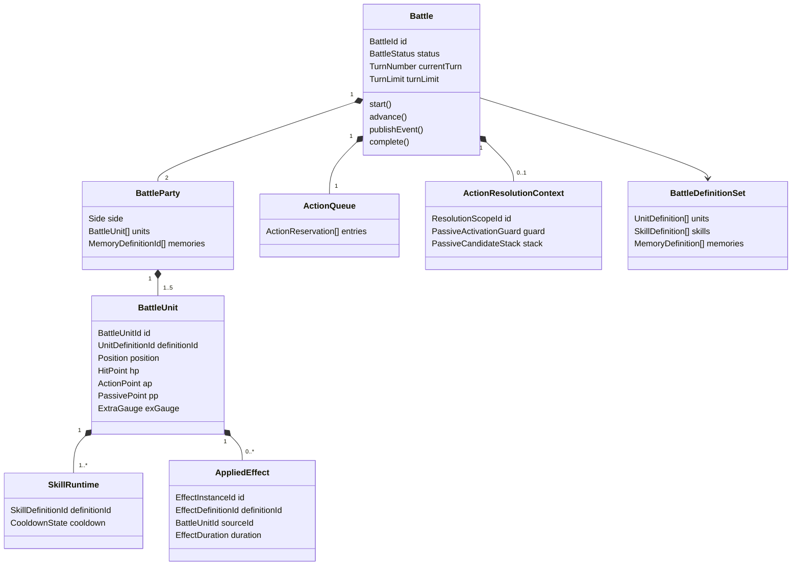

# ドメインモデル

## 目的

本書は、Battle Simulation Contextを実装するための集約、エンティティ、値オブジェクト、ドメインサービス、ポリシーおよびドメインイベントを定義する。

本書では概念と責務の境界を定める。TypeScriptのクラス構成、モジュール配置、API DTOなどの実装詳細は後続設計で決定する。

## モデリング方針

- 1回のAPIリクエストにつき、1つの戦闘を開始から終了まで同期的に実行する。
- 戦闘中の状態変更は、すべて `Battle` 集約を経由する。
- ユニット、スキル、メモリーの定義は戦闘中に変更しない。
- ルールの判定と、イベントログ用の表現を分離する。
- PSの発動タイミングを固定列挙せず、ドメインイベントとスキル定義を対応づける。
- 保留中の仕様は推測で補わず、交換可能なポリシーまたは未対応機能として隔離する。

## モデル全体像

## 集約

### Battle集約

`Battle` を集約ルートとし、1回の戦闘に必要な可変状態を集約内で管理する。

戦闘では、あるユニットへのダメージが戦闘不能、PS、リンクダメージ、行動順の除去、勝敗へ連鎖する。これらを別々の集約にすると、一つの行動中に強い結果整合性が必要になるため、戦闘全体を一つの集約とする。

最大参加数は両陣営を合わせて10体であり、戦闘の永続化や途中再開も行わないため、単一集約によるメモリ上の同期処理を許容する。

#### 集約が所有する状態

- 戦闘IDと戦闘状態
- 現在ターンと規定ターン数
- 味方・敵の戦闘ユニット
- 行動順キューと予約済み行動種別
- 現在の行動・PS解決スコープ
- 発生済みドメインイベント
- 勝敗と終了理由

#### 集約境界の外に置くもの

- 不変のユニット・スキル・メモリー定義
- 乱数の生成実装
- HTTPリクエスト・レスポンス
- API用イベントログの整形
- 戦闘結果の永続化

## エンティティ

### Battle

戦闘全体のライフサイクルと不変条件を管理する集約ルート。

主な責務：

- 戦闘開始状態の生成
- ターン開始と終了
- 行動順キューの生成、消費、並べ替え
- 行動とPS連鎖の解決
- 戦闘不能者のキューからの除去
- 各1行動終了後の勝敗判定
- 戦闘終了状態の確定

### BattleParty

味方または敵の一方を表す集約内エンティティ。`Side` によって識別する。

同じユニット定義を複数編成できるが、各配置枠は別の `BattleUnitId` を持つ。

主な責務：

- 1～5体の戦闘ユニットの保持
- 配置位置の一意性保証
- 編成ボーナスとメモリー指定の保持
- 全滅判定

### BattleUnit

戦闘へ参加している個々のユニット。`BattleUnitId` によって識別し、同じ `UnitDefinitionId` を持つ別個体と区別する。

主な状態：

- 陣営と配置位置
- 現在HP
- 現在AP、PP、EXゲージ
- 基本ステータスと戦闘中ステータス
- AS、PS、EXスキルのランタイム状態
- 付与中の効果
- タイプ別シールド
- チャージ状態
- 戦闘可能／戦闘不能

主な責務：

- リソースの回復と消費
- HPとシールドの変更
- 効果の付与、更新、解除
- クールタイムの設定と減算
- 自身が使用可能なスキルの判定

### SkillRuntime

戦闘ユニットが持つ一つのスキルについて、戦闘中に変化する状態を管理する。

複合識別子は `BattleUnitId + SkillDefinitionId` とする。

主な状態：

- クールタイム残数
- クールタイム単位：行動／ターン
- クールタイムを設定した行動番号またはターン番号
- チャージ中かどうか

クールタイムを設定した行動・ターンでは減算せず、それより後の行動・ターンだけを減算対象とする。

### AppliedEffect

ユニットへ付与された個別の効果。解除、期間、付与者、付与時スナップショットを区別するため、`EffectInstanceId` を持つ。

主な状態：

- 効果定義ID
- 付与者の戦闘ユニットID
- 対象の戦闘ユニットID
- 重複あり／重複なし
- 効果量
- `EffectDuration`：残り回数、行動／ターン単位
- 付与された行動IDとターン番号
- 付与時に固定する値
- 個別の消滅条件

継続ダメージでは、付与時の付与者攻撃力をスナップショットとして保持する。

重複あり・重複なしのどちらも効果インスタンスと期間を個別に保持する。重複なし効果では計算に採用する最強の1件だけが有効であり、その効果が失効した場合は残存インスタンスから次に強い効果を選び直す。

## 集約内部のドメインオブジェクト

### ActionQueue

現在の周回で未行動のユニットと、予約済みの行動種別を保持する。

`ActionReservation` は次を持つ。

- 戦闘ユニットID
- 予約行動種別：AS／EX
- キュー生成時の順序

規則：

- ターン開始時と、現在のキューが空になった後に新しく生成する。
- 生成時点でEXゲージが満タンならEX、それ以外ならASを予約する。
- 速度変化時は未行動者だけを並べ直す。
- 並べ直し時に予約行動種別を変更しない。
- 戦闘不能者を即時除去する。
- 同じ周回に同じ `BattleUnitId` を重複して登録しない。

### ActionResolutionContext

一つの行動または、ターン開始などのトップレベルイベントから派生した処理を解決するための一時的な状態。

主な状態：

- 解決スコープID
- 起点となった行動またはドメインイベント
- 発動済みPS集合
- PS候補グループのスタック
- 現在解決中のスキル

ユニットの1行動では `ActionId` を解決スコープIDとして使用する。ターン開始などユニットの行動外でPS連鎖が始まる場合も、循環防止のため独立した `ResolutionScopeId` を割り当てる。

### PassiveCandidateStack

PS候補グループを後入れ先出しで保持する。

規則：

1. 同じドメインイベントで条件を満たしたPSを一つの候補グループにする。
2. 先制攻撃を持つ候補を通常候補より前へ分ける。
3. それぞれの候補群を所有者の行動速度順に並べる。
4. 同速時は味方、敵、前列、絶対左列の順にする。
5. 同じユニットの複数PSは定義順にする。
6. PS解決中に新しい候補グループが生じた場合、スタック先頭へ積む。
7. 新しいグループをすべて解決した後、元のグループへ戻る。

### PassiveActivationGuard

`BattleUnitId + SkillDefinitionId` を解決スコープごとに記録し、同じPSの再発動を防ぐ。

ユニットの1行動内では、同じPSを1回だけ発動できる。ユニット行動外のイベントでは、そのイベントから始まる解決スコープ内で同じ制限を適用し、PS同士の循環を防ぐ。

### ShieldState

物理、EN、タイプなしのシールドプールを保持する。

ダメージ適用順：

1. ダメージタイプに対応するタイプありシールド
2. タイプなしシールド
3. サブユニット
4. HP

同じタイプのシールド値は加算する。個別の消滅条件を持つシールドについては、付与元の `AppliedEffect` を維持しながら有効な合計値を算出する。

## 値オブジェクト

| 値オブジェクト      | 内容と不変条件                                                              |
| ------------------- | --------------------------------------------------------------------------- |
| `BattleId`          | 1回のシミュレーションを識別するID。ログ相関にも使用する。                   |
| `BattleUnitId`      | 戦闘参加枠を識別するID。同じユニット定義の重複を区別する。                  |
| `Side`              | `ALLY` または `ENEMY`。                                                     |
| `LocalPosition`     | 左・中央・右と、前列・後列の組。各陣営内で一意。                            |
| `GlobalCoordinate`  | `x=0..2`、`y=0..3`。敵後列、敵前列、味方前列、味方後列の順にyを割り当てる。 |
| `TurnLimit`         | 1～99の整数。                                                               |
| `TurnNumber`        | 1から開始し、`TurnLimit` を超えない整数。                                   |
| `HitPoint`          | 0以上、最大HP以下。0なら戦闘不能。                                          |
| `ActionPoint`       | 0以上、最大AP以下。                                                         |
| `PassivePoint`      | 0以上、最大PP以下。                                                         |
| `ExtraGauge`        | 0以上、ユニット固有の最大値以下。超過分を保持しない。                       |
| `StatBlock`         | HP、攻撃力、防御力、会心率、行動速度などのまとまり。                        |
| `Percentage`        | 割合値。会心判定時の実効値だけを0～100%へ補正する。                         |
| `Damage`            | 0以上の計算途中値と、最低1適用後の最終整数値を区別する。                    |
| `DamageType`        | `PHYSICAL` または `ENERGY`。ユニットタイプとは別概念。                      |
| `Cooldown`          | 残数、行動／ターン単位、設定スコープ番号の組。                              |
| `EffectDuration`    | 1以上の初期回数、0以上の残り回数、行動／ターン単位、付与スコープの組。      |
| `ActionReservation` | 戦闘ユニットIDとAS／EXの予約種別。生成後は速度再計算でも種別不変。          |
| `BattleResult`      | 勝敗、終了理由、終了ターン、最終状態の組。                                  |

## 不変な定義モデル

### UnitDefinition

- ユニット定義ID
- 属性、ユニットタイプ、ロール、適正
- 基本ステータス
- EXゲージ最大値
- 定義順を保持したASとPS
- EXスキル

### SkillDefinition

- スキル定義ID
- スキル種別：AS／PS／EX
- 定義順
- APまたはPP消費量
- 発動条件
- 対象選択定義
- 効果定義の順序付きリスト
- クールタイム
- チャージ定義
- PSの場合は発動タイミング定義
- 必中、防御貫通、先制攻撃、同時発動制限などの特性

### PassiveTriggerDefinition

PSの発動タイミングをドメインイベントへ対応づける定義。

- 対象となるドメインイベント種別
- イベントの発生前／発生後などのフェーズ
- 発動条件を評価するための述語定義
- 発動対象となるイベントの発生源・対象の条件

発動タイミングは拡張可能とし、新しいタイミングの追加によって `Battle` 集約の公開インターフェースを変更しない。

### MemoryDefinition

- メモリー定義ID
- 効果対象条件
- 固定値補正
- 重複ありバフとして扱う割合補正

### BattleDefinitionSet

1回の戦闘で使用する定義だけを集めた不変オブジェクト。戦闘開始後は同じインスタンスを参照し続ける。

完全再現は要件ではないが、実行中に定義が変化して結果が不整合になることを防ぐ。

## ドメインサービスとポリシー

| サービス／ポリシー         | 責務                                                                    |
| -------------------------- | ----------------------------------------------------------------------- |
| `FormationFactory`         | リクエストと定義データから、検証済みの両陣営を生成する。                |
| `FormationBonusCalculator` | コミカルの最適属性評価とクレバーボーナスの累積を行う。                  |
| `CombatStatCalculator`     | 編成、適性、バフ・デバフ、メモリーから戦闘中ステータスを計算する。      |
| `EffectStackingPolicy`     | 重複あり効果を全加算し、重複なし効果を同種の最大1件へ絞る。             |
| `ActionOrderPolicy`        | 速度、陣営、前後列、絶対左列から行動順を決める。                        |
| `ActionSelectionPolicy`    | 予約行動種別とAS定義順から使用スキルまたは待機を決める。                |
| `TargetSelectionPolicy`    | 共通座標、マンハッタン距離、列優先などから対象を選ぶ。                  |
| `PassiveTriggerMatcher`    | ドメインイベントとPSの発動タイミング・条件を照合する。                  |
| `PassiveResolutionService` | PS候補スタック、速度順、発動済み集合を使って連鎖を解決する。            |
| `DamageCalculator`         | 基礎値、各補正、最終切り捨て、最低1ダメージを計算する。                 |
| `DamageApplicationService` | シールド、サブユニット、HP、リンクへのダメージ適用を調整する。          |
| `CooldownPolicy`           | 設定スコープでは減らさず、次回以降の行動・ターン終了時に減らす。        |
| `EffectDurationPolicy`     | 対象自身の行動またはターン終了時に期間を減らし、0で即時失効させる。     |
| `VictoryPolicy`            | 各1行動終了後に全滅とターン上限を評価し、同時全滅では味方を勝者とする。 |

サービスは必要な状態を `Battle` から受け取り、状態変更の決定結果を返す。集約内の状態を直接公開・変更しない。

## ドメインイベントとPS発動

### ドメインイベントの役割

ドメインイベントは次の二つに使用する。

1. PSの発動タイミングと条件を評価する。
2. Battle Observationへ戦闘中の事実を通知する。

内部のPS判定に必要な詳細イベントと、APIへ公開するログイベントは同一である必要はない。Battle Observationが内部イベントを公開用イベントへ変換する。

### 基本イベント候補

| 分類     | イベント候補                                                       |
| -------- | ------------------------------------------------------------------ |
| 戦闘     | `BattleStarted`, `BattleCompleted`                                 |
| ターン   | `TurnStarted`, `ResourcesRecovered`, `TurnCompleted`               |
| 行動順   | `ActionQueueCreated`, `ActionQueueReordered`                       |
| 行動     | `ActionStarted`, `ActionWaited`, `ActionCompleted`                 |
| スキル   | `SkillUseStarted`, `SkillEffectResolved`, `SkillUseCompleted`      |
| PS       | `PassiveCandidateDetected`, `PassiveActivated`, `PassiveResolved`  |
| ダメージ | `DamageCalculated`, `DamageApplied`, `ShieldConsumed`              |
| 効果     | `EffectApplied`, `EffectUpdated`, `EffectRemoved`, `EffectExpired` |
| ユニット | `UnitDefeated`                                                     |

これは閉じた列挙ではない。新しいスキルの発動タイミングに必要なドメイン上の事実を追加できる。

### イベント共通情報

各イベントは最低限、次を持つ。

- 戦闘ID
- 戦闘内で単調増加するイベント連番
- ターン番号
- 解決スコープID
- 行動ID：行動中の場合
- 発生源の戦闘ユニットID：存在する場合
- 対象の戦闘ユニットID：存在する場合
- イベント固有の事実

イベントにはAPI表示用の文言を持たせない。

### PS解決手順

1. Battle Engineがドメインイベントを発行する。
2. `PassiveTriggerMatcher` が全PSからイベントに対応する発動候補を抽出する。
3. 現在の解決スコープですでに発動済みのPSを除外する。
4. 候補を速度、陣営、配置、スキル定義順で並べ、一つの候補グループとしてスタックへ積む。
5. スタック先頭のPSを発動し、発動済み集合へ追加する。
6. PSの解決中に新しい候補が生じた場合、新しい候補グループをスタック先頭へ積み、直ちに解決する。
7. 新しいグループを解決し終えたら、元のグループの続きへ戻る。
8. スタックが空になるまで繰り返す。
9. 中断していた親の処理へ戻る。

## Battle集約の主要操作

| 操作                      | 事前条件                                           | 結果                                                     |
| ------------------------- | -------------------------------------------------- | -------------------------------------------------------- |
| `create`                  | 検証済み編成、規定ターン数、定義セットが存在する。 | `READY` 状態のBattleを生成する。                         |
| `start`                   | 状態が `READY`。                                   | 戦闘開始イベントを発行し、最初のターンを開始する。       |
| `beginTurn`               | 戦闘中で、規定ターン内。                           | AP・PPを回復し、ターン開始イベントと対応PSを解決する。   |
| `createActionQueue`       | 使用可能な行動が存在する。                         | 速度順と予約行動種別を持つキューを生成する。             |
| `resolveNextAction`       | キューに予約が存在する。                           | 1行動とPS連鎖を解決する。                                |
| `reorderRemainingActions` | 行動中に速度が変化した。                           | 未行動者だけを並べ直し、行動種別を維持する。             |
| `completeTurn`            | 使用可能な行動が存在しない。                       | 対象クールタイムを減らし、ターン終了イベントを発行する。 |
| `judgeResult`             | 1行動が完了した。                                  | 勝敗または継続を決定する。                               |
| `complete`                | 勝敗が確定した。                                   | 結果を保持し、以後の状態変更を禁止する。                 |

## 不変条件

### 戦闘

- 状態遷移は `READY → RUNNING → COMPLETED` の一方向とする。
- 規定ターン数は1～99とする。
- `COMPLETED` 後は戦闘状態を変更しない。
- 勝敗判定は各1行動のPS連鎖終了後に行う。
- 同じ効果処理で両陣営が全滅した場合は味方勝利とする。

### 編成と配置

- 各陣営は1～5体とする。
- 同じ陣営内で配置位置を重複させない。
- 同じユニット定義の重複を許可する。
- 各参加枠へ一意な `BattleUnitId` を割り当てる。
- 各編成のメモリー指定は最大6件とする。

### ユニットとリソース

- HP、AP、PP、EXゲージを負数にしない。
- EXゲージをユニット固有の最大値より大きくしない。
- HPが0になったユニットを即時に戦闘不能とする。
- 戦闘不能者を行動順キューへ残さない。
- APが0のユニットは、EXゲージ満タンの場合だけ新しい行動順キューへ登録できる。
- APが0かつEX予約を実行不能な場合は、EXゲージを全量消費して待機する。

### 行動順とスキル

- 同じ周回の行動順キューに、同じ戦闘ユニットを複数登録しない。
- 速度変化による並べ替えで予約行動種別を変更しない。
- AP・PP不足によってリソースを負数にしない。
- ASは定義順で最初に使用可能なものを選ぶ。
- 使用可能なASがなければ待機する。
- スキル使用者が戦闘不能になった時点で、そのスキルの未解決効果を中断する。
- チャージ開始とチャージ効果発動を別々の1行動とする。
- クールタイムを設定した行動・ターンでは、そのクールタイムを減らさない。

### PS

- 同じ戦闘ユニットが持つ同じPSを、一つの解決スコープで2回発動しない。
- 新しく誘発されたPS候補を、既存の未処理候補より先に処理する。
- 発動候補の順序は速度、陣営、配置、定義順で一意にする。
- チャージ中のユニットは自身のPSを発動しない。

### ダメージと効果

- 通常の攻撃は、暗闇または特別な回避効果がない限り命中する。
- ダメージの途中計算を丸めず、最終結果で小数部分を切り捨てる。
- ダメージを発生させる攻撃は、ダメージ無効時を含め最低1ダメージとする。
- 会心判定時だけ会心率を0～100%へ補正する。
- 同じタイプのシールド値を加算する。
- リンクダメージを対象数で分割しない。
- リンクダメージから別のリンクダメージを発生させない。
- 継続ダメージは付与時に記録した攻撃力を参照する。
- 行動単位効果は対象自身の行動終了時だけ残り回数を減らす。
- 行動単位効果を付与された当該行動では残り回数を減らさない。
- ターン単位効果を付与された当該ターンでは残り回数を減らさない。
- 重複あり・重複なし効果の期間を効果インスタンスごとに管理する。
- 効果期間が0になった時点で効果を失効させ、重複なし効果では次に強い効果を即時に再選択する。

## 勝敗判定

各1行動のPS連鎖がすべて終了した後、次の優先順で判定する。

1. 敵味方がともに全滅している：味方勝利
2. 敵だけが全滅している：味方勝利
3. 味方だけが全滅している：味方敗北
4. 最終ターンを終了し、敵が生存している：味方敗北
5. 上記以外：戦闘継続

最終ターンの途中で敵を全滅させた場合は、2の規則によって勝利する。

## 保留仕様の隔離

保留事項を次のポリシーへ隔離し、確定前に既定動作を推測しない。

| 保留ID   | ポリシー                    | 扱い                                                         |
| -------- | --------------------------- | ------------------------------------------------------------ |
| Q-TGT-05 | `StealthFallbackPolicy`     | 代替対象がいないステルスを含むスキルは未対応として明示する。 |
| Q-EFF-04 | `SubUnitAttenuationPolicy`  | 特殊減衰が必要なサブユニット追加ダメージは未対応とする。     |
| Q-EFF-05 | `FreezeAmplificationPolicy` | 増幅値を必要とする凍結効果は未対応とする。                   |
| Q-EFF-06 | `BurnTripleStackPolicy`     | 炎上3回時のダメージ計算は未対応とする。                      |

API入力に該当する定義が含まれる場合、曖昧な結果を返さず、シミュレーション開始前に未対応ルールとして検出する。

## ドメイン層のポート

| ポート            | 用途                                                           |
| ----------------- | -------------------------------------------------------------- |
| `BattleCatalog`   | IDからユニット、スキル、メモリー定義を取得する。               |
| `RandomSource`    | 会心、暗闇などの確率判定を行う。テストでは差し替え可能とする。 |
| `DomainEventSink` | 確定したドメインイベントをBattle Observationへ渡す。           |

戦闘集約の永続化は要件ではないため、`BattleRepository` は設けない。

## アプリケーションサービスとの境界

`SimulateBattleUseCase` は次の順序でドメインを使用する。

1. API DTOを検証する。
2. `BattleCatalog` から必要な定義を取得する。
3. 保留中の未対応ルールを使用する定義がないか検証する。
4. `FormationFactory` で両陣営を生成する。
5. `Battle.create` で集約を生成する。
6. 戦闘が `COMPLETED` になるまで集約を進行させる。
7. `BattleResult` とドメインイベントをBattle Observationへ渡す。
8. APIレスポンスへ変換する。

アプリケーションサービスは、ダメージ計算や勝敗判定などのドメインルールを持たない。

## 既存設計との対応

| 既存文書                   | 本書での対応                                                                             |
| -------------------------- | ---------------------------------------------------------------------------------------- |
| ユビキタス言語             | 値オブジェクト、エンティティ、イベント名の語彙として使用する。                           |
| 仕様決定・保留事項         | 不変条件、ポリシー、保留仕様の隔離へ反映する。                                           |
| ユースケース               | `SimulateBattleUseCase` とBattle集約の主要操作へ対応する。                               |
| 境界づけられたコンテキスト | Battle Catalog、Formation、Battle Engine、Battle Observationのモジュール境界を維持する。 |

## 次の設計への申し送り

次の `06_戦闘状態遷移.md` では、以下を詳細化する。

- 戦闘、ターン、周回、1行動の状態遷移
- 行動順キューの生成・並べ替え・消費
- チャージ、気絶、凍結と行動予約の関係
- ドメインイベントとPS候補スタックの時系列
- 戦闘不能、勝敗判定、ターン上限の遷移点
