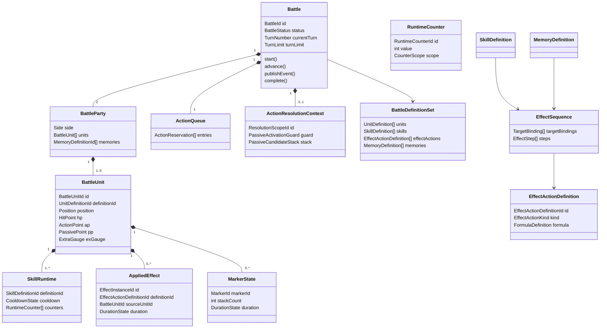

# ドメインモデル

## 目的

本書は、Battle Simulation Contextを実装するための集約、エンティティ、値オブジェクト、ドメインサービス、ポリシーおよびドメインイベントを定義する。

本書では概念と責務の境界を定める。TypeScriptのクラス構成、モジュール配置、API DTOなどの実装詳細は後続設計で決定する。

## モデリング方針

- 1回のAPIリクエストにつき、1つの戦闘を開始から終了まで同期的に実行する。
- 戦闘中の状態変更は、すべて `Battle` 集約を経由する。
- ユニット、スキル、メモリーの定義は戦闘中に変更しない。
- ルールの判定と、イベントログ用の表現を分離する。
- PSの発動タイミングを固定列挙せず、ドメインイベントとスキル定義を対応づける。
- 保留中の仕様は推測で補わず、交換可能なポリシーまたは未対応機能として隔離する。

## モデル全体像

```mermaid
classDiagram
    class Battle {
        BattleId id
        BattleStatus status
        TurnNumber currentTurn
        TurnLimit turnLimit
        start()
        advance()
        publishEvent()
        complete()
    }

    class BattleParty {
        Side side
        BattleUnit[] units
        MemoryDefinitionId[] memories
    }

    class BattleUnit {
        BattleUnitId id
        UnitDefinitionId definitionId
        Position position
        HitPoint hp
        ActionPoint ap
        PassivePoint pp
        ExtraGauge exGauge
    }

    class SkillRuntime {
        SkillDefinitionId definitionId
        CooldownState cooldown
        RuntimeCounter[] counters
    }

    class AppliedEffect {
        EffectInstanceId id
        EffectActionDefinitionId definitionId
        BattleUnitId sourceUnitId
        DurationState duration
    }

    class MarkerState {
        MarkerId markerId
        int stackCount
        DurationState duration
    }

    class RuntimeCounter {
        RuntimeCounterId id
        int value
        CounterScope scope
    }

    class ActionQueue {
        ActionReservation[] entries
    }

    class ActionResolutionContext {
        ResolutionScopeId id
        PassiveActivationGuard guard
        PassiveCandidateStack stack
    }

    class BattleDefinitionSet {
        UnitDefinition[] units
        SkillDefinition[] skills
        EffectActionDefinition[] effectActions
        MemoryDefinition[] memories
    }

    class EffectSequence {
        TargetBinding[] targetBindings
        EffectStep[] steps
    }

    class EffectActionDefinition {
        EffectActionDefinitionId id
        EffectActionKind kind
        FormulaDefinition formula
    }

    Battle "1" *-- "2" BattleParty
    BattleParty "1" *-- "1..5" BattleUnit
    BattleUnit "1" *-- "1..*" SkillRuntime
    BattleUnit "1" *-- "0..*" AppliedEffect
    BattleUnit "1" *-- "0..*" MarkerState
    Battle "1" *-- "1" ActionQueue
    Battle "1" *-- "0..1" ActionResolutionContext
    Battle --> BattleDefinitionSet
    SkillDefinition --> EffectSequence
    MemoryDefinition --> EffectSequence
    EffectSequence --> EffectActionDefinition
```

## 集約

### Battle集約

`Battle` を集約ルートとし、1回の戦闘に必要な可変状態を集約内で管理する。

戦闘では、あるユニットへのダメージが戦闘不能、PS、リンクダメージ、行動順の除去、勝敗へ連鎖する。これらを別々の集約にすると、一つの行動中に強い結果整合性が必要になるため、戦闘全体を一つの集約とする。

最大参加数は両陣営を合わせて10体であり、戦闘の永続化や途中再開も行わないため、単一集約によるメモリ上の同期処理を許容する。

#### 集約が所有する状態

- 戦闘IDと戦闘状態
- 戦闘モード（`NORMAL` または `TACTICAL_EXERCISE`）
- 現在ターンと規定ターン数
- 味方・敵の戦闘ユニット
- 行動順キューと予約済み行動種別
- 現在の行動・PS解決スコープ
- 発生済みドメインイベント
- 勝敗と終了理由
- 演習状態（戦術演習のみ）：累計スコア、ブレイク回数、敵ユニットの原基準値スナップショット

#### 集約境界の外に置くもの

- 不変のユニット・スキル・メモリー定義
- 乱数の生成実装
- HTTPリクエスト・レスポンス
- API用イベントログの整形
- 戦闘結果の永続化

## エンティティ

### Battle

戦闘全体のライフサイクルと不変条件を管理する集約ルート。

主な責務：

- 戦闘開始状態の生成
- ターン開始と終了
- 行動順キューの生成、消費、並べ替え
- 行動とPS連鎖の解決
- 戦闘不能者のキューからの除去
- 各1行動終了後の勝敗判定
- 戦闘終了状態の確定

### BattleParty

味方または敵の一方を表す集約内エンティティ。`Side` によって識別する。

同じユニット定義を複数編成できるが、各配置枠は別の `BattleUnitId` を持つ。

主な責務：

- 1～5体の戦闘ユニットの保持
- 配置位置の一意性保証
- 編成ボーナスとメモリー指定の保持
- 全滅判定

### BattleUnit

戦闘へ参加している個々のユニット。`BattleUnitId` によって識別し、同じ `UnitDefinitionId` を持つ別個体と区別する。

主な状態：

- 陣営と配置位置
- 現在HP
- 現在AP、PP、EXゲージ
- 基本ステータスと戦闘中ステータス
- AS、PS、EXスキルのランタイム状態
- 付与中の効果
- タイプ別シールド
- チャージ状態
- 戦闘可能／戦闘不能

主な責務：

- リソースの回復と消費
- HPとシールドの変更
- 効果の付与、更新、解除
- クールタイムの設定と減算
- 自身が使用可能なスキルの判定

### SkillRuntime

戦闘ユニットが持つ一つのスキルについて、戦闘中に変化する状態を管理する。

複合識別子は `BattleUnitId + SkillDefinitionId` とする。

主な状態：

- クールタイム残数
- クールタイム単位：行動／ターン
- クールタイムを設定した行動番号またはターン番号
- チャージ中かどうか
- 発動回数、累計条件、N回ごと条件に使用する `RuntimeCounter`

クールタイムを設定した行動・ターンでは減算せず、それより後の行動・ターンだけを減算対象とする。

他スキルの`EffectAction`（`COOLDOWN_MANIPULATION`、Issue #129）から、任意のスキルのクールタイム残数をリセット（0にする）または短縮（指定量だけ減らし0未満にしない）できる。この操作は上記の自然減算の設定scope（設定した行動・ターンでは減らさない）とは独立した明示的操作であり、対象スキルが今回の行動・ターンで設定されていても適用する。詳細は [`07_戦闘ルール詳細.md`](./07_戦闘ルール詳細.md) の `R-SKL-09` を参照。

### AppliedEffect

ユニットへ付与された個別の効果。解除、期間、付与者、付与時スナップショットを区別するため、`EffectInstanceId` を持つ。

`AppliedEffect` は `EffectActionDefinition` を実行した結果として発生する継続状態であり、即時ダメージや即時回復そのものは保持しない。継続する stat 補正、DamageModifier、状態異常、継続回復、シールド、致死耐え、肩代わりなどを対象とする。

主な状態：

- 効果アクション定義ID
- 付与者の戦闘ユニットID（Memory の `triggeredEffects` 由来の付与だけは付与者ユニットを持たず、代わりに付与元の陣営を持つ。`R-MEM-04`、M7-006/Issue #179）
- 対象の戦闘ユニットID
- 重複あり／重複なし
- 効果量
- `DurationState`：残り回数、消費条件、失効条件、解除可否、親子連動
- 付与された行動IDとターン番号
- 付与時に固定する値
- 個別の消滅条件

継続ダメージでは、付与時の付与者攻撃力をスナップショットとして保持する（`DMG-008`／Issue #189）。あわせて種別（固定継続ダメージ／炎上／毒）とダメージタイプもインスタンス自身が保持する — 炎上の重複数（`R-DOT-03`）と毒の再付与統合（`R-DOT-04`）の判定は、Catalogの効果アクション定義を引けない位置からも行う必要があるためである。

重複あり・重複なしのどちらも効果インスタンスと期間を個別に保持する。重複なし効果では計算に採用する最強の1件だけが有効であり、その効果が失効した場合は残存インスタンスから次に強い効果を選び直す。

### MarkerState

ユニットへ付与された固有状態を表す。raw の固有スタック、専用印、条件参照用状態を、個別の専用フィールドではなく汎用 Marker として扱う。

主な状態：

- Marker ID
- 付与者の戦闘ユニットID、または付与元陣営（`sourceSide`）。R-MEM-04 の Memory 由来の付与は使用者 `BattleUnit` を持たないため、`AppliedEffect` と同じくどちらか一方だけを持つ（M7-008 / Issue #176）
- 対象の戦闘ユニットID
- スタック数
- スタック上限
- `DurationState`
- 解除可能かどうか
- 関連する `AppliedEffect` または linkedEffectGroup

Marker は `Condition` と `Formula` から参照できる。たとえば「対象に警棒が付与されている場合」や「Marker 数 × 15%」は、専用実装ではなく Marker の有無・スタック数を参照する。

### RuntimeCounter

戦闘中に増減する回数・累計値を表す。発動回数、N回ごと、累計ダメージ、特定条件を満たした回数などを `Condition` から参照するために使う。

主な状態：

- Counter ID
- スコープ：Battle、BattleUnit、SkillRuntime、AppliedEffect、EffectSequence
- 現在値
- リセット条件
- 最終更新イベント

`RuntimeCounter` は実行時状態であり、Catalog には初期値・参照名・更新タイミングだけを定義する。どのイベントで増減するかは `07_戦闘ルール詳細.md` と `08_ドメインイベント.md` で具体化する。

スコープによって実装マイルストーンが異なる。`SkillRuntime`スコープは、PS発動条件（発動回数、N回ごと、累計ダメージ閾値）に必要な最小範囲としてM6で実装する（Issue #143）。`Battle`／`BattleUnit`スコープは利用するproduction Catalog定義が現れるまでFeature Complete必須対象に含めず、Catalogロード時点で明示的に拒否する。必要な定義を追加する際は、そのproduction経路と同じTaskで実装・検証する。`AppliedEffect`スコープは、効果インスタンス・Markerに所有される汎用Counter管理としてM7のEFF-005（Issue #162）で実装した。`DurationDefinition.counterUpdates`（scope: `APPLIED_EFFECT`のみ）が更新契機を宣言し、`AppliedEffect.duration.counters`（`EffectDurationState.counters`）が実行時値を保持する。`expiration.conditions`（R-EFF-08）の`RUNTIME_COUNTER` Conditionから同じ効果インスタンスのcounterを参照できる。`MarkerState`も同じ`EffectDurationState`を再利用するためモデル上は`counterUpdates`を持てるが、Marker自身のconsumption/expiration機構がまだ実装されていないため（`CAP_MARKER`のUNSUPPORTED*MARKER_DURATION）、Catalogロード時点で明示的に拒否する。`EffectSequence`スコープは、`EffectSequence`自身の実行時識別子として既存の`SkillUseId`（1回の解決を一意に識別する）を再利用し、`BattleUnit.effectSequenceCounters`（`SkillUseId`→`RuntimeCounter`）を保持先として、M7のEFF-006（Issue #212）で実装した。`EffectSequence.counterUpdates`（scope: `EFFECT_SEQUENCE`のみ）が更新契機を宣言する。この解決自身が完了した時点で必ずcounterを破棄・`RuntimeCounterReset`を発行する（`resetScope`宣言の選択余地がない — `EffectSequence`は解決単位を超えて状態を持てないため）。`Battle`／`BattleUnit`スコープ（利用するproduction定義が存在しないためFeature Complete必須対象外）とは異なり、`13*実装計画.md`のM7完了条件が要求する対象であり、本Issueの実装によりR-EFF-11はルールCoverage台帳上で完了した。いずれのスコープも同じ `RuntimeCounter` モデルを使い、モデル自体を分割しない。

## 集約内部のドメインオブジェクト

### ActionQueue

現在の周回で未行動のユニットと、予約済みの行動種別を保持する。

`ActionReservation` は次を持つ。

- 戦闘ユニットID
- 予約行動種別：AS／EX
- キュー生成時の順序

規則：

- ターン開始時と、現在のキューが空になった後に新しく生成する。
- 生成時点でEXゲージが満タンならEX、それ以外ならASを予約する。
- 速度変化時は未行動者だけを並べ直す。
- 並べ直し時に予約行動種別を変更しない。
- 戦闘不能者を即時除去する。
- 同じ周回に同じ `BattleUnitId` を重複して登録しない。

### ActionResolutionContext

一つの行動または、ターン開始などのトップレベルイベントから派生した処理を解決するための一時的な状態。

主な状態：

- 解決スコープID
- 起点となった行動またはドメインイベント
- 発動済みPS集合
- PS候補グループのスタック
- 現在解決中のスキル

ユニットの1行動では `ActionId` を解決スコープIDとして使用する。ターン開始などユニットの行動外でPS連鎖が始まる場合も、循環防止のため独立した `ResolutionScopeId` を割り当てる。

### PassiveCandidateStack

PS候補グループを後入れ先出しで保持する。

規則：

1. 同じドメインイベントで条件を満たしたPSを一つの候補グループにする。
2. 先制攻撃を持つ候補を通常候補より前へ分ける。
3. それぞれの候補群を所有者の行動速度順に並べる。
4. 同速時は味方、敵、前列、絶対左列の順にする。
5. 同じユニットの複数PSは定義順にする。
6. PS解決中に新しい候補グループが生じた場合、スタック先頭へ積む。
7. 新しいグループをすべて解決した後、元のグループへ戻る。

### PassiveActivationGuard

`BattleUnitId + SkillDefinitionId` を解決スコープごとに記録し、同じPSの再発動を防ぐ。

ユニットの1行動内では、同じPSを1回だけ発動できる。ユニット行動外のイベントでは、そのイベントから始まる解決スコープ内で同じ制限を適用し、PS同士の循環を防ぐ。

### ShieldState

物理、EN、タイプなしのシールドプールを保持する。

ダメージ適用順：

1. ダメージタイプに対応するタイプありシールド
2. タイプなしシールド
3. サブユニット
4. HP

同じタイプのシールド値は加算する。個別の消滅条件を持つシールドについては、付与元の `AppliedEffect` を維持しながら有効な合計値を算出する。

`DMG-004`（Issue #194）の実装では、残量の実体を `AppliedEffect.shield`（プール区分・残量・漸減宣言）に置き、3プールはそこからの導出値とした（`battle/combat/shield-policy.ts` の `shieldPoolsOf`）。別途プールの実体を持つと、インスタンス単位の失効・解除・`StateDelta` 復元とプール合計が二重管理になり乖離しうるためである。`10_API設計.md` の `ShieldStateResponse` も同じ導出を共有する。

### SubUnit

R-SUB-01/R-SUB-02 のサブユニット。耐久力（残HP）と、所持者の攻撃へ加える追加ダメージ・追加デバフを併せ持つ。

`DMG-005`（Issue #190）の実装では `ShieldState` と同じ設計を採り、実体を `AppliedEffect.subUnit`（残耐久力・追加ダメージ定義）に置いた（`battle/combat/sub-unit-policy.ts`）。ただしシールドと違い**プールへ合算しない** — R-SUB-01 第3項「サブユニットの残HPをシールド表示値へ合算できるが、内部状態は通常シールドと分ける」と `10_API設計.md`「SubUnitStateResponse」（消費順と固有効果を追跡するためインスタンスごとに返す）に従い、吸収も `SubUnitDamaged` もインスタンス単位で解決する。付与時の最大耐久力は `AppliedEffect.magnitude`、付与者の付与時攻撃力（`SUBUNIT_ADDITIONAL_DAMAGE.providerAttack`）は `AppliedEffect.snapshot` が持つ。

## 値オブジェクト

| 値オブジェクト             | 内容と不変条件                                                                  |
| -------------------------- | ------------------------------------------------------------------------------- |
| `BattleId`                 | 1回のシミュレーションを識別するID。ログ相関にも使用する。                       |
| `BattleUnitId`             | 戦闘参加枠を識別するID。同じユニット定義の重複を区別する。                      |
| `Side`                     | `ALLY` または `ENEMY`。                                                         |
| `LocalPosition`            | 左・中央・右と、前列・後列の組。各陣営内で一意。                                |
| `GlobalCoordinate`         | `x=0..2`、`y=0..3`。敵後列、敵前列、味方前列、味方後列の順にyを割り当てる。     |
| `TurnLimit`                | 1～99の整数。                                                                   |
| `TurnNumber`               | 1から開始し、`TurnLimit` を超えない整数。                                       |
| `HitPoint`                 | 0以上、最大HP以下。0なら戦闘不能。                                              |
| `ActionPoint`              | 0以上、最大AP以下。                                                             |
| `PassivePoint`             | 0以上、最大PP以下。                                                             |
| `ExtraGauge`               | 0以上、ユニット固有の最大値以下。超過分を保持しない。                           |
| `StatBlock`                | HP、攻撃力、防御力、会心率、行動速度などのまとまり。                            |
| `Percentage`               | 割合値。会心判定時の実効値だけを0～100%へ補正する。                             |
| `Damage`                   | 0以上の計算途中値と、最低1適用後の最終整数値を区別する。                        |
| `DamageType`               | `PHYSICAL` または `EN`。ユニットタイプとは別概念。                              |
| `Cooldown`                 | 残数、行動／ターン単位、設定スコープ番号の組。                                  |
| `DurationDefinition`       | Catalog 上の期間定義。時間制限、消費条件、特殊失効、解除可否、親子連動を持つ。  |
| `DurationState`            | 付与後の残期間。残り回数、消費済み回数、付与スコープ、linkedEffectGroupを持つ。 |
| `ActionReservation`        | 戦闘ユニットIDとAS／EXの予約種別。生成後は速度再計算でも種別不変。              |
| `BattleResult`             | 勝敗、終了理由、終了ターン、最終状態の組。                                      |
| `EffectActionDefinitionId` | `effects.json` 内の再利用可能な効果アクションを識別する。                       |
| `TargetBindingId`          | 一つの `EffectSequence` 内で束縛した対象集合を識別する。                        |
| `TargetReference`          | `SELF`、`TRIGGER_SOURCE`、`BINDING` など、効果解決時の対象参照。                |
| `ConditionDefinition`      | 状態、イベントpayload、直前結果、RuntimeCounterを参照する構造化条件。           |
| `FormulaDefinition`        | 数値を返す構造化式。任意コードや文字列式を持たない。                            |
| `MarkerId`                 | 固有状態を識別するID。`MARKER_` prefix を持つ。                                 |
| `RuntimeCounterId`         | 実行時カウンターを識別するID。スコープ内で一意。                                |

## 不変な定義モデル

### UnitDefinition

- ユニット定義ID
- 属性、ユニットタイプ、ロール、適正
- 基本ステータス（レベル200・無強化時点の値）
- 成長値 `levelGrowth`（任意。レベル1あたりのHP・攻撃力・防御力・行動速度の上昇量。R-ENH-05）
- EXゲージ最大値
- 定義順を保持したASとPS
- EXスキル

### SkillDefinition

- スキル定義ID
- スキル種別：AS／PS／EX
- 定義順
- APまたはPP消費量
- 発動条件
- PSの場合は発動タイミング定義
- `EffectSequence`
- クールタイム
- チャージ定義
- 必中、防御貫通、先制攻撃、同時発動制限などの特性

AS / EX は `triggers` を持たず、行動選択によって使用される。PS は1件以上の `TriggerDefinition` を持ち、ドメインイベントと条件によって発動候補になる。

### EffectSequence

Skill または Memory の効果解決手順を表す不変定義。対象束縛と効果ステップを一つの単位にまとめる。

主な構成：

- `TargetBinding`: 効果解決の冒頭で対象候補を束縛する
- `EffectStep`: 解決順に並ぶ `ACTION` / `BRANCH` / `RANDOM_BRANCH` / `REPEAT`
- 各 step の `Condition`
- step から参照する `EffectActionDefinition`

`EffectSequence` は状態を持たない。解決中の一時状態、直前結果、選択済み対象、乱数結果、RuntimeCounter更新は `ActionResolutionContext` と各ランタイムオブジェクトが保持する。

Issue #217設計方針A/D: この「解決中の一時状態」は、明示的なframe構造体として永続化・直列化されるものではなく、実resolver（`effect-action-group-resolver.ts`の再帰的generator呼び出し連鎖）自身のJavaScript呼び出しスタックがそのままpending frame stackとして機能する。ACTION適用ループ・step一覧・BRANCH・RANDOM_BRANCH・REPEATの各再帰段は、中断（使用者戦闘不能）を検知した瞬間、それ以降の兄弟・分岐・iterationへは一切進まず、`{resolvedCount, resolvedActionCount, interrupted, unresolvedCount}`という共通の中間結果をそのまま呼び出し元へ伝播する — Catalog定義を再解釈して未解決件数や中断イベント種別を見積もる並行インタプリタは存在しない（`countCandidateHits`のような静的見積もり器は採用しない）。「直前結果」は`LastResultState`という単一の可変箱で表現し、実際に確定したEffectAction結果だけを書き込む（未実行の結果を書き込む経路はない）。

### TargetBinding / TargetSelector

`TargetSelector` は raw の「敵単体」「味方全体」「前衛」「HPが低い味方」「攻撃対象」などを構造化する。

主な責務：

- 対象候補の陣営、件数、範囲を定義する
- 位置、属性、ロール、ユニットタイプ、所属、キャラクター、Marker、HP割合で絞り込む
- 優先順を定義する
- 候補が0件の場合の fallback を定義する
- trigger source / trigger target / 既存 binding から派生対象を作る
- ステルス適用後に代替対象が存在しない場合は、ステルスを消費したうえで元の対象を維持する

対象選択そのものは `TargetSelectionPolicy` が実行する。`TargetSelector` は対象選択ロジックを持たず、選択に必要な条件だけを保持する。

Issue #170（TGT-001、`CAP_TARGET_DERIVED_AREA`）: `area`（`ADJACENT_ORTHOGONAL`・`DIRECTLY_AHEAD_OF_BASE`・`BEHIND_BASE`・`SAME_ROW_AS_BASE`・`SAME_COLUMN_AS_BASE`）が参照する「基準対象」は、`kind: BINDING_DERIVED` の場合だけ `base`（`TargetReference`）から解決し、それ以外の`kind`（`SELF`/`SELECT`）では常に使用者自身を暗黙のbaseとする（`UT-CAT-TSEL-007`が示すとおり、`kind: SELF` と base依存の`area`の組み合わせもCatalog上は許容されるため）。`base`の`BINDING`参照は、同じ`EffectSequence`内で定義順に解決済みのtargetBindingだけを参照でき（R-TGT-10）、先頭の1体を基準対象とする。`base`の`TRIGGER_SOURCE`/`TRIGGER_TARGET`/`LAST_ACTION_TARGETS`/`LAST_DAMAGED_TARGETS`参照は`CAP_TRIGGER_CONTEXT`（RES-005）のスコープのため未対応。`fallback`（R-TGT-10、`CAP_TARGET_BINDING_FALLBACK`）はIssue #168（TGT-003）で実装した: 候補が0件（`kind`→戦闘不能除外→`filters`→`area`→`order`→`count`適用後）の場合、`fallback`自身を独立した`TargetSelectorDefinition`として同じ評価順で再帰的に評価する（`fallback`が自身の`fallback`を持つ場合も連鎖する）。

Issue #169（TGT-002、`CAP_TARGET_FILTER_ORDER`）: 非空`filters`（`POSITION_ROW`/`POSITION_COLUMN`/`POSITION_SLOT`/`UNIT_TYPE`/`ROLE`/`ATTRIBUTE`/`AFFILIATION`/`CHARACTER`/`HAS_MARKER`/`HP_RATIO`/`AND`/`OR`/`NOT`、および新設した`EXCLUDE_RESOLVED_UNIT`「`reference`（SELF/BINDING）が指す解決済みユニットを除外する」・`MARKER_IN_AREA`「候補自身を基準にした`area`内のMarker所在を判定する」）を`target-selection-policy.ts`の`matchesFilter`が評価する。`EXCLUDE_RESOLVED_UNIT.reference`は、実行時（`resolveExcludeReferenceUnits`）が対応するSELF/BINDING以外の`kind`（`TRIGGER_SOURCE`/`TRIGGER_TARGET`/`LAST_ACTION_TARGETS`/`LAST_DAMAGED_TARGETS`）をCatalogロード時点で拒否する。`MARKER_IN_AREA.area`は、`applyArea`が実装する`ADJACENT_ORTHOGONAL`/`DIRECTLY_AHEAD_OF_BASE`/`BEHIND_BASE`/`SAME_ROW_AS_BASE`/`SAME_COLUMN_AS_BASE`の5 kindのみCatalogロード時点で許可し、`SINGLE`/`ALL`/`ROW`/`COLUMN`は拒否する。また戦闘不能ユニットにも`markerStates`は残るため、明示`includeDefeated`指定を持たないこの所在判定は生存ユニットだけを対象にする。`order`は`FARTHEST`（R-TGT-03）・`FRONT_ROW`/`BACK_ROW`（R-TGT-06の前後列優先）に加え、`NEAREST`・`LEFT_TO_RIGHT`・`LOWEST_HP_RATIO`・`HIGHEST_HP_RATIO`・`HIGHEST_ATTACK`・`LOWEST_MAX_HP`・新設`HIGHEST_MAX_HP`・`HIGHEST_EX_GAUGE_RATIO`・新設`FASTEST`・新設`SELF_LOWEST_PRIORITY`（自身以外優先、hard excludeではなく末尾へ回す）を実装し、パラメータ付きオブジェクト形式の`order`要素として新設`MARKER_COUNT`（`markerId`+`direction`）・`UNIT_TYPE_PRIORITY`（`unitType`）を追加した（既存の文字列形式`TargetOrderKey`と混在できる）。`UNIT_TYPE`/`ROLE`/`AFFILIATION`/`CHARACTER`フィルタと`UNIT_TYPE_PRIORITY`順は静的Catalogデータ（`UnitDefinition`）参照が要るため、`resolveTargets`以降の呼び出し連鎖（`action-selection-policy.ts`・`action-skill-use-resolver.ts`・`skill-resolution-service.ts`・lifecycle各所）へ`unitDefinitions`を新たに通す。R-TGT-06の左右列優先（列版、指定列からの列距離順）はproduction Catalogに使用例がなく対応する`TargetOrderKey`も存在しないため引き続き未実装のまま残す（必要になった時点でキーを追加する、TGT-001以来の既定方針）。`HAS_MARKER`フィルタは`countCondition`（`MarkerCountCondition`、`ConditionDefinition`の`TARGET_HAS_MARKER`と同じ形）でMarker所持数のしきい値も表現できる。TargetBindingの`EffectSequence`開始時定義順固定と、参照時点の戦闘不能skip（明示`includeDefeated`がない限り）というR-TGT-10の残り2点は、それぞれTGT-001/RES-005・RES-002で既に実装済み。production Catalogの`fallback`使用例（`SKL_CLARA_SANTA_AS2`/`SKL_LYDIA_GENIUS_EX`）はいずれも非空`filters`を伴うため、TGT-002完了により無改変のCatalogでfallback経路を通すproduction統合テストを追加し、`CAP_TARGET_BINDING_FALLBACK`を`runtimeStatus: IMPLEMENTED`にした（`REF-037`／Issue #384でユニット効果軸へ移送し、証跡は`IT-UNIT-LYDIA-GENIUS-005`・`IT-UNIT-CLARA-SANTA-004`が持つ）。Rule Coverage上もR-TGT-09・R-TGT-10は全段階が揃い完了、R-TGT-06は左右列優先の残りが未完了のまま次のproduction使用例待ちとする。

Issue #167（TGT-004、R-TGT-08「ステルス」、3PR構成）: `order`適用後・`count`適用前の候補順（`resolveTargets`内部の`ordered`）に対し、第一優先対象（先頭）だけがStealth状態を持つ場合に候補順の末尾へ移動する。Stealthは`APPLY_STATUS`由来の`AppliedEffect`（`statusKind: "STEALTH"`、R-ACTN-03「`APPLY_STATUS`は`AppliedEffect`として保持する」）として表す——フェーズ1（Issue #167）では予約`MarkerId`（`MARKER_STEALTH`）による近似を採用したが、R-ACTN-03の決定仕様（`APPLY_STATUS`は`MarkerState`ではなく`AppliedEffect`）と整合しないため、`AppliedEffect.statusKind`ベースへ設計変更した。「自身を対象とする自身のスキルには適用しない」（#6）と「条件によって対象が1体に限定されている場合は適用しない」（#7）は、候補が1件しかなく、かつ`isStructurallySingleCandidateSelector`が真を返すselectorだけ適用しない（`target-selection-policy.ts`の`applyStealthRedirect`）。`kind`が`SELF`/`TRIGGER_SOURCE`/`TRIGGER_TARGET`のいずれかの場合に加え、`SELECT`/`BINDING_DERIVED`でも`filters`に`POSITION_SLOT`（単一陣営`side: "ALLY"/"ENEMY"`に絞られている場合のみ——row+columnの一意なスロットは陣営内で最大1体だが、`side: "ALL"`/未指定では両陣営から1体ずつ生じうるため対象外）を持つ場合や、`area`に`DIRECTLY_AHEAD_OF_BASE`/`BEHIND_BASE`（`applyArea`が内部で`u.side === base.side`かつ単一座標へ絞るため`selector.side`の値に関わらず常に最大1体）を持つ場合も、候補集合が盤面の生存状況ではなく定義そのものによって1体以下へ限定されるため真を返す。当初は候補が2件未満なら一律に適用しない設計だったが、`SELECT`/`BINDING_DERIVED`は候補が盤面の生存状況に依存するため、たまたま生存候補がStealth所持者1体だけになった場合（Q-TGT-05「代替対象なし」の一種）まで除外してしまう誤りがあった。さらに`isStructurallySingleCandidateSelector`がselectorの`kind`だけで判定していたため、`POSITION_SLOT`filterや`DIRECTLY_AHEAD_OF_BASE`/`BEHIND_BASE`areaによって定義上1体へ限定された`SELECT`/`BINDING_DERIVED`まで battlefield-happenstance（Q-TGT-05）として誤って消費対象にしてしまう誤りが残っていたため、`filters`/`area`も判定に含めるよう修正した。それ以外の`SELECT`/`BINDING_DERIVED`は候補1件でも通常どおり#2〜#4（Q-TGT-05を含む）へ進む。移動後に代替対象が存在しない場合（`count`が候補全件を要求する等）も、Stealthは消費したうえで元の対象へ発動する（#4、Q-TGT-05）。`resolveTargets`（既存の呼び出し元向け、消費情報を返さない）と、消費情報を返す新設`resolveTargetsWithStealthConsumption`（`resolveEffectSequence`が`targetBindings`解決時に使う）に分割し、後者だけが実際の消費（`EffectExpired`/reason:`CONSUMPTION`）につながる——AS選択時のフィージビリティ判定（`hasResolvableTargets`）や`TargetsSelected`イベントpayload用の監査再解決（`resolveBindingSelections`）はconsumeを確定させてはならないため、引き続き`resolveTargets`を使う。同じ`EffectSequence`内の複数`targetBindings`が同じStealth所持者を第一優先対象に選ぶ場合、R-TGT-10の定義順評価に従い最初のbindingでのみ移動・消費が成立するよう、`resolveEffectSequence`が検出済み`EffectInstanceId`の集合を`resolveTargetsWithStealthConsumption`へ後続bindingの評価ごとに引き継ぐ（`applyStealthRedirect`はこの集合に含まれる`AppliedEffect`を「既に消費済み」として無視する）。`EffectSequencePlan`に`stealthConsumptions`（`targetBindings`解決中に検出した消費対象の配列）を追加し、AS/EX・チャージ発動・PS発動が共有する唯一の実行経路`resolveEffectSequencePlan`が、steps解決を開始する前に一括で`expireEffects`（reason:`CONSUMPTION`）を適用する——`removeMarkers`ではなく`expireEffects`を使うことで、`linkedEffectGroupId`カスケード・CombatStat再計算も自動で扱われ、フェーズ3で production Catalogが Stealth を他の`AppliedEffect`（Heal・被ダメージ減少等）と同じlinked groupの一員として付与する場合も追加配線なしでR-EFF-09のカスケードが働く。消費で発生したイベント列（`EffectExpired`カスケード含む）は、AS/EX・チャージ発動が渡す同期callback（`context.onFactEventForPassiveChain`）がある経路ではその場でPS連鎖へ転送するが、PS自身の`EffectSequence`が`passive-activation-service.ts`から`yield*`委譲される経路ではcallbackを持たないため、他のEffectAction内部イベントと同じ`{kind: "EFFECT_RESOLVED", events}`としてyieldし、`resolvePassiveChain`/`driveActivation`側のdriverに処理を委ねる（`effect-action-group-resolver.test.ts`のUT-SKILL-RESOLUTION-SERVICE-013/014はcallback経路、`passive-activation-service.test.ts`のUT-R-TGT-08-009/UT-R-EFF-09-008はyield経路とlinked group cascadeを検証）。フェーズ3（production Catalog完全変換）: `APPLY_STATUS`を実際に解決するresolverが存在しなかった（`effect-action-group-resolver.ts`は`DAMAGE`/`COOLDOWN_MANIPULATION`/`APPLY_STAT_MOD`/`APPLY_MARKER`/`REMOVE_MARKER`のみ対応）ため、`APPLY_STAT_MOD`と同じ構造（`effect-grant-service.ts`の`grantEffect`）で`APPLY_STATUS`分岐を追加した——`status === "STEALTH"`の場合だけ`status`+`duration`の無条件付与（`duplicate: true`固定、`APPLY_STAT_MOD`と同じ理由でCombatStat再計算は呼ばない）を許可し、それ以外のstatus種別（STUN/FREEZE/BLIND/EVASION/DAMAGE_IMMUNITY等、R-STS-01〜04固有の実効処理が必要）は、追加payload field（`probability`/`appliesTo`/`damageThreshold`/`damageAmplificationOnBreak`）の有無に関わらず無条件で拒否する。Catalogスキーマ（`effect-action-definition-factory.ts`）はこれらのfieldを将来のR-STS-\*実装に備えて既に許容するが、このresolverは`status`自体で許可リストを取る——追加fieldを持たないSTUN定義（例: production Catalogの`ACT_CHIZURU_DOMESTIC_AS1_STUN`、`status`+`duration`のみ）を「未対応として明確に失敗する」ままにし、「`EffectApplied`として成功するが実際の効果（行動不能化等）はない」というsilent partial implementationを防ぐ。production Catalogの`ACT_SUIRAN_CHAOS_PS1_EVASION`（`status: "EVASION"`、Issue #183、`CAP_HIT_COUNT_EVASION`）もこの拒否で意図どおり未対応のまま止まる。`AppliedEffect.statusKind`（フェーズ1でモデルに追加済み）は`EffectSnapshot`（`state-delta.ts`の`toEffectSnapshot`）・`EffectApplied`イベントpayload・独立Reducerの同一性比較（`state-delta-reducer.ts`の`sameEffectSnapshot`）のいずれにも配線されていなかったため、フェーズ3でこの3箇所を追加し、`APPLY_STATUS`由来の付与がDomain Event・StateDelta・独立Reducer復元のすべてで`statusKind`を保持するようにした。`decrementSkillUseEffectDurations`（フェーズ1で実装済みの純粋関数）もどこからも呼ばれていなかったため、`action-skill-use-resolver.ts`の`SkillUseCompleted`記録直後（`SkillUseInterrupted`では呼ばない、フェーズ1レビューが明示する仕様固定）に、ACTION単位（`action-completion.ts`）と同じ手順（減算→`EffectDurationReduced`発行→0になったインスタンスの`expireEffects`）で配線した——この過程で`grantEffect`が`context.skillUseId`を`buildInitialDurationState`へ渡しておらず、`grantedSkillUseId`（付与した使用自身を減算から除外する）が常に`undefined`のままだった潜在バグも発見・修正した（`UT-R-EFF-01-047`が実配線経由でこの回帰を検出する）。`apps/api/src/__tests__/production-catalog/units/UNIT_MAO_COMMITTEE.test.ts`が、実カタログの`ACT_MAO_COMMITTEE_PS2_STEALTH`（`status: STEALTH`、`duration.timeLimit: {unit: SKILL_USE, count: 3}`、`linkedEffectGroupId: MAO_COMMITTEE_PS2_LINK`）を`SKL_MAO_COMMITTEE_PS2`の実PS経路ごと実行し、(1) 付与がDomain Event/StateDelta/独立Reducer復元まで一致すること（`IT-UNIT-MAO-COMMITTEE-005`）、(2) 実際に付与されたStealthに対してR-TGT-08のリダイレクト・消費（`EffectExpired`/reason:`CONSUMPTION`）が機能し、同じlinked groupのHEAL・DMG_DOWNも巻き添えで失効すること（`IT-UNIT-MAO-COMMITTEE-004`）を検証する。PSも`EFF-006`/Issue #212で独立した`SkillUseId`を持つ1回のスキル使用であるため、`SKILL_USE`単位期間効果はAS/EXの`SkillUseCompleted`だけでなくPS自身の`PassiveResolved`（`PassiveInterrupted`では減算しない、同じ規約）でも減算する必要があったが未配線だったため、`passive-activation-service.ts`の`driveActivation`内に同じ手順（減算→`EffectDurationReduced`→`expireEffects`）を追加した（`UT-R-EFF-01-052`/`053`が検証する）。

イベント順序契約（`08_ドメインイベント.md`「イベント発行と処理」——候補は発行順に検出し、解決時機は解決コンテキストに従う。即時解決コンテキストでは原因イベント自身の候補を子イベントより先に解決し、前倒し可能な明示的例外は`RuntimeCounterChanged`のみ。`R-ATM-02`の後段フェーズでは、効果処理中に保留した候補群を完了イベント自身の候補より先に排出する）: 前段の修正は`SkillUseCompleted`/`PassiveResolved`をPS連鎖へ渡す（`action-skill-use-resolver.ts`の`passiveRuntime.onFactEvent`／`passive-activation-service.ts`の`yield`）より前にSKILL_USE単位減算を行っていたため、記録イベント順（完了→`EffectDurationReduced`→`EffectExpired`）と実際のPS/Memory候補解決順（減算の子イベントが先、完了イベント自身が最後）が逆転していた。完了イベント自身のPS連鎖を先に解決してから減算するよう順序を入れ替え、減算対象（`changes`）はその連鎖解決前のunitsスナップショットから決定する——連鎖解決後のunitsから決定すると、完了イベントに反応したPSが別の`skillUseId`で新たに付与したSKILL_USE効果まで「直前の使用分」として誤って巻き込む（前段と同じ理由）。決定した対象（`battleUnitId`+`effectInstanceId`のキーのみ）は新設`applied-effect-duration.ts`の`reapplySkillUseDurationDecrement`で連鎖解決後のunitsへ適用する（対象の決定と適用を分離する）。`UT-R-EFF-01-055`（AS/EX経路）・`UT-R-EFF-01-056`（PS自身の完了経路）が、記録イベント順と実際のPS発動順が一致することを検証する。

上記の初版実装（`applyEffectDurationChanges`）は、決定した対象の減算量（before/after）まで連鎖解決前のスナップショット値をそのまま使い回して連鎖解決後のunitsへ絶対値として設定していたため、同じownerに属する独立した「1回のスキル使用完了」（この完了イベント自身の連鎖の中で反応した子PS自身の完了など）が連鎖解決中に同じインスタンスを既に1減算していた場合、その減算を古いスナップショット値で上書きして消してしまう不具合があった（count:2の効果が本来2件の`EffectDurationReduced`で`2→1→0`と失効すべきところ、1件分の減算が消え`1`のまま残ってしまう）。`applyEffectDurationChanges`を`reapplySkillUseDurationDecrement`へ置き換え、対象の識別（`battleUnitId`+`effectInstanceId`）だけを連鎖解決前のスナップショットから受け取り、減算量（before/after）は呼び出し時点の連鎖解決後unitsから都度再計算する設計に修正した——これにより「対象がまだ存在するか」の判定と「現在値からの再計算」が同じlookupに統合され、旧版が別途行っていた`stillPresentChanges`絞り込みも不要になった。`UT-R-EFF-04-021`（`reapplySkillUseDurationDecrement`単体、before:1→after:0への再計算を検証）・`UT-R-EFF-01-057`（実配線経由、同じownerの親完了＋子PS完了が`2→1→0`で失効し2件の`EffectDurationReduced`がその遷移を表すことを検証）が、この修正を検証する。

`08_ドメインイベント.md`「現在処理中のイベントから直接発生したイベントを子とする」契約: `action-skill-use-resolver.ts`のAS/EX経路は、外側のSKILL_USE期間減算（`emitEffectDurationReducedEvents`）の最初の`EffectDurationReduced`の親（`parentEventId`）に、`recorder.getEvents()`の時点での最終イベントをそのまま使っていた。`skillUseCompleted`自身のPS連鎖解決（この減算より先に実施、上記の順序契約）がPSを誘発した場合、その時点の最終イベントは誘発されたPSの`PassiveResolved`やその子イベント（例えば同じownerの独立した完了として自ら行うSKILL_USE単位減算の`EffectDurationReduced`）になり得るため、外側の減算イベントの直接原因が実際の`skillUseCompleted`ではなくネストしたPSイベントであるかのような誤った因果ツリーになっていた（PS自身の完了経路、`passive-activation-service.ts`は元から`terminalEvent.eventId`を正しく親に使っている）。`recorder.getEvents()`から拾った最終イベントではなく`skillUseCompleted.eventId`自身を明示的に親として渡すよう修正した。`UT-R-EFF-01-058`が、`SkillUseCompleted`がPS連鎖を誘発し、その連鎖自身の`EffectDurationReduced`が最終記録イベントになるケースで、外側の減算イベントの`parentEventId === skillUseCompleted.eventId`（誘発されたPS側のイベントではない）であることを検証する。

### EffectStep

`EffectSequence` 内の解決単位。

| 種別            | 責務                                                          |
| --------------- | ------------------------------------------------------------- |
| `ACTION`        | 対象に1件以上の `EffectActionDefinition` を定義順に適用する。 |
| `BRANCH`        | `Condition` の真偽で then / else の step を選択する。         |
| `RANDOM_BRANCH` | `RandomSource` により分岐を選び、選択結果をイベントへ残す。   |
| `REPEAT`        | 同じ step 群を指定回数繰り返す。                              |

`EffectStep` は「いつ、どの順番で解決するか」を表し、HPやリソースへ何をするかは `EffectActionDefinition` が表す。

### EffectActionDefinition

HP、リソース、状態、Marker、継続効果などへの一つの作用を表す不変定義。

主な種別：

- ダメージ
- 即時回復、継続回復
- stat 補正
- 与ダメージ・被ダメージ補正
- AP / PP / EXゲージ操作（一回限りの加減算）
- 期間付きリソース獲得量Modifier（`RESOURCE_GAIN_MOD`。以後の獲得イベントへ倍率を適用する継続効果であり、`AppliedEffect`として`M7`で表現する。一回限りの加減算とは区別する）
- リソース上限変更
- 状態異常・特殊状態付与
- シールド付与
- 効果解除・効果無効
- Marker 付与・解除
- 致死耐え、挑発、肩代わり、反射、ダメージリンク

`EffectActionDefinition` は payload と `FormulaDefinition`、`DurationDefinition`、stacking を持つ。`EffectActionResolver` が対象・数値・適用順を解決し、その解決結果に基づいて `Battle` 集約上の実際の状態変更を行うのは `battle/lifecycle`（モジュール構成は「モジュール所有と公開境界」を参照）である。

### FormulaDefinition

効果量を計算するための構造化式。任意コード、自由な式文字列、eval 相当の表現を持たない。

参照できる主な入力：

- 使用者、対象、trigger source、trigger target、target binding
- 攻撃力、防御力、最大HP、現在HP、不足HP、失ったHP
- 直前に与えた/受けたダメージ
- Marker 数
- 生存ユニット数
- HP割合

`FormulaDefinition` は数値を返す。ダメージ、回復、リソース変更などへ適用する際の丸め、下限、上限、計算順は `07_戦闘ルール詳細.md` で定義する。

### ConditionDefinition

効果の発動可否、step分岐、trigger predicate、Duration失効条件を表す構造化条件。

参照できる主な入力：

- 対象の生存状態、HP割合、属性、ロール、位置、リソース、状態異常
- Marker の有無とスタック数
- ドメインイベント payload
- 直前の効果結果
- `RuntimeCounter`
- ターン番号
- PS所有者から見た対象のFormation位置関係（M6。「目の前」など。`TRIGGER_POSITION_RELATION`）
- 現在のroot／parentイベントとBattle／Turn phase（M6。Battle開始・Turn開始・Turn終了時の発動除外。`TRIGGER_EXCLUSION_TIMING`）

`ConditionDefinition` は真偽値だけを返し、状態変更を行わない。Trigger predicateとしての評価は`PassiveTriggerMatcher`（M6、`battle/triggering`）が、`EffectSequence`のstep分岐・Duration失効条件としての評価は`ConditionEvaluator`（M7、`battle/skill`）が行う。

### MarkerDefinition

Marker の種類、スタック上限、解除可否、関連効果を表す不変定義。

Marker は raw ごとの固有状態名を汎用化するためのモデルであり、ドメインモデルへ専用フィールドを増やさないための拡張点とする。Marker の実行時状態は `MarkerState` が保持する。

### PassiveTriggerDefinition

PSの発動タイミングをドメインイベントへ対応づける定義。

- 対象となるドメインイベント種別
- イベントの発生前／発生後などのフェーズ
- 発動条件を評価するための述語定義
- 発動対象となるイベントの発生源・対象の条件

発動タイミングは拡張可能とし、新しいタイミングの追加によって `Battle` 集約の公開インターフェースを変更しない。

Catalog v2 では `TriggerDefinition` と `ConditionDefinition` として表現し、PSだけでなく Memory の `triggeredEffects` でも同じ概念を使用する。

### MemoryDefinition

- メモリー定義ID
- `triggeredEffects`
- 対象条件

Memory の唯一の表現は `TriggerDefinition + EffectSequence` である。戦闘開始時に味方へ固定値または割合補正を与える単純な Memory も、`APPLY_STAT_MOD` を持つ `triggeredEffects` として表現する（省略記法の `modifiers` フィールドは廃止した）。

### BattleDefinitionSet

1回の戦闘で使用する定義だけを集めた不変オブジェクト。戦闘開始後は同じインスタンスを参照し続ける。

完全再現は要件ではないが、実行中に定義が変化して結果が不整合になることを防ぐ。

含まれる定義：

- UnitDefinition
- SkillDefinition
- EffectActionDefinition
- MemoryDefinition

## ドメインサービスとポリシー

| サービス／ポリシー            | 責務                                                                                                                                                                                                                                                                                                  |
| ----------------------------- | ----------------------------------------------------------------------------------------------------------------------------------------------------------------------------------------------------------------------------------------------------------------------------------------------------- |
| `FormationFactory`            | リクエストと定義データから、検証済みの両陣営を生成する。                                                                                                                                                                                                                                              |
| `FormationBonusCalculator`    | コミカルの最適属性評価とクレバーボーナスの累積を行う。                                                                                                                                                                                                                                                |
| `EnhancedBaseStatsCalculator` | 強化指定（学園レベル、現在レベル、ギアカスタム）とユニット定義から強化後基本ステータスを純関数として算出する（R-ENH-01〜06）。強化指定がある陣営のユニットについて、開始時ステータス計算の基本値を差し替える。M11で実装する。                                                                         |
| `AcademyLevelPolicy`          | 学園レベルのローテーション配分（HP→攻撃力→防御力）と系統別加算量から、タイプ・属性系統ごとの加算値を算出する（R-ENH-02）。M11で実装する。                                                                                                                                                             |
| `GearCustomizationPolicy`     | ギア効果表（種別×ランク×対象ステータス）からギア合計割合を算出する（R-ENH-04）。M11で実装する。                                                                                                                                                                                                       |
| `CombatStatCalculator`        | 編成、適性、バフ・デバフ、メモリーから戦闘中ステータスを計算する。                                                                                                                                                                                                                                    |
| `EffectStackingPolicy`        | 重複あり効果を全加算し、重複なし効果を同種の最大1件へ絞る。                                                                                                                                                                                                                                           |
| `ActionOrderPolicy`           | 速度、陣営、前後列、絶対左列から行動順を決める。                                                                                                                                                                                                                                                      |
| `ActionSelectionPolicy`       | 予約行動種別とAS定義順から使用スキルまたは待機を決める。                                                                                                                                                                                                                                              |
| `TargetSelectionPolicy`       | 共通座標、マンハッタン距離、列優先などから対象を選ぶ。                                                                                                                                                                                                                                                |
| `EffectSequenceResolver`      | TargetBindingを評価し、EffectStepを定義順に解決する。                                                                                                                                                                                                                                                 |
| `ConditionEvaluator`          | ConditionDefinitionを戦闘状態、イベント、直前結果、RuntimeCounterから評価する。                                                                                                                                                                                                                       |
| `FormulaEvaluator`            | FormulaDefinitionを戦闘状態から数値へ評価する。                                                                                                                                                                                                                                                       |
| `EffectActionResolver`        | EffectActionDefinitionの対象・数値・適用順を解決する。実際のHP、リソース、AppliedEffect、Markerの変更は、この解決結果を受け取った`battle/lifecycle`が行う（「モジュール所有と公開境界」参照）。                                                                                                       |
| `PassiveTriggerMatcher`       | ドメインイベントとPSの発動タイミング・条件を照合する。`TriggerDefinition.condition`が参照する`RUNTIME_COUNTER`（M6実装は`SkillRuntime`スコープのみ）、Formation位置関係、除外timingもここで評価する（M6）。`ConditionEvaluator`が担う`EffectSequence`内部の分岐・失効条件（M7）とは評価対象が異なる。 |
| `PassiveResolutionService`    | PS候補スタック、速度順、発動済み集合を使って連鎖を解決する。                                                                                                                                                                                                                                          |
| `DamageCalculator`            | 基礎値、各補正、最終切り捨て、最低1ダメージを計算する。                                                                                                                                                                                                                                               |
| `DamageApplicationService`    | シールド、サブユニット、HP、リンクへのダメージ適用を調整する。                                                                                                                                                                                                                                        |
| `CooldownPolicy`              | 設定スコープでは減らさず、次回以降の行動・ターン終了時に減らす。                                                                                                                                                                                                                                      |
| `DurationPolicy`              | 時間制限、消費条件、特殊失効、親子連動に従って効果を失効させる。                                                                                                                                                                                                                                      |
| `MarkerPolicy`                | Markerの付与、更新、スタック上限、解除を扱う。                                                                                                                                                                                                                                                        |
| `RuntimeCounterPolicy`        | 発動回数、累計条件、N回ごとのRuntimeCounterを更新する。                                                                                                                                                                                                                                               |
|                               |
| `VictoryPolicy`               | 各1行動終了後に全滅とターン上限を評価し、同時全滅では味方を勝者とする。通常戦闘モードだけで使用する。                                                                                                                                                                                                 |
| `BreakResolutionService`      | 戦術演習で敵ユニットのHPが0に到達したとき、戦闘不能に代えてブレイクを解決する。撃破契機のトリガーを発火させたうえで、効果解除（メモリー由来免除）、ブレイク強化、全回復を同一解決ステップ内で原子的に行う。全戦闘不能判定箇所が経由する単一のシームとする。                                           |
| `ExerciseScalingPolicy`       | ブレイク回数から各ステータスの強化倍率・加算値を純関数として算出する。増分 `inc(n) = 20（n≤3）、17+n（n≥4）` の加算累積、攻撃・防御の21回目以降頭打ち、速度+5pp/回、会心率絶対値+1pp/回を実装する（R-TEX-04）。                                                                                       |
| `ExerciseEndPolicy`           | 戦術演習の終了条件（味方全滅、5ターン終了）を`VictoryPolicy`と同じチェックポイントで評価し、スコアとブレイク回数を持つ演習結果を確定する。                                                                                                                                                            |

サービスは必要な状態を `Battle` から受け取り、状態変更の決定結果を返す。集約内の状態を直接公開・変更しない。

## ドメインイベントとPS発動

### ドメインイベントの役割

ドメインイベントは次の三つに使用する。

1. PSの発動タイミングと条件を評価する。
2. Memory の `triggeredEffects` の発動タイミングと条件を評価する。
3. Battle Observationへ戦闘中の事実を通知する。

内部のPS判定に必要な詳細イベントと、APIへ公開するログイベントは同一である必要はない。Battle Observationが内部イベントを公開用イベントへ変換する。

### 基本イベント候補

| 分類     | イベント候補                                                                                      |
| -------- | ------------------------------------------------------------------------------------------------- |
| 戦闘     | `BattleStarted`, `BattleCompleted`                                                                |
| ターン   | `TurnStarted`, `ResourcesRecovered`, `TurnCompleting`, `TurnCompleted`                            |
| 行動順   | `ActionQueueCreated`, `ActionQueueReordered`                                                      |
| 行動     | `ActionStarted`, `ActionWaited`, `ActionCompleting`, `ActionCompleted`                            |
| スキル   | `SkillUseStarting`, `SkillUseStarted`, `SkillUseCompleted`, `SkillUseInterrupted`                 |
| PS       | `PassiveCandidateDetected`, `PassiveActivated`, `PassiveResolved`                                 |
| ダメージ | `UnitBeingAttacked`, `DamageWillBeApplied`, `DamageCalculated`, `DamageApplied`, `ShieldConsumed` |
| 回復     | `HealApplied`                                                                                     |
| 効果     | `EffectApplied`, `EffectMerged`, `EffectRemoved`, `EffectExpired`                                 |
| リソース | `ResourceChanged`                                                                                 |
| ユニット | `UnitDefeated`                                                                                    |

これは閉じた列挙ではない。新しいスキルの発動タイミングに必要なドメイン上の事実を追加できる。

### イベント共通情報

各イベントは最低限、次を持つ。

- 戦闘ID
- 戦闘内で単調増加するイベント連番
- ターン番号
- 解決スコープID
- 行動ID：行動中の場合
- 発生源の戦闘ユニットID：存在する場合
- 対象の戦闘ユニットID：存在する場合
- イベント固有の事実

イベントにはAPI表示用の文言を持たせない。

### PS解決手順

1. Battle Engineがドメインイベントを発行する。
2. `PassiveTriggerMatcher` が全PSからイベントに対応する発動候補を抽出する。
3. 現在の解決スコープですでに発動済みのPSを除外する。
4. 候補を速度、陣営、配置、スキル定義順で並べ、一つの候補グループとしてスタックへ積む。
5. スタック先頭のPSを発動し、発動済み集合へ追加する。
6. PSの効果処理の外（前段・後段フェーズ、行動外トップレベルイベント）で新しい候補が生じた場合、新しい候補グループをスタック先頭へ積み、直ちに解決する。PSの効果処理中に生じた候補は、その発動の保留キューへイベント発生順に積み、当該PSの効果処理完了後に解決する（`07_戦闘ルール詳細.md`「スキル効果処理の割り込み制御」`R-ATM-01`〜`R-ATM-02`）。
7. 新しいグループ・保留キューを解決し終えたら、元のグループの続きへ戻る。
8. スタックが空になるまで繰り返す。
9. 中断していた親の処理へ戻る。

### Memory triggeredEffects 解決

Memory の `triggeredEffects` は、PSと同じドメインイベントを発動候補として扱う。ただしPSのようなPP消費、同一PS再発動制限、先制攻撃順は持たない。

Memory triggeredEffects の候補順は次の順で一意にする。

1. APIリクエストで指定された Memory の順序。
2. 同一 Memory 内の `triggeredEffects` 定義順。
3. 同一 `triggeredEffect` 内の `EffectSequence.steps` 定義順。

戦闘開始時 Memory 効果は `BattleStarted` から発動する。複数 Memory の発動順、PSとの相互作用、同じイベントでPSとMemoryが両方候補になる場合の優先順は `07_戦闘ルール詳細.md` で具体化する。

## Battle集約の主要操作

| 操作                      | 事前条件                                           | 結果                                                     |
| ------------------------- | -------------------------------------------------- | -------------------------------------------------------- |
| `create`                  | 検証済み編成、規定ターン数、定義セットが存在する。 | `READY` 状態のBattleを生成する。                         |
| `start`                   | 状態が `READY`。                                   | 戦闘開始イベントを発行し、最初のターンを開始する。       |
| `beginTurn`               | 戦闘中で、規定ターン内。                           | AP・PPを回復し、ターン開始イベントと対応PSを解決する。   |
| `createActionQueue`       | 使用可能な行動が存在する。                         | 速度順と予約行動種別を持つキューを生成する。             |
| `resolveNextAction`       | キューに予約が存在する。                           | 1行動とPS連鎖を解決する。                                |
| `reorderRemainingActions` | 行動中に速度が変化した。                           | 未行動者だけを並べ直し、行動種別を維持する。             |
| `completeTurn`            | 使用可能な行動が存在しない。                       | 対象クールタイムを減らし、ターン終了イベントを発行する。 |
| `judgeResult`             | 1行動が完了した。                                  | 勝敗または継続を決定する。                               |
| `complete`                | 勝敗が確定した。                                   | 結果を保持し、以後の状態変更を禁止する。                 |

## 不変条件

### 戦闘

- 状態遷移は `READY → RUNNING → COMPLETED` の一方向とする。
- 規定ターン数は1～99とする。
- `COMPLETED` 後は戦闘状態を変更しない。
- 勝敗判定は各1行動のPS連鎖終了後に行う。
- 同じ効果処理で両陣営が全滅した場合は味方勝利とする。

### 編成と配置

- 各陣営は1～5体とする。
- 同じ陣営内で配置位置を重複させない。
- 同じユニット定義の重複を許可する。
- 各参加枠へ一意な `BattleUnitId` を割り当てる。
- 各編成のメモリー指定は最大6件とする。

### ユニットとリソース

- HP、AP、PP、EXゲージを負数にしない。
- EXゲージをユニット固有の最大値より大きくしない。
- HPが0になったユニットを即時に戦闘不能とする。
- 戦闘不能者を行動順キューへ残さない。
- APが0のユニットは、EXゲージ満タンの場合だけ新しい行動順キューへ登録できる。
- APが0かつEX予約を実行不能な場合は、EXゲージを全量消費して待機する。

### 行動順とスキル

- 同じ周回の行動順キューに、同じ戦闘ユニットを複数登録しない。
- 速度変化による並べ替えで予約行動種別を変更しない。
- AP・PP不足によってリソースを負数にしない。
- ASは定義順で最初に使用可能なものを選ぶ。
- 使用可能なASがなければ待機する。
- スキル使用者が戦闘不能になった時点で、そのスキルの未解決効果を中断する。
- チャージ開始とチャージ効果発動を別々の1行動とする。
- クールタイムを設定した行動・ターンでは、そのクールタイムを減らさない。

### 戦術演習

- 戦闘モードが `TACTICAL_EXERCISE` の場合、敵陣営はちょうど1体とし、敵編成にメモリーを持たせない。
- 規定ターン数は5とする。
- 累計スコアは単調増加とし、負のスコアを発生させない。
- 演習中の敵ユニットは戦闘不能へ遷移させない。HPが0に到達した解決ステップ内でブレイクとして解決し、復活を完了させる。
- ブレイク強化は常に敵ユニットの原基準値スナップショットから再計算する（複利計算をしない）。
- 復活時、メモリー由来以外の敵ユニットへの付与効果・マーカーを残さない。
- 演習結果に勝利・敗北を持たせない。

### PS

- 同じ戦闘ユニットが持つ同じPSを、一つの解決スコープで2回発動しない。
- 新しく誘発されたPS候補を、既存の未処理候補より先に処理する。
- 発動候補の順序は速度、陣営、配置、定義順で一意にする。
- チャージ中のユニットは自身のPSを発動しない。

### EffectSequence と効果DSL

- `EffectSequence` の `TargetBindingId` は同一 sequence 内で一意にする。
- `EffectStep` は定義順に解決する。
- `ACTION` step は1件以上の `EffectActionDefinition` を参照する。
- `ConditionDefinition` と `FormulaDefinition` は任意コードや自由な式文字列を持たない。
- `FormulaDefinition` は状態変更を行わず、数値だけを返す。
- `ConditionDefinition` は状態変更を行わず、真偽値だけを返す。
- `RuntimeCounter` を参照する条件は、存在する counter と scope だけを参照する。
- `RANDOM_BRANCH` は `RandomSource` を経由して評価し、選択結果をドメインイベントへ残す。

### ダメージと効果

- 通常の攻撃は、暗闇または特別な回避効果がない限り命中する。
- ダメージの途中計算を丸めず、最終結果で小数部分を切り捨てる。
- ダメージを発生させる攻撃は、ダメージ無効時を含め最低1ダメージとする。
- 会心判定時だけ会心率を0～100%へ補正する。
- 同じタイプのシールド値を加算する。
- リンクダメージを対象数で分割しない。
- リンクダメージから別のリンクダメージを発生させない。
- 継続ダメージは付与時に記録した攻撃力を参照する。
- 行動単位効果は対象自身の行動終了時だけ残り回数を減らす。
- 行動単位効果を付与された当該行動では残り回数を減らさない。
- ターン単位効果を付与された当該ターンでは残り回数を減らさない。
- 重複あり・重複なし効果の期間を効果インスタンスごとに管理する。
- 効果期間が0になった時点で効果を失効させ、重複なし効果では次に強い効果を即時に再選択する。
- Marker のスタック数を負数にしない。
- Marker のスタック数は定義された上限を超えない。
- linkedEffectGroup に属する効果は、親子連動の失効規則に従ってまとめて失効できる。
- `AppliedEffect` と `MarkerState` は付与者、対象、付与スコープを保持し、後続のCondition/Formulaから参照できる。

## 勝敗判定

各1行動のPS連鎖がすべて終了した後、次の優先順で判定する。

1. 敵味方がともに全滅している：味方勝利
2. 敵だけが全滅している：味方勝利
3. 味方だけが全滅している：味方敗北
4. 最終ターンを終了し、敵が生存している：味方敗北
5. 上記以外：戦闘継続

最終ターンの途中で敵を全滅させた場合は、2の規則によって勝利する。

戦術演習では本判定を使用せず、`ExerciseEndPolicy` が同じチェックポイントで終了条件（味方全滅、5ターン終了）だけを評価する。敵のHP0はブレイクとして解決されるため、勝敗判定の対象にならない（R-TEX-09）。

## ドメイン層のポート

| ポート            | 用途                                                           |
| ----------------- | -------------------------------------------------------------- |
| `BattleCatalog`   | IDからユニット、スキル、メモリー定義を取得する。               |
| `RandomSource`    | 会心、暗闇などの確率判定を行う。テストでは差し替え可能とする。 |
| `DomainEventSink` | 確定したドメインイベントをBattle Observationへ渡す。           |

戦闘集約の永続化は要件ではないため、`BattleRepository` は設けない。

## モジュール所有と公開境界

`#132` M6〜M8に備え、本書で定義した集約・エンティティ・値オブジェクト・ドメインサービス・ポリシーの所有モジュールを固定する。モジュール構成とコード配置は [04\_境界づけられたコンテキスト.md](./04_境界づけられたコンテキスト.md)「内部モジュールのコード配置と依存方向」を正とし、本節はモデル単位の対応表を示す。

### エンティティ・集約内オブジェクト

| モデル                                       | 所有モジュール                                                                                                                        | 公開境界                                                                                                                                |
| -------------------------------------------- | ------------------------------------------------------------------------------------------------------------------------------------- | --------------------------------------------------------------------------------------------------------------------------------------- |
| `Battle`                                     | `battle/lifecycle`                                                                                                                    | `create`／`start`／`advance`／`complete`などの主要操作のみを公開し、内部の解決手順は非公開。                                            |
| `BattleParty`                                | `battle/model`                                                                                                                        | 陣営・戦闘ユニット一覧・全滅判定を公開し、内部配列の直接変更は許可しない。                                                              |
| `BattleUnit`                                 | `battle/model`                                                                                                                        | リソース増減・効果付与などの操作メソッドを公開し、フィールドの直接書き換えは許可しない。                                                |
| `SkillRuntime`                               | `battle/model`（クールタイム・チャージの状態は現状`cooldown-state.ts`／`charge-state.ts`として`BattleUnit`の一部で表現する）          | クールタイム・チャージ状態の読み取りと、状態を変更する専用関数だけを公開する。                                                          |
| `AppliedEffect`                              | `battle/effects`（M7で追加）                                                                                                          | 効果の付与・失効判定に必要な状態だけを公開する。                                                                                        |
| `MarkerState`                                | `battle/effects`（M7で追加）                                                                                                          | スタック数・DurationStateの読み取りと、`effects`内の更新操作のみを公開する。                                                            |
| `RuntimeCounter`（`SkillRuntime`スコープ）   | `battle/model`（M6で追加。`SkillRuntime`の`cooldown`と同じ実体が保持する）                                                            | スコープと現在値の読み取りのみを公開する。`Battle`／`BattleUnit`スコープは利用するproduction定義が現れるまでCatalogロード時に拒否する。 |
| `RuntimeCounter`（`AppliedEffect`スコープ）  | `battle/model`（M7で追加、EFF-005/Issue #162。`AppliedEffect`/`MarkerState`が共有する`EffectDurationState.counters`が実体を保持する） | スコープと現在値の読み取りのみを公開する。                                                                                              |
| `RuntimeCounter`（`EffectSequence`スコープ） | `battle/model`（M7で追加、EFF-006/Issue #212。`BattleUnit.effectSequenceCounters`（`SkillUseId`キー）が実体を保持する）               | スコープと現在値の読み取りのみを公開する。実行時識別子は既存の`SkillUseId`を再利用し、専用のResolverは新設していない。                  |
| `ActionQueue`                                | `battle/action`                                                                                                                       | 生成・消費・並べ替えの操作を公開し、内部エントリ配列は非公開。                                                                          |
| `ActionResolutionContext`                    | `battle/triggering`（M6で新設）                                                                                                       | 現在の解決スコープIDと発動済み集合の参照のみを公開する。                                                                                |
| `PassiveCandidateStack`                      | `battle/triggering`（M6で新設）                                                                                                       | push／pop相当の操作のみを公開する。                                                                                                     |
| `PassiveActivationGuard`                     | `battle/triggering`（M6で新設）                                                                                                       | 判定・記録操作のみを公開する。                                                                                                          |
| `ShieldState`                                | `battle/combat`（`DMG-004`／Issue #194。残量の実体は`AppliedEffect.shield`が持ち、3プールは`shield-policy.ts`がそこから導出する）     | 吸収・漸減操作とプール合計の読み取りのみを公開し、インスタンスの走査手順は非公開。                                                      |

### 不変な定義モデル

`UnitDefinition`、`SkillDefinition`、`EffectSequence`、`EffectActionDefinition`、`FormulaDefinition`、`ConditionDefinition`、`MarkerDefinition`、`PassiveTriggerDefinition`、`MemoryDefinition`、`TargetBinding`／`TargetSelector`、`EffectStep`は `catalog/definitions` が所有する。`BattleDefinitionSet` は `battle/model` が所有し、`catalog/definitions` から取得した各定義への参照だけを保持する（`catalog/definitions`自体を再輸出しない）。

### ドメインサービスとポリシー

| サービス／ポリシー                                                             | 所有モジュール                                                                                                                                                                                                                                                                                                                                            |
| ------------------------------------------------------------------------------ | --------------------------------------------------------------------------------------------------------------------------------------------------------------------------------------------------------------------------------------------------------------------------------------------------------------------------------------------------------- |
| `FormationFactory`                                                             | `formation`（`battle/model`にだけ依存する）                                                                                                                                                                                                                                                                                                               |
| `FormationBonusCalculator`                                                     | `battle/model`（`BattleParty`が保持する`FormationBonus`型の生成元であり、型と計算が同一ファイルのため。[04\_境界づけられたコンテキスト.md](./04_境界づけられたコンテキスト.md)「現行ファイルの移行先一覧」参照）                                                                                                                                          |
| `AttributeAffinityPolicy`                                                      | `battle/combat`（`DamageCalculator`だけが利用する）                                                                                                                                                                                                                                                                                                       |
| `PositionAptitudePolicy`                                                       | `battle/model`（`starting-combat-stats.ts`だけが利用する純粋計算）                                                                                                                                                                                                                                                                                        |
| `EnhancedBaseStatsCalculator`／`AcademyLevelPolicy`／`GearCustomizationPolicy` | `battle/model`（開始時ステータス算出の前段で基本値を差し替える純粋計算。M11で実装する）                                                                                                                                                                                                                                                                   |
| `CombatStatCalculator`                                                         | `battle/model`（`BattleParty`の開始時ステータス算出で使う純粋計算。M7以降、`battle/effects`が戦闘中再計算のために参照する）                                                                                                                                                                                                                               |
| `EffectStackingPolicy`                                                         | `battle/model`（`CombatStatCalculator`が利用する重複あり／なし合成。M7の`AppliedEffect`重複解決とは別物として扱う）                                                                                                                                                                                                                                       |
| `ActionOrderPolicy`                                                            | `battle/action`                                                                                                                                                                                                                                                                                                                                           |
| `ActionSelectionPolicy`                                                        | `battle/action`                                                                                                                                                                                                                                                                                                                                           |
| `TargetSelectionPolicy`                                                        | `battle/targeting`                                                                                                                                                                                                                                                                                                                                        |
| `EffectSequenceResolver`                                                       | `battle/skill`（M7で追加）                                                                                                                                                                                                                                                                                                                                |
| `ConditionEvaluator`                                                           | `battle/skill`（M7で追加）                                                                                                                                                                                                                                                                                                                                |
| `FormulaEvaluator`                                                             | `battle/skill`（M7で追加）                                                                                                                                                                                                                                                                                                                                |
| `EffectActionResolver`                                                         | `battle/skill`（EffectActionを対象・数値まで解決する。M7で追加。`battle/combat`はskillに依存する一方向のため、`combat`・`effects`への実際の呼び出しはskillではなく`battle/lifecycle`が行う。次段落参照）                                                                                                                                                  |
| `PassiveTriggerMatcher`                                                        | `battle/triggering`（M6で新設）                                                                                                                                                                                                                                                                                                                           |
| `PassiveResolutionService`                                                     | `battle/triggering`（M6で新設）                                                                                                                                                                                                                                                                                                                           |
| `DamageCalculator`                                                             | `battle/combat`                                                                                                                                                                                                                                                                                                                                           |
| `DamageApplicationService`                                                     | `battle/combat`                                                                                                                                                                                                                                                                                                                                           |
| `CooldownPolicy`                                                               | `battle/model`（`BattleUnit`の`CooldownMap`型と同一ファイル`cooldown-state.ts`にある減算・操作関数）                                                                                                                                                                                                                                                      |
| `DurationPolicy`                                                               | `battle/effects`（M7で追加）                                                                                                                                                                                                                                                                                                                              |
| `MarkerPolicy`                                                                 | `battle/effects`（M7で追加）                                                                                                                                                                                                                                                                                                                              |
| `RuntimeCounterPolicy`（発動回数・N回ごと・累計ダメージ閾値の更新）            | `battle/model`（M6で追加。`CooldownPolicy`と同様、`SkillRuntime`の状態を直接更新する）                                                                                                                                                                                                                                                                    |
| `RuntimeCounterPolicy`（`AppliedEffect`スコープの更新）                        | `battle/triggering`（M7で追加、EFF-005/Issue #162。`runtime-counter-effect-matcher.ts`。マッチングに`evaluateTriggerCondition`/selector評価器が必要なため`battle/effects`ではなくM6の`runtime-counter-matcher.ts`と同じ`battle/triggering`に置く — `battle/effects`と`battle/triggering`はモジュール依存境界（`eslint.config.mjs`）で相互に依存できない） |
| `VictoryPolicy`                                                                | `battle/outcome`                                                                                                                                                                                                                                                                                                                                          |

[04\_境界づけられたコンテキスト.md](./04_境界づけられたコンテキスト.md)「モジュールの依存順序」が固定する `battle/combat → battle/skill`（`combat`が`skill`に依存する一方向）と矛盾しないよう、`EffectActionResolver`（`battle/skill`）は`battle/combat`・`battle/effects`のどちらも直接importしない。`EffectActionResolver`の責務は、対象・数値・適用順を解決した記述（現行の`ResolvedEffectApplication`と同種の型）を組み立てるところまでとし、この記述を受け取って実際に`battle/combat`（HP・シールドなど）または`battle/effects`（AppliedEffect・Marker）へ適用するのは、両方に依存できる`battle/lifecycle`（`action-phase-resolver.ts`）である。現行コードも同じ形をとっており、`action-phase-resolver.ts`が`skill-resolution-service.ts`の解決結果を受け取って`damage-application-service.ts`（`battle/combat`）を呼び出している。`effects`と`combat`が互いをimportしないという04の規則は、この`battle/lifecycle`を経由した呼び分けを前提とする。

### ドメイン層のポート

`BattleCatalog`、`RandomSource`、`DomainEventSink`は `domain/ports` が所有する。実装（`InMemoryBattleCatalog`、`SystemRandomSource`など）は `infrastructure/` に置き、ドメインは型と契約だけを公開する。

## アプリケーションサービスとの境界

`SimulateBattleUseCase` は次の順序でドメインを使用する。

1. API DTOを検証する。
2. `BattleCatalog` から必要な定義を取得する。
3. `FormationFactory` で両陣営を生成する。
4. `Battle.create` で集約を生成する。
5. 戦闘が `COMPLETED` になるまで集約を進行させる。
6. `BattleResult` とドメインイベントをBattle Observationへ渡す。
7. APIレスポンスへ変換する。

アプリケーションサービスは、ダメージ計算や勝敗判定などのドメインルールを持たない。

## 既存設計との対応

| 既存文書                   | 本書での対応                                                                             |
| -------------------------- | ---------------------------------------------------------------------------------------- |
| ユビキタス言語             | 値オブジェクト、エンティティ、イベント名の語彙として使用する。                           |
| 仕様決定・保留事項         | 不変条件、ポリシーへ反映する。                                                           |
| ユースケース               | `SimulateBattleUseCase` とBattle集約の主要操作へ対応する。                               |
| 境界づけられたコンテキスト | Battle Catalog、Formation、Battle Engine、Battle Observationのモジュール境界を維持する。 |

## 次の設計への申し送り

次の `06_戦闘状態遷移.md` では、以下を詳細化する。

- 戦闘、ターン、周回、1行動の状態遷移
- 行動順キューの生成・並べ替え・消費
- チャージ、気絶、凍結と行動予約の関係
- ドメインイベントとPS候補スタックの時系列
- EffectSequence、Memory triggeredEffects、RuntimeCounter更新の時系列
- 戦闘不能、勝敗判定、ターン上限の遷移点

`07_戦闘ルール詳細.md` では、Formulaの整数化、DamageModifier / HealingModifierの計算順、Durationの消費・失効順、MarkerとlinkedEffectGroupの失効順を具体化する。

`08_ドメインイベント.md` では、`UnitBeingAttacked`、`DamageWillBeApplied`、`HealApplied`、`ResourceChanged` などの新イベントと payload を具体化する。
