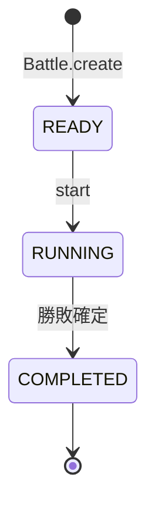
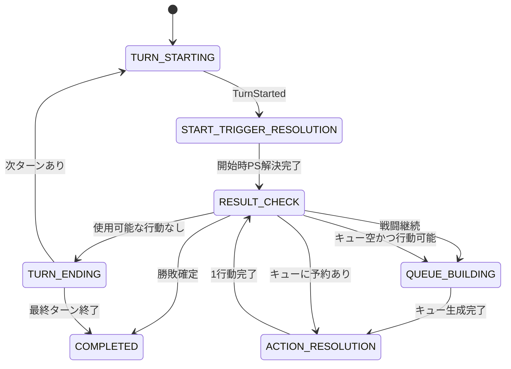
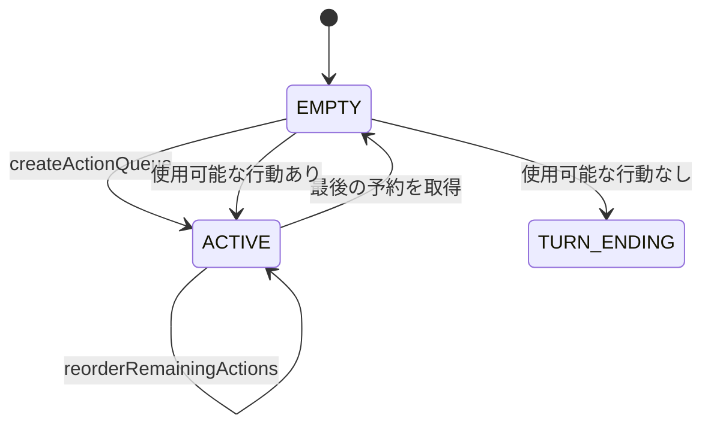
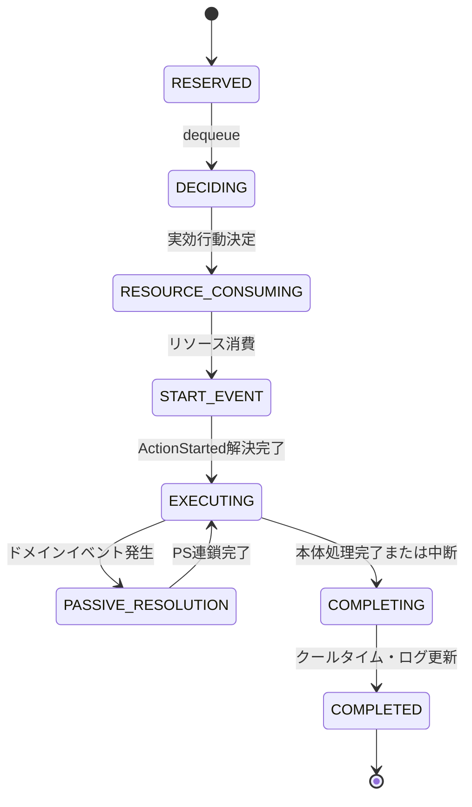
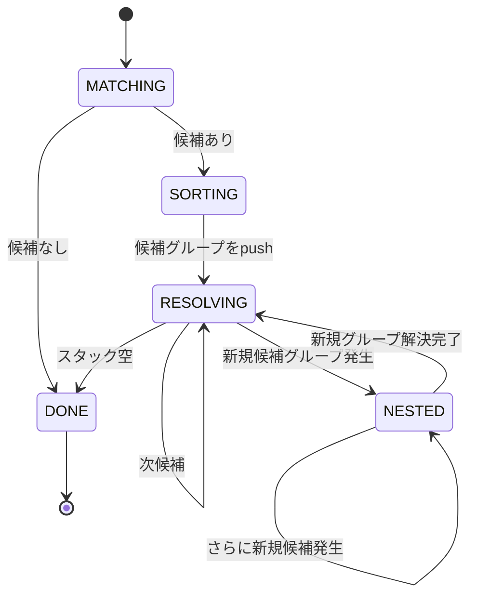
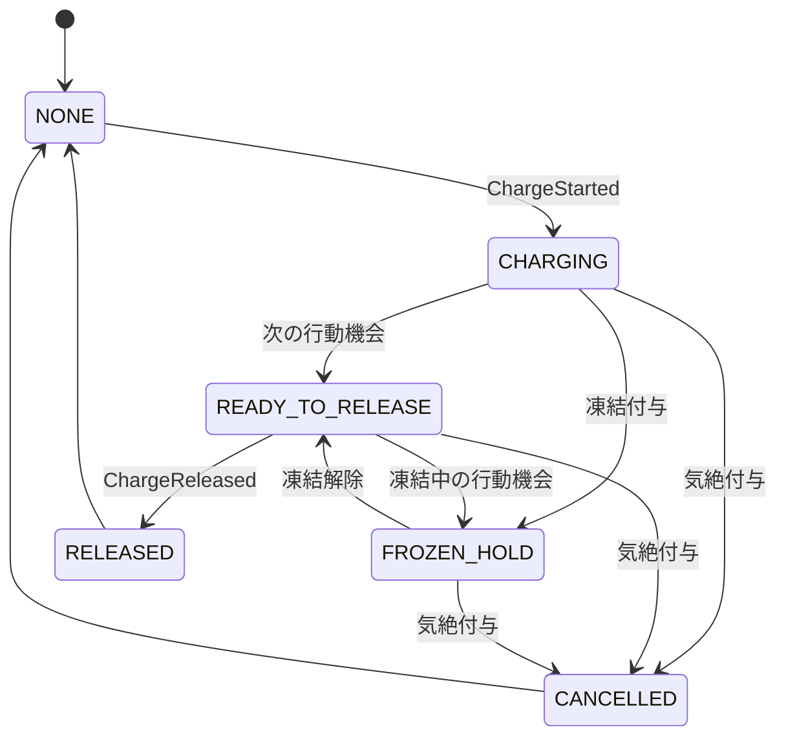
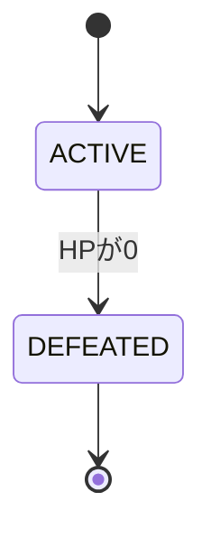
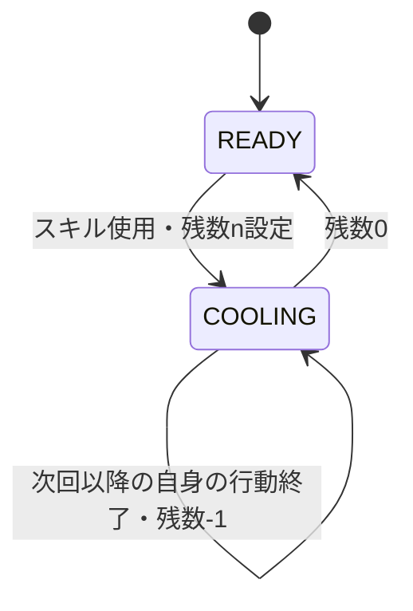
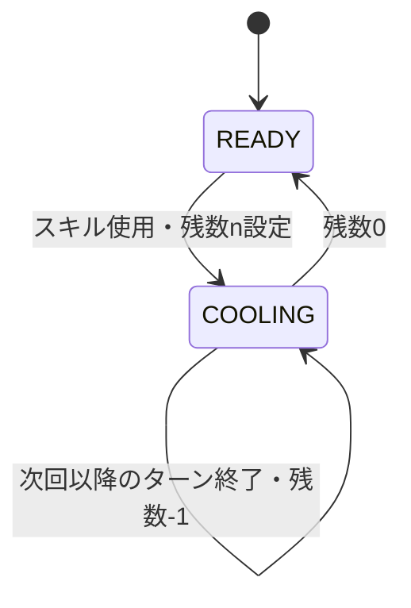
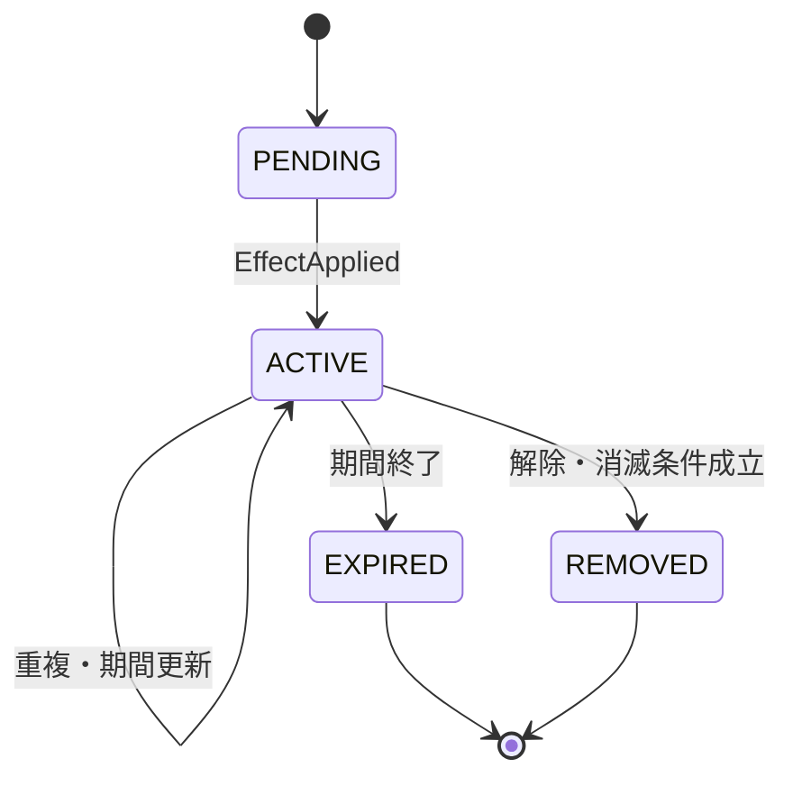

# 戦闘状態遷移

## 目的

本書は、`Battle` 集約が戦闘開始から終了までにたどる状態と、各遷移で実行する処理を定義する。

状態遷移は [05\_ドメインモデル.md](./05_ドメインモデル.md) のモデルを前提とし、実装時の処理順、イベント発行点および不変条件の判断根拠として使用する。

## 状態の階層

戦闘状態を次の階層に分ける。

| 階層         | 管理対象                                                 |
| ------------ | -------------------------------------------------------- |
| 戦闘         | `READY`、`RUNNING`、`COMPLETED`                          |
| ターン       | 開始処理、行動処理、終了処理                             |
| 周回         | 行動順キューの生成から空になるまで                       |
| 行動         | 行動決定、リソース消費、スキル・待機、PS連鎖、完了       |
| 解決スコープ | ドメインイベントから発生したPS候補スタック               |
| ユニット     | 戦闘可能／戦闘不能、チャージ、行動阻害効果、クールタイム |

上位状態が終了すると、その配下の未完了状態も終了する。例えば戦闘が `COMPLETED` になった後は、ターンや行動順キューを更新しない。

## 戦闘全体の状態遷移

| 現在状態    | 契機            | ガード条件                      | 処理                                                 | 次状態      |
| ----------- | --------------- | ------------------------------- | ---------------------------------------------------- | ----------- |
| なし        | `Battle.create` | 編成と規定ターン数が検証済み    | 戦闘開始状態を構築する                               | `READY`     |
| `READY`     | `start`         | 両陣営に1体以上のユニットが存在 | `BattleStarted` を発行する                           | `RUNNING`   |
| `RUNNING`   | 結果判定        | 勝利または敗北条件が成立        | 結果と終了理由を確定し、`BattleCompleted` を発行する | `COMPLETED` |
| `COMPLETED` | 任意の更新要求  | 常に不許可                      | 状態変更を拒否する                                   | `COMPLETED` |

## RUNNING状態の進行

`RESULT_CHECK` は、ユニットの1行動後だけでなく、ターン開始など行動外のトップレベル解決スコープが完了した後にも通過する。柔軟なPS発動タイミングによって行動外で全滅が発生しても、次の処理へ進む前に戦闘を終了できるようにするためである。

## ターン状態

### TURN_STARTING

処理順：

1. ターン番号を1増やす。初回は1とする。
2. 戦闘可能な全ユニットのAPとPPを最大値まで回復する。
3. ターン開始で期限を迎える効果がある場合、その効果定義に従って更新する。
4. `TurnStarted` と必要な詳細イベントを発行する。
5. イベントを発動タイミングとして持つPSを解決する。
6. 解決スコープ完了後に結果判定を行う。

ターン開始PSによってEXゲージが満タンになった場合、その後に生成する行動順キューではEXを予約する。

### TURN_ENDING

処理順：

1. `TurnCompleting` を発行し、対応するPSを解決する。
2. PS連鎖完了後、期間とクールタイムの更新対象を現在状態から再取得する。
3. 現在のターンより前に設定されたターン単位クールタイムを1減らす。
4. 現在のターンで設定されたクールタイムは減らさない。
5. 現在のターンより前に付与されたターン単位効果の残り回数を1減らす。現在のターンで付与された効果は減らさない。
6. 残り回数が0になった効果を即時に失効させ、`EffectExpired` を発行する。
7. 重複なし効果が失効した場合、残っている同種効果から次に強い効果を有効化し、影響するステータスを再計算する。
8. `TurnCompleted` を発行し、対応するPSを解決する。
9. 解決スコープ完了後に結果判定を行う。
10. 現在ターンが規定ターン数に達し、敵が生存していれば敗北とする。
11. 次ターンが存在する場合は `TURN_STARTING` へ進む。

ターン終了PSによって敵が全滅した場合は、ターン上限による敗北より先に敵全滅による勝利を判定する。

## 行動順キューの状態遷移

### キュー生成対象

次のいずれかを満たす戦闘可能なユニットを登録する。

- APが1以上
- EXゲージが満タン
- チャージ効果の発動待ちで、凍結などにより発動を阻害されていない

発動可能なチャージ効果は、APとEXゲージがともに使用不能でも次の行動機会を必要とするため、キュー生成対象とする。凍結中でもAPまたは満タンのEXゲージがあれば通常の規則でキューへ入り、待機する。

### キュー生成

1. 対象ユニットを現在の行動速度が高い順に並べる。
2. 同速時は味方、敵、前列、絶対左列の順にする。
3. 生成時点のEXゲージが満タンならEX、それ以外ならASをリソース行動種別として予約する。
4. 各ユニットを1回だけキューへ登録する。
5. `ActionQueueCreated` を発行する。

### 速度変化による並べ替え

1. 現在の1行動とPS連鎖を最後まで解決する。
2. キューに残っている未行動者だけを新しい速度順に並べ直す。
3. AS／EXの予約種別は変更しない。
4. `ActionQueueReordered` を発行する。

速度変化による並べ替えは、新しい周回の開始ではない。

### 戦闘不能者の除去

ユニットが戦闘不能になった時点で、そのユニットの予約をキューから除去する。除去によってキューが空になった場合も、現在の解決スコープが完了するまでは新しいキューを生成しない。

## 行動の状態遷移

### DECIDING：実効行動の決定

行動順キューはAS／EXのリソース行動種別を予約するが、チャージや行動阻害を考慮した実効行動は、キューから取り出した後に決定する。

優先順：

1. 戦闘不能なら処理せず終了する。本来はキューから除去済みであるため防御的な判定とする。
2. 気絶中なら待機する。チャージ中の場合はチャージをキャンセルする。
3. 凍結中なら待機する。チャージは維持する。
4. 発動待ちのチャージ効果があれば、予約されたAS／EXより優先してチャージ効果を発動する。
5. 予約種別がEXならEXスキルを使用する。
6. 予約種別がASなら、定義順で使用可能なASを選択する。
7. 使用可能なASがなければ待機する。

チャージ効果が予約AS／EXを上書きした場合、APとEXゲージを消費しない。現在のキューエントリだけを消費し、次のキュー生成時にその時点のEXゲージからAS／EXを改めて予約する。

### RESOURCE_CONSUMING：リソース消費

| 実効行動                           | 消費するリソース                                 | EXゲージ増加                   |
| ---------------------------------- | ------------------------------------------------ | ------------------------------ |
| AS                                 | 選択したASに定義されたAP                         | 消費APと同量。最大値で打ち止め |
| EX                                 | EXゲージ全量。APは消費しない                     | なし                           |
| 通常の待機                         | APを1                                            | 1。最大値で打ち止め            |
| AP 0・EX満タン・行動不能による待機 | EXゲージ全量                                     | なし                           |
| チャージ効果発動                   | なし。チャージ開始時に元スキルのコストを消費済み | なし                           |

リソースを消費する行動では消費した時点を行動開始とする。チャージ効果発動のようにリソースを消費しない行動では、キューエントリに対応する処理を開始した時点を行動開始とする。行動開始時に `ActionStarted` を発行する。

### START_EVENT：行動開始時処理

1. `ActionStarted` に対応するPS候補を解決する。
2. 継続ダメージなど、行動開始を契機とする効果を定義順に解決する。
3. 各効果が発行したイベントに対応するPS候補を直ちに解決する。
4. 行動者が戦闘不能になった場合は、本体スキルを実行せず `COMPLETING` へ進む。

### EXECUTING：本体処理

#### AS

1. 対象選択後、`SkillUseStarting` を発行する。
2. スキル使用前を発動タイミングとするPSを解決する。
3. PS連鎖完了後、使用者の生存、対象、発動条件を再検証する。前提が成立しなくなった場合はスキルを中断し、`SkillUseInterrupted` を発行して、以降の手順を行わず `COMPLETING` へ進む。
4. 使用したスキルへクールタイムを設定し、現在の行動IDを設定スコープとして記録する。
5. コスト消費とクールタイム設定の確定後、`SkillUseStarted` を発行する。
6. 効果定義を定義順に一つずつ解決する。
7. 各効果の前後で必要なドメインイベントを発行し、対応PSを直ちに解決する。
8. 使用者が戦闘不能になった場合は残りの効果を中断し、`SkillUseInterrupted` を発行する。
9. 中断されなかった場合だけ `SkillUseCompleted` を発行し、スキル使用後を発動タイミングとするPSを解決する。

#### EX

ASと同じイベント・効果解決手順を使用する。APを消費せず、開始時にEXゲージを全量消費する点だけが異なる。

#### 待機

1. `ActionWaited` を発行する。
2. 待機を発動タイミングとするPSを解決する。
3. スキル効果は実行しない。

#### チャージ開始

1. 元スキルのリソースは `RESOURCE_CONSUMING` で消費済みとする。
2. 元スキルへクールタイムを設定し、現在の行動IDを設定スコープとして記録する。
3. ユニットをチャージ中にする。
4. チャージ状態の確定後、`ChargeStarted` を発行する。
5. 対応するPSを解決する。
6. 一つの行動として完了する。

#### チャージ効果発動

1. `ChargeReleased` を発行する。
2. チャージしたスキルの効果を定義順に解決する。
3. 対応するPSを解決する。
4. チャージ状態を終了する。
5. チャージ開始とは別の一つの行動として完了する。

### COMPLETING：行動完了

1. 行動中に発生したPS候補スタックが空であることを確認する。
2. `ActionCompleting` を発行し、対応するPSを解決する。
3. PS連鎖完了後、期間とクールタイムの更新対象を現在状態から再取得する。
4. 現在の行動より前に設定された、行動者自身の行動単位クールタイムを1減らす。
5. 現在の行動で設定されたクールタイムは減らさない。
6. 行動者を対象とする行動単位効果のうち、現在の行動より前に付与された各効果インスタンスの残り回数を1減らす。他ユニットを対象とする効果と、現在の行動で付与された効果は減らさない。
7. 残り回数が0になった効果を即時に失効させ、`EffectExpired` を発行する。
8. 重複なし効果が失効した場合、残っている同種効果から次に強い効果を有効化し、影響するステータスを再計算する。
9. `ActionCompleted` を発行し、対応PSを解決する。
10. 行動完了PSによる新しい連鎖もすべて解決する。
11. 戦闘不能者を行動順キューから除去する。
12. 行動イベントと状態差分をBattle Observationへ渡す。
13. 解決スコープを終了し、結果判定へ進む。

## PS解決の状態遷移

### 候補グループ

同じドメインイベントによって条件を満たしたPSを一つの候補グループとする。先制攻撃を持つ候補を通常候補より前へ分け、それぞれの候補群の中で次の順序を適用する。

グループ内の順序：

1. 所有者の行動速度が高い順
2. 味方陣営、敵陣営の順
3. 前列、後列の順
4. 絶対左列から右列の順
5. 同じユニットではスキル定義順

### 新規候補の即時処理

PSの解決中に新しいドメインイベントが発生し、別のPS候補が生じた場合は、新しい候補グループをスタック先頭へ積む。元のグループに未処理候補が残っていても、新しいグループを先にすべて解決する。

### 発動済み制限

- ユニットの1行動では、`BattleUnitId + SkillDefinitionId` ごとに1回だけ発動できる。
- ターン開始・終了など行動外のトップレベルイベントでは、そのイベントの解決スコープごとに1回だけ発動できる。
- 発動済みPSが再び条件を満たしても候補へ追加しない。
- チャージ中のユニットが持つPSは候補へ追加しない。

### 単一PSの発動

1. 発動直前に、発動条件、PP、クールタイム、所有者の状態を再確認する。
2. 発動不能になっていれば候補を破棄し、次の候補へ進む。
3. 再入を防ぐため、現在の解決スコープの発動済み集合へPSを追加する。
4. 定義されたPPを消費し、消費PPと同量だけEXゲージを増やす。最大値を超えた分は保持しない。
5. PSへクールタイムを設定し、現在の行動IDまたはターン番号を設定スコープとして記録する。
6. `PassiveActivated` を発行し、PSの効果を定義順に解決する。
7. 新しいPS候補が生じた場合は、現在のPSの親処理を中断して新しい候補グループを先に解決する。
8. 所有者が戦闘不能になった場合は残りの効果を中断する。
9. 中断されなかった場合は `PassiveResolved` を発行する。

## チャージ状態

規則：

- チャージ開始と効果発動はそれぞれ1行動とする。
- チャージ中は自身のPSを発動できず、特別な回避効果も発動できない。
- 気絶を付与された時点でチャージをキャンセルする。
- 凍結ではチャージをキャンセルしない。
- 凍結中の行動機会では待機し、凍結解除後の次の行動機会に効果を発動する。
- チャージ効果発動はAS／EX予約より優先する。

## 戦闘ユニットの状態

戦闘可能状態と行動阻害効果は、単一の排他的な列挙にしない。ユニットは生存中に、気絶、凍結、チャージなど複数の状態を同時に持ち得る。

### 生存状態

`DEFEATED` への遷移時：

1. HPを0に固定する。
2. `UnitDefeated` を発行する。
3. 行動順キューから除去する。
4. 新たなスキル・PSの発動候補にしない。
5. スキル解決中の使用者なら残りの効果を中断する。

### 気絶

- 指定回数のアクティブ行動機会を待機すると解除する。
- 待機時にAPがあればAPを1消費する。
- APが0かつEXゲージ満タンならEXゲージを全量消費する。
- 再付与時は残り回数が長い方を一つだけ残す。
- 付与時にチャージをキャンセルする。

### 凍結

- 指定期間が経過するか、新たな攻撃スキルによるダメージを受けるまで継続する。
- 炎上、毒などの継続ダメージや、デバフだけのスキルでは解除しない。
- 行動機会では待機としてリソースを消費する。
- ダメージによる解除時は、保留中の `FreezeAmplificationPolicy` を通して増幅する。
- 再付与時は延長や増幅率の加算を行わない。
- チャージ状態を維持する。

## クールタイム状態

### 行動単位

残数が0になった行動では再使用せず、次の行動機会から使用可能とする。

### ターン単位

残数が0になったターン終了後、次の行動機会から使用可能とする。

### 他スキルによるクールタイム操作（Issue #129）

上記の自然減算（`COOLING --> COOLING: 残数-1`）とは独立に、他スキルの`EffectAction`（`COOLDOWN_MANIPULATION`）が任意のタイミングで`COOLING`状態の対象スキルへ`RESET`（`COOLING --> READY`相当、残数0）または`REDUCE`（`COOLING --> COOLING`、残数を`amount`だけ減算し0未満にしない）を適用できる。対象スキルが既に`READY`（未登録、または残数0）の場合は状態遷移せずno-opとする。`R-SKL-04`の「設定した行動・ターンでは減らさない」規則は自身の自然減算にのみ適用され、この明示操作には適用しない。詳細は [`07_戦闘ルール詳細.md`](./07_戦闘ルール詳細.md) の `R-SKL-09` を参照。

## 効果の状態遷移

効果の重複時：

- 重複あり効果は期間を含む個別の `AppliedEffect` として保持し、計算時にすべて加算する。
- 重複なし効果も期間を含む個別の `AppliedEffect` として保持し、同種のうち効果量が最も大きいものだけを計算へ採用する。
- 採用されない重複なし効果も、期間や解除に備えて個別状態を保持する。
- 採用中の最強効果が失効した場合は、残っている同種効果から次に強いものを即時に採用する。
- 毒、気絶、凍結など固有の重複規則がある場合は、その効果固有ルールを優先する。

### 行動単位効果期間

1. 効果付与時に、対象、残り回数、付与された行動IDを記録する。
2. 対象自身の行動終了時だけ減算判定を行う。
3. 現在の行動IDが付与時の行動IDと同じなら減算しない。
4. 次回以降の対象自身の行動終了時に残り回数を1減らす。
5. 0になった時点で `EXPIRED` へ遷移する。

### ターン単位効果期間

1. 効果付与時に、残り回数と付与されたターン番号を記録する。
2. ターン終了時に減算判定を行う。
3. 現在のターン番号が付与時のターン番号と同じなら減算しない。
4. 次のターン終了時から残り回数を1減らす。
5. 0になった時点で `EXPIRED` へ遷移する。

## 結果判定

### 判定タイミング

- ユニットの1行動と、その行動から派生したPS連鎖の完了後
- ターン開始・終了など、行動外のトップレベル解決スコープの完了後

### 判定優先順

1. 敵味方とも全滅：味方勝利、終了理由 `SIMULTANEOUS_DEFEAT`
2. 敵だけ全滅：味方勝利、終了理由 `ENEMY_DEFEATED`
3. 味方だけ全滅：味方敗北、終了理由 `ALLY_DEFEATED`
4. 最終ターン終了かつ敵生存：味方敗北、終了理由 `TURN_LIMIT_REACHED`
5. それ以外：継続

規定ターンの途中で敵が全滅した場合は勝利とする。結果が確定した後は、未処理のキュー、効果、PS候補を処理しない。

## 状態遷移とドメインイベント

| 遷移                       | 必須イベント                                                                      |
| -------------------------- | --------------------------------------------------------------------------------- |
| 戦闘開始                   | `BattleStarted`                                                                   |
| ターン開始                 | `TurnStarted`, `ResourcesRecovered`                                               |
| キュー生成                 | `ActionQueueCreated`                                                              |
| キュー並べ替え             | `ActionQueueReordered`                                                            |
| 行動開始                   | `ActionStarted`                                                                   |
| スキル開始・終了・中断     | `SkillUseStarting`, `SkillUseStarted`, `SkillUseCompleted`, `SkillUseInterrupted` |
| 待機                       | `ActionWaited`                                                                    |
| チャージ開始・発動・中断   | `ChargeStarted`, `ChargeReleased`, `ChargeCancelled`                              |
| ダメージ適用               | `DamageApplied`                                                                   |
| 効果付与・統合・解除・失効 | `EffectApplied`, `EffectMerged`, `EffectRemoved`, `EffectExpired`                 |
| 戦闘不能                   | `UnitDefeated`                                                                    |
| 行動完了                   | `ActionCompleting`, `ActionCompleted`                                             |
| ターン終了                 | `TurnCompleting`, `TurnCompleted`                                                 |
| 戦闘終了                   | `BattleCompleted`                                                                 |

イベントは状態変更が確定した後に発行する。PSの「使用前」など変更前の契機が必要な場合は、意図を明確にした `...Requested` または `...Starting` イベントを別途定義する。

## 異常系

| 状況                                   | 扱い                                                                 |
| -------------------------------------- | -------------------------------------------------------------------- |
| `COMPLETED` 後の進行要求               | ドメインエラー                                                       |
| 空のキューからの行動取得               | ドメインエラー。上位フローはキュー再生成またはターン終了を選ぶ       |
| 戦闘不能者の行動要求                   | 予約を破棄し、状態不整合として記録する                               |
| AP・PP不足での直接的なスキル使用       | 拒否し、AS選択ポリシーへ戻す                                         |
| 発動済みPSの再候補化                   | 候補から除外する                                                     |
| 未実装Capabilityを必要とするスキル     | 戦闘開始前に未対応ルールとして拒否する                               |
| PS連鎖スタックが実装上の安全上限を超過 | ドメインルール違反ではなく実行保護エラーとして中断し、診断情報を残す |

## 状態遷移テストの基準シナリオ

1. APを複数持つユニットが複数周回でASを使用し、AP 0でターンを終了する。
2. キュー生成後に速度が変わり、未行動者だけが並び替わり、AS／EX予約が維持される。
3. キュー生成後にEXゲージが満タンになり、現在の予約はASのまま、次の周回でEXになる。
4. AP 0・EX満タンのユニットが気絶し、EXゲージを消費して待機する。
5. PSが別のPSを誘発し、新しい候補を既存候補より先に処理して元の候補へ戻る。
6. 同じPSが一つの解決スコープで再度条件を満たしても発動しない。
7. ターン開始イベントに対応するPSが発動し、全滅した場合はキュー生成前に戦闘終了する。
8. 行動開始時の継続ダメージで行動者が戦闘不能になり、本体スキルを実行しない。
9. チャージ開始後の次の行動で、AS／EX予約より先にチャージ効果を発動する。
10. チャージ中の気絶でチャージをキャンセルする。
11. チャージ中の凍結ではチャージを維持し、解除後の次の行動で発動する。
12. クールタイムを設定した同じ行動・ターンでは減らさず、次回以降に減らす。
13. 同じ効果処理で両陣営が全滅し、味方勝利になる。
14. 最終ターン途中の敵全滅は勝利、敵生存のままターン終了すると敗北になる。
15. 行動単位効果が付与行動では減らず、対象自身の次回行動終了時から減る。
16. 重複あり効果が異なる残り期間を個別に保持し、それぞれ別の行動で失効する。
17. 重複なしの最強効果が失効し、残っている次点効果が即時に有効になる。
18. ターン単位効果が付与ターンでは減らず、次のターン終了時から減る。

## 次の設計への申し送り

次の `07_戦闘ルール詳細.md` では、状態遷移から呼び出す次の判定・計算を詳細化する。

- AS選択と発動条件評価
- ターゲット候補生成と各ターゲット方式
- ダメージ、シールド、リンクの適用順
- バフ・デバフ・状態異常の重複、期間、解除
- 属性、編成、適性、メモリーによる補正
- 保留ポリシーを必要とするルールの境界
