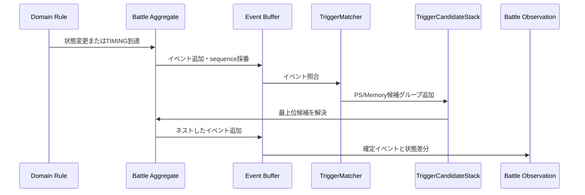
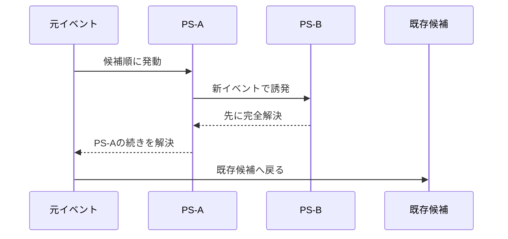

# ドメインイベント

## 目的

本書は、Battle Simulation Contextで発生するドメインイベントについて、次を定義する。

- イベントの共通形式と順序
- イベントが表す事実と発行タイミング
- イベント間の親子・因果関係
- TriggerDefinitionとの照合
- Battle Observationによる公開ログと状態履歴への変換

イベントは [05\_ドメインモデル.md](./05_ドメインモデル.md)、[06\_戦闘状態遷移.md](./06_戦闘状態遷移.md)、[07\_戦闘ルール詳細.md](./07_戦闘ルール詳細.md) を実行した結果として発生する。

## 基本方針

- ドメインイベントは、戦闘内で確定した事実または処理上の明確な契機を表す。
- イベントは発行後に変更しない。
- すべてのイベントへ戦闘内で単調増加する連番を付ける。
- PSとMemory triggeredEffectsは、イベント種別とイベント内容を発動タイミング・発動条件として使用する。
- イベントにAPI表示用の文言を持たせない。
- 内部イベントとAPI公開ログを分離する。
- 戦闘の永続化や完全再現は要件ではないが、レスポンス内ではイベント順と状態変化を追跡できるようにする。

## イベントの分類

| 分類         | 用途                                                                                                     |
| ------------ | -------------------------------------------------------------------------------------------------------- |
| `FACT`       | 確定した事実を表す。状態変更を伴う場合と、判定結果だけを表す場合があり、PS判定とログの両方で使用できる。 |
| `TIMING`     | 「スキル効果適用前」など、状態変更前の発動契機を表す。                                                   |
| `DIAGNOSTIC` | 候補除外や上限超過など、結果説明のための内部診断を表す。                                                 |

### FACT

過去形のイベント名を使用する。

例：

- `DamageApplied`
- `EffectExpired`
- `UnitDefeated`

### TIMING

進行中であることが分かるイベント名を使用する。

例：

- `SkillUseStarting`
- `DamageWillBeApplied`
- `TurnCompleting`

TIMINGイベントは状態変更前の契機であるため、PS/Memory連鎖によって前提条件が変わった場合、親処理の再検証を行う。

### DIAGNOSTIC

原則としてPSの発動契機に使用しない。

例：

- `PassiveCandidateSuppressed`
- `ExtraGaugeOverflowDiscarded`

## イベントエンベロープ

すべてのイベントは次の共通情報を持つ。

| フィールド          | 型・形式                       | 必須 | 説明                                                     |
| ------------------- | ------------------------------ | ---- | -------------------------------------------------------- |
| `schemaVersion`     | 正の整数                       | 必須 | イベント契約のバージョン。初期値は1。                    |
| `eventId`           | `DomainEventId`                | 必須 | 戦闘内で一意なイベントID。                               |
| `sequence`          | 1以上の整数                    | 必須 | 戦闘内の全イベントを通した連番。                         |
| `eventType`         | 文字列                         | 必須 | `DamageApplied` などのイベント種別。                     |
| `category`          | `FACT`／`TIMING`／`DIAGNOSTIC` | 必須 | イベント分類。                                           |
| `battleId`          | `BattleId`                     | 必須 | 戦闘ID。                                                 |
| `turnNumber`        | 1～99                          | 必須 | 発生時のターン番号。戦闘開始前だけ0を許可する。          |
| `cycleNumber`       | 0以上                          | 必須 | ターン内の周回番号。周回外では0。                        |
| `actionId`          | `ActionId`                     | 任意 | ユニットの行動中に発生した場合の行動ID。                 |
| `skillUseId`        | `SkillUseId`                   | 任意 | 一つのAS、PS、EX、チャージ効果解決を識別するID。         |
| `effectSequenceId`  | `EffectSequenceId`             | 任意 | SkillまたはMemory内の効果解決を識別するID。              |
| `resolutionScopeId` | `ResolutionScopeId`            | 必須 | PSの1回制限と候補スタックを共有する解決スコープ。        |
| `parentEventId`     | `DomainEventId`                | 任意 | このイベントを直接発生させた親イベント。                 |
| `rootEventId`       | `DomainEventId`                | 必須 | 解決スコープを開始した最上位イベント。                   |
| `sourceUnitId`      | `BattleUnitId`                 | 任意 | 出来事の発生源。                                         |
| `sourceSide`        | `Side`                         | 任意 | Memoryなど、特定ユニットを発生源にしない場合の発生陣営。 |
| `targetUnitIds`     | `BattleUnitId[]`               | 任意 | 出来事の対象。順序を保持する。                           |
| `payload`           | イベント固有値                 | 必須 | イベント固有の事実。                                     |

実時間のタイムスタンプはイベント順序の決定に使用しない。順序は `sequence` だけで決定する。

### イベントID

イベントIDは少なくとも戦闘内で一意とする。実装例として、`battleId + sequence` から生成できる。

```text
eventId = `${battleId}:${sequence}`
```

外部へ公開する形式は後続のAPI設計で決定する。

## 順序と因果関係

### sequence

- Battle集約がイベントを発行するたびに1増やす。
- ネストしたPSから発生するイベントにも同じ連番を使用する。
- 同じ `sequence` を持つイベントを二つ作らない。
- 公開ログは `sequence` の昇順で返す。

### parentEventId

現在処理中のイベントから直接発生したイベントを子とする。

例：

```text
DamageApplied
└─ PassiveActivated
   └─ EffectApplied
```

この場合、`PassiveActivated.parentEventId` は `DamageApplied.eventId`、`EffectApplied.parentEventId` は `PassiveActivated.eventId` とする。

### rootEventId

一つの解決スコープに属するイベントは同じ `rootEventId` を持つ。

- ユニット行動では原則として `ActionStarted.eventId`
- ターン開始処理では `TurnStarted.eventId`
- ターン終了処理では `TurnCompleting.eventId`
- 戦闘開始処理では `BattleStarted.eventId`

### resolutionScopeId

- ユニット行動では `ActionId` と対応する。
- 行動外のトップレベルイベントでは、新しい解決スコープIDを発行する。
- PS発動済み集合と候補スタックは、解決スコープが終わるまで共有する。
- 解決スコープ終了後、発動済み集合を破棄する。

## イベント発行と処理



処理順：

1. ルールが状態を変更する、またはTIMINGイベントの契機へ到達する。
2. Battle集約がイベントを生成し、連番を採番してイベントバッファへ追加する。
3. `PassiveTriggerMatcher` と Memory trigger matcher がイベントへ対応する候補を抽出する。
4. 候補があれば候補グループをスタックへ積み、`07_戦闘ルール詳細.md` の順序で直ちに解決する。
5. PSまたはMemoryから発生した子イベントも同じ手順で処理する。
6. 子の候補グループが空になったら親処理へ戻る。
7. 状態変更とイベントをBattle Observationへ渡す。

### 複合処理と状態差分の所有

一つの原子的な処理を複数のイベントで説明する場合、状態変更を所有する主イベントを一つに定める。内訳を表す子イベントへ同じ `stateDelta` を重複して持たせない。

例として、AS行動開始時のAP消費とEXゲージ増加は、次の順で記録する。

1. AP消費とEXゲージ増加を原子的に確定する。
2. `ActionStarted` を主イベントとして発行し、リソース変更の `stateDelta` を持たせる。
3. `ActionPointConsumed` と `ExtraGaugeIncreased` を `ActionStarted` の子イベントとして発行し、変更内訳をpayloadへ持たせる。
4. 子イベントの `stateVersionBefore` と `stateVersionAfter` は同じ値とし、`stateDelta` は空にする。

子イベントも確定事実でありPS/Memoryの発動契機にできる。主イベントに対応するPS/Memory候補を解決した後、子イベントを定義順に発行して、それぞれに対応する候補を直ちに解決する。

## 戦闘・ターンイベント

| eventType            | 分類     | 発行タイミング                        | 主なpayload                      |
| -------------------- | -------- | ------------------------------------- | -------------------------------- |
| `BattleStarted`      | `FACT`   | `READY` から `RUNNING` へ遷移した直後 | 規定ターン数、両陣営の参加枠     |
| `TurnStarted`        | `FACT`   | ターン番号を進めた直後                | ターン番号                       |
| `ResourcesRecovered` | `FACT`   | AP・PPを回復した直後                  | ユニットごとの回復前後値         |
| `TurnCompleting`     | `TIMING` | ターン終了処理の開始時                | ターン番号                       |
| `TurnCompleted`      | `FACT`   | 期間・クールタイム・PS解決を終えた後  | ターン番号、終了時状態バージョン |
| `BattleCompleted`    | `FACT`   | 勝敗を確定した直後                    | 勝敗、終了理由、終了ターン       |

### ResourcesRecovered payload

ユニットごとに次を持つ。

- `battleUnitId`
- `apBefore`, `apAfter`
- `ppBefore`, `ppAfter`

EXゲージはターン開始時に回復しないため含めない。

## 行動順キューイベント

| eventType                  | 分類   | 発行タイミング                     | 主なpayload              |
| -------------------------- | ------ | ---------------------------------- | ------------------------ |
| `ActionQueueCreated`       | `FACT` | 新しい周回のキュー生成後           | 周回番号、予約一覧       |
| `ActionQueueReordered`     | `FACT` | 速度変化による未行動者の並べ替え後 | 変更前後の順序、予約種別 |
| `ActionReservationRemoved` | `FACT` | 戦闘不能者の予約を除去した後       | 対象ユニット、除去理由   |

### 予約一覧

各予約は次を持つ。

- 順位
- 戦闘ユニットID
- キュー生成時の行動速度
- 予約種別：AS／EX

速度再計算後も予約種別は変更しない。`ActionQueueReordered` は順序変更だけを表す。

## 行動イベント

| eventType          | 分類     | 発行タイミング                   | 主なpayload                        |
| ------------------ | -------- | -------------------------------- | ---------------------------------- |
| `ActionStarted`    | `FACT`   | 実効行動のリソース消費後         | 予約種別、実効行動、リソース前後値 |
| `ActionWaited`     | `FACT`   | 待機が確定した後                 | 待機理由、消費リソース             |
| `ActionCompleting` | `TIMING` | 行動終了処理の開始時             | 行動種別、行動者                   |
| `ActionCompleted`  | `FACT`   | 効果期間・クールタイム・PS解決後 | 行動結果、終了時状態バージョン     |

### ActionStarted payload

- `actorUnitId`
- `reservedActionType`：AS／EX
- `effectiveActionType`：AS／EX／WAIT／CHARGE_RELEASE
- `apBefore`, `apAfter`
- `exBefore`, `exAfter`
- `waitReason`：待機でなければなし

AS行動開始時のAP消費とEXゲージ増加は、`ActionStarted` が状態差分を所有する。PS発動時のPP消費とEXゲージ増加は、`PassiveActivated` が状態差分を所有する。個別のリソースイベントは変更内訳を表し、同じ状態差分を重複して持たない。

## スキルイベント

| eventType             | 分類     | 発行タイミング                                   | 主なpayload                      |
| --------------------- | -------- | ------------------------------------------------ | -------------------------------- |
| `SkillUseStarting`    | `TIMING` | 対象選択後、最初の効果適用前                     | スキル、使用者、対象、コスト     |
| `SkillUseStarted`     | `FACT`   | コスト消費とクールタイム設定後                   | スキル、コスト、クールタイム     |
| `SkillUseCompleted`   | `FACT`   | 全stepとPS/Memory連鎖の解決後                    | 解決したstep数、対象             |
| `SkillUseInterrupted` | `FACT`   | 開始前提の不成立または使用者戦闘不能で中断した時 | 中断理由、解決済み・未解決効果数 |
| `SkillMissed`         | `FACT`   | 暗闇判定でスキル全体がMISSになった時             | 暗闇効果ID、判定結果             |
| `TargetsSelected`     | `FACT`   | 対象順を確定した後                               | ターゲット方式、候補順、選択対象 |

同じ `SkillUseId` に属するイベントを関連づける。PSも一つのスキル使用として新しい `SkillUseId` を持つ。

## EffectSequenceイベント

| eventType                | 分類         | 発行タイミング                      | 主なpayload                           |
| ------------------------ | ------------ | ----------------------------------- | ------------------------------------- |
| `TargetBindingsResolved` | `FACT`       | EffectSequence開始時のbinding評価後 | bindingごとの対象順、fallback使用有無 |
| `EffectStepStarting`     | `TIMING`     | step条件評価前                      | step種別、step index、条件            |
| `EffectStepSkipped`      | `DIAGNOSTIC` | step条件がfalseでスキップされた時   | step index、条件評価結果              |
| `EffectStepCompleted`    | `FACT`       | stepの解決完了後                    | step index、解決action数              |
| `RandomBranchSelected`   | `FACT`       | RANDOM_BRANCHの分岐決定後           | mode、選択label、branch index         |
| `EffectActionStarting`   | `TIMING`     | EffectAction適用前                  | action ID、kind、対象                 |
| `EffectActionCompleted`  | `FACT`       | EffectAction適用完了後              | action ID、kind、結果種別             |

### EffectActionCompleted payload

- `effectActionDefinitionId`
- `effectActionKind`
- `targetUnitIds`
- `resultKind`: `APPLIED` / `SKIPPED` / `MISSED` / `REJECTED` / `INTERRUPTED`
- `lastResultReference`: 後続の `LAST_RESULT` 条件やFormulaが参照できる結果ID

`EffectActionStarting` はTIMINGイベントである。PS/Memory連鎖によって対象、使用者、条件が変化した場合、親EffectActionは適用直前に再検証する。

## チャージイベント

| eventType            | 分類   | 発行タイミング                     | 主なpayload                  |
| -------------------- | ------ | ---------------------------------- | ---------------------------- |
| `ChargeStarted`      | `FACT` | チャージ状態を設定した後           | スキル、開始行動ID           |
| `ChargeReleaseReady` | `FACT` | 発動可能な次の行動機会へ到達した時 | スキル、元行動ID             |
| `ChargeReleased`     | `FACT` | チャージ効果の解決開始時           | スキル、元行動ID、現在行動ID |
| `ChargeCancelled`    | `FACT` | 気絶によりキャンセルした後         | スキル、キャンセル理由       |
| `ChargeHeldByFreeze` | `FACT` | 凍結により発動を延期した時         | スキル、凍結効果ID           |

## PSイベント

| eventType                    | 分類         | 発行タイミング                   | 主なpayload                        |
| ---------------------------- | ------------ | -------------------------------- | ---------------------------------- |
| `PassiveCandidateDetected`   | `DIAGNOSTIC` | 発動条件を満たす候補を検出した時 | PS、所有者、トリガーイベント       |
| `PassiveCandidateSuppressed` | `DIAGNOSTIC` | 候補を除外した時                 | PS、除外理由                       |
| `PassiveActivated`           | `FACT`       | 発動済み集合への登録とPP消費後   | PS、PP・EX前後値、トリガーイベント |
| `PassiveResolved`            | `FACT`       | PSのEffectSequence解決後         | PS、解決step数                     |
| `PassiveInterrupted`         | `FACT`       | 所有者戦闘不能で中断した時       | PS、中断理由、未解決効果数         |

### 候補除外理由

- 所有者が戦闘不能
- チャージ中
- PP不足
- クールタイム中
- 発動条件が不成立へ変化
- 同じ解決スコープですでに発動済み
- 同時発動制限で別候補が選択された

DIAGNOSTICイベントは詳細ログ設定が有効な場合だけ公開してよい。発行自体を省略する実装も許容するが、テスト時には除外理由を観測可能にする。

## Memoryイベント

| eventType                   | 分類         | 発行タイミング                        | 主なpayload                               |
| --------------------------- | ------------ | ------------------------------------- | ----------------------------------------- |
| `MemoryCandidateDetected`   | `DIAGNOSTIC` | triggeredEffectの条件を満たした時     | Memory、triggeredEffect、トリガーイベント |
| `MemoryCandidateSuppressed` | `DIAGNOSTIC` | 候補を除外した時                      | Memory、除外理由                          |
| `MemoryTriggered`           | `FACT`       | triggeredEffectの解決開始時           | Memory、triggeredEffect、トリガーイベント |
| `MemoryResolved`            | `FACT`       | triggeredEffectのEffectSequence解決後 | Memory、解決step数                        |

Memory由来の `APPLY_STAT_MOD` が継続効果として付与された際は、通常スキル由来の場合と同じ `EffectApplied` を発行する（`MemoryModifierApplied` は廃止。`modifiers` フィールド廃止に伴い不要になった）。

Memoryイベントは `sourceUnitId` を持たず、`sourceSide` を持つ。`MemoryTriggered` から発生するEffectSequenceイベントは、同じ `effectSequenceId` と `sourceSide` を引き継ぐ。

### Memory候補除外理由

- trigger conditionが不成立へ変化
- 対象候補が0件
- 必要Capabilityが未実装
- source unitを必要とするEffectActionを含む

## 命中・会心イベント

| eventType                | 分類   | 発行タイミング             | 主なpayload                |
| ------------------------ | ------ | -------------------------- | -------------------------- |
| `BlindnessCheckResolved` | `FACT` | 暗闇一つの判定後           | 効果ID、確率、MISS判定     |
| `EvasionActivated`       | `FACT` | 特別な回避効果が成功した後 | 回避効果ID、対象           |
| `HitConfirmed`           | `FACT` | 対象への命中が確定した時   | スキル、ヒット番号、対象   |
| `CriticalCheckResolved`  | `FACT` | 会心判定後                 | 元会心率、実効会心率、結果 |

乱数値そのものを公開ログへ含める必要はない。テスト・診断用途では内部イベントへ記録できる。

## ダメージイベント

| eventType                  | 分類     | 発行タイミング                   | 主なpayload                          |
| -------------------------- | -------- | -------------------------------- | ------------------------------------ |
| `UnitBeingAttacked`        | `TIMING` | 攻撃対象が確定した直後           | 発生源、対象、スキル、ヒット番号     |
| `DamageWillBeApplied`      | `TIMING` | 命中・会心後、ダメージ計算前     | 発生源、対象、会心、貫通、補正       |
| `DamageCalculated`         | `FACT`   | 最終ダメージ確定後               | 計算要素、最終ダメージ、タイプ、特性 |
| `ShieldConsumed`           | `FACT`   | シールド値を減らした後           | シールドタイプ、前後値、吸収量       |
| `SubUnitDamaged`           | `FACT`   | サブユニットへ適用した後         | サブユニット効果ID、前後値、吸収量   |
| `HitPointReduced`          | `FACT`   | HPを減らした後                   | HP前後値、HPダメージ量               |
| `DamageApplied`            | `FACT`   | 一つのダメージ適用を完了した後   | 計算値、シールド吸収、HPダメージ     |
| `LinkedDamageGenerated`    | `FACT`   | リンク先ダメージを生成した時     | 元イベント、リンク対象、ダメージ量   |
| `DamageRedirected`         | `FACT`   | 挑発・肩代わりで対象が変わった時 | 元対象、新対象、原因効果             |
| `ReflectedDamageGenerated` | `FACT`   | 反射ダメージを生成した時         | 元イベント、反射元、反射先、量       |

### DamageCalculated payload

- 発生源・対象の戦闘ユニットID
- スキル定義ID、EffectAction定義ID
- ヒット番号
- 攻撃力、防御力
- 実効防御力
- スキル威力
- 属性倍率
- 会心倍率
- 与ダメージ倍率
- 被ダメージ倍率
- Action内追加ダメージ倍率
- `defenseIgnoreRate`, `shieldIgnoreRate`, `damageReductionIgnoreRate`
- 切り捨て前の値
- 最終ダメージ
- ダメージタイプ
- リンクダメージか
- シールド適用可能か

### DamageApplied payload

- `calculatedDamage`
- HP直接適用量
- タイプありシールド吸収量
- タイプなしシールド吸収量
- サブユニット吸収量
- HPダメージ量
- 対象のHP前後値
- 戦闘不能になったか

## 回復イベント

| eventType     | 分類   | 発行タイミング       | 主なpayload                    |
| ------------- | ------ | -------------------- | ------------------------------ |
| `HealApplied` | `FACT` | HP回復を適用した直後 | 回復元、対象、回復量、HP前後値 |

### HealApplied payload

- 発生源の戦闘ユニットID。Memory由来の場合は `sourceSide`
- 対象の戦闘ユニットID
- EffectAction定義ID
- Formula評価結果
- HealingModifier倍率
- 整数化後の回復量
- 実際に回復したHP量
- 破棄したoverheal量
- 対象のHP前後値

## 効果イベント

| eventType                   | 分類   | 発行タイミング                       | 主なpayload                        |
| --------------------------- | ------ | ------------------------------------ | ---------------------------------- |
| `EffectApplied`             | `FACT` | 新しい効果インスタンス追加後         | 効果インスタンス、期間、効果量     |
| `EffectApplicationRejected` | `FACT` | 無効効果などで付与しなかった時       | 効果、拒否理由                     |
| `EffectMerged`              | `FACT` | 毒など固有規則で既存効果へ統合した後 | 統合前後の効果量・期間             |
| `EffectiveEffectChanged`    | `FACT` | 重複なし効果の採用対象が変わった時   | 同種キー、変更前後の効果ID         |
| `EffectRemoved`             | `FACT` | 解除・消滅条件で削除した後           | 効果インスタンス、解除理由         |
| `EffectExpired`             | `FACT` | 残り期間が0になった直後              | 効果インスタンス、期間単位         |
| `EffectConsumptionChanged`  | `FACT` | 消費条件で残回数が変化した後         | 効果インスタンス、消費条件、前後値 |

### EffectApplied payload

- 効果インスタンスID
- EffectAction定義ID
- 付与者・対象の戦闘ユニットID
- 重複あり／重複なし
- `EffectKindKey`
- 効果量
- duration: 期間単位、owner、消費条件、失効条件、linkedEffectGroupId
- 初期回数、残り回数
- 付与行動ID、付与ターン番号
- 付与時スナップショット：必要な場合

## Markerイベント

| eventType       | 分類   | 発行タイミング                  | 主なpayload                         |
| --------------- | ------ | ------------------------------- | ----------------------------------- |
| `MarkerApplied` | `FACT` | Markerを新規付与した後          | Marker ID、対象、スタック、Duration |
| `MarkerUpdated` | `FACT` | Markerのスタック/Duration変更後 | Marker ID、変更前後値、更新方針     |
| `MarkerRemoved` | `FACT` | Markerを解除・失効した後        | Marker ID、対象、解除理由           |

### MarkerUpdated payload

- `markerId`
- 対象の戦闘ユニットID
- 付与者の戦闘ユニットIDまたは `sourceSide`
- `stackBefore`, `stackAfter`
- `durationBefore`, `durationAfter`
- `policy`: `ADD` / `KEEP_EXISTING` / `REFRESH` / `REPLACE`
- `linkedEffectGroupId`

### EffectExpiredの順序

1. 行動またはターン終了時に残り回数を減らす。
2. 0になった効果ごとに `EffectExpired` を発行する。
3. 重複なし効果の最強効果が変わった場合、`EffectiveEffectChanged` を発行する。
4. ステータスを再計算し、必要なら `CombatStatChanged` を発行する。
5. 各イベントに対応するPS/Memory候補を直ちに解決する。

付与された当該行動・ターンでは期間を減らさない。

## リソース・クールタイムイベント

| eventType                     | 分類         | 発行タイミング                 | 主なpayload                          |
| ----------------------------- | ------------ | ------------------------------ | ------------------------------------ |
| `ResourceChanged`             | `FACT`       | AP/PP/EXゲージ変更を確定した後 | 対象、resource、前後値、理由         |
| `ActionPointConsumed`         | `FACT`       | AP消費後                       | 消費理由、前後値、消費量             |
| `PassivePointConsumed`        | `FACT`       | PP消費後                       | PS、前後値、消費量                   |
| `ExtraGaugeIncreased`         | `FACT`       | AP・PP消費による増加後         | 原因、前後値、増加量                 |
| `ExtraGaugeOverflowDiscarded` | `DIAGNOSTIC` | 最大値超過分を破棄した時       | 要求増加量、実増加量、破棄量         |
| `ExtraGaugeConsumed`          | `FACT`       | EX使用・特殊待機で全量消費後   | 消費理由、前後値                     |
| `ResourceCapacityChanged`     | `FACT`       | APなどの最大値変更後           | 対象、resource、最大値前後           |
| `CooldownStarted`             | `FACT`       | スキルへクールタイム設定後     | スキル、単位、初期残数、設定スコープ |
| `CooldownReduced`             | `FACT`       | 次回以降の行動・ターン終了時   | スキル、前後値                       |
| `CooldownCompleted`           | `FACT`       | 残数が0になった時              | スキル、単位                         |

`ActionStarted`、`PassiveActivated`、`MODIFY_RESOURCE` のEffectActionは、状態差分の主イベントとして `ResourceChanged` を発行する。`ActionPointConsumed`、`PassivePointConsumed`、`ExtraGaugeIncreased`、`ExtraGaugeConsumed` は詳細内訳として子イベントにできるが、同じ状態差分を重複して持たない。

### ResourceChanged payload

- 対象の戦闘ユニットID
- `resource`: `AP` / `PP` / `EX_GAUGE`
- `before`, `after`
- `delta`
- `reason`: `SKILL_COST` / `WAIT_COST` / `EX_GAIN` / `EFFECT_ACTION` / `TURN_RECOVERY`
- 原因イベントID

## RuntimeCounterイベント

| eventType               | 分類   | 発行タイミング                         | 主なpayload                  |
| ----------------------- | ------ | -------------------------------------- | ---------------------------- |
| `RuntimeCounterChanged` | `FACT` | RuntimeCounterの値を更新した直後       | counter、scope、前後値、原因 |
| `RuntimeCounterReset`   | `FACT` | scope終了などでcounterをリセットした後 | counter、scope、リセット理由 |

RuntimeCounter更新イベントは、原因となる状態変更イベントの子イベントとして発行する。`RUNTIME_COUNTER` Condition は更新後の値を参照するため、候補抽出より前に発行される。

## ユニットイベント

| eventType             | 分類   | 発行タイミング                 | 主なpayload                      |
| --------------------- | ------ | ------------------------------ | -------------------------------- |
| `CombatStatChanged`   | `FACT` | 有効効果変更後の再計算時       | ステータス種別、前後値、変更理由 |
| `UnitDefeated`        | `FACT` | HPが0になった直後              | ユニット、原因イベント           |
| `StunDurationChanged` | `FACT` | 気絶の残り回数変更後           | 前後値、変更理由                 |
| `FreezeRemoved`       | `FACT` | 期間またはダメージで凍結解除後 | 凍結効果ID、解除理由             |

`UnitDefeated` の後、そのユニットの行動予約を除去して `ActionReservationRemoved` を発行する。

## イベントとTrigger照合

### TriggerDefinition

PS Skill と Memory triggeredEffects は `TriggerDefinition` を持つ。

| フィールド       | 説明                                                                     |
| ---------------- | ------------------------------------------------------------------------ |
| `eventType`      | 対応するイベント種別。                                                   |
| `category`       | 必要ならFACT／TIMINGを限定する。                                         |
| `sourceSelector` | 自身、味方、敵、source sideなど発生源条件。                              |
| `targetSelector` | 自身、味方、敵など対象条件。                                             |
| `condition`      | `ConditionDefinition`。payload、対象状態、RuntimeCounterなどの追加条件。 |

例：

```text
味方がダメージを受けた後
  eventType = DamageApplied
  targetSelector = ALLY
  condition = EVENT_PAYLOAD hpDamage > 0

自身がASを使う前
  eventType = SkillUseStarting
  sourceSelector = SELF
  condition = EVENT_PAYLOAD skillType == AS
```

### 候補抽出

1. 戦闘可能な全ユニットのPSと、編成に指定されたMemory triggeredEffectsを対象にする。
2. PSでは、チャージ中の所有者が持つPSを除外する。
3. `eventType`、`category`、source/target selector、`condition` を照合する。
4. PSでは、現在の解決スコープで発動済みの同一PSを除外する。
5. PSでは、同時発動制限を適用する。
6. PS候補は先制攻撃候補を通常候補より前へ分け、それぞれを速度、陣営、配置、定義順で並べる。
7. Memory候補はAPI指定順、同一Memory内の定義順で並べる。
8. 候補グループを `07_戦闘ルール詳細.md` の順序でスタックへ積む。

### 発動直前の再確認

候補検出後にネストしたイベントで状態が変わる可能性があるため、発動直前に次を再確認する。

PS候補:

- 所有者が戦闘可能
- チャージ中でない
- PPが足りる
- クールタイムが0
- 発動条件が現在も成立
- 解決スコープで未発動

Memory候補:

- trigger conditionが現在も成立
- 対象候補が1件以上存在する
- requiredCapabilitiesが実装済み

### PS/Memoryからの連鎖

`PassiveActivated`、`PassiveResolved`、`MemoryTriggered`、`MemoryResolved`、それらが発行した効果・ダメージイベントも、通常のイベントと同様に別のPS/Memoryの発動契機にできる。

新しい候補は既存の未処理候補より先に処理する。



## TIMINGイベント後の再検証

TIMINGイベントに反応したPS/Memoryによって前提が変わる場合がある。

| TIMINGイベント         | 再検証する内容                               |
| ---------------------- | -------------------------------------------- |
| `SkillUseStarting`     | 使用者の生存、対象、発動条件、スキル中断     |
| `UnitBeingAttacked`    | 発生源・対象の生存、対象変更、挑発・肩代わり |
| `DamageWillBeApplied`  | 対象の生存、シールド、ダメージ無効・軽減効果 |
| `EffectActionStarting` | 対象の生存、無効効果、重複規則、Capability   |
| `ActionCompleting`     | 期間・クールタイム更新対象                   |
| `TurnCompleting`       | 期間・クールタイム更新対象                   |

前提が成立しなくなった場合、親処理を中断または再計算し、理由をイベントとして残す。

## Battle Observation

### 責務

Battle Observationは次を行う。

- 内部イベントをAPI公開イベントへ変換する。
- イベント連番と因果関係を保持する。
- 状態差分を記録する。
- 初期状態と差分から任意時点の状態を復元可能にする。
- 必要な粒度で状態スナップショットを生成する。

ドメイン判断は行わない。

### 状態バージョン

Battleの可変状態へ変更を確定するたびに `stateVersion` を1増やす。

公開イベントは次を持つ。

- `stateVersionBefore`
- `stateVersionAfter`
- 状態変更がある場合は、対応する状態差分への参照

状態変更のないTIMINGイベントでは、前後のバージョンを同じにする。

### StateDelta

変更した項目だけを、戦闘ユニットIDや効果インスタンスIDをキーとして記録する。

概念例：

```json
{
  "units": {
    "ally-1": {
      "hp": { "before": 1000, "after": 750 },
      "effectsAdded": [],
      "effectsRemoved": []
    }
  },
  "queue": null,
  "battleStatus": null
}
```

配列全体の位置に依存するJSON Patchではなく、安定したドメインIDで差分対象を識別する。

### 状態復元

```text
stateAt(sequence N) = initialState + delta(1) + delta(2) + ... + delta(N)
```

レスポンス利用者が各時点の状態を必要とするため、少なくとも初期状態と全状態差分を返す。具体的なAPIでは、イベントへ差分本体を重複させず、状態差分配列への参照を持たせる。

### 公開レベル

| レベル       | 内容                                                                         |
| ------------ | ---------------------------------------------------------------------------- |
| `SUMMARY`    | 戦闘開始、行動結果、戦闘不能、ターン終了、戦闘終了。                         |
| `DETAILED`   | スキル、各ヒット、ダメージ、回復、シールド、効果、Marker、PS、Memoryを含む。 |
| `DIAGNOSTIC` | 候補除外、乱数判定、超過切り捨てなど内部診断も含む。                         |

本アプリケーションの要件は行動単位の詳細ログであるため、APIの既定値は `DETAILED` とする。

## 公開イベント形式

公開イベントは内部イベント名をそのまま露出させる必要はないが、機械的に識別可能な `type` を持つ。

```text
BattleLogEvent {
  sequence
  type
  turnNumber
  cycleNumber
  actionId?
  parentSequence?
  sourceUnitId?
  targetUnitIds?
  details
  stateVersionBefore
  stateVersionAfter
  stateTransitionReference?
}
```

表示文言はクライアント側、またはAPIプレゼンテーション層で `type` と `details` から生成する。状態変更を持つイベントは `stateTransitionReference` から対応する差分を一意に取得できなければならない。

## イベントの不変条件

- `sequence` は1から始まり、欠番を許容しても重複・逆転させない。
- `eventId` は戦闘内で一意とする。
- 子イベントの `sequence` は親イベントより大きくする。
- 子イベントの `rootEventId` は親と同じにする。
- 同じ行動に属するイベントは同じ `actionId` を持つ。
- 同じスキル解決に属するイベントは同じ `skillUseId` を持つ。
- 同じEffectSequence解決に属するイベントは同じ `effectSequenceId` を持つ。
- Memory由来イベントは `sourceSide` を持ち、特定ユニットを発生源にしない。
- FACTイベントは、表す状態変更が確定した後に発行する。
- 一つの状態変更を複数イベントの `stateDelta` へ重複して記録しない。
- TIMINGイベント後は親処理の前提を再検証する。
- ドメインイベントへ表示文言を格納しない。
- `stateDelta` の適用後状態はBattle集約の実状態と一致する。

## イベントテストの基準

1. すべてのイベント連番が単調増加し重複しない。
2. PSまたはMemoryから別の候補が誘発されたとき、親子関係とrootイベントが維持される。
3. 新しいPS/Memory候補のイベントが `07_戦闘ルール詳細.md` の順序で並ぶ。
4. 同じ行動のイベントが同じ `actionId` を持つ。
5. 複数ヒットが別々の `UnitBeingAttacked`、`DamageWillBeApplied`、`DamageApplied` を発行する。
6. シールド吸収とHPダメージの合計が計算ダメージと一致する。
7. 効果期間0で `EffectExpired` が発行される。
8. 重複なしの最強効果失効後に `EffectiveEffectChanged` が発行される。
9. PP消費と同量のEX増加を `ResourceChanged` と `PassiveActivated` から確認できる。
10. AP消費でEXが最大値を超えた場合、`ResourceChanged` と `ExtraGaugeOverflowDiscarded` から実増加量と破棄量を説明できる。
11. 初期状態へsequence順に差分を適用し、最終状態と一致する。
12. TIMINGイベント中のPS/Memoryで前提が変化した場合、親処理が再検証される。
13. `DETAILED` ログに各スキル、PS、Memory、ダメージ、回復、効果変更が含まれる。
14. `DIAGNOSTIC` を除外しても状態復元に必要なFACTイベントと差分が失われない。
15. Markerの付与、更新、解除が `MarkerApplied`、`MarkerUpdated`、`MarkerRemoved` として追跡できる。
16. RANDOM_BRANCHの選択結果を `RandomBranchSelected` から確認できる。

## 次の設計への申し送り

次の `09_アプリケーション設計.md` では、次を詳細化する。

- `SimulateBattleUseCase` の処理フロー
- Battle Catalogと定義データの読み込み
- 入力検証と未対応ルール検出
- Battle集約の実行ループ
- Battle ObservationからAPIレスポンスへの変換
- ドメインエラーとアプリケーションエラーの分類
