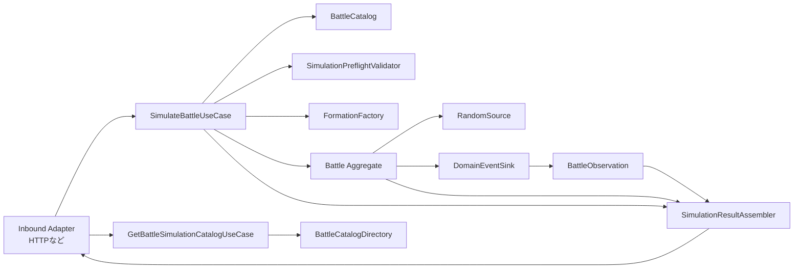
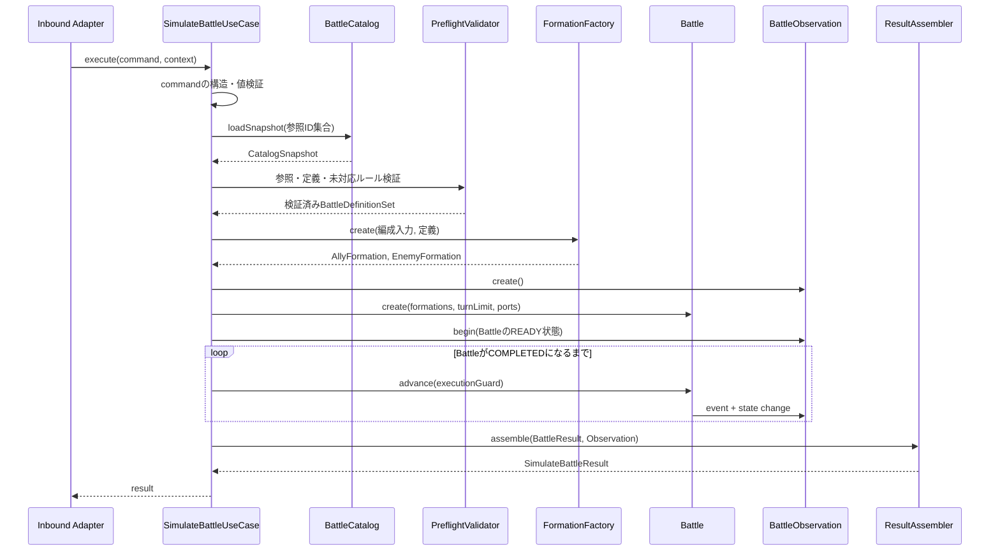

# アプリケーション設計

## 目的

本書は、戦闘シミュレーションを1リクエストで最後まで実行するアプリケーション層について、次を定義する。

- `SimulateBattleUseCase` と `GetBattleSimulationCatalogUseCase` の入出力と処理順
- Battle Catalogから定義データを取得する境界
- 入力、参照、定義および未対応ルールの検証
- Battle集約の生成と完了までの実行
- Battle Observationからレスポンスモデルへの変換
- ドメインエラーとアプリケーションエラーの分類

本書は [03\_ユースケース.md](./03_ユースケース.md)、[04\_境界づけられたコンテキスト.md](./04_境界づけられたコンテキスト.md)、[05\_ドメインモデル.md](./05_ドメインモデル.md)、[06\_戦闘状態遷移.md](./06_戦闘状態遷移.md)、[07\_戦闘ルール詳細.md](./07_戦闘ルール詳細.md)、[08\_ドメインイベント.md](./08_ドメインイベント.md) を前提とする。

## 設計方針

- アプリケーション層はユースケースの進行を調整し、戦闘ルールを実装しない。
- HTTP、JSONなどの外部表現をアプリケーション層へ持ち込まない。
- 戦闘ごとに独立したBattle集約とBattle Observationを生成する。
- 一つの実行中は、同じバージョンの定義データだけを参照する。
- 入力から事前に検出できる問題は、Battle集約を生成する前にまとめて返す。
- 戦闘の途中状態は永続化せず、成功時だけ完結した結果を返す。
- タイムアウトや実行保護による中断を、勝敗やターン上限による敗北として扱わない。
- Catalog参照ユースケースは戦闘開始可否の推移的Capability判定を再利用し、UI専用の推測ロジックを持たない。

## アプリケーション構成



### 責務一覧

| コンポーネント                      | 層          | 責務                                                                   |
| ----------------------------------- | ----------- | ---------------------------------------------------------------------- |
| `SimulateBattleUseCase`             | Application | ユースケース全体の順序、失敗時の中断、結果の返却を調整する。           |
| `GetBattleSimulationCatalogUseCase` | Application | 全Unit・Memoryの表示用read modelと選択可否を返す。                     |
| `BattleCatalog`                     | Domain Port | 必要な定義を、一貫したCatalogスナップショットとして取得する。          |
| `BattleCatalogDirectory`            | Domain Port | 検証済みCatalog全体を一覧query用の不変スナップショットとして取得する。 |
| `SimulationPreflightValidator`      | Application | 入力制約、参照解決、未対応ルールを戦闘開始前に検証する。               |
| `FormationFactory`                  | Domain      | 検証済み定義と配置から編成および戦闘開始ユニットを生成する。           |
| `Battle`                            | Domain      | 戦闘状態を保持し、ドメインルールに従って完了まで遷移する。             |
| `DomainEventSink`                   | Domain Port | 確定イベントと状態変更記録をBattle Observationへ渡す。                 |
| `BattleObservation`                 | Application | 初期状態、イベント、状態差分をリクエスト内で蓄積する。                 |
| `SimulationResultAssembler`         | Application | Battleの結果とObservationを出力モデルへ変換する。                      |

## SimulateBattleUseCase

### インターフェース

概念上、次のインターフェースを持つ。

```text
SimulateBattleUseCase.execute(
  command: SimulateBattleCommand,
  context: SimulationExecutionContext
) -> SimulateBattleResult
```

正常系は `SimulateBattleResult` を返す。失敗時は後述する構造化された `ApplicationError` を返し、途中までの戦闘結果を成功レスポンスとして返さない。

### SimulateBattleCommand

```text
SimulateBattleCommand {
  allyFormation: FormationInput
  enemyFormation: FormationInput
  turnLimit: integer
  logLevel: SUMMARY | DETAILED | DIAGNOSTIC = DETAILED
}

FormationInput {
  slots: FormationSlotInput[1..5]
  memoryDefinitionIds: MemoryDefinitionId[0..6]
}

FormationSlotInput {
  unitDefinitionId: UnitDefinitionId
  position: FormationPositionInput
}

FormationPositionInput {
  column: 0 | 1 | 2
  row: FRONT | REAR
}
```

Commandの配置入力は各陣営から見た `FRONT`／`REAR` とし、Formationモジュールで3×4共通座標へ変換する。外部表現からCommandへの変換はInbound Adapterが担当する。

同じ `unitDefinitionId` を複数の枠で指定できる。入力配列内の各要素は別の参加枠であり、別々の `BattleUnitId` を割り当てる。

### SimulationExecutionContext

ドメインルールではない実行上の情報を保持する。

```text
SimulationExecutionContext {
  requestId?
  cancellationSignal?
  deadline?
}
```

HTTPリクエストやフレームワーク固有の型は含めない。キャンセルと期限は安全な処理境界で確認し、ドメインの勝敗へ変換しない。

### SimulateBattleResult

```text
SimulateBattleResult {
  battleId
  catalogRevision
  outcome: ALLY_WIN | ALLY_LOSE
  completionReason:
    ENEMY_DEFEATED |
    ALLY_DEFEATED |
    SIMULTANEOUS_DEFEAT |
    TURN_LIMIT_REACHED
  completedTurn
  initialState
  finalState
  events: BattleLogEvent[]
  stateTransitions: StateTransition[]
}
```

`events` は指定された公開レベルのイベントログ、`stateTransitions` は全状態変更の履歴とする。イベント公開レベルによって表示用イベントを間引いても、状態復元に必要な差分は `stateTransitions` から失われない。公開イベントは対応する状態差分への参照を持ち、差分本体を重複して保持しない。

```text
StateTransition {
  causedBySequence
  stateVersionBefore
  stateVersionAfter
  stateDelta
}
```

`initialState` へ `stateTransitions` を順に適用した結果は、必ず `finalState` と一致する。

## GetBattleSimulationCatalogUseCase

### インターフェース

```text
GetBattleSimulationCatalogUseCase.execute()
  -> BattleSimulationCatalogResult
```

入力queryは持たない。初期スコープでは全Unit・Memoryが十分小さく、検索・filter・paginationはクライアント表示の責務とする。

### Result

```text
BattleSimulationCatalogResult {
  catalogRevision
  units: BattleSimulationUnitSummary[]
  memories: BattleSimulationMemorySummary[]
}

BattleSimulationUnitSummary {
  unitDefinitionId
  displayName
  characterName
  attribute
  unitType
  role
  positionAptitudes[]
  selectable
  unavailableCapabilities[]
}

BattleSimulationMemorySummary {
  memoryDefinitionId
  displayName
  selectable
  unavailableCapabilities[]
}
```

画像URLはCatalog Domainの責務にせず、初期API Resultへ含めない。

### 処理手順

1. `BattleCatalogDirectory`から起動時検証済みの全Catalogスナップショットを取得する。
2. UnitごとにUnit自身、参照Skill、参照EffectActionの必要Capabilityを推移的に収集する。
3. MemoryごとにMemory自身、triggeredEffectsが参照するEffectActionの必要Capabilityを推移的に収集する。
4. `findUnimplementedCapabilities`と同じ規則で `selectable` と未対応Capability IDを決定する。
5. Skill、EffectAction、Formula、Condition、triggeredEffectsを除いた表示用Resultへprojectする。
6. Unit・Memoryをdefinition ID昇順、Capability IDを昇順にして返す。

同じCatalog revisionに対するResultは不変である。Composition Rootは起動時に1回構築して安全に共有でき、HTTPリクエストごとにCatalogファイルを再読込しない。

## ユースケース処理フロー



### 処理手順

1. `SimulateBattleCommand` の形式と値域を検証する。
2. 入力に含まれるユニットIDとメモリーIDを重複排除した参照ID集合にする。
3. `BattleCatalog` から一貫したCatalogスナップショットを取得する。
4. 不明なID、定義の参照整合性、保留中の未対応ルールを検証する。
5. `FormationFactory` で両陣営を生成し、編成、配置、補正を確定する。
6. `BattleId`、リクエスト専用の `RandomSource`、`BattleObservation` を用意する。
7. `Battle.create` で `READY` 状態のBattle集約を生成する。
8. Observationへ戦闘開始前の `initialState` を登録する。
9. Battle集約を `COMPLETED` になるまで進行させる。
10. 各イベントと状態変更をObservationへ逐次記録する。
11. Battleの結果とObservationから `SimulateBattleResult` を組み立てる。
12. 最終状態と状態差分の整合性を確認して返す。

Battleの進行中に、アプリケーションサービスがキュー生成、AS選択、勝敗判定などへ分岐してはならない。`advance()` がどの状態遷移を行うかはBattle集約が判断する。

## Battle Catalogの利用

### BattleCatalog

```text
BattleCatalog.loadSnapshot(
  unitDefinitionIds,
  memoryDefinitionIds
) -> BattleCatalogSnapshot
```

`BattleCatalogSnapshot` は次を満たす。

- `catalogRevision` を持つ。
- 要求されたユニット、スキル、効果、メモリーと、その推移的な参照先を含む。
- スナップショット取得後は変更されない。
- 要求されたIDごとに、存在または不存在を判定できる。
- 定義順を保持する。

格納方式がコード、ファイル、データベースのいずれであっても、このポート契約は変えない。

### BattleCatalogDirectory

```text
BattleCatalogDirectory.loadSnapshot() -> BattleCatalogSnapshot
```

一覧query専用に全Unit・Memoryとその選択可否計算に必要なSkill・EffectAction・Capabilityを含む。`BattleCatalog`の要求ID閉包取得とは分離し、戦闘実行が不要な全定義を誤って保持する設計へ変えない。アダプターは同じ検証済み不変Catalog indexから両portを実装してよい。

### 一貫性

一つの戦闘中にCatalogを再取得しない。実行中に外部の定義データが更新されても、取得済みスナップショットだけを使用する。

定義がプロセス内で不変なら、Catalogアダプターは検証済みデータを安全に共有できる。ただしBattleの可変状態をCatalogへ保存しない。

### 定義グラフ

選択されたユニットとメモリーから、次を推移的に解決する。

- AS、PS、EXスキル
- スキルの各効果
- 効果が参照する追加効果、状態異常、シールド、リンク定義
- PS発動タイミングと発動条件
- 属性、ユニットタイプ、配置適性、編成補正
- メモリーの対象条件、割合補正、固定値補正

条件分岐によって実際には到達しない可能性があっても、選択された定義から到達可能な参照は事前検証の対象にする。

## 検証設計

### 検証段階

| 段階             | 実行者               | 主な検証内容                             | 失敗分類                |
| ---------------- | -------------------- | ---------------------------------------- | ----------------------- |
| 外部形式検証     | Inbound Adapter      | JSON型、必須項目、列挙値の形式           | 外部入力エラー          |
| Command検証      | Application          | 人数、件数、値域、配置重複               | `INVALID_COMMAND`       |
| 参照検証         | Application          | ユニット・メモリー・推移的参照の存在     | `DEFINITION_NOT_FOUND`  |
| 定義整合性検証   | Catalog／Application | ID一意性、値域、定義順、参照型の整合     | `INVALID_DEFINITION`    |
| 対応可否検証     | Application          | 未実装Capabilityを必要とする定義の検出   | `UNSUPPORTED_RULE`      |
| ドメイン不変条件 | Domain               | 編成生成、Battle生成、状態遷移の不変条件 | `DOMAIN_RULE_VIOLATION` |

同じ検証を複数層へ無目的に重複させない。ただし、外部境界での早期拒否とドメイン内部の不変条件防御は別の責務として許容する。

### Command検証

可能な限りすべての違反を収集して一度に返す。

- 各陣営の参加枠が1～5件
- 各陣営のメモリーが0～6件
- `turnLimit` が1～99
- `column` が0～2
- `row` が `FRONT` または `REAR`
- 同じ陣営内で配置が重複していない
- `logLevel` が定義済みの値

ユニットIDの重複は違反にしない。敵味方で同じ配置入力を持つことも、それぞれ別の盤面であるため違反にしない。

### 未対応ルール検出

選択された定義グラフに未実装 Capability が含まれる場合は戦闘を開始しない。現時点で保留仕様として隔離する `Q-*` Capability はない。

「戦闘中にその分岐へ到達しなかった」ことを理由に実行を許可しない。入力とCatalogスナップショットが同じなら、対応可否判定も同じになるようにする。

### Catalog全体の検証

Catalogアダプターは起動時またはCatalog更新時に、少なくとも次を検証する。

- 定義IDが種類ごとに一意
- 必須参照先が存在し、期待する定義種類である
- AS、PS、効果の定義順が一意に決まる
- AP・PP消費量、EX最大値、クールタイム、効果期間が許容範囲内
- PSの発動イベント種別と条件式が解釈可能
- ダメージタイプ、期間単位、重複種別などの列挙値が有効

未実装 Capability を使う定義は構造不正とは限らないため、Catalog全体を利用不能にはせず、選択された場合に `UNSUPPORTED_RULE` とする。

## 編成と識別子の生成

### BattleUnitId

`BattleUnitId` はユニット定義IDではなく参加枠を識別する。アプリケーション層は各陣営の入力枠へ一意なIDを割り当て、Formationへ渡す。

概念例：

```text
ally:1
ally:2
enemy:1
```

入力順は識別子を安定して生成するためだけに使い、行動順やターゲット優先順には使わない。

### FormationFactoryへの入力

FormationFactoryへ次を渡す。

- 陣営
- `BattleUnitId`
- 解決済みユニット定義
- 陣営内配置
- 解決済みメモリー定義

FormationFactoryは共通座標、配置適性、編成ボーナスおよび開始時ステータスを計算する。同じ定義を持つ二つの参加枠も、別々の戦闘ユニットとして生成する。

Memory による stat 補正（`APPLY_STAT_MOD` を持つ `triggeredEffects`）は FormationFactory の責務ではない。`triggeredEffects` は M7 の `BattleStarted` イベント処理（`R-MEM-03`）で候補化・解決し、stat補正は通常の `AppliedEffect` として `CombatStatCalculator` に渡す。そのためFormationFactoryが生成する開始時ステータスにMemory由来の補正は含まれない。

## Battle実行

### 実行単位

`Battle.advance()` はドメイン上の安全な境界まで処理する。初期実装では「一つのトップレベル解決スコープが完了し、必要な勝敗判定を終えるまで」を一回の境界とする。

これによりアプリケーション層は次だけを制御する。

```text
while battle.status != COMPLETED:
  executionGuard.check()
  battle.advance(executionGuard)
```

一つのスキル効果やPS連鎖の途中で外部へ制御を返さない。集約不変条件が一時的に未確定な状態を外へ見せないためである。

`SimulationExecutionGuard` は非ドメインの実行制御としてBattle Engineへ渡す。Battle Engineはイベント発行、PS候補の積み込み、効果解決などの安全な内部境界でもガードを確認できるが、ガードの値を戦闘ルールの判定には使用しない。

### RandomSource

- Battleごとに専用の `RandomSource` を生成する。
- 会心、暗闇などの確率判定だけに使用する。
- アプリケーション層は乱数結果から戦闘判断を行わない。
- テストでは値列を指定できる実装へ差し替える。
- 完全再現は要件でないため、乱数シードを公開契約の必須項目にしない。

### 実行保護

不具合や異常な定義による無限処理からプロセスを保護するため、`SimulationExecutionGuard` を設ける。

監視候補：

- 経過時間または外部期限
- 発行イベント総数
- PS候補スタックの深さ
- 一つの解決スコープで処理した効果数
- 自己再誘発するAppliedEffect／EffectSequence RuntimeCounter更新の再帰depth（`PassiveChainLimits.maxEffectRuntimeCounterDepth`、両スコープで共有、R-EFF-11・PR #211再レビュー[P1]／EFF-006）
- キャンセル要求

上限値は運用設定であり、99ターンというドメインルールとは分離する。イベント数などの上限到達は `EXECUTION_LIMIT_EXCEEDED`、期限切れは `EXECUTION_TIMEOUT`、キャンセルは `EXECUTION_CANCELLED` とし、ターン上限敗北にはしない。中断時のイベントは診断ログへ利用できるが、通常の戦闘結果として返さない。

## Battle Observation

### ライフサイクル

Battle Observationはリクエストごとに生成し、次の順に使用する。

1. `Battle.create` 後、`READY` 状態を `initialState` として登録する。
2. Battleから受け取ったイベントを `sequence` 順に記録する。
3. 状態変更ごとに `StateTransition` を記録する。
4. Battle完了後、公開レベルに応じてイベントを投影する。
5. 最終状態と差分適用結果を照合する。
6. レスポンス組み立て後に破棄する。

### DomainEventSink契約

Observationへ渡す記録は、少なくとも次を持つ。

```text
ObservedDomainChange {
  event: DomainEvent
  stateVersionBefore
  stateVersionAfter
  stateDelta
}
```

状態を変更しないイベントは前後バージョンを同じにし、空の差分を持つ。複合処理の内訳イベントは主イベントと同じ差分を重複して持たない。

Observationは、受信後に可変なBattle集約を再参照して過去状態を推測しない。イベント発行時に確定した差分を受け取る。

### 公開レベルと状態履歴

| 公開レベル   | イベント投影                             | 状態履歴               |
| ------------ | ---------------------------------------- | ---------------------- |
| `SUMMARY`    | 主要な戦闘・行動結果                     | 全状態変更を保持する。 |
| `DETAILED`   | スキル、PS、ヒット、ダメージ、効果を含む | 全状態変更を保持する。 |
| `DIAGNOSTIC` | 候補除外、乱数、超過破棄を追加する       | 全状態変更を保持する。 |

表示イベントを除外しても、`stateTransitions.causedBySequence` は元の内部イベント連番を保持する。したがって公開イベントの `sequence` に欠番があってもよい。

## 結果の組み立て

`SimulationResultAssembler` は次を行う。

1. `BattleResult` から勝敗、終了理由、終了ターンを取得する。
2. Battleの読み取りモデルから最終状態を取得する。
3. Observationから初期状態、公開イベント、全状態差分を取得する。
4. 定義の内部実装情報を公開用のIDと値へ変換する。
5. `initialState + stateTransitions` と `finalState` の一致を確認する。
6. `SimulateBattleResult` を生成する。

Assemblerは表示文言を生成せず、機械判読可能なイベント種別と詳細値を返す。HTTPステータス、JSONプロパティ名、日時形式などは後続のAPI設計で決定する。

## エラー設計

### ApplicationError

```text
ApplicationError {
  code
  messageKey
  violations[]
  diagnosticId?
}

Violation {
  path?
  definitionId?
  ruleId?
  reason
}
```

ドメインモデルへAPI向けメッセージやHTTPステータスを持たせない。Inbound Adapterが `ApplicationError.code` を外部エラーへ変換する。

### エラー分類

| code                           | 発生例                                 | クライアントによる修正 | 戦闘開始         |
| ------------------------------ | -------------------------------------- | ---------------------- | ---------------- |
| `INVALID_COMMAND`              | 人数超過、配置重複、ターン数不正       | 可能                   | しない           |
| `DEFINITION_NOT_FOUND`         | 不明なユニット・メモリーID             | 可能                   | しない           |
| `UNSUPPORTED_RULE`             | 未実装Capabilityを必要とする定義       | 定義選択の変更で可能   | しない           |
| `INVALID_DEFINITION`           | 参照切れ、不正な消費量、解釈不能な条件 | 原則不可               | しない           |
| `DOMAIN_RULE_VIOLATION`        | Battle生成時または遷移時の不変条件違反 | 状況による             | 開始前または中断 |
| `EXECUTION_LIMIT_EXCEEDED`     | イベント数・PS深度・効果数の上限       | 原則不可               | 中断             |
| `EXECUTION_TIMEOUT`            | 戦闘実行期限を超過                     | 再実行可能             | 中断             |
| `EXECUTION_CANCELLED`          | 呼び出し元によるキャンセル             | 再実行可能             | 中断             |
| `INTERNAL_INVARIANT_VIOLATION` | 差分復元不一致など実装上の矛盾         | 不可                   | 中断             |

### ドメインエラーの変換

ドメインから返されたエラーを、原因を失わずアプリケーションエラーへ変換する。

| ドメインエラー                       | 変換先                         |
| ------------------------------------ | ------------------------------ |
| 編成・値オブジェクト生成時の入力違反 | `INVALID_COMMAND`              |
| 既知の未対応ポリシーへの到達         | `UNSUPPORTED_RULE`             |
| `COMPLETED` 後の更新など呼出順違反   | `INTERNAL_INVARIANT_VIOLATION` |
| AP・PP負数など集約内部の不変条件違反 | `INTERNAL_INVARIANT_VIOLATION` |

事前検証を通過した入力で未対応ポリシーへ到達した場合は、検証漏れとして診断情報を残す。

## トランザクションと並行実行

### トランザクション境界

戦闘状態を永続化しないため、戦闘全体をデータベーストランザクションで囲まない。ユースケースの論理的な成功境界は、結果モデルを完全に組み立てた時点とする。

Catalogアダプターがデータベースを利用する場合、スナップショット取得だけを読み取りトランザクションとしてよい。取得後の戦闘処理は切り離す。

### 並行実行

- Battle、Observation、RandomSource、実行ガードはリクエスト間で共有しない。
- 不変なCatalogスナップショットは共有してよい。
- グローバルな可変イベント連番を使用せず、Battleごとに連番を持つ。
- ある戦闘のキャンセルや失敗が、別の戦闘状態へ影響しない。

### 再試行と冪等性

完全再現を保証しないため、同じCommandの再実行が同じイベント列や結果になるとは限らない。Inbound Adapterや基盤が、失敗した実行を自動的に再試行して一回目と同じ結果として扱ってはならない。

将来、冪等性キーや再現可能な乱数シードを公開する場合は、結果保存とBattle Replay Contextの要否を再検討する。

## テスト設計

### アプリケーション単体テスト

`BattleCatalog`、`RandomSource`、ID生成器をテスト用実装へ差し替え、次を確認する。

1. 正常なCommandでCatalogを一度だけ取得し、Battleが完了する。
2. Command違反を可能な範囲でまとめて返し、CatalogやBattleを呼び出さない。
3. 不明なユニットIDとメモリーIDを対象パス付きで返す。
4. 同じユニット定義を複数指定して、異なる `BattleUnitId` を生成する。
5. 選択された定義グラフに未実装Capabilityがあれば、Battle生成前に拒否する。
6. Catalogスナップショットを戦闘途中で再取得しない。
7. `DETAILED` が既定の公開レベルになる。
8. `SUMMARY` でも全状態差分が保持される。
9. 実行保護上限を超えた場合、戦闘結果ではなく実行エラーを返す。
10. キャンセルを敗北へ変換しない。

`GetBattleSimulationCatalogUseCase`はfake `BattleCatalogDirectory`で次を確認する。

1. 全Unit・Memoryが安定順で返る。
2. 直接・推移的な未実装Capabilityが `selectable: false`になる。
3. 選択可否がSimulationPreflightValidatorと一致する。
4. 完全なSkill・EffectAction定義をResultへ露出しない。

### 結合テスト

1. 実Catalogからユニット、全スキル、効果、メモリーを推移的に解決できる。
2. Catalogの参照切れや定義順不正を検出できる。
3. 固定乱数列でBattleを完了し、勝敗と終了理由を返す。
4. イベントの `sequence` と状態バージョンが単調増加する。
5. 初期状態へ全差分を適用した結果が最終状態と一致する。
6. PS連鎖、効果期間失効、PP消費によるEX増加を公開結果から追跡できる。
7. 1～99の境界ターン数を正しく受理し、範囲外を拒否する。
8. 同時全滅と最終ターン途中の敵全滅を正しい勝敗へ変換する。

### アダプター契約テスト

- Catalogアダプターが欠落IDを黙って無視しない。
- Catalogアダプターが定義順とCatalogリビジョンを保持する。
- DomainEventSinkアダプターがイベント順と状態差分を変更しない。
- Inbound Adapterが外部DTOとCommandを双方向に正しく変換する。
- エラーコードと外部エラー形式の対応が安定している。

## 完了条件

`SimulateBattleUseCase` は、次をすべて満たした場合だけ成功とする。

- Battleが `COMPLETED` である。
- 勝敗、終了理由、終了ターンが確定している。
- 初期状態、最終状態、イベントログが存在する。
- 状態差分の適用結果が最終状態と一致する。
- イベントと状態バージョンの順序が不変条件を満たす。
- 実行中のアプリケーションエラーが残っていない。

`GetBattleSimulationCatalogUseCase` は、次をすべて満たした場合だけ成功とする。

- 起動時に構造・参照検証済みのCatalog snapshotだけを使用する。
- 全Unit・Memoryを一意かつ安定順で返す。
- 選択可否と未対応Capabilityが戦闘事前検証と一致する。
- Catalog revisionを返す。
- 戦闘実行に不要な完全定義を外部Resultへ公開しない。

## Application／Presentationのモジュール構成

`#132` M6〜M8に備え、Application層とPresentation層の内部モジュール境界をコード配置として固定する。対象は既存のLayer構成（`application` / `presentation`）の内部だけであり、Layer間の依存方向は変更しない。目標構成と依存規則は [04\_境界づけられたコンテキスト.md](./04_境界づけられたコンテキスト.md)「内部モジュールのコード配置と依存方向」を正とし、本節はApplication／Presentation固有の責務分担を示す。

### Application: Simulation／Catalog／Observation／Contracts

```text
apps/api/src/application/
├── simulation/   # SimulateBattleCommand、SimulateBattleUseCase、SimulationPreflightValidator、
│                 # SimulationResultAssembler、SimulationExecutionContext、SimulationCapacityExceededError、
│                 # FormationInputMapper、SimulateBattleRequest/ResponseMapper
├── catalog/      # GetBattleSimulationCatalogUseCase、BattleSimulationCatalogResponseMapper
├── observation/  # BattleObservation、BattleLogEvent、BattleLogProjection
├── contracts/    # ApplicationError、request・response・catalog・battle-log・error（外部JSON契約の正本、旧http-contract）
└── shared/       # 複数サブモジュール共有のユーティリティ。現時点で該当ファイルがないため作成しない。
```

- `simulation/` はユースケースの進行調整（`SimulateBattleUseCase`）と、その入出力変換だけを持つ。ダメージ計算や勝敗判定などのドメインルールを持たない方針（本書冒頭）は維持する。
- `catalog/` は戦闘実行に必要な `BattleCatalog`（要求ID閉包取得）とは独立し、`BattleCatalogDirectory`（一覧query）だけを扱う。
- `observation/` は `simulation/` からも `catalog/` からも独立し、Battleが発行した事実の記録・投影だけを行う。`simulation/` が `observation/` を呼び出す一方向とし、逆方向のimportは持たない。
- `contracts/` はPresentationとApplicationの外部契約境界であり、`simulation/`・`catalog/`のどちらのモデルも「知っている」立場になる。したがって `contracts/` は `simulation/`・`catalog/` へ依存せず、逆に `simulation/`・`catalog/` が `contracts/` の型を参照してレスポンスを組み立てる。
- `http-contract.ts` はSimulation・Catalog双方の型を1ファイルに持っていたが、PR4で `contracts/request.ts`（request body）・`contracts/response.ts`（simulation response body）・`contracts/catalog.ts`・`contracts/battle-log.ts`・`contracts/error.ts` へ分割した。

### Presentation: Routes／Schemas／Protocol

```text
apps/api/src/presentation/http/
├── build-server.ts    # Composition Rootに縮小し、Route登録とprotocol配線だけを行う
├── routes/            # simulation route、catalog route、health route
├── schemas/
│   ├── simulation/
│   ├── battle-log/
│   ├── catalog/
│   ├── health/
│   └── error/         # 全エラーステータス共通のErrorResponse schema
└── protocol/
    ├── cors/
    ├── request-id/
    ├── content-negotiation/
    ├── etag/
    └── error-response/  # ApplicationError→HTTP変換（error-response-mapper.ts）とsetErrorHandler登録
```

`build-server.ts`（旧861行）は、Server構築・Route・CORS・request ID・content negotiation・ETag・OpenAPI・エラーハンドラー登録を一括で保持していた。PR4で次のように抽出し、`build-server.ts`はFastifyインスタンス構築・各moduleの配線・OpenAPI swagger登録（doc schema差し替えの`transform`を含む）だけに縮小した（300行）。

1. Route登録を `routes/` へ抽出した（`GET /health/*`、`GET /api/v1/battle-simulation-catalog`、`POST /api/v1/battle-simulations`）。`SimulateBattleUseCasePort`・`ShutdownGatePort`は`routes/simulation-route.ts`、`GetBattleSimulationCatalogUseCasePort`は`routes/catalog-route.ts`が所有し、`build-server.ts`は型を再exportするだけにする。
2. CORS処理を `protocol/cors/` へ抽出した（CORS registration、OpenAPI向けCORSヘッダー文書化、preflight doc route登録）。
3. Request ID採番とリクエスト実行状態（requestId・cancellation）の追跡を `protocol/request-id/` へ抽出した。
4. Accept判定・Content-Type検証を `protocol/content-negotiation/` へ抽出した。
5. ETag生成・`If-None-Match`判定を `protocol/etag/` へ抽出した。
6. `schemas.ts`（旧1161行）をSimulation・Battle Log・Catalog・Health・Errorの5分割にした。

`error-response-mapper.ts` は `ApplicationError` からHTTPエラーレスポンスへの変換を担う、Fastifyに依存しない純粋関数群である。`schemas/`・`protocol/`のどちらにも一意に属さなかったが、`setErrorHandler`の登録（`register-error-handler.ts`）と同じprotocol横断的関心事として扱い、`protocol/error-response/` に置いた。

Presentationは `application/contracts` の型だけを参照し、`domain`へ直接依存しない既存規則（`no-restricted-imports`）を維持する。Route分割後も、各Routeモジュールが参照してよいのは対応するApplication UseCaseと`contracts`だけとする。

## 次の設計への申し送り

次の `10_API設計.md` では、次を詳細化する。

- HTTPエンドポイント、メソッド、ステータスコード
- Unit・Memory一覧と選択可否のJSONスキーマ
- リクエスト・レスポンスJSONスキーマ
- 配置、ID、列挙値の外部表現
- イベントログと状態差分の具体的なJSON形式
- `ApplicationError` とAPIエラーレスポンスの対応
- レスポンスサイズ、タイムアウト、ログ公開レベルの指定方法
