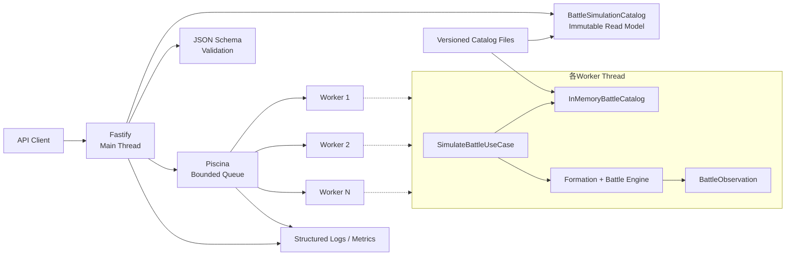
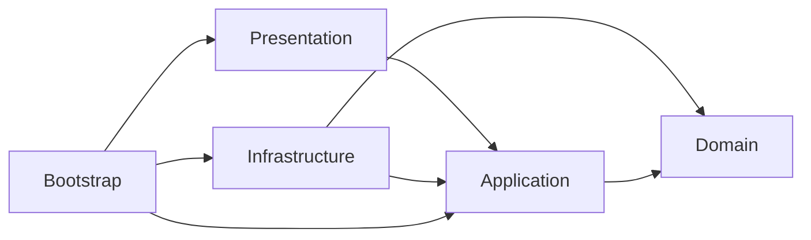

# インフラストラクチャ設計

## 目的

本書は、Battle Simulation ContextをNode.js／TypeScriptで稼働させるためのインフラストラクチャについて、次を定義する。

- ソースコードのモジュール構成と依存方向
- HTTPサーバーとInbound Adapter
- CPU集約型の戦闘実行を隔離するワーカープール
- Battle Catalogの格納、読み込み、検証
- RandomSource、ID生成器、実行ガードの実装境界
- 設定、ログ、メトリクス、ヘルスチェック、終了処理
- OpenAPI、テスト、ビルド、配備の方針

本書は [09\_アプリケーション設計.md](./09_アプリケーション設計.md) と [10_API設計.md](./10_API設計.md) を実装技術へ割り当てる。ドメインルール自体はインフラストラクチャ層へ実装しない。

## 現在の技術前提

リポジトリの現在の設定を前提とする。

| 項目           | 採用値              |
| -------------- | ------------------- |
| ランタイム     | Node.js 24系        |
| 言語           | TypeScript 6系      |
| モジュール     | ESM                 |
| パッケージ管理 | pnpm                |
| ビルド         | TypeScript Compiler |
| テスト         | Vitest              |
| 静的解析       | ESLint              |
| 整形           | Prettier            |

`package.json` と `pnpm-lock.yaml` を依存バージョンの正本とする。設計書へパッチバージョンを固定せず、導入時にNode.js 24との互換性が確認できるサポート中のバージョンをロックファイルへ固定する。

## 技術選定

### HTTPサーバー：Fastify

Fastifyを採用する。

採用理由：

- ルート単位でJSON Schemaによる入力検証と出力シリアライズを定義できる。
- ステータスコードごとのレスポンススキーマを設定できる。
- リクエスト本文上限、タイムアウト、Request ID、エラーハンドラーをサーバー境界で扱える。
- ルートスキーマからOpenAPI文書を生成できる。
- WebフレームワークをHTTPアダプター内へ閉じ込めやすい。

Fastifyのスキーマはアプリケーションが所有する静的ファイルだけを登録する。外部リクエストからJSON Schemaを受け取り、実行時にコンパイルしてはならない。

### CPU実行基盤：Piscina Worker Pool

Node.jsの `worker_threads` を直接管理せず、Piscinaによる境界付きワーカープールを採用する。

採用理由：

- 戦闘シミュレーションは主にCPU集約処理であり、HTTPのイベントループから分離する必要がある。
- ワーカー数、待機キュー長、ワーカーごとの並行タスク数を制限できる。
- `AbortSignal` によるタスクキャンセルを扱える。
- 実行時間、待機時間、使用率などの統計を取得できる。
- ESMとTypeScriptからビルドされたワーカーエントリを扱える。

初期構成では1ワーカーにつき同時に1戦闘だけ実行する。Battle処理は非同期I/O中心ではないため、同じワーカー上で複数戦闘を並行実行しない。

### APIスキーマ：JSON Schema

[10_API設計.md](./10_API設計.md) の外部DTOをJSON Schemaとして定義し、次へ共用する。

- Fastifyのリクエスト検証
- Fastifyのレスポンスシリアライズ
- OpenAPI 3.0.3文書の生成
- API契約テスト

ドメインクラスやApplication Commandから外部スキーマを直接生成しない。外部DTO用TypeScript型とJSON Schemaの一致を契約テストで保証する。

### 追加する主要依存

| パッケージ            | 用途                                             | 区分               |
| --------------------- | ------------------------------------------------ | ------------------ |
| `fastify`             | HTTPサーバー、ルート検証、レスポンスシリアライズ | runtime            |
| `piscina`             | Worker Thread Pool、待機キュー、キャンセル       | runtime            |
| `@fastify/swagger`    | ルートスキーマからOpenAPI生成                    | runtimeまたはbuild |
| `@fastify/swagger-ui` | 開発・検証環境のAPI UI                           | optional           |
| `@fastify/cors`       | GitHub Pages UI向けのorigin限定CORS              | runtime            |
| `@fastify/compress`   | リバースプロキシがない場合のHTTP圧縮             | optional           |

実装開始時に公式の互換表でFastify本体と公式プラグインの組み合わせを確認し、pnpm lockfileへ固定する。依存追加は実装タスクで行い、本設計作成時点ではインストールしない。

### 採用しないもの

初期スコープでは次を導入しない。

- Battle永続化用データベース
- 戦闘結果キャッシュ
- 外部メッセージキュー
- 分散トランザクション
- Catalogの動的管理API

戦闘は同期完了し、履歴保存や再取得を行わないためである。

## 全体構成



### メインスレッドの責務

- TCP／HTTP接続
- Content-Type、本文サイズ、JSON構造の検証
- Request IDの採番と応答ヘッダー
- Unit・Memory一覧read modelのGET、ETag、CORS
- ワーカープールへの受付可否判定
- タスクの投入、期限、切断時キャンセル
- ワーカー結果のHTTPレスポンスへの変換
- ヘルスチェック、構造化ログ、メトリクス
- Graceful Shutdown

戦闘実行は従来どおりWorkerへ隔離する。一覧GETはCPU集約処理を行わず、起動時に検証・project済みの不変read modelをメインスレッドから返す。一覧取得のたびにWorker taskやCatalogファイル読み込みを発生させない。

### ワーカースレッドの責務

- Catalogの読み込みと不変スナップショット化
- Application Commandへの変換
- `SimulateBattleUseCase` の実行
- FormationとBattle集約の生成・進行
- ドメインイベントと状態差分の観測
- API出力モデルへ変換するためのアプリケーション結果生成
- 戦闘内の実行保護と期限確認

HTTPのRequest／Replyオブジェクトをワーカーへ渡さない。ワーカーはHTTPステータスを判断せず、成功結果または構造化されたアプリケーションエラーを返す。

## ソースコード構成

```text
apps/api/src/
  main.ts
  bootstrap/
    build-container.ts
    build-http-server.ts
    load-config.ts
    shutdown.ts
  domain/
    battle/
    formation/
    catalog/
    shared/
  application/
    simulate-battle/
      simulate-battle-use-case.ts
      simulate-battle-command.ts
      simulate-battle-result.ts
      simulation-preflight-validator.ts
    observation/
    errors/
    ports/
  infrastructure/
    catalog/
      runtime/
        catalog-manifest.ts
        catalog-schema.ts
        catalog-definition-mapper.ts
        catalog-file-loader.ts
        in-memory-battle-catalog.ts
        catalog-cli.ts
        validate-catalog-cli.ts
      source/
        catalog-src-aggregator.ts
        catalog-src-generator.ts
        catalog-src-cli.ts
        generate-catalog-cli.ts
        check-catalog-src-cli.ts
    random/
      system-random-source.ts
    identity/
      battle-id-generator.ts
    execution/
      simulation-execution-guard.ts
    worker/
      simulation-worker-pool.ts
      simulation-worker-entry.ts
      worker-contract.ts
    observability/
      logger.ts
      metrics.ts
  presentation/
    http/
      routes/
        simulate-battle-route.ts
        health-routes.ts
      schemas/
      mappers/
      error-handler.ts
      request-context.ts
  generated/
    openapi.json

apps/api/catalog/
  manifest.json
  units.json
  skills.json
  effects.json
  memories.json
  capabilities.json
```

`generated/openapi.json` をリポジトリへ含めるかはCI運用で決定する。含める場合は生成後の差分がないことをCIで検証する。

## 依存方向



依存規則：

- `domain` は他のプロジェクト内レイヤーへ依存しない。
- `application` は `domain` とApplication Portだけへ依存する。
- `presentation` は `application` のユースケースとエラーへ依存する。
- `infrastructure` はApplication PortまたはDomain Portを実装する。
- `bootstrap` だけが具象クラスを生成し、依存を接続する。
- ワーカーエントリはComposition Rootであり、ドメインルールを持たない。

ESLintのimport制約で違反を検出し、循環依存検査もCIへ追加する。import短縮が必要な場合はNode.js ESMでも解決できる `package.json#imports` の `#` specifierを使用し、TypeScriptだけが理解するpath aliasは使用しない。

## HTTPサーバー設計

### サーバー生成

`buildHttpServer` はFastifyインスタンスを生成し、次を登録して返す。

1. 構造化ロガー
2. Request ID生成規則
3. JSON Schemaとシリアライザー
4. 共通エラーハンドラー
5. セキュリティ・サイズ・タイムアウト設定
6. CORSプラグイン
7. Catalog一覧ルート
8. 戦闘シミュレーションルート
9. ヘルスチェックルート
10. OpenAPIプラグイン
11. シャットダウンフック

モジュール読み込み時にlistenしない。`main.ts` が設定検証と依存構築に成功した後だけlistenする。これによりHTTPテストでサーバーをプロセス起動せず注入できる。

### ルート処理

`POST /api/v1/battle-simulations` のハンドラーは次だけを行う。

1. FastifyがJSON構造を検証する。
2. Request IDと期限を含むリクエストコンテキストを生成する。
3. DTOを構造化クローン可能な `WorkerSimulationTask` へ変換する。
4. ワーカープールへ投入する。
5. `WorkerSimulationResult` をAPIレスポンスへ変換する。
6. 成功またはエラーのステータスと本文を返す。

Catalog参照、Formation生成、勝敗判定をルートハンドラーへ書かない。

`GET /api/v1/battle-simulation-catalog` のハンドラーは次だけを行う。

1. 起動時に構築済みの `BattleSimulationCatalogResult` を参照する。
2. Catalog revision由来のETagと `If-None-Match`を比較する。
3. 一致時は304、不一致時はresponse schemaに従って200を返す。

Catalogファイルの読み込み、推移的Capability計算、sortをリクエストごとに行わない。

### CORS

`@fastify/cors`をroute登録前に設定する。許可originは `CORS_ALLOWED_ORIGINS`から構築した完全一致setで判定する。

- `Origin`が許可setに含まれる場合だけCORS response headerを返す。
- `Origin`なしのCLI、health check、server-to-server requestを拒否しない。
- methodは `GET`、`POST`、`OPTIONS`。
- request headerは `Content-Type`、`Accept`、`X-Request-Id`、`If-None-Match`。
- expose headerは `X-Request-Id`、`Retry-After`、`ETag`。
- credentialsはfalse。
- 開発localhostをproduction既定値へ含めない。
- CORS拒否を認証・認可として扱わない。API自体の公開境界は別途配備で制御する。

### JSON検証設定

API bodyの検証は次の方針とする。

- `coerceTypes: false`
- `useDefaults: false`
- `removeAdditional: false`
- 全objectへ `additionalProperties: false`
- integer、配列長、文字列長、列挙値をスキーマで制限
- 既定値はDTOからCommandへ変換する処理で明示的に設定

クライアント入力を静かに変換または削除しない。複数の構造違反を返す設定は、リクエスト本文上限と最大配列長を先に設けた上で使用する。

Catalog照会のような非同期処理をJSON Schemaバリデーター内で行わない。構造検証後にApplicationの事前検証として実行する。

Fastifyの検証エラーはキーワードと対象パスに応じて分類する。

| 検証内容                                             | APIエラー               |
| ---------------------------------------------------- | ----------------------- |
| JSON構文、型、必須項目、未知プロパティ               | `400 MALFORMED_REQUEST` |
| 人数、メモリー件数、ターン数、columnなど業務上の値域 | `422 INVALID_COMMAND`   |
| 未知のrow、logLevelなど外部列挙値                    | `400 MALFORMED_REQUEST` |

JSON Schemaに値域を記載してOpenAPIへ公開しつつ、共通エラーハンドラーで上記へ変換する。同じ違反がApplicationまで到達した場合も、最終的な公開コードは同じにする。

### レスポンスシリアライズ

成功と各エラーステータスへレスポンスJSON Schemaを登録する。スキーマにない内部プロパティを応答へ混入させない。

初期実装はワーカーから構造化クローン可能な結果オブジェクトを受け取り、メインスレッドでレスポンススキーマに従ってシリアライズする。

大規模戦闘の計測でシリアライズがイベントループ遅延の主要因になった場合は、次へ変更できる。

1. ワーカー内で同じ信頼済みレスポンススキーマを使ってJSON文字列化する。
2. UTF-8の `ArrayBuffer` をTransferableとしてメインスレッドへ返す。
3. メインスレッドは検証済みbufferをそのまま応答する。

この最適化でもAPI契約は変更しない。計測なしに最初から二重のシリアライズ経路を実装しない。

### エラー処理

共通エラーハンドラーは例外を [10_API設計.md](./10_API設計.md) の `ErrorResponse` へ変換する。

| 発生元              | 変換                               |
| ------------------- | ---------------------------------- |
| JSONパーサー        | `400 MALFORMED_REQUEST`            |
| Fastifyスキーマ検証 | 検証キーワードにより `400`／`422`  |
| 本文上限            | `413 REQUEST_TOO_LARGE`            |
| Content-Type        | `415 UNSUPPORTED_MEDIA_TYPE`       |
| Fastify handler期限 | `504 EXECUTION_TIMEOUT`            |
| ワーカープール満杯  | `503 CAPACITY_EXCEEDED`            |
| ApplicationError    | API設計の対応表に従う。            |
| ワーカー異常終了    | `500 INTERNAL_INVARIANT_VIOLATION` |
| 未分類例外          | `500 INTERNAL_INVARIANT_VIOLATION` |

未分類例外はサーバーログへスタックトレースと `diagnosticId` を記録するが、レスポンスへ含めない。

## ワーカープール設計

### WorkerSimulationTask

スレッド境界ではクラスインスタンスを渡さず、構造化クローン可能なplain objectだけを使用する。

```text
WorkerSimulationTask {
  requestId
  request: BattleSimulationRequestDto
  deadlineEpochMs
  expectedCatalogRevision
}
```

関数、Symbol、HTTPオブジェクト、Domain Entity、`Error` インスタンスを渡さない。

### WorkerSimulationResult

```text
WorkerSimulationResult =
  | { ok: true, result: SimulateBattleResult }
  | { ok: false, error: SerializedApplicationError }
```

ワーカー内の例外は境界で分類し、plain objectへ変換する。予期しない例外の詳細はワーカーログへ記録し、メインスレッドへは `diagnosticId` と安全な分類だけを返す。

### プール設定

初期値は環境設定で上書き可能にし、コンテナへ割り当てられたCPUと負荷試験から決定する。

```text
maxThreads = max(1, os.availableParallelism() - reservedMainThreads)
minThreads = configured warm worker count
concurrentTasksPerWorker = 1
maxQueue = bounded non-negative integer (0は「待ち行列なし、全Worker使用中なら即時503」を意味する有効値)
```

メインイベントループとシリアライズ用に、原則として少なくとも1論理CPU分を予約する。1 CPU環境ではワーカー1本とメインスレッドが同じCPUを共有するため、負荷試験で応答性を確認する。

待機キューを無制限にしない。満杯の場合はタスクを投入せず `503 CAPACITY_EXCEEDED` と `Retry-After` を返す。クライアント別の利用量制限は別途 `429 RATE_LIMIT_EXCEEDED` とする。

### ワーカー初期化

各ワーカーは最初のタスク受入前に次を実行する。

1. 設定のワーカー向け部分を受け取る。
2. Catalogファイルを読み込む。
3. JSON Schemaによる構造検証を行う。
4. Catalog全体の意味的整合性を検証する。
5. `catalogRevision` をmanifestおよび内容ハッシュから確認する。
6. 不変な `InMemoryBattleCatalog` を生成する。
7. ApplicationとDomainの依存を組み立てる。
8. 初期化完了をプールへ通知する。

ワーカーがCatalog初期化に失敗した場合、Ready状態にしない。必要数のワーカーを初期化できなければHTTP readinessも失敗させる。

### Catalogリビジョンの一致

メインスレッドは起動時にmanifestから期待する `catalogRevision` を読み、タスクへ含める。ワーカーのリビジョンが一致しない場合、そのタスクを実行せず `INVALID_DEFINITION` を返す。

起動時（全ワーカーのwarm-up完了前）に不一致が判明した場合は、その時点でプール初期化自体を失敗させ、HTTP readinessを一切成功させない（「ワーカー初期化」参照）。

稼働中（readiness成功後）に不一致が判明した場合、当該ワーカーだけを安全に退役・再初期化する手段は採用しない。Piscinaのようなワーカープール実装は「タスク応答を受信した時点でワーカーを空き状態に戻す」ため、ワーカー自身が応答後に自己終了を予約しても、その終了が実際に走る前に次のタスクが同じ（終了予定の）ワーカーへ割り当てられる競合を避けられない。ワーカープール実装の公開APIが「このタスク限りでワーカーを退役させる」安全な手段を提供しない場合、ワーカー単体の再初期化を試みてはならない。

代わりに、稼働中の不一致はメインスレッド（単一スレッドであり、ワーカーのような競合を持たない）側でプール全体を致命的状態にする。致命的状態になったプールは、以後のタスクをワーカーへ一切投入せず、同じ `INVALID_DEFINITION` を即座に返し続ける。一部のリクエストだけが不定期に失敗し続けるより、プロセス全体を一貫して失敗させる方が異常検知・復旧（プロセス再起動）に直結し安全である。

Catalogファイルを稼働中に置換するホットリロードは機能として提供しない。ただし、これは「稼働中に `catalogDir` の内容が変わらないことをランタイムが保証する」という意味ではない（誤操作や外部要因による置換は起こりうる）。稼働中の不一致を上記のとおりプール全体の致命的状態として扱うのは、この前提の弱さを踏まえた設計である。Catalog更新は新しいアプリケーション配備として全プロセスを再起動する。

### キャンセルと期限

二段階で停止する。

1. タスクの `deadlineEpochMs` を `SimulationExecutionGuard` が安全な内部境界で確認し、`EXECUTION_TIMEOUT` を返す。
2. HTTP切断または外側のhandler期限では、FastifyのAbortSignalをPiscinaタスクへ渡して強制キャンセルする。

通常は1の協調的停止を先に成立させる。2で実行中ワーカーが停止された場合、途中状態を返さず、プールが新しいワーカーを補充する。クライアント切断時は応答送信を試みない。

### ワーカー障害

- ワーカーの未処理例外または異常終了をリクエスト失敗として記録する。
- 途中までの戦闘結果を返さない。
- 同じタスクを自動再実行しない。乱数を含み冪等でないためである。
- プールは異常ワーカーを破棄し、新しいワーカーを初期化する。
- 一定時間内に障害が連続した場合はreadinessを失敗させる。

## Battle Catalog

### 格納形式

Catalogはバージョン管理されたJSONファイルとしてアプリケーション成果物へ含める。

```text
apps/api/catalog/
  manifest.json
  units.json
  skills.json
  effects.json
  memories.json
  capabilities.json
```

`catalog/` は生成物であり、手編集の主対象は `catalog-src/`（ユニット/メモリのバージョン単位に分割した authoring source）である。レイアウトと生成/検証コマンドは `14_Catalog定義スキーマ.md`「authoring source（`catalog-src/`）と生成フロー」を参照。

初期段階ではデータベースを導入しない。定義CRUD、稼働中更新、履歴検索が要件にないためである。

### manifest

```json
{
  "schemaVersion": 1,
  "catalogRevision": "2026-06-28.1",
  "files": {
    "units.json": "sha256:...",
    "skills.json": "sha256:...",
    "effects.json": "sha256:...",
    "memories.json": "sha256:..."
  }
}
```

- `schemaVersion` はCatalogファイル構造の版とする。
- `catalogRevision` はAPIレスポンスへ返す不透明な文字列とする。
- ファイルハッシュで不完全な配備や意図しない混在を検出する。
- リビジョン値だけを信頼せず、実ファイルのハッシュを検証する。

### 読み込み段階


構造検証で型、必須値、列挙値、値域を確認する。意味検証では次を確認する。

- IDの種類内一意性
- ユニットからAS、PS、EXへの参照
- スキルから効果への参照
- PSトリガーイベントと条件式の解釈可否
- 定義順の一意性
- AP・PPコスト、EX最大値、期間、クールタイム
- 効果種別とpayloadの組み合わせ
- 循環参照が許容された関係だけに存在すること
- 未実装Capabilityを必要とする定義のCapability表記

### 未実装Capabilityの表現

未実装Capabilityへ依存する定義には、機械判読可能な要求Capabilityを持たせる。

```json
{
  "requiredCapabilities": ["CAP_REFLECT_DAMAGE"]
}
```

アプリケーションの事前検証は、選択された定義グラフに含まれる `requiredCapabilities` と実装済みCapability集合を比較する。ファイル名や説明文の文字列から未対応ルールを推測しない。

### Catalog検証CLI

`pnpm run validate-catalog <catalog-directory>`（`mise exec -- pnpm run validate-catalog <catalog-directory>`）で、起動時と同じ読み込みパイプライン（Read → Hash → Shape → Resolve → Semantic → Freeze、`apps/api/src/infrastructure/catalog/runtime/catalog-file-loader.ts`）を単体で実行できる。CIやauthoring時にCatalogディレクトリの整合性を確認する用途で、Fastify・Worker Poolなしに完結する。

- 引数を省略すると使用方法を表示し、終了コード1を返す。
- 検証に成功すると `OK: Catalog at "<dir>" is valid (catalogRevision=<revision>).` を標準出力へ書き、終了コード0を返す。
- 検証に失敗すると `FAILED: Catalog at "<dir>" is invalid.` に続けて、失敗種別ごとに整形したエラー内容を標準エラー出力へ書き、終了コード1を返す。

エラー契約（`apps/api/src/infrastructure/catalog/runtime/catalog-cli.ts` の `formatCatalogValidationError`）:

| 失敗要因                                                                        | 例外型                                 | 出力形式                                                        |
| ------------------------------------------------------------------------------- | -------------------------------------- | --------------------------------------------------------------- |
| ID一意性・参照切れ・型違い・EX消費量不一致・未定義Capability参照・未知eventType | `CatalogIntegrityError`                | 違反1件ごとに `[<RULE>] <targetId>: <message>` の行             |
| manifestとファイル内容のhash不一致                                              | `CatalogFileHashMismatchError`         | ファイルごとに `<file>: expected <expected>, got <actual>` の行 |
| `manifest.json` のJSON Schema形状違反                                           | `CatalogManifestValidationError`       | フィールドごとに `<instancePath>: <message>` の行               |
| `schemaVersion` が `2` でない                                                   | `UnsupportedCatalogSchemaVersionError` | 単一行メッセージ                                                |
| Unit/Skill/EffectAction/MemoryのJSON Schema形状違反                             | `CatalogShapeValidationError`          | フィールドごとに `<instancePath>: <message>` の行               |
| JSONとして不正、または配列でないCatalogファイル                                 | `CatalogFileContentError`              | 単一行メッセージ                                                |

`CatalogIntegrityError` は一度の実行で見つかった違反をすべて集めて返す（`09_アプリケーション設計.md` のCommand検証と同様、診断のたびに再実行させない）。

### InMemoryBattleCatalog

検証済み定義をIDで索引化し、読み取り専用として保持する。

- `Map<UnitDefinitionId, UnitDefinition>`
- `Map<SkillDefinitionId, SkillDefinition>`
- `Map<EffectDefinitionId, EffectDefinition>`
- `Map<MemoryDefinitionId, MemoryDefinition>`
- `catalogRevision`
- 実装済みCapability集合

外部へ可変なMapや配列を返さない。定義オブジェクトは生成後に変更せず、戦闘固有のHP、AP、効果期間などをCatalogへ書き込まない。

### BattleSimulationCatalog Read Model

M4.5ではComposition Rootがメインスレッドでも同じCatalog読み込み・検証パイプラインを1回実行し、`GetBattleSimulationCatalogUseCase`から不変の表示用read modelを構築する。

- Unit・Memoryと選択可否計算に必要な全定義を起動時にだけ参照する。
- `selectable`は既存の推移的Capability収集と `IMPLEMENTED`比較を再利用する。
- HTTPへ渡すread modelは表示用fieldとCapability IDだけを持つ。
- requestごとにファイル、Domain定義グラフ、mutable Mapを参照しない。
- main thread read model、manifest期待revision、全Worker revisionが一致しなければlistenしない。
- Catalog一式をmain threadに1コピー追加するmemory影響をM4.5で計測する。問題になる場合も、戦闘Workerへ一覧GETを毎回投入する構成にはせず、起動時projection後に完全indexを解放できるadapter構成を検討する。

## ポートのアダプター

### SystemRandomSource

Domainの `RandomSource` を実装する。

- `[0, 1)` の乱数値またはDomainが要求する確率判定を提供する。
- 会心、暗闇など確率判定だけに使用する。
- グローバル状態へ戦闘結果を保存しない。
- 暗号用途ではないため、初期実装はランタイムの疑似乱数を利用できる。
- テストでは固定値列を返す実装へ差し替える。

完全再現が要件でないため、seedをAPIへ公開しない。将来seed対応する場合は別アダプターを追加する。

### BattleIdGenerator

- 衝突しにくくログで扱える文字列IDを生成する。
- 時系列ソート可能なUUID v7または同等形式を使用できる。
- IDからドメイン上の意味を導出しない。
- Request IDとBattle IDを同一視しない。
- テストでは固定ID生成器へ差し替える。

### SimulationExecutionGuard

次を戦闘ごとに保持する。

- 絶対期限
- 発行イベント総数
- PS候補スタック深度
- 1解決スコープ内の効果解決数
- キャンセル状態

上限値は設定から受け取るが、ガード自身は勝敗を決定しない。上限超過を構造化されたApplicationErrorとして通知する。

### BattleObservation

リクエストスコープのメモリー内アダプターとして実装する。

- 初期状態を1件保持する。
- イベントを連番順に追加する。
- 状態変更だけを `stateTransitions` へ追加する。
- イベントから状態差分への参照インデックスを設定する。
- 完了時に差分を再適用し、最終状態との一致を検証する。
- レスポンス生成後に破棄する。

イベント数と差分量は実行ガードへ報告し、プロセスメモリーを無制限に消費しない。

## 設定管理

### 方針

- 環境変数は `loadConfig` の一か所だけで読み取る。
- 文字列を検証済みの型付き `ApplicationConfig` へ変換する。
- 必須値欠落、数値変換失敗、矛盾する期限は起動エラーにする。
- ドメイン層から `process.env` を参照しない。
- 安全な既定値だけを `.env.example` へ記載する。
- 秘密値をログへ出さない。

### 設定項目

| 環境変数                           | 用途                                |
| ---------------------------------- | ----------------------------------- |
| `NODE_ENV`                         | 実行環境。                          |
| `HOST`                             | listenするホスト。                  |
| `PORT`                             | listenするポート。                  |
| `LOG_LEVEL`                        | 構造化ログレベル。                  |
| `TRUST_PROXY`                      | 信頼するプロキシ設定。既定はfalse。 |
| `HTTP_BODY_LIMIT_BYTES`            | JSON本文上限。                      |
| `HTTP_RECEIVE_TIMEOUT_MS`          | リクエスト受信期限。                |
| `HTTP_HANDLER_TIMEOUT_MS`          | HTTPハンドラー全体の期限。          |
| `SIMULATION_TIMEOUT_MS`            | ワーカー内戦闘実行期限。            |
| `WORKER_MIN_THREADS`               | 常駐ワーカー数。                    |
| `WORKER_MAX_THREADS`               | 最大ワーカー数。                    |
| `WORKER_MAX_QUEUE`                 | 待機タスク上限。                    |
| `SIMULATION_MAX_EVENTS`            | 1戦闘のイベント上限。               |
| `SIMULATION_MAX_PASSIVE_DEPTH`     | PS候補スタック深度上限。            |
| `SIMULATION_MAX_EFFECTS_PER_SCOPE` | 1解決スコープの効果数上限。         |
| `SHUTDOWN_GRACE_MS`                | 終了時に実行中タスクを待つ時間。    |
| `CATALOG_PATH`                     | Catalog格納ディレクトリ。           |
| `CORS_ALLOWED_ORIGINS`             | CORSで許可するoriginのcomma区切り。 |

期限は次の不変条件を満たす。

```text
SIMULATION_TIMEOUT_MS < HTTP_HANDLER_TIMEOUT_MS < upstream timeout
```

upstream timeoutはアプリケーション外のため、起動時には前二つだけを検証し、配備設定テストで全体を確認する。

`CORS_ALLOWED_ORIGINS`は各要素をtrimし、schemeとhostだけを持つ絶対originとして検証する。path、query、fragment、userinfo、wildcard、重複を拒否する。productionではGitHub Pages originを明示する。

## ログ設計

### 構造化ログ

JSON形式の構造化ログを使用する。主要フィールド：

- `timestamp`
- `level`
- `message`
- `requestId`
- `battleId`
- `catalogRevision`
- `workerThreadId`
- `outcome`
- `completionReason`
- `completedTurn`
- `eventCount`
- `stateTransitionCount`
- `queueWaitMs`
- `simulationDurationMs`
- `responseSerializationMs`
- `errorCode`
- `diagnosticId`

### ログイベント

| イベント       | レベル      | 内容                                                   |
| -------------- | ----------- | ------------------------------------------------------ |
| サーバー起動   | info        | バージョン、Catalogリビジョン、ワーカー設定            |
| リクエスト受付 | info        | Request ID、ルート、ログレベル。編成全体は記録しない。 |
| プール待機     | debug／warn | 待機時間、キュー長                                     |
| 戦闘完了       | info        | Battle ID、結果、ターン、イベント数、所要時間          |
| 入力エラー     | info        | エラーコード、違反数。生の本文は記録しない。           |
| 実行保護停止   | warn        | 上限種別、カウンター、diagnosticId                     |
| 予期しない例外 | error       | スタックトレース、diagnosticId。レスポンスには非公開。 |
| シャットダウン | info        | 待機中・実行中件数、終了結果                           |

ユニットIDやメモリーIDは機密情報ではないが、巨大ログとCatalog情報漏えいを避けるため通常ログへリクエスト・レスポンス全体を出さない。DIAGNOSTIC APIログとサーバー運用ログも分離する。

## メトリクス

実装技術は配備環境に合わせるが、少なくとも次を観測する。

### HTTP

- リクエスト数：route、method、status class
- レスポンス時間
- リクエスト／レスポンスbyte数
- 接続中断数
- 4xx／5xx数

### Worker Pool

- 実行中ワーカー数
- idleワーカー数
- キュー長
- キュー待機時間
- シミュレーション実行時間
- プール拒否数
- ワーカー再起動数
- タスクキャンセル数

### Battle

- outcome、completionReason別の戦闘数
- 完了ターン分布
- イベント数分布
- 状態差分数分布
- PS最大連鎖深度
- 実行保護上限到達数

ユニットID、Battle ID、Request IDをメトリクスラベルに使用しない。高カーディナリティ化を避ける。

## ヘルスチェック

### `/health/live`

プロセスがHTTP応答可能なら成功する。Catalog障害やプール満杯だけでは失敗させない。

### `/health/ready`

次をすべて満たす場合だけ成功する。

- シャットダウン開始前
- Catalog manifestと構造検証が成功
- 必要な最小ワーカー数が初期化済み
- ワーカーのCatalogリビジョンが期待値と一致
- 連続ワーカー障害によるサーキット状態でない

一時的なキュー満杯だけでreadinessを即座に失敗させない。満杯リクエストへ `503` を返し、継続的な飽和はメトリクスとアラートで扱う。

ヘルスレスポンスへCatalogの中身、環境変数、エラーのスタックを含めない。

## Graceful Shutdown

SIGTERMまたはSIGINT受信時に次の順で終了する。

1. readinessを失敗へ変更する。
2. 新しい戦闘リクエストの受付を停止する。
3. HTTP keep-alive接続をdrainする。
4. キュー内の未開始タスクをキャンセルする。
5. 実行中タスクを `SHUTDOWN_GRACE_MS` まで待つ。
6. 期限後も残るタスクをキャンセルする。
7. ワーカープールをcloseする。
8. ログとメトリクスをflushする。
9. HTTPサーバーをcloseしプロセスを終了する。

戦闘結果を永続化しないため、終了中に中断した結果を復旧しない。ロードバランサーのdrain時間を `SHUTDOWN_GRACE_MS` より長く設定する。

## OpenAPI

### 生成

Fastifyが扱うJSON Schema Draft 7のルートスキーマから、OpenAPI 3.0.3文書を生成する。

- productionではSwagger UIを既定で公開しない。
- 開発・検証環境だけUIを有効化できる。
- `GET /openapi.json`自体は環境によらず常時公開する（UIの有効・無効に関わらず同じ文書を返す）。設定で制御するのはSwagger UI（`GET /docs`）の公開可否だけであり、JSON自体は非公開にできない（#85、[運用手順.md](../運用手順.md)「OpenAPI文書とSwagger UI」）。
- API例は [10_API設計.md](./10_API設計.md) と一致させる。

### CI検証

- OpenAPI文書を生成できる。
- すべてのルートに成功・エラーレスポンススキーマがある。
- 生成文書をOpenAPI validatorで検証できる。
- 保存する場合、再生成差分がない。
- 破壊的変更を契約差分ツールで検出する。

## セキュリティ

- CatalogとAPIのJSON Schemaは信頼済みアプリケーションコードとしてのみ読み込む。
- リクエストからスキーマ、式、JavaScriptを受け取らない。
- `additionalProperties: false`、本文上限、文字列長、配列長を適用する。
- `TRUST_PROXY` を配備トポロジーに合わせ、無条件にtrueにしない。
- Request IDへ改行や巨大文字列を許可しない。
- Catalog IDをファイルパスへ連結しない。
- Catalogファイルは読み取り専用で配備する。
- pnpm lockfileを使用し、CIではfrozen lockfileでインストールする。
- 依存関係とコンテナイメージを脆弱性スキャンする。
- productionのエラーにスタックトレースを含めない。
- 圧縮をHTTPサーバーとリバースプロキシで二重適用しない。

## 圧縮

大きなJSONレスポンスは圧縮対象とする。

- リバースプロキシが圧縮を担当する環境ではアプリ側圧縮を無効にする。
- アプリ単体で配備する場合はFastify対応の圧縮プラグインを使用できる。
- `Accept-Encoding` を尊重する。
- 小さなレスポンスやヘルスチェックは圧縮しない閾値を設ける。
- 圧縮時間とイベントループ遅延を計測する。

圧縮の有無でAPI本文やETagの意味を変えない。戦闘POSTは `Cache-Control: no-store` とし、Catalog一覧GETだけはrevision由来ETagと短いpublic cacheを使用する。圧縮表現ごとに弱いETagへ分ける必要がある配備ではHTTP仕様に従う。

## ビルドと起動

### ビルド

1. `pnpm install --frozen-lockfile`
2. Catalog JSON Schema検証と意味検証
3. TypeScript typecheck
4. ESLint
5. Vitest
6. OpenAPI生成・検証
7. `tsc` によるESM JavaScript出力

ワーカーエントリはコンパイル後の `.js` を絶対file URLで解決する。

```text
new URL("./simulation-worker-entry.js", import.meta.url)
```

開発時のtsx実行とproductionのコンパイル済み実行で、ワーカーファイル解決方法が変わる点を結合テストする。

### 起動

1. 設定を読み込み検証する。
2. main threadでCatalog全体を読み込み、構造・参照・hashを検証する。
3. Catalog一覧read modelと期待リビジョンを構築する。
4. ロガーとメトリクスを初期化する。
5. ワーカープールを生成して最小数をwarm upする。
6. 全ワーカーのCatalog revisionがmain threadと一致することを確認する。
7. Catalog query、simulation、CORSを含むFastifyサーバーを構築する。
8. listenを開始する。
9. readinessを成功へ変更する。

初期化に失敗した場合はポートを公開せず、非0終了する。

## 配備

### 採用基盤

M4.5のAPI配備先はGoogle Cloud Run serviceとし、regionは `asia-northeast1` を採用する。GitHub PagesはCloud Runが発行する公開HTTPS URLへ直接接続する。Cloud Run Jobs、Cloud Run worker pools、API Gateway、外部HTTP Load Balancerは初期構成へ追加しない。

初期UIに認証機能がないためCloud Run serviceはunauthenticated invocationを許可する。CORSはbrowserの送信元制御であって認証・課金防止境界ではないため、CLIやserver-to-serverからの呼び出しを防ぐものとして扱わない。公開運用の防御は本文上限、実行timeout、bounded Worker queue、Cloud Run最大instance数、ログ・budget alertで構成する。

### Container契約

- multi-stage Dockerfileでproduction依存、`apps/api/dist/`、Catalog成果物だけをruntime imageへ含める。
- runtime imageはLinux `amd64`対応とし、Node.js 24系の固定digestまたは同等の再現可能なbase imageを使用する。
- non-root userで実行し、productionでSwagger UIを無効にする。
- Cloud Runが注入する `PORT`を使用し、`HOST=0.0.0.0`でlistenする。
- Catalogとコンパイル済みWorker entryをimageへ同梱し、起動後に外部filesystemから取得しない。
- container filesystemへ永続データを書かない。戦闘結果はrequest完了後に保持しない。
- `/health/live`をstartup probe候補とし、Catalog検証とWorker warm-upが完了するまでHTTP portを公開しない既存起動順を維持する。

production imageはローカルcontainer testで、`PORT`の上書き、Catalog読込、Worker file解決、SIGTERM、non-root実行を検証する。

### M4.5 Cloud Run初期設定

| 項目                  | 初期値                           | 理由                                                      |
| --------------------- | -------------------------------- | --------------------------------------------------------- |
| Service name          | `muvluvgg-battle-simulator-api`  | API用途を識別可能にする。                                 |
| Region                | `asia-northeast1`                | 主な利用者に近い東京region。                              |
| Billing               | request-based                    | request処理中を中心にCPUを割り当てる。                    |
| CPU                   | 1 vCPU                           | M4.5最小構成。負荷試験で変更する。                        |
| Memory                | 1 GiB                            | main／WorkerのCatalog保持を含む初期値。実測で変更する。   |
| Minimum instances     | 0                                | idle時にscale-to-zeroし、cold startを受け入れる。         |
| Maximum instances     | 1                                | 初期公開時の費用・濫用上限。M9の容量試験まで拡大しない。  |
| Container concurrency | 2                                | CPU集約POSTをdefault高並行で受けず、軽量GETの余地を残す。 |
| Request timeout       | 40 seconds                       | 30秒simulation timeoutと応答終了処理を包含する。          |
| `WORKER_MAX_QUEUE`    | 1                                | instance内待機をboundedにし、超過を503へ変換する。        |
| `SHUTDOWN_GRACE_MS`   | 8000                             | Cloud RunのSIGTERM後10秒以内に終了処理を終える。          |
| Ingress               | all                              | GitHub Pagesからpublic HTTPSで呼び出す。                  |
| Authentication        | unauthenticated invocationを許可 | 初期UIはCloud Run IAM tokenを保持しない。                 |
| CORS allowed origin   | `https://komei0727.github.io`    | GitHub Pages originだけをbrowser向けに許可する。          |

CPU、Memory、concurrencyは推測で拡大しない。M4.5の最大入力smoke testとM9の負荷試験結果を記録し、変更理由を設計へ反映する。maximum instancesは費用の絶対的な保証とはみなさず、Google Cloud Billing budget alertも設定する。

### Scalingとrevision

- 1プロセス内でワーカースレッドを使用する。
- 水平スケール時はCloud Run instance／container単位で複製する。
- Battle状態を共有しないため、sticky sessionは不要とする。
- 各revisionへ同じCatalog成果物を配備する。
- CPU limitに合わせて `WORKER_MAX_THREADS` を設定し、Cloud Run concurrencyをWorker thread＋queue容量より無制限に大きくしない。
- ワーカーごとにCatalogと結果をメモリー保持するため、最大同時実行数と最悪レスポンスサイズからmemory limitを決める。
- OOMによる中断を防ぐため、負荷試験で99ターン・DIAGNOSTICの上限シナリオを測定する。

Catalog更新はローリングデプロイで行える。ただし同時期に異なる `catalogRevision` のレプリカが存在し得るため、各レスポンスへ使用リビジョンを必ず返す。

### Image registryとCI/CD

- container imageは同一Google Cloud projectのArtifact Registryへ保存する。
- image tagだけに依存せず、deployしたimage digestとGit commit SHAを記録する。
- GitHub ActionsはWorkload Identity Federationで短期credentialを取得し、長期service account keyをGitHub Secretsへ保存しない。
- PRではcontainer build、脆弱性検査、ローカル起動smoke testまで行い、Cloud Runへdeployしない。
- main branchの承認済みworkflowだけがArtifact Registry pushとCloud Run deployを行う。
- deploy後にlive、ready、Catalog GET、最小simulation、GitHub Pages originのCORSを検証する。
- smoke test失敗時は新revisionへtrafficを確定せず、直前の正常revisionへ戻せる手順を用意する。
- Cloud Run service URLをGitHub Environmentの公開設定値としてPages buildへ渡す。

## テスト設計

### インフラストラクチャ単体テスト

1. 環境変数を型付き設定へ変換し、不正値と期限逆転を拒否する。
2. Catalogファイルのハッシュ不一致、構造不正、参照切れを検出する。
3. `requiredCapabilities` を保持して事前検証へ渡す。
4. RandomSourceが規定範囲外の値を返さない。
5. ID生成器が要求形式を満たす。
6. ApplicationErrorを正しいHTTPエラーへ変換する。
7. ログの秘匿フィールドが除外される。
8. 許可origin設定のwildcard、path、重複、不正URLを拒否する。
9. Catalog一覧read modelを起動時に1回だけ構築する。

### HTTP結合テスト

Fastifyのinject機能または同等のプロセス内HTTPテストを使用する。

1. Catalog一覧を `200` と安定順のresponseへ変換する。
2. Catalog一覧のETag一致で `304` と本文なしを返す。
3. 戦闘正常リクエストを `200` へ変換する。
4. 型変換を行わず数値文字列を拒否する。
5. 未知プロパティを拒否する。
6. 本文上限を `413` で返す。
7. 全エラーが共通 `ErrorResponse` になる。
8. Request IDを応答とログへ引き継ぐ。
9. response schema外のプロパティを公開しない。
10. 戦闘POSTに `Cache-Control: no-store`、Catalog GETにETag/cache headerを返す。
11. 許可originのGET/POST/preflightにCORS headerを返す。
12. 未許可originへCORS headerを返さない。

### Worker結合テスト

1. productionと同じコンパイル済みESMワーカーを起動できる。
2. 各ワーカーが同じCatalogリビジョンを使用する。
3. 同時タスクが別Battle、Observation、RandomSourceを使用する。
4. キュー満杯で追加タスクを拒否する。
5. 協調的期限で `EXECUTION_TIMEOUT` を返す。
6. 強制キャンセル後にワーカーが補充される。
7. ワーカー異常終了時に自動再実行しない。
8. Graceful Shutdownで未開始タスクと実行中タスクを規則どおり扱う。

### 負荷・耐久テスト

- 最小戦闘の高並行実行
- 5対5、99ターン、DETAILED
- 5対5、99ターン、DIAGNOSTIC
- PS連鎖が深い戦闘
- 大量の効果インスタンスと状態差分を持つ戦闘
- ワーカープール満杯の継続負荷
- クライアント切断とタイムアウト
- ローリング終了中の実行タスク

確認指標：

- HTTPイベントループ遅延
- p50／p95／p99の待機時間と実行時間
- ワーカーごとのCPU使用率
- 戦闘ごとの最大メモリー
- JSONシリアライズ時間
- レスポンス圧縮率
- エラー率とワーカー再起動数

## 技術的な不変条件

- HTTPメインスレッドでBattleを直接実行しない。
- ワーカープールのタスクキューを無制限にしない。
- 1ワーカーで複数のCPU集約戦闘を同時実行しない。
- Catalogをリクエストごとにファイルから再読込しない。
- 一つの戦闘中にCatalogリビジョンを変更しない。
- Worker境界へDomain EntityやHTTPオブジェクトを渡さない。
- タイムアウト、キャンセル、プール飽和を戦闘の敗北へ変換しない。
- 戦闘失敗を自動再試行しない。
- ログ、メトリクス、エラーレスポンスへ戦闘結果全文を出さない。
- readiness成功前に戦闘ルートを公開しない。

## 参照資料

- [Fastify Validation and Serialization](https://fastify.dev/docs/latest/Reference/Validation-and-Serialization/)
- [Fastify Request](https://fastify.dev/docs/latest/Reference/Request/)
- [Fastify Lifecycle](https://fastify.dev/docs/latest/Reference/Lifecycle/)
- [@fastify/swagger](https://github.com/fastify/fastify-swagger)
- [Node.js Worker Threads](https://nodejs.org/api/worker_threads.html)
- [Piscina Worker Pool](https://github.com/piscinajs/piscina)

## 次の設計への申し送り

次の `12_テスト戦略.md` では、次を詳細化する。

- テストピラミッドとレイヤー別責務
- ドメインルールIDとテストケースのトレーサビリティ
- 固定RandomSourceを使った決定的シナリオ
- PS連鎖、効果期間、行動順、状態差分のモデルベーステスト
- API契約、Catalog整合性、Worker Poolの結合テスト
- 負荷・耐久・回帰テストと完了基準
