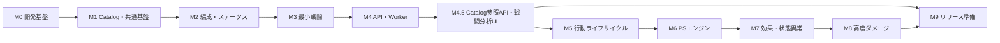

# 実装計画

## 目的

本書は、これまでの設計をNode.js／TypeScriptのバックエンドアプリケーションとして実装する順序と完了条件を定義する。

- 実装マイルストーンと依存関係
- 最小縦切りから全109ルールへ拡張する順序
- 各段階で作成するDomain、Application、Catalog、API、Worker、テスト
- 未実装Capabilityを推測実装せず隔離する方法
- 品質ゲート、リスク、リリース条件

本書は [11\_インフラストラクチャ設計.md](./11_インフラストラクチャ設計.md) と [12\_テスト戦略.md](./12_テスト戦略.md) を実行可能な作業単位へ分解する。

## 現在地

現在のリポジトリにはTypeScript、Vitest、ESLint、Prettierの基本設定と最小の `apps/api/src/main.ts` がある（`#116` `M45-ARCH-001`で`apps/api/`・`apps/ui/`のworkspace構成へ再編済み）。Domain、Application、HTTP、Worker、Catalogの実装はこれから開始する。

現時点で利用できるもの：

- Node.js 24系とTypeScript 6系
- pnpm scripts
- Vitestとcoverage
- ESLintとPrettier
- DDD設計書と109件の詳細ルール
- 未実装Capabilityの識別子と拒否方針

実装前または初期マイルストーンで追加するもの：

- レイヤー別ディレクトリと依存制約
- Fastify、Piscina、OpenAPI関連依存
- Catalogの具体的なJSON Schema
- テストBuilder、固定RandomSource、トレーサビリティ台帳
- CIパイプライン

## 実装原則

- レイヤーを横に全部作ってから結合せず、動作する小さな縦切りを繰り返す。
- 各ルールは失敗するテストを先に追加し、最小実装で通す。
- 一つのPull Requestで複数の大領域を同時に完成させない。
- 未実装機能を仮の値やno-opで成功扱いにしない。
- 未実装Capabilityを含む定義は開始前に構造化エラーで拒否する。
- DomainからHTTP、ファイル、環境変数、Workerへ依存させない。
- イベントと状態差分はBattle実装の初期段階から記録し、最後に後付けしない。
- API契約は最小縦切りで固定し、その後は同じv1契約へイベント種別を追加する。
- 性能最適化は計測結果に基づき、正しさと観測可能性を先に確立する。

## マイルストーン全体

| ID     | マイルストーン                 | 主な成果                                 | 完了ルール数 |
| ------ | ------------------------------ | ---------------------------------------- | -----------: |
| `M0`   | 開発基盤と設計契約             | レイヤー構成、依存制約、テスト基盤、CI   |            0 |
| `M1`   | Catalogと共通Domain基盤        | 定義Schema、ID、Capability、Catalog検証  |            0 |
| `M2`   | 編成・座標・ステータス         | Formation生成、補正、属性                |           20 |
| `M3`   | 最小戦闘縦切り                 | 1対1、AS、対象、ダメージ、勝敗、イベント |           11 |
| `M4`   | API・Worker Walking Skeleton   | HTTP→Worker→UseCase→Battle→JSON          |            0 |
| `M4.5` | Catalog参照API・戦闘分析UI     | 一覧API、CORS、Cloud Run、UI、Pages      |            0 |
| `M5`   | 行動ライフサイクル             | EX、待機、速度再計算、CT、チャージ       |            3 |
| `M6`   | PSイベントエンジン             | 発動照合、先制攻撃、即時連鎖、PP・EX     |           13 |
| `M7`   | 効果・状態異常・高度ターゲット | 期間、重複、解除、気絶、凍結、暗闇       |           41 |
| `M8`   | 高度ダメージ                   | 防御貫通、シールド、サブ、リンク、継続   |           21 |
| `M9`   | 完成・性能・リリース準備       | 全契約、実Catalog、負荷試験、運用        |            0 |

ルール数の合計は109件とする。`M0`、`M1`、`M4`、`M4.5`、`M9` はルールを支える技術・契約マイルストーンであり、独自のドメインルール数を加算しない。

## 依存関係



`M4.5` は `M5` の着手条件である。まず `M4` の配信経路へCatalog参照APIとCORSを追加してCloud Runへ配備し、その契約を利用する初期UIをGitHub Pagesへ公開する。`M5` 以降は、Domain拡張と対応するUI拡張を同じマイルストーンで進め、長期間未結合のブランチを作らない。

## ルール割当

全109ルールを、最初に全受け入れ条件を満たすDomainマイルストーンへ一意に割り当てる。

### M2：編成・ステータス 20件

- `R-NUM-01`～`R-NUM-03`
- `R-FRM-01`～`R-FRM-05`
- `R-POS-01`～`R-POS-03`
- `R-BON-01`～`R-BON-03`
- `R-STA-01`～`R-STA-04`
- `R-ATR-01`～`R-ATR-02`

### M3：最小戦闘 11件

- `R-FRM-06`
- `R-ORD-02`
- `R-TGT-01`、`R-TGT-02`、`R-TGT-07`
- `R-HIT-01`
- `R-CRT-01`～`R-CRT-02`
- `R-DMG-01`
- `R-END-01`～`R-END-02`

### M5：行動ライフサイクル 3件

- `R-ORD-03`
- `R-SKL-04`
- `R-SKL-09`

### M6：PSイベントエンジン 13件

- `R-PS-01`～`R-PS-08`
- `R-ACT-03`～`R-ACT-04`
- `R-SKL-01`～`R-SKL-02`、`R-SKL-06`

### M7：効果・状態異常・高度ターゲット 41件

- `R-NUM-04`
- `R-ORD-01`、`R-ORD-04`
- `R-ACT-01`～`R-ACT-02`
- `R-TGT-03`～`R-TGT-06`、`R-TGT-08`～`R-TGT-10`
- `R-SKL-05`、`R-SKL-07`～`R-SKL-08`
- `R-MEM-01`～`R-MEM-04`
- `R-ACTN-01`
- `R-HIT-02`～`R-HIT-03`
- `R-DMG-02`
- `R-HEAL-01`～`R-HEAL-03`
- `R-STS-01`～`R-STS-04`
- `R-EFF-01`～`R-EFF-11`

### M8：高度ダメージ 21件

- `R-SKL-03`
- `R-ACTN-02`～`R-ACTN-03`
- `R-DMG-03`～`R-DMG-05`
- `R-SHD-01`～`R-SHD-03`
- `R-SUB-01`～`R-SUB-02`
- `R-INT-01`～`R-INT-03`
- `R-LNK-01`～`R-LNK-03`
- `R-DOT-01`～`R-DOT-04`

同じルールを複数マイルストーンでテストしてよいが、完了数は最初に全受け入れ条件を満たしたマイルストーンへだけ計上する。

## M0 開発基盤と設計契約

### 目的

Domain実装を安全に増やせるプロジェクト構造とテスト基盤を作る。

### 実装項目

1. `domain`、`application`、`infrastructure`、`presentation`、`bootstrap` のディレクトリを作る。
2. import短縮が必要ならNode.js ESMとTypeScriptの双方で解決できる `package.json#imports` を設定する。TypeScriptだけのpath aliasは使用しない。
3. ESLintでレイヤー間の禁止依存を検出する。
4. 循環依存をCIで検出する方法を追加する。
5. Unit／Scenario／Contract／Integrationテストは当初 `apps/api/src/**/*.test.ts` として対象モジュール付近へ配置し、共通支援を `apps/api/src/testing/` に作る。負荷試験は別の実行設定へ分離する。
6. `SequenceRandomSource`、固定ID生成器、Manual Clockを作る。
7. 109ルールIDを抽出するトレーサビリティ台帳と検証スクリプトを作る。
8. format、typecheck、lint、test、buildをCIで実行する。
9. Fastify、Piscina、Swagger関連パッケージの互換バージョンを確認しlockfileへ追加する。
10. `apps/api/src/main.ts` をComposition Rootから起動する形へ変更する準備を行う。
11. 最初のテスト追加後にVitestの `passWithNoTests` をfalseへ変更し、既存のcoverage 80%下限を維持する。

### テスト

- レイヤー禁止依存のfixtureテスト
- テスト用RandomSourceの不足・余剰値検出
- 固定IDの一意な採番
- ルール台帳が109件と一致すること
- 空のアプリケーションがtypecheck、lint、buildを通ること

### 完了条件

- すべての品質コマンドをローカルとCIで同じ方法で実行できる。
- DomainパッケージからNode.js固有モジュールをimportできない制約がある。
- 新しいルールIDを設計書へ追加すると台帳検証が失敗する。
- 後続マイルストーンが同じテスト支援コードを再利用できる。

## M1 Catalogと共通Domain基盤

### 目的

戦闘定義を型安全に読み込み、不変なDomain定義として提供する。

### 先行設計

実装着手前に `14_Catalog定義スキーマ.md` を作成し、次を確定する。

- Unit、Skill、Effect、Memory定義のJSON構造
- IDと参照関係
- AS・PS・効果の定義順
- PS発動イベントと条件式の表現
- 効果種別ごとのpayload
- `requiredCapabilities`
- Catalog schema versionとrevision

### 実装項目

1. Definition ID、Battle ID、Battle Unit IDなどのbranded typeを作る。
2. Catalog DTO用JSON Schemaを作る。
3. manifestとファイルハッシュ検証を作る。
4. ID一意性、参照型、定義順の意味検証を作る。
5. DTOから不変なDomain Definitionへ変換するMapperを作る。
6. `InMemoryBattleCatalog` と `BattleCatalog` Portを実装する。
7. 実装済みCapability集合と要求Capabilityの比較器を作る。
8. `minimal`、`invalid` のテストCatalogを作る。
9. Catalog検証CLIまたはscriptを追加する。

### テスト

- 正常な最小Catalogの読み込み
- 重複ID、参照切れ、型違い参照、定義順不正
- 不正なAP・PP・EX・期間・クールタイム
- manifest hash不一致
- 未知schema version
- `requiredCapabilities` の保持と未対応判定
- 変換後定義が外部から変更されないこと

### 完了条件

- テストCatalogをファイルから読み込み、同一revisionのスナップショットを生成できる。
- Catalog不整合はBattle生成前に対象ID付きで失敗する。
- 未実装CapabilityをCapabilityとして表現できる。
- リクエストごとのファイル再読込を必要としない。

## M2 編成・座標・ステータス

### 目的

API入力相当の編成から、補正済みの戦闘開始状態を生成する。

### Domain実装

- `Side`
- `FormationPosition`
- `GlobalCoordinate`
- `FormationSlot`
- `BattleParty`
- `FormationFactory`
- `FormationBonusCalculator`
- `PositionAptitudePolicy`
- `CombatStatCalculator`
- `EffectStackingPolicy` の初期形
- `AttributeAffinityPolicy`
- HP、AP、PP、EX、割合、ターン数の値オブジェクト

### 実装順

1. 数値の内部表現、切り捨て、確率契約を作る。
2. 編成人数、配置、ユニット重複、メモリー件数、ターン数を検証する。
3. 陣営内配置から共通座標へ変換する。
4. マンハッタン距離と前方向を実装する。
5. 通常属性の編成役を実装する。
6. コミカルの全候補を評価して最大ボーナスを選ぶ。
7. クレバーボーナスを段階累積する。
8. 配置適性を含む開始ステータスを計算する（Memory補正は含まない。後述「スコープ外」を参照）。
9. 重複あり・重複なし効果の合成器を、戦闘中再計算に再利用できる形で作る。
10. 属性相性を定義データから評価する。

### テスト

- `UT-R-NUM-*`、`UT-R-FRM-*`、`UT-R-POS-*`
- 属性構成のtable test
- コミカルの複数最適候補
- クレバー1～5体
- ステータス式の補正順
- 重複あり総和と重複なし最強選択
- 全12共通座標

### 完了条件

- 20ルールが台帳上で完了する。
- 同一Unit Definitionを複数のBattle Unitへ変換できる。
- 編成入力順が行動順や対象順へ影響しない。
- 戦闘開始状態にCatalogの可変参照が残らない。

### スコープ外：Memory triggeredEffectsの解決

Memory による stat 補正は `modifiers` 省略記法を廃止し、`triggeredEffects` + `APPLY_STAT_MOD` に一本化した（Catalog v2の主表現に統一）。そのためM2は Memory 補正を一切計算しない。`FormationFactory` が生成する開始ステータスは編成ボーナスと配置適性のみで確定し、Memory由来の `AppliedEffect` を含まない。

Memory の本来の発動処理（`BattleStarted` イベントでの `triggeredEffects` 候補化・解決、`R-MEM-01`〜`R-MEM-04`）は Memory発動エンジンの責務であり、M7で実装する。したがって、M7完了までの間、戦闘開始時のMemory補正は一切適用されない状態になる。これは意図した段階導入であり、M7で `AppliedEffect`、EffectSequence、TargetBinding、Memory候補解決をまとめて完成させる。

この後退が `SimulationPreflightValidator`（R-FRM-06）実装後も黙って見過ごされないよう、`triggeredEffects` を持つ全Memoryは `requiredCapabilities` に `CAP_MEMORY_TRIGGERED_EFFECT`（`status: PLANNED`）を要求する。Memory発動エンジンが未実装の間、このMemoryを参照する編成は preflight で `UNSUPPORTED_RULE` として拒否され、「戦闘は開始できるがMemory効果だけ黙って未適用」という状態を防ぐ。Memory発動エンジン実装時に `capabilities.json` の該当エントリを `IMPLEMENTED` へ更新する。

## M3 最小戦闘縦切り

### 目的

HTTPやWorkerを使わず、UseCaseから1対1の戦闘を勝敗確定まで完了する最初の縦切りを作る。

### 対象機能

- Battleの `READY → RUNNING → COMPLETED`
- ターン開始とAP回復
- 基本行動順
- ASの定義順選択
- デフォルトターゲット
- 複数対象・複数ヒットの定義順解決
- 通常命中と会心
- 属性を含む基本ダメージ
- HP減算、戦闘不能、勝敗
- 規定ターン上限
- Domain EventとBattle Observation
- 初期状態、最終状態、State Transition
- `SimulateBattleUseCase` の最小正常系
- Capability preflight

### Domain実装

- `Battle`
- `BattleUnit`
- `TurnState`
- `ActionQueue`
- `ActionOrderPolicy`
- `ActionSelectionPolicy`
- `TargetSelectionPolicy` の基本形
- `SkillResolutionService`
- `HitPolicy`
- `CriticalPolicy`
- `DamageCalculator`
- `VictoryPolicy`
- Domain Event envelopeと主要イベント

### Application実装

- `SimulateBattleCommand`
- `SimulationPreflightValidator`
- `SimulateBattleUseCase`
- `BattleObservation`
- `SimulationResultAssembler`
- Application Errorの基本分類

### イベント実装

最初から次を含める。

- `BattleStarted`
- `TurnStarted`
- `ResourcesRecovered`
- `ActionQueueCreated`
- `ActionStarted`
- `TargetsSelected`
- `SkillUseStarting`
- `SkillUseStarted`
- `SkillUseCompleted`
- `HitConfirmed`
- `CriticalCheckResolved`
- `DamageCalculated`
- `DamageApplied`
- `UnitDefeated`
- `ActionCompleting`
- `ActionCompleted`
- `TurnCompleting`
- `TurnCompleted`
- `BattleCompleted`

### テスト

- `SCN-BTL-001` 基本戦闘
- `SCN-BTL-002` 同速順の基本部分
- AS候補の定義順と対象なしfallback
- 複数対象・複数ヒット
- 会心0%、100%、範囲外補正
- 攻撃力≦防御力と最低1ダメージ
- 最終切り捨て
- 同時全滅とターン上限
- 未実装Capabilityを持つ定義の開始前拒否
- `initialState + transitions = finalState`
- イベント連番、親子、状態バージョン

### 完了条件

- 11ルールが台帳上で完了する。AS選択、Skill解決、リソース消費など後続依存を持つルールは部分実装として扱い、この段階では完了計上しない。
- 最小Catalogの1対1戦闘をUseCaseから完了できる。
- 未実装Capabilityを持つ定義はBattle生成前に拒否できる。
- 全状態差分を独立Reducerで復元できる。
- Battleの結果判断をApplicationへ漏らしていない。
- 実時間、ファイル、HTTPへ依存せず高速に実行できる。

## M4 API・Worker Walking Skeleton

### 目的

最小戦闘をproductionと同じ `HTTP → Worker → UseCase → Battle → Response` 経路で実行する。

### 実装項目

1. FastifyとJSON Schema設定を導入する。
2. `POST /api/v1/battle-simulations` のrequest／response DTOを作る。
3. DTOとCommand、Application ResultとResponseのMapperを作る。
4. 共通Error ResponseとHTTP status mapperを作る。
5. OpenAPI 3.0.3を生成する。
6. `WorkerSimulationTask` と `WorkerSimulationResult` を作る。
7. Piscina Poolとコンパイル済みESM worker entryを作る。
8. Worker初期化時にCatalogを読み込む。
9. Request ID、期限、切断時キャンセルを接続する。
10. `/health/live` と `/health/ready` を作る。
11. 構造化ログの最小フィールドを作る。
12. Graceful Shutdownの骨格を作る。

### テスト

- Fastify injectによる正常・400・413・415・422
- 未知プロパティと数値文字列の拒否
- OpenAPI Schemaへの適合
- 実Workerで最小戦闘
- Worker Catalog revision一致
- Pool満杯の `503 CAPACITY_EXCEEDED`
- 期限の `504 EXECUTION_TIMEOUT`
- Request IDと `Cache-Control: no-store`
- production build後のworker file解決

### 完了条件

- curl相当の1リクエストで最小戦闘結果を取得できる。
- HTTPメインスレッドでBattleを直接実行していない。
- Worker異常を勝敗へ変換しない。
- APIレスポンスから状態差分を復元できる。
- v1の外部プロパティ名とエラー形式が契約テストで固定される。

この段階のエンドポイントは開発・検証用であり、全ルール対応済みとして公開しない。

## M4.5 Catalog参照API・戦闘分析UI

### 目的

ユーザーがAPIから取得した選択可能なUnit／Memoryを使って戦闘条件を組み立て、シミュレーション結果を分析できる最小のシングルページUIを公開する。以降のUI拡張に先立ち、Catalog参照契約とGitHub Pagesからの接続境界を固定する。

### Backend実装項目

1. `GetBattleSimulationCatalogUseCase` と `BattleCatalogDirectory` portを追加する。
2. 検証済みCatalogから、Unit／Memoryの選択用不変read modelを起動時に構築する。
3. Unit／MemoryからSkill、EffectActionまで依存Capabilityを推移的に評価し、`selectable` と `unavailableCapabilities` を算出する。
4. `GET /api/v1/battle-simulation-catalog` のDTO、JSON Schema、OpenAPI契約を追加する。
5. 定義ID昇順の安定順序、重複排除済みCapability、Catalog情報の非公開境界を契約テストで固定する。
6. `catalogRevision` からETagを生成し、`If-None-Match` 一致時に304を返す。GETは5分キャッシュ、戦闘POSTは `no-store` とする。
7. GitHub Pagesの許可originを設定で注入し、GET／POST／OPTIONS、必要header、公開response headerだけを許可するCORSを追加する。
8. メインスレッドとWorkerが同じCatalog revisionをロードしてからreadyとする。

### Cloud Run・Delivery実装項目

1. production依存、`apps/api/dist/`、Catalogだけを含むmulti-stage Dockerfileとcontainer ignore設定を作る。
2. non-root、Linux amd64、`0.0.0.0:$PORT`、production Worker解決、SIGTERMをcontainer testで固定する。
3. `asia-northeast1`のCloud Run serviceを、request-based billing、1 vCPU、1 GiB、minimum 0、maximum 1、concurrency 2、timeout 40秒で構築する。
4. `WORKER_MAX_QUEUE=1`、`SHUTDOWN_GRACE_MS=8000`、production Catalog path、CORS originをCloud Run環境設定へ反映する。
5. Artifact RegistryとGitHub Actions deploy workflowを作る。
6. GitHub ActionsからGoogle CloudへWorkload Identity Federationで認証し、長期service account keyを保存しない。
7. 新revisionへ段階的にdeployし、live、ready、Catalog、simulation、CORS smoke test後にtrafficを確定する。
8. image digest、Git SHA、Cloud Run revisionを記録し、直前revisionへのrollback手順を作る。
9. Billing budget alertとログ保持期間を設定し、maximum instancesだけを絶対的な費用上限とみなさない。
10. Cloud Run service URLをGitHub EnvironmentからPages buildへ渡す。

### UI実装項目

1. React、TypeScript、Viteのworkspace、品質コマンド、CIを整備する。
2. [UI設計](../ui-design/README.md) のトークンとシステマティックな分析画面を実装する。
3. 初期表示でCatalog参照APIを呼び、loading／ready／failedと手動再試行を実装する。静的Catalogへのfallbackは設けない。
4. 敵味方それぞれ前衛3枠・後衛3枠、Memory枠、ターン数を編集できるようにする。
5. Unit／Memory選択ダイアログで検索、属性、役割、選択可否を表示し、`selectable: false` を選択不可にする。
6. 戦闘APIを呼び、実行中、成功、構造化エラー、Catalog revision不一致を扱う。
7. Summary、イベント詳細、状態遷移、JSONを同じページ内で確認できるようにする。
8. キーボード操作、フォーカス管理、responsive、visual／E2Eテストを完成させる。
9. CSPとAPI URLを環境別に設定し、GitHub Pagesへdeployしてlive smoke testを実行する。

### 作業タスク

具体的なIssue単位、依存関係、受け入れ条件は [UI実装・拡張計画](../ui-design/07_UI実装・拡張計画.md) の `M45-API-001`～`M45-API-003`、`M45-INFRA-001`～`M45-INFRA-002`、`M45-UI-001`～`M45-UI-007` を正とする。Backend 3件、Cloud Run／Delivery 2件、UI 7件へ分割し、それぞれGitHub milestone `M4.5` を割り当てる。

### テスト

- Catalog queryの選択可否、推移的Capability、安定順序、情報非公開
- GETの200／304、Schema、ETag、Cache-Control
- CORSの許可origin、拒否origin、preflight、公開header
- production containerのPORT、non-root、Catalog／Worker解決、SIGTERM
- Cloud Run新revisionのlive、ready、Catalog、simulation、CORSとrollback
- Catalog取得失敗、再試行、空一覧、選択不能項目
- 6枠編成、重複、必須入力、ターン境界
- 戦闘成功、422、503、504、revision不一致
- Summary／詳細の集計・表示、keyboard、responsive、visual regression
- production buildをGitHub Pages相当base pathで配信するEnd-to-End

### 完了条件

- UIはUnit／Memoryの表示・選択情報をCatalog参照APIだけから取得する。
- GitHub Pagesの許可originからCatalog GET、preflight、戦闘POSTが成功し、未許可originにはCORS headerを返さない。
- APIが選択不能とした定義をUIから送信できず、API側のpreflightも同じ理由で拒否する。
- Catalog取得前または失敗中は編集・戦闘開始できず、手動で再試行できる。
- 画面設計の主要ユースケースをlive APIを使うE2Eで確認できる。
- Cloud Runでminimum instances 0、maximum instances 1の初期費用境界を維持し、cold startを含むlive E2Eが成功する。
- Workload Identity Federation経由でmainからdeployでき、長期Google Cloud credentialをGitHubへ保存していない。
- `M45-API-001`～`M45-API-003`、`M45-INFRA-001`～`M45-INFRA-002`、`M45-UI-001`～`M45-UI-007` のIssueがすべて完了している。

## M5 行動ライフサイクル

### 目的

複数AP、EX、待機、速度変化、クールタイム、チャージを含む完全な行動進行を作る。

### 実装項目

- キュー生成時のAS／EX予約
- キューが空になった後の再生成
- 速度変化時の未行動者だけの並べ替え
- 予約行動種別の保持
- 戦闘不能者の予約即時除去
- EX使用と全量消費
- AP0・EX満タン・行動不能時の特殊待機
- AS全候補不成立時の待機
- 行動・ターン単位クールタイム
- 設定スコープでは減算しない規則
- 他スキルのクールタイム短縮・リセット（`COOLDOWN_MANIPULATION`、Issue #129）
- チャージ開始、発動、気絶キャンセル、凍結保持の土台

### イベント追加

- `ActionQueueReordered`
- `ActionReservationRemoved`
- `ActionWaited`
- `CooldownStarted`
- `CooldownReduced`
- `CooldownCompleted`
- `ChargeStarted`
- `ChargeReleased`

`ActionPointConsumed`/`ExtraGaugeConsumed`は`ActionStarted`（`apBefore`/`apAfter`/`exBefore`/`exAfter`）が同じ状態差分を既に持つ任意の内訳子イベントであり（[08\_ドメインイベント.md](./08_ドメインイベント.md)「同じ状態差分を重複して持たない」）、M5では発行しない。`ChargeReleaseReady`/`ChargeCancelled`/`ChargeHeldByFreeze`は気絶・凍結（M7）に依存するため、M5は「チャージ開始、発動、気絶キャンセル、凍結保持の土台」（実装項目）までとし、これら3イベント自体はM7のイベント追加へ計上する。

### テスト

- `SCN-BTL-003`～`SCN-BTL-006`
- `SCN-BTL-010` の行動ライフサイクル部分
- AP複数周回
- AP0・EXなしのキュー除外
- EX後にAPが残る次周回AS
- 同じ行動・ターンで設定したCTを減らさない
- 速度変更前後のキュー差分
- 他スキルのクールタイムRESET/REDUCE、READY対象へのno-op、CT中ASの除外（Issue #129）

### 完了条件

- 3ルールが台帳上で完了する。状態異常やPSへ依存する行動選択・速度再計算・リソース消費・チャージ阻害は後続マイルストーンで完了計上する。
- [06\_戦闘状態遷移.md](./06_戦闘状態遷移.md) の戦闘・ターン・周回・行動遷移を実装している。
- キュー操作とリソース操作がイベント・状態差分から追跡できる。
- チャージ開始と発動が別Action IDを持つ。

## M6 PSイベントエンジン

### 目的

固定タイミング列挙に依存せず、Domain EventへPS定義を対応づけて即時連鎖を解決する。

### 実装項目

- `PassiveTriggerDefinition`
- `PassiveTriggerMatcher`
- `PassiveCandidate`
- `PassiveCandidateGroup`
- `PassiveResolutionStack`
- 発動済みPS集合
- 速度、陣営、配置、定義順の比較
- 同時発動制限
- 発動直前再確認
- 新規候補のスタック先頭追加
- PP消費と同量のEXゲージ増加
- EX最大超過切り捨て
- `ResourceChanged`
- PSクールタイム
- チャージ中所有者のPS除外
- `ACTION` stepの条件・対象・action定義順解決
- Skill中断との接続

### イベント追加

- `PassiveCandidateDetected`
- `PassiveCandidateSuppressed`
- `PassiveActivated`
- `PassivePointConsumed`
- `ResourceChanged`
- `ExtraGaugeIncreased`
- `ExtraGaugeOverflowDiscarded`
- `PassiveResolved`
- `PassiveInterrupted`

### テスト

- `SCN-BTL-007` PS多段連鎖
- `SCN-BTL-008` PP消費とEX増加
- 同速候補の全tie-breaker
- 先制攻撃候補の通常候補に対する優先と、先制同士の順序
- 同じUnitの複数PS定義順
- 所有者死亡、PP不足、CT、条件変化の再確認
- 同時発動制限
- 同じ解決スコープでの再候補化
- `ACTION` step内のaction定義順とPS即時割り込み
- PP消費、EX増加、`MODIFY_RESOURCE` の `ResourceChanged` 発行順
- TIMINGイベント後の親処理再検証
- イベントroot・parent・sequence

### 完了条件

- 13ルールが台帳上で完了する。
- 3段以上のPS連鎖を既存候補より先に処理して親へ戻れる。
- 同じBattle Unitの同じPSが1解決スコープで2回発動しない。
- PPとEXの状態変更が一つの主イベントにだけ記録される。
- 実行ガードがPS深度とイベント数を監視する。

## M7 効果・状態異常・高度ターゲット

### 目的

効果インスタンス、重複、期間、解除、状態異常、Memory triggeredEffects、残りの対象選択方式を実装する。

### 実装項目

- `FormulaEvaluator` の完成
- `AppliedEffect`
- `EffectDuration`
- `EffectKindKey`
- `TargetSelector` 評価順
- `TargetBinding`
- `BRANCH`、`RANDOM_BRANCH`、`REPEAT`
- 直前 `EffectAction` 結果
- `EffectActionResolver` 共通処理
- 即時回復、回復量補正、継続回復
- 重複あり／重複なしの個別保持
- 最強効果と次点の選択
- 行動単位・ターン単位期間
- 消費条件、特殊失効条件
- `linkedEffectGroup`
- `MarkerState`
- `RuntimeCounter`
- 付与Action ID・Turn Numberによる初回減算除外
- 効果解除・状態異常解除・シールド解除の分類
- 効果無効と付与拒否
- Memory候補抽出、候補順、`BattleStarted` 解決
- Memory由来 `APPLY_STAT_MOD` の `AppliedEffect` 化
- `CombatStatChanged` と速度再計算の接続
- AP、EX、チャージ、気絶、凍結を含む行動可能判定と実効行動優先順
- クールタイム、AP、対象、発動条件、状態異常を含むAS選択の完成
- 気絶
- 凍結とダメージ解除
- 暗闇の定義順判定
- 特別な回避効果
- ダメージ無効効果と最低1ダメージの接続
- 最も遠い、隣接、目の前、列優先
- ステルスの通常処理
- ステルス代替対象なし時の元対象発動
- 凍結解除時のダメージ増幅

### イベント追加

- `EffectApplying`
- `EffectApplied`
- `EffectApplicationRejected`
- `EffectMerged`
- `EffectRemoved`
- `EffectExpired`
- `EffectiveEffectChanged`
- `CombatStatChanged`
- `StunDurationChanged`
- `FreezeRemoved`
- `BlindnessCheckResolved`
- `EvasionActivated`
- `HealApplied`
- `MemoryCandidateDetected`
- `MemoryCandidateSuppressed`
- `MemoryTriggered`
- `MemoryResolved`
- `ChargeReleaseReady`（M5からの持ち越し。気絶・凍結に依存するため）
- `ChargeCancelled`（同上）
- `ChargeHeldByFreeze`（同上）

### テスト

- `SCN-BTL-011`～`SCN-BTL-014`
- `SCN-BTL-018`
- 全対象選択方式のtable test
- 待機時の行動単位期間減算
- 戦闘不能で行動予約除去時に期間を減らさないこと
- 同時失効とPS割り込みを含む相対イベント順
- 最強効果失効後の次点繰り上げ
- ステルス代替対象なし時に元の対象へ発動すること
- 凍結解除時のダメージ増幅率の既定値と個別値
- Formulaのbinding、payload、直前結果、Marker参照
- TargetBindingのsequence内固定と戦闘不能時skip
- BRANCH / RANDOM_BRANCH / REPEAT の定義順と乱数消費順
- 回復量補正、継続回復、最大HP超過破棄
- 消費条件、特殊失効、linkedEffectGroup、Marker、RuntimeCounter
- `BattleStarted` Memoryの候補順、PSとの順序、stat再計算

### 完了条件

- 41ルールが台帳上で完了する。
- 重複あり・重複なしの全インスタンスが個別期間を保持する。
- `EffectExpired` からステータス再計算まで因果関係を追跡できる。
- 効果による速度変化が未行動キューだけを並べ替える。
- `CAP_MEMORY_TRIGGERED_EFFECT` を実装済みにでき、Memory効果を黙って未適用にしない。

## M8 高度ダメージ

### 目的

防御貫通、シールド、サブユニット、リンク、継続ダメージ、防御介入を既存のダメージパイプラインへ追加する。

### 実装項目

- 即時EffectActionの完成
- M8系継続EffectActionの付与
- 防御貫通
- DamageModifier
- ダメージイベント順
- 防御介入順
- 肩代わり
- 反射
- 複数ヒットごとの回避、会心、ダメージ、シールド、戦闘不能、PS連鎖
- 物理／ENタイプ別シールドプール
- 無属性シールド
- サブユニット耐久値
- シールド・サブユニット・HPの適用順
- リンク元ダメージの保持
- 全リンク対象への同量適用
- リンク再発防止
- 継続ダメージの付与時攻撃力snapshot
- 固定継続ダメージ
- 通常炎上と最大3インスタンス
- 毒の現在HP割合・付与時攻撃力上限
- 毒再付与時の期間・効果量統合
- サブユニット追加ダメージの特殊減衰式
- 炎上3重複時の各炎上ダメージ2倍

### イベント追加

- `UnitBeingAttacked`
- `DamageCalculating`
- `DamageWillBeApplied`
- `DamageApplying`
- `ShieldConsumed`
- `SubUnitDamaged`
- `HitPointReduced`
- `LinkedDamageGenerated`
- `ReflectedDamageGenerated`
- 継続ダメージ固有details

### テスト

- `SCN-BTL-015`～`SCN-BTL-017`
- 防御貫通あり・なし
- 複数ヒットの途中で使用者が戦闘不能になった場合の残ヒット中断
- 物理／EN／無属性シールドの組み合わせ
- DamageModifier、damageReductionIgnoreRate、ダメージイベント順
- 防御介入順、肩代わり、反射の再発防止
- ダメージ保存則
- リンク対象数を変えても各対象量が不変
- リンク先ごとのシールド状態
- 付与者攻撃力変化・戦闘不能後の継続ダメージ
- 毒上限とシールド非適用
- サブユニット特殊減衰式の境界値
- 炎上3重複時に各炎上インスタンスが2倍になること

### 完了条件

- 21ルールが台帳上で完了し、合計109ルールになる。
- シールド吸収＋サブユニット吸収＋HPダメージが適用ダメージと一致する。
- リンクダメージから新しいリンクを発生させない。
- 継続ダメージが付与時の攻撃力を保持する。
- 高度ダメージでも使用者戦闘不能時のSkill中断が機能する。

## M9 完成・性能・リリース準備

### 目的

全ルールをproduction Catalog、API、Worker、運用基盤へ結合し、リリース可能性を確認する。

### 機能完成

1. 主要22 Battle Scenarioを全経路で確認する。
2. production Catalogを投入し構造・意味検証を通す。
3. 未実装Capabilityを全定義について検査する。
4. SUMMARY、DETAILED、DIAGNOSTICの投影を完成する。
5. APIの全成功・エラーSchemaを完成する。
6. OpenAPI 3.0.3を生成して互換性検査する。
7. health、ログ、メトリクス、Graceful Shutdownを完成する。
8. 実行保護の全上限を設定可能にする。

### 性能・容量

- 1対1短時間戦闘の高並行試験
- 5対5・99ターン・DETAILED
- 5対5・99ターン・DIAGNOSTIC
- 最大PS連鎖
- 多数効果インスタンス
- Pool満杯、timeout、切断
- soak test
- shutdown中の実行タスク

測定結果から次を決定する。

- Worker最小・最大数
- Queue上限
- Simulation timeout
- 最大イベント数
- 最大PS深度
- 1スコープ最大効果数
- コンテナCPU・メモリー
- 圧縮担当と閾値

### セキュリティ・運用

- 依存関係脆弱性検査
- lockfile固定インストール
- productionでSwagger UIを無効化
- stack trace・Catalog全文の非公開確認
- Request IDとdiagnostic IDの追跡
- readinessとrolling deployment
- 異なるCatalog revisionが混在する期間の観測

### 完了条件

- [12\_テスト戦略.md](./12_テスト戦略.md) の品質ゲートをすべて満たす。
- production build成果物でEnd-to-Endが成功する。
- 全109ルールに実行テストが対応する。
- 未実装Capabilityは仮実装されず、該当定義だけを事前拒否する。
- 最大規模の測定結果から運用設定を決定している。
- API v1契約とCatalog revisionをリリース成果物へ記録している。

## 縦切りの進め方

各機能は次の順で一つの小さな縦切りとして完成させる。

```text
設計ルール
→ Domain Unit Test
→ Domain実装
→ Domain Event・StateDelta
→ Battle Scenario
→ Application Result
→ API DTO／Schema
→ Worker End-to-End
→ トレーサビリティ更新
```

例えばシールドを追加する場合、`ShieldState` だけを作って完了にしない。1件の物理シールド定義をCatalogから読み、APIリクエストで使用し、`ShieldConsumed`、状態差分、最終状態まで確認できるところで縦切りを閉じる。

## Pull Request分割方針

### 推奨サイズ

- 一つの明確なDomain概念または一つの縦切り
- 関連ルールIDを少数に限定
- テスト、実装、必要な設計更新を同じPRへ含める
- 常にbuild可能で、既存テストが通る

### 避ける分割

- 全Entityだけを先に作るPR
- 全interfaceだけを先に作るPR
- テストなしで複数ルールを一括実装するPR
- Domain、API、Workerを長期間別ブランチで進める
- 大量のCatalogデータとEngine変更を同時に入れる

### 例

```text
PR-1  Rule IDとテスト基盤
PR-2  Catalog manifest・hash検証
PR-3  Unit／Skill最小Definition
PR-4  FormationPositionとGlobalCoordinate
PR-5  編成人数・配置検証
PR-6  最小ステータス計算
PR-7  Battle開始とTurn開始
PR-8  基本ActionQueue
PR-9  1対象1ヒットAS
PR-10 DamageとBattle完了
PR-11 StateDelta復元
PR-12 HTTP＋Worker最小経路
```

番号は実際のPull Request番号ではなく、分割粒度の例である。

## 作業チケットの形式

各チケットは次を持つ。

```text
ImplementationTask {
  taskId
  objective
  relatedRuleIds[]
  relatedQuestionIds[]
  dependencies[]
  deliverables[]
  tests[]
  acceptanceCriteria[]
  documentationImpact[]
}
```

「ダメージを実装する」のような広い題名だけにせず、対象ルールと観測可能な完了条件を含める。

## Definition of Done

各実装タスクは次を満たして完了とする。

- 関連ルールIDと仕様確認IDが明記されている。
- 正常、不成立、境界の必要テストがある。
- Domainに技術依存を持ち込んでいない。
- 必要なDomain EventとStateDeltaがある。
- イベントの親子・root・sequenceが維持される。
- Application、API、Catalogへの影響が反映されている。
- Catalog参照APIまたはUIへ影響する場合、DTO、runtime validation、loading／error状態、OpenAPIを同じタスクで更新している。
- 未確定仕様を仮定していない。
- トレーサビリティ台帳が更新されている。
- format、typecheck、lint、test、buildが成功する。
- 設計との差が生じた場合は設計書を同時更新している。

## 並行作業

### 並行可能な作業

M1以降、次は契約を先に固定すれば並行できる。

- Domain Engineとproduction Catalogデータ整備
- API JSON SchemaとWorker Pool基盤
- ログ・メトリクスとDomain機能
- OpenAPI契約テストとDomain Scenario
- 負荷試験Harnessと後半Domain機能
- Catalog参照API契約確定後のUI骨格とBackend内部最適化

### 直列にすべき作業

- Catalog Schema確定前の大量Catalogデータ投入
- Catalog参照API契約確定前のUnit／Memory選択UI
- M4.5のlive smoke test完了前のM5 UI拡張
- Event envelope確定前のPS発動エンジン
- Action lifecycle確定前の効果期間
- 基本Damage pipeline確定前のシールド・リンク
- StateDelta復元確立前の大規模APIログ最適化

並行作業間ではDomain Event名、Definition DTO、Application Resultを共有契約とし、変更時に双方の契約テストを更新する。

## production Catalogデータ

個別ユニット、スキル、メモリーの実データ投入はEngine実装と分離する。

### 進め方

1. M1でSchemaと小さなテストCatalogを確定する。
2. M2～M8はテストCatalogでルールを実装する。
3. Schema安定後、最大Skill Lv・通常戦闘というauthoring方針に従い、記入済みMarkdownを小さな単位でCatalogへ変換する。
4. 各定義へ出典、revision、requiredCapabilityを付ける。
5. production Catalog全体の構造・参照検証を継続実行する。
6. 代表ユニットについて期待するスキル選択と計算結果を承認テストにする。

### リリース依存

EngineはテストCatalogで完成できるが、productionリリースには対象となる全ユニット・スキル・メモリー定義が必要である。実データが未提供または未検証の定義を推測して埋めない。

## 未実装Capabilityの隔離

### 実装済みCapability

```text
ImplementedCapabilities = {
  ...確定済み機能
}
```

Catalog定義の推移的グラフに未実装Capabilityが一つでも含まれる場合、`SimulationPreflightValidator` が `UNSUPPORTED_RULE` を返す。

### リリース条件

- 未実装Capabilityを必要としない編成は実行できる。
- 必要とする編成はBattleを一度も進行させず拒否する。
- エラーにCapability IDと対象Definition IDを含める。
- 未実装Capabilityが実行中に初めて発覚した場合は検証漏れとして内部エラーにする。
- 未実装Capabilityを0%、100%、対象なしなどの仮値で代替しない。

## リスク管理

| リスク                 | 兆候                             | 対策                           | 検出段階     |
| ---------------------- | -------------------------------- | ------------------------------ | ------------ |
| PS循環・イベント爆発   | 深度・イベント数の急増           | 発動済み集合、stack、実行上限  | M6／負荷試験 |
| 状態差分の二重適用     | 復元状態と最終状態の不一致       | 主イベント所有、独立Reducer    | M3以降       |
| 浮動小数誤差           | 境界でダメージが1ずれる          | 内部表現統一、最終だけ切り捨て | M2／M3       |
| Catalog参照不整合      | 起動・Workerごとに結果差         | hash、revision、全体検証       | M1／M4       |
| APIレスポンス肥大      | メモリー・serialization時間増大  | 差分参照、イベント上限、圧縮   | M4／M9       |
| Workerメモリー増大     | 高並行時のOOM                    | bounded pool、容量測定         | M4／M9       |
| Worker path差異        | dev成功、build後失敗             | コンパイル済みESM結合テスト    | M4           |
| 未実装Capabilityの漏出 | 実行中に未対応分岐到達           | requiredCapabilities事前走査   | M1以降       |
| 巨大PRによる統合遅延   | 長期間build不能                  | 小さな縦切り、常時結合         | 全期間       |
| productionデータ不足   | Engine完成後も実Catalog不可      | Schema先行、データ作業分離     | M1以降       |
| 選択可否判定の乖離     | 一覧で選択可、実行時に未対応拒否 | preflightと同じ依存走査を共有  | M4.5以降     |
| UI/API revision不一致  | 選択後に定義が失効               | revision保持、再取得、再選択   | M4.5以降     |
| CORS設定の過不足       | Pagesから失敗／不要originを許可  | exact origin契約テスト         | M4.5         |

リスクが顕在化した場合、例外的な実装で隠さず、再現テストと設計上の判断を記録する。

## 変更管理

### 決定済み仕様が変わる場合

1. [02\_仕様確認事項.md](./02_仕様確認事項.md) の決定内容を更新する。
2. 影響するユビキタス言語、ルール、状態遷移、イベントを更新する。
3. Rule IDは意味が同じなら維持し、意味が別物なら新しいIDを追加する。
4. 既存テストがなぜ変わるかをPRに記載する。
5. API互換性とCatalog Schema versionへの影響を確認する。

### Capabilityが実装される場合

1. 保留表から決定事項へ移す。
2. 新規または既存Rule IDへ具体的な規則を記載する。
3. 拒否テストを正常・境界テストへ置き換える。
4. Capabilityを実装済み集合へ追加する。
5. 対象Catalog定義を有効化する。
6. API event detailsやStateへの影響を確認する。

## 品質確認コマンド

実装後は少なくとも次を実行する。

```text
pnpm format:check
pnpm typecheck
pnpm lint
pnpm test
pnpm test:coverage
pnpm build
```

追加予定：

- Catalog検証
- ルール台帳検証
- OpenAPI生成・検証
- コンパイル済みWorker結合テスト
- End-to-End

CIとローカルで異なるコマンド体系を作らず、package scriptsを共通入口にする。

## リリース段階

### Internal Domain Complete

- M2～M3完了
- 最小戦闘をApplicationから実行可能
- イベント・状態差分復元可能

### Contract Complete

- M4完了
- API v1とOpenAPI固定
- Worker経路で最小戦闘可能

### Analysis UI Ready

- M4.5完了
- Catalog参照API、ETag、CORS契約固定
- GitHub Pages上の初期UIから編成、戦闘実行、Summary・詳細確認が可能
- Catalog取得失敗とAPI構造化エラーを安全に表示可能

### Feature Complete

- M5～M8完了
- 109ルール対応
- 未実装Capabilityの拒否
- 主要22シナリオ成功

### Production Ready

- M9完了
- production Catalog検証成功
- 容量・timeout設定決定
- 監視、終了処理、セキュリティ確認
- リリース成果物End-to-End成功

段階名を外部公開バージョンと同一視しない。Feature Complete前のAPIは検証環境だけで利用する。

## 実装開始時の優先バックログ

| 順位 | Task ID   | 内容                                | 依存                 |
| ---: | --------- | ----------------------------------- | -------------------- |
|    1 | `IMP-001` | レイヤーディレクトリとimport制約    | なし                 |
|    2 | `IMP-002` | テスト支援とRule ID台帳             | `IMP-001`            |
|    3 | `DES-014` | Catalog定義スキーマ設計             | なし                 |
|    4 | `IMP-003` | Catalog manifest・Schema・検証器    | `DES-014`            |
|    5 | `IMP-004` | Definition IDと不変Catalog          | `IMP-003`            |
|    6 | `IMP-005` | 数値・リソース値オブジェクト        | `IMP-001`            |
|    7 | `IMP-006` | FormationPosition・GlobalCoordinate | `IMP-005`            |
|    8 | `IMP-007` | Formation検証とBattleUnit生成       | `IMP-004`, `IMP-006` |
|    9 | `IMP-008` | 編成ボーナス・開始ステータス        | `IMP-007`            |
|   10 | `IMP-009` | Battle状態と基本Turn                | `IMP-008`            |
|   11 | `IMP-010` | 基本ActionQueueとAS選択             | `IMP-009`            |
|   12 | `IMP-011` | 対象・ダメージ・勝敗                | `IMP-010`            |
|   13 | `IMP-012` | Domain Event・Observation・差分復元 | `IMP-009`～`IMP-011` |
|   14 | `IMP-013` | SimulateBattleUseCase最小縦切り     | `IMP-012`            |
|   15 | `IMP-014` | Fastify＋Worker Walking Skeleton    | `IMP-013`            |

Domain EventはBattleの最初の更新から必要であるため、実際には `IMP-009`～`IMP-011` と並行して小さく導入し、`IMP-012` で公開形式と復元検証を完成させる。`IMP-015` 相当以降のM4.5タスクは、[UI実装・拡張計画](../ui-design/07_UI実装・拡張計画.md) のTask IDとGitHub Issueを正とする。

## 計画完了条件

この実装計画を開始可能と判断する条件：

- M0～M4、M4.5、M5～M9の依存関係と完了条件が合意されている。
- M4.5のCatalog参照API、CORS、Cloud Run配備、初期UIがM5の着手条件として定義されている。
- 109ルールがいずれかのDomainマイルストーンへ一意に割り当てられている。
- 未実装Capabilityの拒否方針が維持されている。
- `14_Catalog定義スキーマ.md` をM1の先行設計として作成する。
- 最小縦切りの入力、出力、テストCatalogの範囲が明確である。
- production Catalogデータの準備をEngine実装と分離して進められる。

## 次の設計への申し送り

次の `14_Catalog定義スキーマ.md` では、次を詳細化する。

- manifest、Unit、Skill、Effect、MemoryのJSON Schema
- ID、参照、定義順、schema version、catalog revision
- AS、PS、EX、チャージの定義表現
- PS発動イベント・条件式の安全な表現
- ダメージ、バフ、デバフ、状態異常、対象選択の効果payload
- 効果期間、重複、クールタイム、Capabilityの表現
- DTOからDomain Definitionへの変換と検証規則
