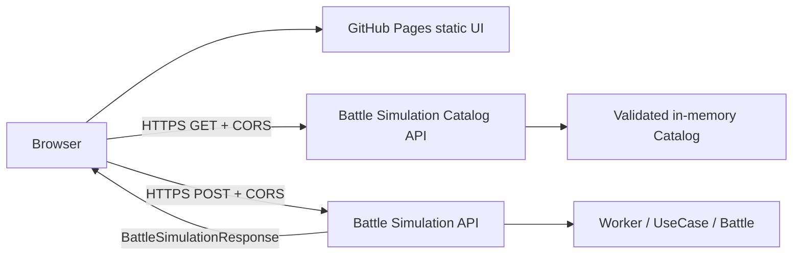

# フロントエンドアーキテクチャ設計

## 1. 方針

UIはGitHub Pagesへ配備可能な静的Single Page Applicationとし、ブラウザから別ホストの戦闘シミュレーションAPIを呼ぶ。

バックエンドのDomain/ApplicationコードやCatalogファイルをブラウザへバンドルしない。UIは一覧APIから現在のCatalog表示情報と選択可否を取得し、HTTP DTOだけを境界として共有する。

## 2. 推奨技術構成

| 領域                | 採用                             | 理由                                                                |
| ------------------- | -------------------------------- | ------------------------------------------------------------------- |
| UI                  | React + TypeScript               | ダイアログ、状態遷移、将来の詳細表示拡張を明示的に構成できる        |
| Build               | Vite                             | 静的成果物、GitHub Pagesのbase path、環境変数を扱いやすい           |
| Package manager     | pnpm                             | 既存リポジトリと統一                                                |
| Unit/Component test | Vitest + Testing Library         | 既存Vitestとの一貫性、DOM操作の振る舞いテスト                       |
| E2E                 | Playwright                       | 実ブラウザで主要フローとGitHub Pages base pathを検証                |
| Styling             | CSS Modulesまたは単一のtheme CSS | 採用モックのCSSを段階的に部品化し、UIライブラリへ外観を依存させない |

正確な依存バージョンは実装開始時にリポジトリのrelease-age/trust policyを満たすものを固定する。本書は最新バージョン番号を固定しない。

## 3. 配置

推奨ディレクトリは `apps/ui/` とする（`#116` `M45-ARCH-001`でbackendの`apps/api/`と並ぶ独立workspace packageへ再編済み）。

```text
repository/
├── apps/
│   ├── api/                     # backend（src/, catalog/ runtime Catalog含む）
│   └── ui/
│       ├── index.html
│       ├── package.json
│       ├── tsconfig.json
│       ├── vite.config.ts
│       ├── public/
│       │   └── assets/          # 後から追加する画像
│       └── src/
│           ├── app/
│           ├── components/
│           ├── features/
│           ├── lib/
│           ├── styles/
│           └── test/
├── docs/ui-design/               # 本設計とモック
└── pnpm-workspace.yaml
```

`pnpm-workspace.yaml`の`packages`に `apps/api`・`apps/ui` をworkspace packageとして持つ。ルートの`package.json`はworkspace orchestrationと共通development toolingだけに限定し、`ui:*` scriptsはmise.tomlから`pnpm --filter ui run ...`（package名で解決するためdirectory移動の影響を受けない）で委譲する。

## 4. 実行時構成



GitHub PagesはUIファイルだけを配信する。API proxyやsecret保持はできない。ブラウザへ渡してはいけない認証secretが必要になった場合、この構成を再検討する。

## 5. モジュール境界

```text
app
├── composition / top-level state
features/formation
├── formation UI and validation
features/catalog-selection
├── unit/memory dialog and filtering
features/simulation
├── API client, request mapping, execution state
features/summary
├── pure result projection and tables
features/details
├── event, transition and JSON views
lib
├── exhaustive guards, formatting, browser utilities
styles
└── design tokens and global layout
```

依存方向：

- `components`はfeature固有型へ依存しない汎用表示部品とする。
- feature間の直接importを最小化し、`app`が組み合わせる。
- `summary`はAPIレスポンスから表示モデルへ変換する純粋関数を公開する。
- `details`は未知イベントを許容し、event typeの網羅性をコンパイル条件にしない。
- API clientはReactへ依存しない。

## 6. GitHub Pages対応

### 6.1 Base path

project site URLを次と想定する。

```text
https://komei0727.github.io/muvluvgg_battle_simulator/
```

Viteの `base` は `/muvluvgg_battle_simulator/` とする。リポジトリ名を変更する可能性がある場合はCI環境変数から設定する。

- アセットURLを `/assets/...` のようなドメインroot固定にしない。
- `import.meta.env.BASE_URL` またはVite importを使用する。
- 初期版はクライアントルーターを使わないため、GitHub Pagesの404 fallbackは不要。

### 6.2 API URL

```text
VITE_API_BASE_URL=https://<cloud-run-service-url>
```

- production値はCloud Run serviceの公開HTTPS URLとする。URLをソースコードへ直書きせず、GitHub Environmentの公開設定値からbuildへ渡す。
- 末尾 `/` は設定読込時に正規化する。
- 未設定、HTTPSでない、URLとして不正な場合はproduction buildまたは起動表示で失敗させる。
- API URLを画面から任意入力させない。
- secretを `VITE_*` に置かない。すべて公開値として扱う。

### 6.3 Deployment workflow

GitHub Actionsで次を行う。

1. checkout
2. mise/pnpm setup
3. install
4. UI typecheck、lint、unit/component test
5. UI build
6. build成果物のbase path smoke test
7. Pages artifact upload
8. main branchのみdeploy

PRではdeployせず、buildとtestまで行う。

APIのCloud Run deployはPages deployより先に完了させる。Pages workflowはCloud Run service URLが未設定、HTTPSでない、またはlive smoke testに失敗する場合にproduction deployを開始しない。UIとAPIを同一workflowへ密結合せず、API revisionをrollbackしてからPagesを再buildできるようにする。

## 7. Battle Simulation Catalog API

### 7.1 理由

UIは `GET /api/v1/battle-simulation-catalog` を起動時に取得する。API responseがUnit・Memoryの表示情報、選択可否、Catalog revisionの正本である。

### 7.2 取得DTO

```ts
interface BattleSimulationCatalogResponse {
  readonly schemaVersion: 1;
  readonly catalogRevision: string;
  readonly units: readonly UiUnitDefinition[];
  readonly memories: readonly UiMemoryDefinition[];
}

interface UiDefinitionAvailability {
  readonly selectable: boolean;
  readonly unavailableCapabilities: readonly string[];
}

interface UiUnitDefinition extends UiDefinitionAvailability {
  readonly unitDefinitionId: string;
  readonly displayName: string;
  readonly characterName?: string;
  readonly attribute: string;
  readonly role: string;
  readonly positionAptitudes: readonly string[];
  readonly imageUrl?: string;
}

interface UiMemoryDefinition extends UiDefinitionAvailability {
  readonly memoryDefinitionId: string;
  readonly displayName: string;
  readonly imageUrl?: string;
}
```

APIはskill/effect式全体を公開せず、UIが表示と選択可否に必要な情報だけを返す。`selectable`と `unavailableCapabilities` はバックエンドが推移的な定義グラフとCapability statusから計算する。UIは再計算しない。

### 7.3 Load stateとcache

- 初回render後に1回取得する。
- 取得成功まで編成editorを有効にしない。
- 取得失敗は手動retryだけを提供し、自動無限retryしない。
- responseのETag/Cache-Controlに従い、再読込時は条件付きGETを利用できる。
- staleなlocalStorageやbundle内Catalogへfallbackしない。
- 同一page session内では成功responseをmemoryに保持する。

### 7.4 Revision差異

戦闘成功レスポンスの `catalogRevision` と直前に取得した一覧APIのrevisionが異なる場合：

- 結果を破棄しない。
- サマリ上部に「UIのCatalog表示データとAPI実行Catalogの版が異なります」と警告する。
- BattleUnitの表示名は `unitDefinitionId` で取得済み一覧から解決し、見つからない場合はIDを表示する。
- 自動再送しない。
- 一覧の手動再取得を案内する。

一覧再取得後も既存の戦闘結果はその実行時revisionとともに保持する。

## 8. 型の管理

- UI側にwire DTO型を置く。
- 初期実装ではbackendの `apps/api/src/application/contracts/`（`request.ts`・`response.ts`・`catalog.ts`・`battle-log.ts`・`error.ts`）をブラウザから直接importしない。backend package boundaryとビルド対象を分離する。
- OpenAPIから型生成を導入する場合、生成差分をCIで検出し、手書き型との二重管理をやめる。
- 実行時には成功・エラーの最小shapeを検証する。TypeScript型だけで外部入力を信頼しない。
- `events[].details`と未知列挙値は `unknown` として安全にnarrowingする。

## 9. エラー境界

- App全体の予期しないrender errorをError Boundaryで捕捉する。
- JSON表示など局所的な重い機能は局所Error Boundaryを許容する。
- API既知エラーは例外画面ではなくsimulation stateの `failed` として扱う。
- 不正な成功レスポンスは `RESPONSE_CONTRACT_MISMATCH` というUI内部エラーへ変換し、diagnostic detailsをconsoleへ出さず安全な概要だけ表示する。

## 10. 設計上の禁止事項

- HTMLモックの単一ファイル構造を本番へそのままコピーしない。
- React stateへAPIレスポンスを必要以上に複製しない。
- イベント文言をサーバーから返る英語 `message` の解析で生成しない。
- Catalog IDから属性やキャラクター名を文字列分割で推測しない。
- 未知イベントを例外にしない。
- GitHub PagesへAPI secretを埋め込まない。
- CORSを `*` とcredentialsの組み合わせで許可しない。

## 11. アーキテクチャ受け入れ条件

- `UI-ARCH-001`: `apps/ui/dist`を静的HTTP serverから配信して全主要機能が起動する。
- `UI-ARCH-002`: `/muvluvgg_battle_simulator/` base pathでCSS/JS/画像が404にならない。
- `UI-ARCH-003`: API clientとsummary projectionがReactなしでunit testできる。
- `UI-ARCH-004`: ブラウザbundleへbackend Domain/Application実装が混入しない。
- `UI-ARCH-005`: UI bundleにCatalog、skill、effect定義全体を含めない。
- `UI-ARCH-006`: Catalog revision差異を警告できる。
- `UI-ARCH-007`: 未知イベントdetailsを受信しても成功レスポンスを表示できる。
- `UI-ARCH-008`: 一覧APIが失敗した状態でstaleな定義を使って戦闘を送信しない。
