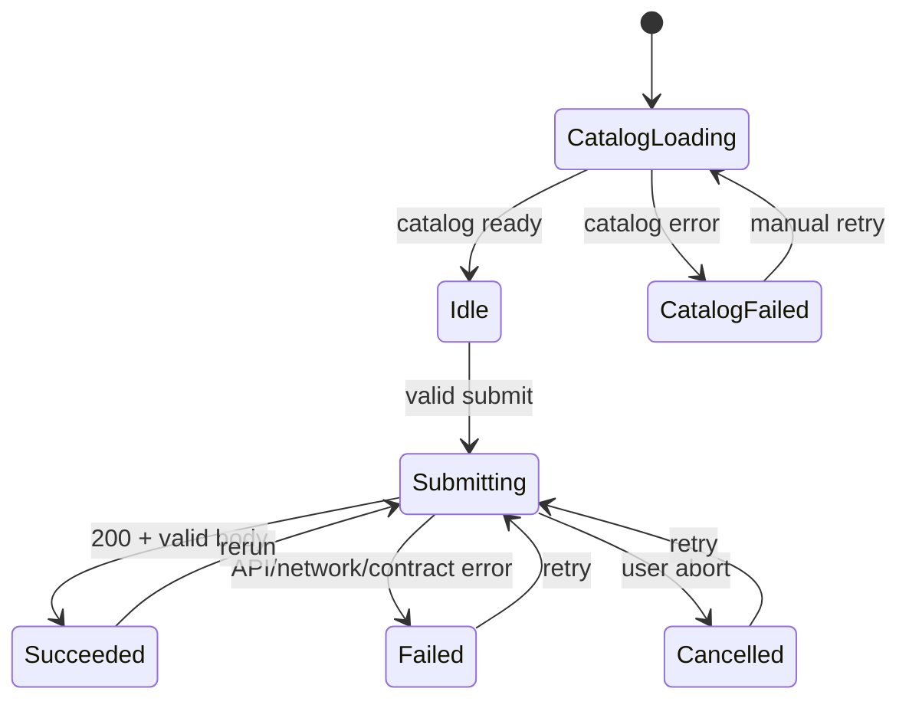

# コンポーネント・状態管理設計

## 1. 方針

- ページ全体の戦闘draftと実行状態は `BattleSimulatorPage` が所有する。
- ダイアログの検索文字列など一時的UI状態はダイアログ自身が所有する。
- APIレスポンスは1箇所に保持し、サマリ・詳細表示モデルはselectorで導出する。
- 初期版で外部global state libraryを導入しない。`useReducer`とpure selectorで十分な構造にする。
- URL、localStorage、serverへ編成状態を保存しない。

## 2. コンポーネントツリー

```text
BattleSimulatorApp
└── AppErrorBoundary
    └── BattleSimulatorPage
        ├── AppHeader
        │   └── ApiStatus
        ├── PageHeading
        ├── BattleSetupSection
        │   ├── FormationEditor (side=ally)
        │   │   ├── FormationGrid
        │   │   │   └── UnitSlot × 6
        │   │   └── MemoryGrid
        │   │       └── MemorySlot × 6
        │   ├── VersusDivider
        │   ├── FormationEditor (side=enemy)
        │   ├── ExecutionParameterForm
        │   └── SubmitControls
        ├── SubmissionFeedback
        ├── BattleSummarySection
        │   ├── OutcomeStrip
        │   └── UnitSummaryTable × 2
        ├── BattleDetailsSection
        │   ├── DetailsTabs
        │   ├── EventTimeline
        │   ├── StateTransitionTable
        │   └── RawJsonView
        ├── UnitSelectionDialog
        └── MemorySelectionDialog
```

DialogはDOM上でPage直下に置き、見た目の起点slotはstateで参照する。slot内へdialogをネストしない。

## 3. 主要コンポーネント責務

### `BattleSimulatorPage`

- reducer初期化
- 一覧APIの取得・再読込とCatalog load state管理
- API client composition
- submit/cancel orchestration
- derived validation、request、summaryのmemoization
- 成功時のfocus/scroll制御

### `FormationEditor`

Props：

```ts
interface FormationEditorProps {
  readonly side: "ally" | "enemy";
  readonly slots: readonly FormationSlotInput[];
  readonly memoryDefinitionIds: readonly (string | undefined)[];
  readonly catalog: BattleSimulationCatalogResponse;
  readonly fieldErrors: ReadonlyMap<string, readonly string[]>;
  readonly disabled: boolean;
  readonly onOpenUnitSelection: (slotKey: string) => void;
  readonly onOpenMemorySelection: (side: Side, index: number) => void;
}
```

入力を直接変更せず、選択dialogを開くintentだけ通知する。

### `UnitSlot`

- 空/選択済み/警告/エラー/disabledを表示する。
- button要素を使用する。
- 選択済みでも表示名をaccessible nameへ含める。
- 適性外配置はwarning badgeを表示する。

### `UnitSelectionDialog`

- 開くたびに現在slotと選択値を受け取る。
- 検索、属性、ロール、適性、利用可否のfilterを持つ。
- filter結果はCatalog順または表示名順で安定表示する。
- 選択不可定義にはbuttonを出さないかdisabledにし、理由を同じitem内に表示する。
- 選択/解除後に閉じ、元のslotへfocusを戻す。

### `MemorySelectionDialog`

Unit版と同じ基本挙動とし、属性・ロールfilterは持たない。将来タグfilterを追加できる領域を残す。

### `SubmitControls`

- validation summary
- 実行開始
- 実行中のキャンセル要求
- submit可否の理由表示
- API endpointを読み取り専用で表示

### `BattleSummarySection`

- API DTOを直接集計しない。
- `selectBattleSummary(response, catalog)`の結果だけ受け取る。
- 味方・敵の列構造を同じにする。
- summary projection warningがある場合、表の上に「一部イベントを集計できませんでした」を表示する。

### `EventTimeline`

- event listをsequence昇順表示する。
- 初期表示は簡潔な1行。展開時にdetailsを表示する。
- 100件を超える場合は初期50件、追加読込方式またはvirtualizationを使う。表示件数を黙って切り捨てない。
- filter導入は将来拡張とし、初期版は全件表示でよい。

### `RawJsonView`

- `JSON.stringify(response, null, 2)`の結果を表示する。
- Clipboard APIが使える場合にコピーbuttonを表示する。
- コピー失敗を戦闘失敗として扱わない。

## 4. State model

```ts
interface BattleSimulatorState {
  readonly catalog: CatalogLoadState;
  readonly draft: BattleDraft;
  readonly selectionDialog: SelectionDialogState;
  readonly execution: ExecutionState;
  readonly activeDetailsTab: "events" | "transitions" | "json";
}

type CatalogLoadState =
  | { readonly status: "loading" }
  | {
      readonly status: "ready";
      readonly response: BattleSimulationCatalogResponse;
      readonly etag?: string;
      readonly requestId?: string;
    }
  | {
      readonly status: "failed";
      readonly error: UiApiError;
      readonly requestId?: string;
    };

type SelectionDialogState =
  | { readonly kind: "closed" }
  | { readonly kind: "unit"; readonly slotKey: string }
  | { readonly kind: "memory"; readonly side: Side; readonly index: number };

type ExecutionState =
  | { readonly status: "idle" }
  | {
      readonly status: "submitting";
      readonly executionId: string;
      readonly request: BattleSimulationRequest;
      readonly startedAt: number;
    }
  | {
      readonly status: "succeeded";
      readonly executionId: string;
      readonly request: BattleSimulationRequest;
      readonly response: BattleSimulationResponse;
      readonly requestId?: string;
      readonly completedAt: number;
    }
  | {
      readonly status: "failed";
      readonly executionId: string;
      readonly error: UiApiError;
      readonly previousSuccess?: SuccessfulExecutionSnapshot;
    }
  | {
      readonly status: "cancelled";
      readonly executionId: string;
      readonly previousSuccess?: SuccessfulExecutionSnapshot;
    };
```

`previousSuccess`は失敗/キャンセル後も前回結果を表示するための最小snapshotである。無制限な履歴配列をstateへ保持しない。

## 5. Reducer actions

```ts
type BattleSimulatorAction =
  | { type: "catalogLoadStarted" }
  | {
      type: "catalogLoadSucceeded";
      response: BattleSimulationCatalogResponse;
      etag?: string;
      requestId?: string;
    }
  | { type: "catalogLoadFailed"; error: UiApiError; requestId?: string }
  | { type: "unitSelected"; slotKey: string; unitDefinitionId: string }
  | { type: "unitRemoved"; slotKey: string }
  | { type: "memorySelected"; side: Side; index: number; memoryDefinitionId: string }
  | { type: "memoryRemoved"; side: Side; index: number }
  | { type: "turnLimitChanged"; value: number | "" }
  | { type: "logLevelChanged"; value: LogLevel }
  | { type: "selectionOpened"; selection: Exclude<SelectionDialogState, { kind: "closed" }> }
  | { type: "selectionClosed" }
  | {
      type: "submissionStarted";
      executionId: string;
      request: BattleSimulationRequest;
      startedAt: number;
    }
  | {
      type: "submissionSucceeded";
      executionId: string;
      response: BattleSimulationResponse;
      requestId?: string;
      completedAt: number;
    }
  | { type: "submissionFailed"; executionId: string; error: UiApiError }
  | { type: "submissionCancelled"; executionId: string }
  | { type: "detailsTabChanged"; tab: "events" | "transitions" | "json" };
```

Reducer規則：

- `catalog.status !== "ready"`ではselection dialogとsubmissionを開始しない。
- Catalog再取得で選択済み定義が消えた、または `selectable: false`になった場合はdraftから黙って削除せず、該当slotをerrorにして送信を禁止する。
- `submissionSucceeded/Failed/Cancelled`のexecutionIdが現在実行と異なる場合は無視する。
- 6体目のunitSelectedはstateを変更せず、UI validation violationを返せるcommand層で拒否する。Reducer内で通知副作用を行わない。
- selection dialogを閉じてもfilter状態はdialog componentのunmountで破棄する。
- draft変更で成功結果を即時破棄しない。結果に「この結果は変更前の条件です」とdirty indicatorを表示する。

## 6. State transition



入力検証失敗では `Submitting`へ遷移しない。

## 7. Derived selectors

次をpure functionとする。

```ts
validateDraft(draft, catalog): readonly UiViolation[]
buildBattleSimulationRequest(draft): RequestBuildResult
selectCanSubmit(state, violations): boolean
selectRoster(response, catalog): RosterProjection
selectBattleSummary(response, catalog): SummaryProjection
selectCatalogRevisionWarning(response, catalog): string | undefined
selectIsResultDirty(draft, successfulRequest): boolean
```

Selectorは入力を変更しない。Catalog arrayやevents arrayをsortする場合はcopyを作る。

## 8. Filter state

Unit dialog内部：

```ts
interface UnitFilter {
  readonly query: string;
  readonly attribute?: string;
  readonly role?: string;
  readonly aptitude?: "FRONT" | "REAR";
  readonly availability: "all" | "selectable" | "unavailable";
}
```

- queryはtrimし大文字小文字を区別しない。
- 日本語displayNameとIDの両方を対象にする。
- debounceは初期不要。Catalog 69件程度を同期filterする。
- sortはselectable優先、次にdisplayNameのlocaleCompare、最後にIDとする。

## 9. UI内部エラー

```ts
interface UiViolation {
  readonly path: string;
  readonly slotKey?: string;
  readonly code: string;
  readonly message: string;
}
```

表示文言は `code`ごとの辞書に置き、validatorに長文を埋め込まない。サーバーから来た未知のruleId/messageは安全なtextとして表示し、HTMLとして挿入しない。

## 10. 推奨ファイル構成

```text
apps/ui/src/
├── app/
│   ├── BattleSimulatorApp.tsx
│   ├── BattleSimulatorPage.tsx
│   ├── battle-simulator-reducer.ts
│   └── app-error-boundary.tsx
├── components/
│   ├── DefinitionImage.tsx
│   ├── Dialog.tsx
│   ├── ErrorNotice.tsx
│   └── Tabs.tsx
├── features/
│   ├── formation/
│   │   ├── FormationEditor.tsx
│   │   ├── UnitSlot.tsx
│   │   ├── MemorySlot.tsx
│   │   ├── draft-validation.ts
│   │   └── request-mapper.ts
│   ├── catalog-selection/
│   │   ├── UnitSelectionDialog.tsx
│   │   ├── MemorySelectionDialog.tsx
│   │   ├── catalog-filter.ts
│   │   └── catalog-loader.ts
│   ├── simulation/
│   │   ├── api-client.ts
│   │   ├── api-contract.ts
│   │   ├── response-validator.ts
│   │   └── error-normalizer.ts
│   ├── summary/
│   │   ├── summary-projector.ts
│   │   └── UnitSummaryTable.tsx
│   └── details/
│       ├── event-formatters.ts
│       ├── EventTimeline.tsx
│       ├── StateTransitionTable.tsx
│       └── RawJsonView.tsx
├── lib/
│   ├── exhaustive.ts
│   └── format.ts
└── styles/
    ├── tokens.css
    └── global.css
```

同一featureでしか使わない型・CSS・testはfeature内にco-locateする。

## 11. コンポーネント受け入れ条件

- `UI-CMP-001`: draft、API response、summaryを重複したmutable stateとして持たない。
- `UI-CMP-002`: 遅れて到着した旧executionの結果が最新stateを上書きしない。
- `UI-CMP-003`: draft変更後も前回結果を保持しdirty表示する。
- `UI-CMP-004`: dialogを閉じた後、起点slotへfocusが戻る。
- `UI-CMP-005`: selection/filter/summaryの主要ロジックがpure functionとしてtest可能である。
- `UI-CMP-006`: 100件超のイベントも黙って切り捨てない。
- `UI-CMP-007`: 画像ロード失敗が親componentのerrorにならない。
- `UI-CMP-008`: 一覧APIのloading/failed/readyを判別し、failedから手動再読込できる。
- `UI-CMP-009`: Catalog未取得またはstale selectionがある状態で戦闘を送信しない。
