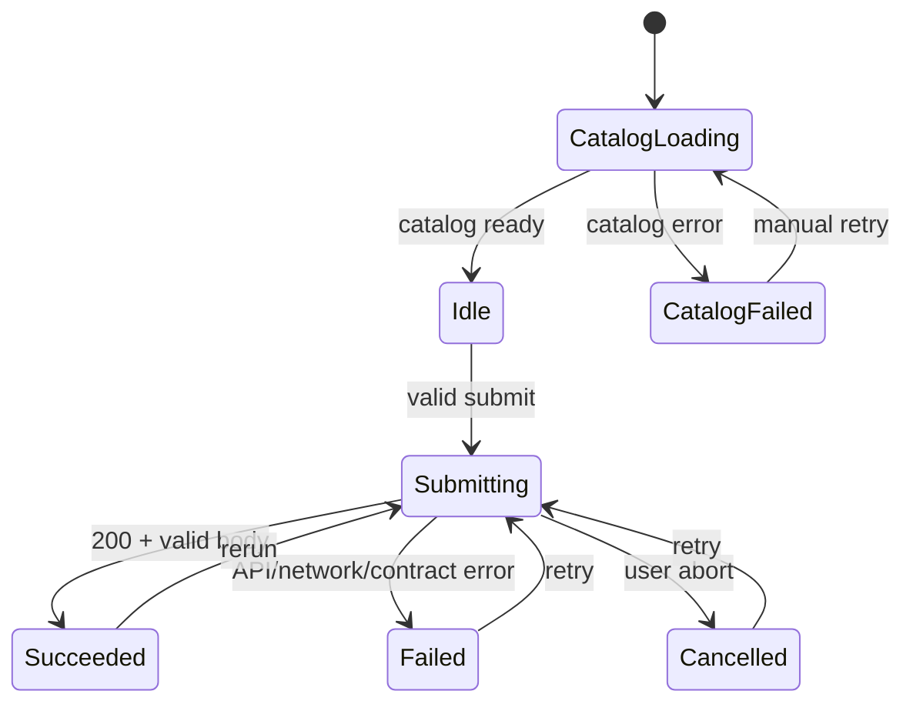

# コンポーネント・状態管理設計

## 1. 方針

- ページ全体の戦闘draftと実行状態は `BattleSimulatorPage` が所有する。
- 状態は関心ごとに3つのsliceへ分割し、それぞれ独立したreducer/hookが持つ（§4）。単一の巨大reducerへ統合しない。
  - Catalog load state: `useCatalogLoader`（`features/catalog-selection/catalog-loader.ts`）
  - 編成draftと選択dialog: `formationReducer`（`features/formation/formation-reducer.ts`）
  - 実行状態: `executionReducer` を内包する `useSimulationExecution`（`features/simulation/execution-reducer.ts`／`use-simulation-execution.ts`）
- ダイアログの検索文字列など一時的UI状態はダイアログ自身が所有する。詳細タブの選択状態も `BattleDetailsSection` のlocal stateとする。
- APIレスポンスは1箇所に保持し、サマリ・詳細表示モデルはselectorで導出する。
- 初期版で外部global state libraryを導入しない。`useReducer`とpure selectorで十分な構造にする。3sliceはいずれも `useReducer` + pure reducerで持ち、`useState` に reducer を手で適用する形や、レンダー中のrefへの書き込みは使わない（並行レンダリング下で書き込みが破棄され得るため）。
- URLとserverへ編成状態を保存しない。localStorageへは編成draftと味方の育成データを保存する（`UI-ADR-012`、[01_UI要求・画面設計.md](./01_UI要求・画面設計.md) §5.9）。永続化でreducerを不純にしない（§4「永続化」）。

## 2. コンポーネントツリー

```text
BattleSimulatorApp（API接続設定の検証。不正時はエラー表示のみ）
└── BattleSimulatorPage
    └── AppShell（topbar・main・footer。footerにUI build revisionを表示）
        ├── Panel（step 01: 戦闘パラメータ）
        │   ├── Catalog loading／failed表示（failed時は再読込button）
        │   ├── BattleSetupLayout（味方・VS区切り・敵の3列layout）
        │   │   ├── FormationEditor (side=ally)
        │   │   │   ├── UnitSlot × 6（FRONT 3・REAR 3。hover／focusでUnitStatPreview）
        │   │   │   └── MemorySlot × 6
        │   │   └── FormationEditor (side=enemy)
        │   ├── ExecutionParameterForm
        │   ├── ValidationSummary
        │   ├── SubmitControls
        │   └── FormationResetControls
        ├── SubmissionFeedback
        ├── Panel（step 02: 戦闘サマリ）
        │   └── BattleSummarySection
        │       ├── OutcomeStrip
        │       └── UnitSummaryTable × 2
        ├── Panel（step 03: 戦闘詳細データ）
        │   └── BattleDetailsSection
        │       ├── Tabs（時系列イベント・状態遷移・レスポンスJSON・ユニット状態・因果ツリー）
        │       ├── EventTimeline
        │       ├── StateTransitionTable
        │       ├── RawJsonView
        │       ├── UnitActionStateSection
        │       └── EventCausalityTree
        ├── UnitSelectionDialog
        └── MemorySelectionDialog
```

- 汎用UI部品は `components/` の `AppShell`・`Panel`・`Button`・`Dialog`・`Tabs`・`DefinitionImage` とする。選択dialogは `Dialog` を、slot・dialogの画像表示は `DefinitionImage` を使う。
- error boundary専用componentは置かない。API接続設定の検証失敗は `BattleSimulatorApp` がエラー表示へ切り替える。
- DialogはDOM上でPage直下に置き、見た目の起点slotはstateで参照する。slot内へdialogをネストしない。

## 3. 主要コンポーネント責務

### `BattleSimulatorPage`

- reducer初期化
- 一覧APIの取得・再読込とCatalog load state管理
- API client composition
- submit/cancel orchestration
- derived validation、request、summaryのmemoization（`use-battle-simulator-view-model.ts` の `useBattleSimulatorViewModel` が3sliceからの派生値を導出する）
- 成功時のfocus/scroll制御

選択dialogの分岐（どのdialogをどのslot起点で開くか）は `app/SelectionDialogs.tsx` が持ち、Pageは `catalog.status === "ready"` のguardと state/dispatch の受け渡しだけを行う。

### `FormationEditor`

Props：

```ts
interface FormationEditorProps {
  readonly side: Side;
  readonly slots: readonly FormationSlotInput[];
  readonly memoryDefinitionIds: readonly (string | undefined)[];
  readonly catalog: BattleSimulationCatalogResponse;
  readonly violations: readonly UiViolation[];
  readonly disabled: boolean;
  readonly imageMap?: Readonly<Record<string, string>>;
  readonly onOpenUnitSelection: (slotKey: string) => void;
  readonly onOpenMemorySelection: (side: Side, index: number) => void;
  readonly onMoveUnit: (fromSlotKey: string, toSlotKey: string) => void;
}
```

入力を直接変更せず、選択dialogを開く・ユニットを移動するintentだけ通知する。

ユニット移動の進行状態（移動元slotKey）はFormationEditorのlocal stateで持ち、ドラッグとキーボード移動モードで共用する。stateが陣営別のeditorインスタンスに閉じているため、反対陣営のslotはdrop先にならない（`dragover`で`preventDefault`しない）— 同一陣営制約はこの構造で担保し、reducerのside検査を第2層とする。移動モード中は各slotの起動操作を「このslotへ配置」へ差し替え、移動元slot自身の起動は中止として扱う。進行状態は視覚非表示の`aria-live="polite"`領域へ通知し、`disabled`がtrueへ変わったら移動モードを解除する。Escapeによる中止は移動モード中だけdocumentレベルのkeydownで捕捉し、フォーカス位置（強化button・メモリー枠・学園レベル入力など）に依存させない。

### `UnitSlot`

- 空/選択済み/警告/エラー/disabledを表示する。
- button要素を使用する。
- 選択済みでも表示名をaccessible nameへ含める。
- 適性外配置はwarning badgeを表示する。

- 選択済み枠はhover／focusで開始時ステータス（`UnitStatPreview`）を表示する。表示のON/OFFだけをlocal stateで持ち、値は算出せずpropsで受け取る。
- ステータス表示はslot buttonへ `aria-describedby` で関連づける。hoverだけの表示にせず、focusでも同じ内容を出す。
- 選択済み・非disabledのslot buttonへHTML5 `draggable`を付与する（空き枠はdrop先のみ）。drag開始でステータスプレビューを消灯し、drop受け入れは親から渡される移動先可否（`moveTarget`）にもとづき`dragover`の`preventDefault`で表現する。drag-overハイライトはenter/leaveの深度カウンタで判定する（子要素での対発火があるため）。
- キーボード代替の「移動」ボタンを強化ボタンと同型で置く（選択済み枠のみ・`disabled`で無効・`aria-pressed`で移動モード中を示す）。移動元・移動先の視覚状態はCSS classで表す。空↔選択済みでwrapper階層を変えない制約（focus復帰）は維持する。

### `UnitStatPreview`

- 1枠分の開始時ステータス（最大HP・攻撃力・防御力・行動速度・会心率・会心ダメージ・有利属性ボーナス）を表示するpresentational component。
- 取得中・取得失敗・未取得の3状態を文言で表す。取得失敗をerror扱いのalertにしない（実行は妨げられていないため）。
- 数値整形だけを行い、強化・編成ボーナス・適性の計算を持たない。

### `UnitSelectionDialog`

- 開くたびに現在slotと選択値を受け取る。
- 候補は`SelectionDialogs`が`selectUnitPool(units, mode, side)`（`catalog-selection/unit-pool.ts`）で編成プールへ絞ってから渡す。dialog自身はモードも陣営も知らない。
- 演習専用ユニットには`開催中`／`開催終了`のチップをtagsへ足す（`R-TEX-11` #4）。選択可否は変えない。
- 検索、属性、ロール、適性、利用可否のfilterを持つ。
- filter結果はCatalog順または表示名順で安定表示する。
- 選択不可定義にはbuttonを出さないかdisabledにし、理由を同じitem内に表示する。
- 選択/解除後に閉じ、元のslotへfocusを戻す。

### `MemorySelectionDialog`

Unit版と同じ基本挙動とし、属性・ロールfilterは持たない。将来タグfilterを追加できる領域を残す。

### `SelectionDialogList`

Unit/Memory両dialogが共有するリスト部品。定義項目の描画・「この枠を空にする」操作・選択buttonのaccessible name生成を担う。「Unit版と同じ基本挙動」を1箇所で保証するため、選択可否の判定（unit側の5体上限など枠固有の事情を含む）は呼び出し側が `disabled` として組み立てて渡す。

### `SubmitControls`

- 実行開始
- 実行中のキャンセル要求
- submit可否の理由表示は `ValidationSummary` が担い、API endpointの読み取り専用表示は `ExecutionParameterForm` が担う

### `FormationResetControls`

- 「編成をクリア」「保存した育成データをクリア」の2操作だけを持つpresentational component（[01_UI要求・画面設計.md](./01_UI要求・画面設計.md) §5.9）。
- storageへ直接触れず、押下intentだけを通知する。何を消すかの決定は `useFormationPersistence` が持つ。
- 実行中（`formationDisabled`）は無効化する。

### `BattleSummarySection`

- API DTOを直接集計しない。集計はサーバーの`unitSummaries`が正本である（[03_API・データ連携設計.md](./03_API・データ連携設計.md) §11）。
- `selectBattleSummary(response, catalog)`の結果だけ受け取る。
- 味方・敵の列構造を同じにする。
- summary projection warningがある場合、表の上に「一部ユニットの集計を取得できませんでした」を表示する。

### `EventTimeline`

- event listをsequence昇順表示する。
- 初期表示は簡潔な1行。展開時にdetailsを表示する。
- 100件を超える場合は初期50件、追加読込方式またはvirtualizationを使う。表示件数を黙って切り捨てない。
- filter導入は将来拡張とし、初期版は全件表示でよい。

### `RawJsonView`

- `JSON.stringify(response, null, 2)`の結果を表示する。
- Clipboard APIが使える場合にコピーbuttonを表示する。
- コピー失敗を戦闘失敗として扱わない。

### `EnhancementPanel`（M11で追加予定）

- 陣営フッターのメモリー枠の並びに、強化トグルと学園レベル9入力（ユニットタイプ3・属性6）を表示する。
- `ExecutionParameterForm`と同じ入力・違反表示パターンとし、field単位のserver violationを該当入力へ表示する。
- トグルOFF時は学園レベル入力を無効化する。入力値は破棄せず保持する。
- 同じパネルへレベルリンクのトグルとリンクレベル入力を置く（`01_UI要求・画面設計.md` §5.6）。強化トグルOFF時は学園レベルと同じく無効化し、入力値は保持する。
- リンクのON／OFFは各枠の`level`を書き換えない。リンクの反映は参照時解決であり（[03_API・データ連携設計.md](./03_API・データ連携設計.md) §3.1）、書き換えると値の置き場が二重化する。

### `UnitEnhancementDialog`（M11で追加予定）

- 選択済みユニット枠から開き、レベル入力とギア9枠（各枠はstat・tier・gradeのselect、空枠可）を編集する。
- `Dialog`を使い、閉じた後は起点slotへfocusを戻す（選択dialogと同じ挙動）。
- 陣営の強化トグルOFF時は編集を無効化し、トグルONを促す文言を表示する。
- 陣営のレベルリンクON中はレベル入力を読み取り専用（`readOnly`）にし、適用中のリンクレベルを表示する。`disabled`にしない — focusできなくなると、サーバー違反の文言をその入力へ結びつけても読み上げから外れる（`UI-AC-039`）。
- 「リンクから外す」／「リンクへ戻す」を切り替えられる。外した瞬間のシード（その時点のリンクレベルを枠の`level`へ書く）は`formationReducer`の純粋な遷移とし、componentはactionをdispatchするだけとする。

## 4. State model

状態は3つのsliceへ分割し、`BattleSimulatorPage` が各hookを合成する。単一の `BattleSimulatorState` は持たない。

### Catalog load state（`catalog-loader.ts`）

```ts
type CatalogLoadState =
  | { readonly status: "loading" }
  | {
      readonly status: "ready";
      readonly response: BattleSimulationCatalogResponse;
      readonly etag?: string;
      readonly requestId?: string;
    }
  | { readonly status: "failed"; readonly error: UiApiError; readonly requestId?: string };
```

`useCatalogLoader(baseUrl)` が `{ state, reload }` を返す。mount時とreload時に取得する。条件付き取得のetagは `reload()` が直前のready snapshotを引数で渡す（直前がfailedならetagを送らず、304で失敗前の応答を復元しない）。

### 編成draftと選択dialog（`formation-reducer.ts`）

```ts
interface FormationState {
  readonly draft: BattleDraft;
  readonly selectionDialog: SelectionDialogState;
  // 手持ちデータの書き戻し先を一意に決める（§4「永続化」）
  readonly lastEditedSlotKey?: string;
}

type SelectionDialogState =
  | { readonly kind: "closed" }
  | { readonly kind: "unit"; readonly slotKey: string }
  | { readonly kind: "memory"; readonly side: Side; readonly index: number };
```

M11（`ENH-001`）で`BattleDraft`へ陣営・ユニットの強化入力（[03_API・データ連携設計.md](./03_API・データ連携設計.md) §3.1）を追加し、`SelectionDialogState`へ `{ kind: "unitEnhancement"; slotKey: string }` を追加する。レベルリンクは`SideEnhancementInput.levelLink`と`UnitEnhancementInput.linkExcluded`として同じ強化入力の中に入り、stateのsliceを増やさない。

### 実行状態（`execution-reducer.ts`／`use-simulation-execution.ts`）

```ts
type ExecutionState =
  | { readonly status: "idle" }
  | {
      readonly status: "submitting";
      readonly executionId: string;
      readonly request: BattleSimulationRequest;
      readonly startedAt: number;
      readonly allyUnitSlotKeys: readonly string[];
      readonly enemyUnitSlotKeys: readonly string[];
      readonly allyMemorySlotKeys: readonly string[];
      readonly enemyMemorySlotKeys: readonly string[];
      readonly previousSuccess?: SuccessfulExecutionSnapshot;
    }
  | {
      readonly status: "succeeded";
      readonly executionId: string;
      readonly request: BattleSimulationRequest;
      readonly response: BattleSimulationResponse;
      readonly requestId?: string;
      readonly completedAt: number;
    }
  | {
      readonly status: "failed";
      readonly executionId: string;
      readonly error: UiApiError;
      readonly requestId?: string;
      readonly allyUnitSlotKeys: readonly string[];
      readonly enemyUnitSlotKeys: readonly string[];
      readonly allyMemorySlotKeys: readonly string[];
      readonly enemyMemorySlotKeys: readonly string[];
      readonly previousSuccess?: SuccessfulExecutionSnapshot;
    }
  | {
      readonly status: "cancelled";
      readonly executionId: string;
      readonly previousSuccess?: SuccessfulExecutionSnapshot;
    };
```

- `executionReducer` はpure functionとし、AbortController・timeout・page unloadの副作用は `useSimulationExecution` が持つ。
- `previousSuccess`は再実行中・失敗・キャンセル後も前回結果を表示するための最小snapshotである。無制限な履歴配列をstateへ保持しない。
- `*SlotKeys` は送信時点のslot対応表である。422 violationsのJSON Pointerを、送信後に編集され得る現在のdraftではなく送信時のslotへ対応づけるため、`submitting`から`failed`へ引き継ぐ（UI-API-004）。
- 詳細タブの選択状態は `BattleDetailsSection` のlocal state（5タブ: `events`／`transitions`／`json`／`actionState`／`causalityTree`）とし、page reducerへ持ち上げない。
- 5タブは`DETAILED`実行のときだけ表示する。`SUMMARY`実行のレスポンスはイベント・状態遷移・`finalState`を持たないため、タブを出すと5つとも「空だが正常」に見え、実行が失敗したのか設定の問題なのか画面から区別できない。代わりに詳細ログモードで実行し直せることを案内する（Issue #464）。

### ステータスプレビュー状態（`use-formation-stat-preview.ts`）

```ts
type FormationStatPreviewState =
  | { readonly status: "unavailable" } // 送信できる編成が組み立たっていない
  | { readonly status: "loading" }
  | { readonly status: "failed" }
  | {
      readonly status: "ready";
      readonly bySlotKey: ReadonlyMap<string, UnitStatPreview>;
    };
```

- 実行状態（`execution-reducer.ts`）とは独立したsliceとする。プレビューの失敗が実行状態を汚さないことを型で保証するためであり、`ExecutionState`へ相乗りさせない。
- draftから組み立てたリクエストのJSON表現が変わったときだけ再取得する。同じ編成で再renderしても再送しない。
- 応答の各`units[]`は`side`と`formationPosition`でリクエストの枠へ突き合わせる（`battleUnitId`は戦闘を実行していないため存在しない）。契約上の並び順（味方→敵、各陣営内はリクエスト順）だけを信じてindexで対応づけると、同数のまま順序が入れ替わった応答で他の枠のステータスをその枠へ表示してしまう。件数・位置・`unitDefinitionId`のいずれかが食い違えば、部分的に対応づけずプレビュー全体を失敗扱いにする。
- 前回のリクエストが実行中なら、新しい編成での取得を始める前にabortする。送信できる編成が無くなって`unavailable`へ戻る場合も同じ扱いとし、中断と競合して完了した古い結果が現在のstateを上書きしないようにする（abortは既に解決済みの応答を取り消せない）。

### 永続化（`lib/storage.ts`／`features/formation/persistence.ts`／`use-formation-persistence.ts`）

localStorageの3キー（`mlgg:player-data`／`mlgg:last-draft`／`mlgg:last-draft:exercise`。[01_UI要求・画面設計.md](./01_UI要求・画面設計.md) §5.9）を扱う。draftの保存・復元・孤児クリアは `usePersistedDraft`（保存キーとdraftの対ごとに1つ）、手持ちデータは `useFormationPersistence` が持つ。

```ts
// 保存形式はdraft型を写すが、レベルリンクの新項目だけは任意にする（後述）
interface StoredUnitEnhancement extends Omit<UnitEnhancementInput, "linkExcluded"> {
  readonly linkExcluded?: boolean; // 欠けていれば false
}

interface StoredSideEnhancement extends Omit<SideEnhancementInput, "levelLink"> {
  readonly levelLink?: LevelLinkInput; // 欠けていればリンクOFF・リンクレベル200
}

interface StoredPlayerData {
  readonly academyLevels: SideEnhancementInput["academyLevels"];
  readonly levelLink?: LevelLinkInput;
  readonly units: Readonly<Record<string, StoredUnitEnhancement>>;
}
```

`StoredUnitEnhancement`／`StoredSideEnhancement`は手持ちデータとdraftキーの**両方**が使う。draftキーにも陣営の`SideEnhancementInput`と枠ごとの`UnitEnhancementInput`がそのまま入っており、読み手（narrowing）は両者で共有されるためである。

- 保存形式は送信DTOではなくdraft型を写したものとする。送信DTOは空枠を圧縮するため、どの枠にどのユニットが居たかを復元できない。
- 全キーとも `schemaVersion` を持ち、値が現行と異なる保存データは破棄して初期状態から開始する。draftキーは保存時の `catalogRevision` も記録する（不一致でも破棄せず、後述の孤児クリアで吸収する）。
- モード別draftは**キーを分ける**。1つのキーへ両モードのdraftを入れると、後から保存した側でもう片方の編成が消え、既存の `mlgg:last-draft`（単一draft形式）との互換も切れる。復元は `useReducer` のlazy initializerへ保存キーを渡して行う。
- 読み出しは `unknown` として受け取り、`lib/unknown-narrowing.ts` のナローイングでshapeを検証する。1項目でも契約から外れれば、その保存データ全体を破棄する（部分的に信じない）。固定長の配列（ユニット枠6・メモリー枠6・ギア枠9）は**長さも契約**として扱い、短い配列を空枠で補って受理しない（枠位置がずれた保存データを黙って受け入れることになるため）。
- storageアクセスは `lib/storage.ts` の `readJsonItem`／`writeJsonItem`／`removeJsonItem` に閉じる。localStorageが存在しない・アクセスがthrowする・容量超過（`QuotaExceededError`）はすべて握り潰し、保存以外の機能を継続する。保存失敗をUiViolationやerror表示へ昇格させない。
- reducerは純粋なまま保つ。復元は `useReducer` のlazy initializerで行い、プリフィル値はdispatch前にストアを引いてactionのpayloadへ乗せ、storageへの書き込みは `useEffect` に閉じる。
- 保存effectの依存はdraftオブジェクトの参照とする。draftの参照は`formationReducer`が値を変えたときだけ変わり、値が変われば必ず保存し直すのが正しい。送信内容の同値性で再取得を抑える `use-formation-stat-preview.ts` とは目的が異なるため、直列化した鍵を挟まない。
- 手持ちデータへの書き戻しは、味方側のdraftから純関数 `mergePlayerDataFromDraft(previous, draft, editedSlotKey)` で導出する。未入力（`""`）のレベル・学園レベル・リンクレベルは書き戻さない（前回値を保つ）。保存データ側は未入力を表現できない型で読まれる（`tools/exercise-lab` の `StoredLevelLink.level` は `int`）ため、この除外は保存形式の前提でもある。導出結果が前回と等しい場合は同一参照を返し、再レンダーと再書き込みを起こさない。
- 手持ちデータはユニット定義ID単位だが、同じ定義は複数枠へ配置できる（§5規則）。全枠を走査して上書きすると、編集した枠の値が同じユニットを持つ未編集の枠の値で潰れるため、ユニットの書き戻し対象は `FormationState.lastEditedSlotKey`（直近に強化入力を編集した枠）だけに限定する。「差分のある枠を選ぶ」規則は、記録更新後に未編集の枠が差分側へ回るため振動する。
- `lastEditedSlotKey` は書き戻し先を一意に決めるためだけの値であり、`BattleDraft` には入れない（送信内容へ影響させない）。学園レベルの書き戻しは枠に紐づかないため、この限定を受けない。
- 敵陣営はプリフィルも書き戻しも行わない。
- レベルリンクの新項目（`levelLink`・`linkExcluded`）は**3キーすべてで任意項目**として読み、欠けていても保存データを破棄しない。`PERSISTENCE_SCHEMA_VERSION`は1のまま据え置く — 版を上げると`schemaVersion`の完全一致判定で全利用者の手持ちデータ（ユニット別レベル・ギア・学園レベル）が破棄されるためである。
- 必須として読んではならないのはdraftキーも同じである。M11の強化入力は既にdraftへ保存されており、手元にあるdraftは新項目を持たない。必須として読むと上の「1項目でも契約から外れれば全体を破棄する」規則に掛かり、両モードの編成draftが丸ごと消える。手持ちデータとdraftは同じ読み手を共有するため、任意化はその読み手1か所で行う。
- 新項目を知らない**旧UI**は未知キーを読み飛ばすため、新形式を読んでも壊れない。一方`mlgg:player-data`には未知キーを拒否する外部の読み手（`tools/exercise-lab`。`extra="forbid"`、`SUPPORTED_SCHEMA_VERSION = 1`）がいる。版を据え置く以上そちらの版チェックは素通りするため、UIが新項目を書き始める前に読み手側を対応させる（`01_UI要求・画面設計.md` §5.9）。
- 味方の`levelLink`は学園レベルと同じ陣営に1組の育成情報であり、`mergePlayerDataFromDraft`で書き戻し、プリフィルへ使う。`linkExcluded`は枠に紐づく値なのでレベル・ギアと同じ扱いとし、書き戻し対象は`lastEditedSlotKey`の枠だけに限る。
- 孤児ID（Catalogから消えた定義）のクリアは、**mount後の最初のCatalog readyで1回だけ**行う。以降のCatalog再読込では§5の規則どおりdraftから黙って削除せず、`validateDraft` のerrorとして送信を止める。判定には `validateDraft` の `UNKNOWN_DEFINITION` violationを流用し、その `slotKey` を持つ枠だけを空にする。同じタイミングで手持ちデータの未知ユニットエントリも取り除く。
- 孤児クリアはdraftごとに、そのdraftのviolationだけで判定する。`slotKey` はモード間で同じ文字列になるため、他モードのviolationを混ぜると無関係な枠を空にする。

## 5. Reducer actions

Catalog load stateのaction（`started`／`succeeded`／`failed`）は `catalog-loader.ts` 内部に閉じ、外へは `reload()` だけを公開する。

```ts
type FormationAction =
  | { type: "unitSelected"; slotKey: string; unitDefinitionId: string }
  | { type: "unitRemoved"; slotKey: string }
  | { type: "memorySelected"; side: Side; index: number; memoryDefinitionId: string }
  | { type: "memoryRemoved"; side: Side; index: number }
  | { type: "turnLimitChanged"; value: number | "" }
  | { type: "logLevelChanged"; value: LogLevel }
  | { type: "selectionOpened"; selection: Exclude<SelectionDialogState, { kind: "closed" }> }
  | { type: "selectionClosed" };

type ExecutionAction =
  | {
      type: "submissionStarted";
      executionId: string;
      request: BattleSimulationRequest;
      startedAt: number;
      allyUnitSlotKeys: readonly string[];
      enemyUnitSlotKeys: readonly string[];
      allyMemorySlotKeys: readonly string[];
      enemyMemorySlotKeys: readonly string[];
    }
  | {
      type: "submissionSucceeded";
      executionId: string;
      response: BattleSimulationResponse;
      requestId?: string;
      completedAt: number;
    }
  | { type: "submissionFailed"; executionId: string; error: UiApiError; requestId?: string }
  | { type: "submissionCancelled"; executionId: string };
```

入力の永続化（Issue #425）で`FormationAction`へ次を追加し、`unitSelected`へ任意の `enhancement` を足す。

```ts
type PersistenceFormationAction =
  // 手持ちデータ由来のプリフィル値。味方枠への配置時だけ載せる
  | {
      type: "unitSelected";
      slotKey: string;
      unitDefinitionId: string;
      enhancement?: UnitEnhancementInput;
    }
  // 「編成をクリア」。味方の育成入力は手持ちデータからプリフィルし直す
  // （レベルリンクで`allyLevelLink`を足す。後述）
  | {
      type: "draftReset";
      allyAcademyLevels?: SideEnhancementInput["academyLevels"];
      allyLevelLink?: LevelLinkInput;
    }
  // 「保存した育成データをクリア」に伴う味方育成入力の初期化
  | { type: "allyEnhancementCleared" }
  // 復元直後にCatalogから消えていた定義の枠を空にする
  | { type: "unknownDefinitionsCleared"; slotKeys: readonly string[] };
```

M11（`ENH-001`）で`FormationAction`へ次を追加する。

```ts
type EnhancementFormationAction =
  | { type: "enhancementToggled"; side: Side; enabled: boolean }
  | {
      type: "academyLevelChanged";
      side: Side;
      group: "unitTypes" | "attributes";
      key: string;
      value: number | "";
    }
  | { type: "unitEnhancementLevelChanged"; slotKey: string; value: number | "" }
  | { type: "unitEnhancementGearChanged"; slotKey: string; gearIndex: number; gear?: GearInput };
```

レベルリンクで`FormationAction`へ次を追加する。「編成をクリア」で学園レベルとリンク設定を1回のactionでプリフィルするため、`draftReset`は別のunion memberを増やさず上の宣言へ`allyLevelLink`を足す。

```ts
type LevelLinkFormationAction =
  | { type: "levelLinkToggled"; side: Side; enabled: boolean }
  | { type: "levelLinkLevelChanged"; side: Side; value: number | "" }
  // シード値はreducerが同じdraftの`levelLink.level`から読む（payloadで渡さない）
  | { type: "unitLevelLinkExclusionChanged"; slotKey: string; excluded: boolean };
```

ユニット移動（ドラッグ&ドロップ／キーボード移動モード）で`FormationAction`へ次を追加する。

```ts
type MoveFormationAction = { type: "unitMoved"; fromSlotKey: string; toSlotKey: string };
```

Reducer規則：

- `catalog.status !== "ready"`ではselection dialogとsubmissionを開始しない（`BattleSimulatorPage` がdialog描画とsubmit可否をguardする）。
- Catalog再取得で選択済み定義が消えた場合はdraftから黙って削除せず、`validateDraft` が該当slotをerrorにして送信を禁止する。
- `submissionSucceeded/Failed/Cancelled`のexecutionIdが現在実行と異なる場合は無視する。
- 陣営の選択数が上限（5体）に達している状態での新規unitSelectedは、`formationReducer` がstateを変更せず無視する。あわせて `UnitSelectionDialog` へ `atCapacity` を渡し、選択自体をUI上で不可にして理由を表示する。Reducer内で通知副作用を行わない。
- selection dialogを閉じてもfilter状態はdialog componentのunmountで破棄する。
- draft変更で成功結果を即時破棄しない。結果に「この結果は変更前の条件です」とdirty indicatorを表示する。
- （M11）陣営の強化トグルOFFでは `kind: "unitEnhancement"` の`selectionOpened`を無視し、`UnitSlot`側でも起動操作を無効化する。トグルOFFへ戻しても強化入力値はdraftへ保持し、送信対象からだけ外す。
- `unitMoved`は同一陣営内の2slot間で`unitDefinitionId`と`enhancement`を交換する（移動先が空なら移動）。不明なslotKey・同一slot・空の移動元・陣営を跨ぐ指定はstateを変更せず無視する。同一陣営内の移動は選択数を変えないため容量チェックは行わない。`selectionDialog`は変更しない。移動は編集ではないため`lastEditedSlotKey`は落とす — 残すと入れ替えで旧座標へ移ってきた未編集ユニットの値が手持ちデータを上書きする。
- `unitSelected`が`enhancement`を伴う場合、その枠の強化入力を丸ごと置き換える。味方枠は常に伴う（記録が無ければ既定値）ため、外した枠へ別ユニットを置いても前のユニットのレベル・ギアが残らない。伴わない敵枠は従来どおり枠の入力を保持する。
- `draftReset`は`selectionDialog`も閉じ、味方の学園レベルとレベルリンク（`allyAcademyLevels`・`allyLevelLink`）だけpayloadで上書きする。payloadに無い項目は既定値へ戻す。実行状態（`ExecutionState`）と直近結果は消さない。
- `levelLinkToggled`・`levelLinkLevelChanged`は各枠の`enhancement`を書き換えない。リンクの反映は参照時解決であり、OFFへ戻すだけで各枠が元の手動レベルへ戻る。
- `unitLevelLinkExclusionChanged`で`excluded: true`のとき、その枠の`level`へその時点のリンクレベルをシードする（`enhancement`未設定の枠は既定値のうえでシードした`enhancement`を作る）。シードしないと外した途端に古い値（多くは200）へ跳ね戻り、外す操作が破壊的に見える。`excluded: false`では`level`を書き換えない。リンクレベルが未入力（`""`）ならシード結果も未入力になり、その枠は従来どおり`UNIT_LEVEL_INVALID`の対象になる。
- 味方の`levelLinkToggled`・`levelLinkLevelChanged`は、学園レベル（`academyLevelChanged`）と同じく**両モードのreducer sliceへfan-outする**（`BattleSimulatorPage.tsx`）。リンク設定は手持ちデータであり、モードを切り替えても同じ値が出なければならない。敵側は都度入力の方針なので編集中のモードだけへ配る。`unitLevelLinkExclusionChanged`は枠に紐づく編集であり、レベル・ギアと同じく手持ちデータの書き戻し・プリフィル経路に乗せる（fan-outしない）。
- `allyEnhancementCleared`は味方の学園レベルとレベルリンクを既定へ戻し、味方全枠の`enhancement`を取り除く（`linkExcluded`もここで消える）。ユニット配置・メモリー・敵側・実行パラメータは変えない。
- `unknownDefinitionsCleared`は該当`slotKey`のユニット枠（強化入力ごと）とメモリー枠だけを空にする。`slotKey`が現在のdraftに無ければ何もしない。

## 6. State transition


```mermaid
stateDiagram-v2
    [*] --> CatalogLoading
    CatalogLoading --> Idle: catalog ready
    CatalogLoading --> CatalogFailed: catalog error
    CatalogFailed --> CatalogLoading: manual retry
    Idle --> Submitting: valid submit
    Submitting --> Succeeded: 200 + valid body
    Submitting --> Failed: API/network/contract error
    Submitting --> Cancelled: user abort
    Succeeded --> Submitting: rerun
    Failed --> Submitting: retry
    Cancelled --> Submitting: retry
```

入力検証失敗では `Submitting`へ遷移しない。

## 7. Derived selectors

次をpure functionとする。

```ts
validateDraft(draft, catalog): readonly UiViolation[]
buildBattleSimulationRequest(draft): RequestBuildResult
selectCanSubmit(violations): boolean
selectRoster(response, catalog): readonly RosterEntry[]
selectBattleSummary(response, catalog): SummaryProjection
selectDisplayedSuccess(executionState): SuccessfulExecutionSnapshot | undefined
selectIsCatalogRevisionMismatch(displayedSuccess, catalogRevision): boolean
selectIsResultDirty(latestRequest, displayedSuccessRequest): boolean
mapServerViolationsToUiViolations(violations, ...slotKeys): readonly UiViolation[]
```

`selectIsCatalogRevisionMismatch` は、表示中の成功結果の `catalogRevision` が保持中Catalogと異なる場合（Catalog再読込中・再読込失敗中を含む）にtrueを返し、矛盾した結果の表示を止めて再取得を促す。

Selectorは入力を変更しない。Catalog arrayやevents arrayをsortする場合はcopyを作る。

## 8. Filter state

Unit dialog内部：

```ts
interface UnitFilter {
  readonly query: string;
  readonly attribute?: string;
  readonly role?: string;
  readonly aptitude?: "FRONT" | "REAR";
}
```

- queryはtrimし大文字小文字を区別しない。
- 日本語displayNameとIDの両方を対象にする。
- debounceは初期不要。Catalog 70件程度を同期filterする。
- sortはdisplayNameのlocaleCompare、次にIDとする。

## 9. UI内部エラー

```ts
interface UiViolation {
  readonly path: string;
  readonly slotKey?: string;
  readonly code: string;
  readonly message: string;
}
```

表示文言は `code`ごとの辞書に置き、validatorに長文を埋め込まない。サーバーから来た未知のruleId/messageは安全なtextとして表示し、HTMLとして挿入しない。

## 10. ファイル構成

実装の現状（test・CSS Moduleは各実装ファイルと同名でco-locateするため省略）:

```text
apps/ui/src/
├── main.tsx
├── vite-env.d.ts
├── app/
│   ├── BattleSimulatorApp.tsx
│   ├── BattleSimulatorPage.tsx
│   ├── SelectionDialogs.tsx
│   └── use-battle-simulator-view-model.ts
├── components/
│   ├── AppShell.tsx
│   ├── Button.tsx
│   ├── DefinitionImage.tsx
│   ├── Dialog.tsx
│   ├── Panel.tsx
│   └── Tabs.tsx
├── features/
│   ├── formation/
│   │   ├── BattleSetupLayout.tsx
│   │   ├── EnhancementPanel.tsx      # 陣営強化（M11で追加予定）
│   │   ├── ExecutionParameterForm.tsx
│   │   ├── FormationEditor.tsx
│   │   ├── FormationGrid.tsx          # 陣営1つ分の前衛3・後衛3と移動モード
│   │   ├── FormationResetControls.tsx # 編成／育成データのリセット操作
│   │   ├── MemorySlot.tsx
│   │   ├── SubmitControls.tsx
│   │   ├── UnitEnhancementDialog.tsx # ユニット強化（M11で追加予定）
│   │   ├── UnitSlot.tsx
│   │   ├── UnitStatPreview.tsx       # 枠hover／focusの開始時ステータス
│   │   ├── ValidationSummary.tsx
│   │   ├── draft-validation.ts
│   │   ├── formation-reducer.ts
│   │   ├── persistence.ts             # 保存スキーマ・検証・draft⇔保存形式の写像
│   │   ├── request-mapper.ts
│   │   ├── use-formation-persistence.ts
│   │   ├── use-formation-stat-preview.ts
│   │   └── types.ts
│   ├── catalog-selection/
│   │   ├── MemorySelectionDialog.tsx
│   │   ├── SelectionDialogList.tsx
│   │   ├── UnitSelectionDialog.tsx
│   │   ├── catalog-filter.ts
│   │   ├── catalog-loader.ts
│   │   ├── definition-image-map.ts
│   │   └── unit-pool.ts               # 編成プール（R-TEX-11）の純関数
│   ├── simulation/
│   │   ├── SubmissionFeedback.tsx
│   │   ├── api-client.ts
│   │   ├── api-contract.ts
│   │   ├── error-normalizer.ts
│   │   ├── execution-reducer.ts
│   │   ├── response-validator.ts
│   │   ├── use-simulation-execution.ts
│   │   └── violation-mapper.ts
│   ├── summary/
│   │   ├── BattleSummarySection.tsx
│   │   ├── OutcomeStrip.tsx
│   │   ├── UnitSummaryTable.tsx
│   │   └── summary-projector.ts
│   ├── exercise/           # 戦術演習（M10）
│   │   ├── ModeTabs.tsx
│   │   ├── ExerciseEnemyFormation.tsx
│   │   ├── ScoreSummaryHeader.tsx
│   │   ├── BreakTimeline.tsx
│   │   ├── exercise-draft-validation.ts
│   │   ├── exercise-request-mapper.ts
│   │   └── exercise-result-projector.ts
│   └── details/
│       ├── BattleDetailsSection.tsx
│       ├── EventCausalityTree.tsx
│       ├── EventTimeline.tsx
│       ├── RawJsonView.tsx
│       ├── StateTransitionTable.tsx
│       ├── UnitActionStateSection.tsx
│       ├── action-state-projector.ts
│       ├── battle-flow-event-formatters.ts
│       ├── damage-event-formatters.ts
│       ├── delta-flattener.ts
│       ├── effect-event-formatters.ts
│       ├── event-causality-tree.ts
│       ├── event-formatters.ts
│       ├── event-presentation.ts
│       ├── exercise-event-formatters.ts
│       ├── resource-event-formatters.ts
│       └── skill-event-formatters.ts
├── lib/
│   ├── aptitude.ts
│   ├── build-info.ts
│   ├── env.ts
│   ├── storage.ts
│   └── unknown-narrowing.ts
├── assets/
│   ├── units/    # UNIT_*.webp
│   └── memories/ # MEM_*.webp
├── styles/
│   ├── tokens.css
│   └── global.css
└── test/
    └── setup.ts
```

同一featureでしか使わない型・CSS・testはfeature内にco-locateする。

## 11. コンポーネント受け入れ条件

- `UI-CMP-001`: draft、API response、summaryを重複したmutable stateとして持たない。
- `UI-CMP-002`: 遅れて到着した旧executionの結果が最新stateを上書きしない。
- `UI-CMP-003`: draft変更後も前回結果を保持しdirty表示する。
- `UI-CMP-004`: dialogを閉じた後、起点slotへfocusが戻る。
- `UI-CMP-005`: selection/filter/summaryの主要ロジックがpure functionとしてtest可能である。
- `UI-CMP-006`: 100件超のイベントも黙って切り捨てない。
- `UI-CMP-007`: 画像ロード失敗が親componentのerrorにならない。
- `UI-CMP-008`: 一覧APIのloading/failed/readyを判別し、failedから手動再読込できる。
- `UI-CMP-009`: Catalog未取得またはstale selectionがある状態で戦闘を送信しない。
- `UI-CMP-010`: モードタブ（`ModeTabs`）が通常戦闘と戦術演習の表示・入力・結果を切り替え、モードごとのdraftと直近結果を独立に保持する。初期モードは戦術演習とし、モードごとのdraftはそれぞれの保存キーからリロードをまたいで復元する。ただし味方の育成入力（学園レベル・ユニットレベル・ギア）は手持ちデータを唯一の出所とするモード共通の値であり、この独立性の対象外とする（`01_UI要求・画面設計.md` §5.9）。
- `UI-CMP-011`: 戦術演習の敵編成（`ExerciseEnemyFormation`）が通常戦闘と同じ盤面（`FormationGrid`）で6枠を出しつつ、そこへ置けるユニットを常に1体に保つ（空き枠への選択は2体目ではなく移動になる）。メモリー枠・強化パネル・ターン上限入力は表示しない。
- `UI-CMP-012`: 演習結果ヘッダー（`ScoreSummaryHeader`）が総スコア、ブレイク回数、終了理由を表示し、ブレイク履歴（`BreakTimeline`）が発生順に描画される。
- `UI-CMP-013`: 実行stateがモードをキーに分離され、遅延到着した旧executionの結果が他モードの最新stateを上書きしない（`UI-CMP-002`の拡張）。
- `UI-CMP-014`: 強化パネル（`EnhancementPanel`）が陣営単位の強化トグルと学園レベル入力を持ち、トグルOFF時は入力値を保持したまま送信対象から外す。
- `UI-CMP-015`: ユニット強化ダイアログ（`UnitEnhancementDialog`）がレベルとギア9枠を編集でき、陣営の強化トグルOFF時は開けない。
- `UI-CMP-016`: 強化入力の検証・リクエスト変換・violation対応づけがpure functionとしてtest可能である（`UI-CMP-005`の拡張）。
- `UI-CMP-017`: ステータスプレビューが実行状態と独立したsliceを持ち、hover／focusの表示切替はslot local stateだけで完結する。プレビューの失敗が`ExecutionState`と送信可否を変えない。
- `UI-CMP-018`: ユニット強化ダイアログが一覧応答の`gearEffects`をpropとして受け取り、選択中のstat・tier・gradeから選択肢の表示文字列を導出する。効果表と`RATIO`／`POINT`の分類をcomponent側に持たず、propが無い場合はランク名だけを描画する。
- `UI-CMP-019`: 永続化がstorage wrapperと純関数の写像に閉じ、`formationReducer`が純粋なまま保たれる（復元はlazy init、プリフィルはactionのpayload、保存は`useEffect`）。storageが使えない環境でもrender・入力・送信が成立する。
- `UI-CMP-020`: 「編成をクリア」と「保存した育成データをクリア」がそれぞれ`01_UI要求・画面設計.md` §5.9の対象だけを消し、実行状態と直近結果を破棄しない。
- `UI-CMP-021`: 編成プールの判定（`unit-pool.ts`）がモード・陣営・ユニットカテゴリだけを引数に取るpure functionで、選択ダイアログの候補・送信前検証・プレビューの`mode`が同じ判定を共有する（`UI-CMP-005`の拡張）。
- `UI-CMP-022`: ステータスプレビューの補正前／補正後の切替（`StatPreviewModeToggle`）がページのlocal stateだけで完結し、`formationReducer`のstateにも永続化対象にも入らない。値は`statPreview`と同じ経路（`FormationEditor`／`ExerciseEnemyFormation` → `FormationGrid` → `UnitSlot` → `UnitStatPreview`）でpropとして配り、componentは補正量の再計算を持たない（`UI-CMP-017`の拡張）。
- `UI-CMP-023`: `EnhancementPanel`が陣営単位のレベルリンク（トグルとリンクレベル入力）を持ち、陣営の強化トグルOFF時は操作できない。リンクのON／OFFとリンクレベルの編集が各枠の`level`を書き換えない（`UI-CMP-014`の拡張）。
- `UI-CMP-024`: `UnitEnhancementDialog`がリンク中のレベル入力を読み取り専用にして適用中のリンクレベルを表示し、「リンクから外す」／「リンクへ戻す」を切り替えられる。外した瞬間のシードは`formationReducer`の純粋な遷移で、component側に副作用を持たない（`UI-CMP-015`の拡張）。
- `UI-CMP-025`: 味方のレベルリンクが学園レベルと同じく両モードのreducer sliceへfan-outし、`linkExcluded`は枠の値として手持ちデータの書き戻し（`lastEditedSlotKey`限定）とプリフィルの経路に乗る。
- `UI-CMP-026`: `levelLink`／`linkExcluded`を持たない保存データを破棄せず既定値で読み、`PERSISTENCE_SCHEMA_VERSION`を上げない（`UI-CMP-019`の拡張）。「編成をクリア」は味方リンク設定を手持ちデータからプリフィルし直し、「保存した育成データをクリア」はリンク設定も既定へ戻す（`UI-CMP-020`の拡張）。
