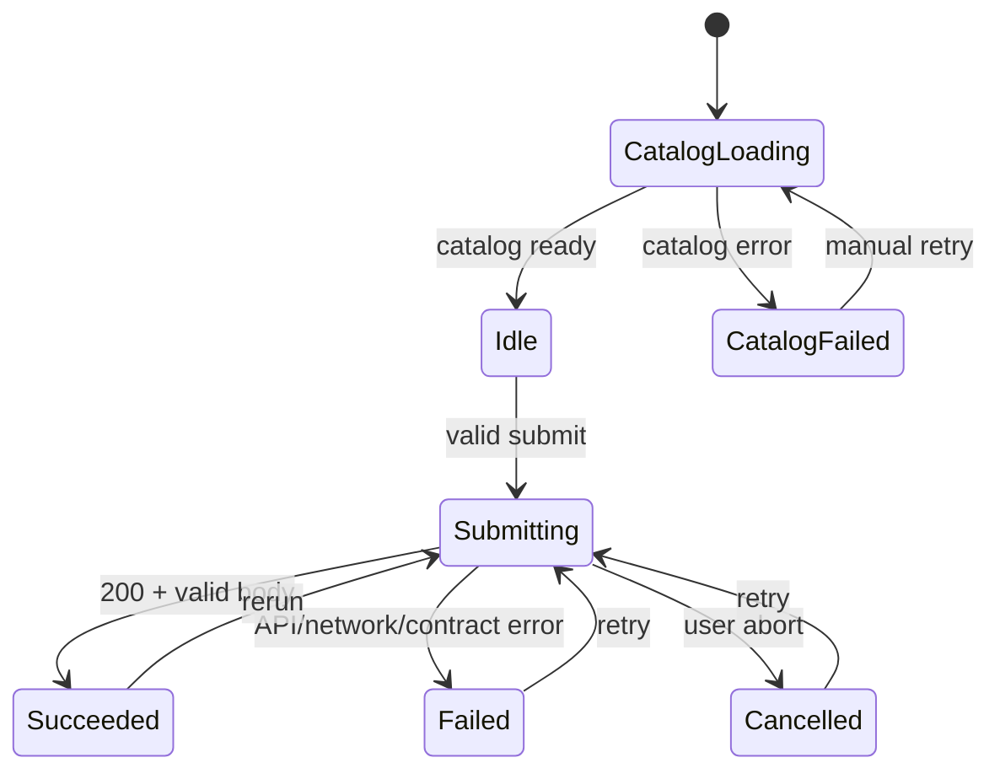

# コンポーネント・状態管理設計

## 1. 方針

- ページ全体の戦闘draftと実行状態は `BattleSimulatorPage` が所有する。
- 状態は関心ごとに3つのsliceへ分割し、それぞれ独立したreducer/hookが持つ（§4）。単一の巨大reducerへ統合しない。
  - Catalog load state: `useCatalogLoader`（`features/catalog-selection/catalog-loader.ts`）
  - 編成draftと選択dialog: `formationReducer`（`features/formation/formation-reducer.ts`）
  - 実行状態: `executionReducer` を内包する `useSimulationExecution`（`features/simulation/execution-reducer.ts`／`use-simulation-execution.ts`）
- ダイアログの検索文字列など一時的UI状態はダイアログ自身が所有する。詳細タブの選択状態も `BattleDetailsSection` のlocal stateとする。
- APIレスポンスは1箇所に保持し、サマリ・詳細表示モデルはselectorで導出する。
- 初期版で外部global state libraryを導入しない。`useReducer`とpure selectorで十分な構造にする。3sliceはいずれも `useReducer` + pure reducerで持ち、`useState` に reducer を手で適用する形や、レンダー中のrefへの書き込みは使わない（並行レンダリング下で書き込みが破棄され得るため）。
- URLとserverへ編成状態を保存しない。localStorageへは編成draftと味方の育成データを保存する（`UI-ADR-012`、[01_UI要求・画面設計.md](./01_UI要求・画面設計.md) §5.9）。永続化でreducerを不純にしない（§4「永続化」）。

## 2. コンポーネントツリー

```text
BattleSimulatorApp（API接続設定の検証。不正時はエラー表示のみ）
└── BattleSimulatorPage（モード選択・Catalog取得・味方の共有育成データだけを持つ）
    └── AppShell（topbar・main・footer。footerにUI build revisionを表示）
        ├── ModeTabs
        ├── NormalBattleMode（`active={mode==="battle"}`。非活性時はnullを返すだけで
        │   │                 アンマウントしない — 実行状態はlocalStorageへ永続化されない
        │   │                 ため、タブ切替でアンマウントすると再訪時に消える。`UI-CT-032`）
        │   ├── Panel（step 01: 戦闘パラメータ）
        │   │   ├── Catalog loading／failed表示（failed時は再読込button）
        │   │   ├── BattleSetupLayout（味方・VS区切り・敵の3列layout）
        │   │   │   ├── FormationEditor (side=ally)
        │   │   │   │   ├── UnitSlot × 6（FRONT 3・REAR 3。hover／focusでUnitStatPreview）
        │   │   │   │   └── MemorySlot × 6
        │   │   │   └── FormationEditor (side=enemy)
        │   │   ├── ExecutionParameterForm
        │   │   ├── ValidationSummary
        │   │   ├── SubmitControls
        │   │   └── FormationResetControls
        │   ├── SubmissionFeedback
        │   ├── Panel（step 02: 戦闘サマリ）
        │   │   └── BattleSummarySection
        │   │       ├── OutcomeStrip
        │   │       └── UnitSummaryTable × 2
        │   ├── Panel（step 03: 戦闘詳細データ）
        │   │   └── BattleDetailsSection（詳細タブの構成は本節末尾を参照）
        │   ├── UnitSelectionDialog
        │   └── MemorySelectionDialog
        └── TacticalExerciseMode（`active={mode==="exercise"}`。同上の理由でnull返しに留める）
            ├── Panel（step 01: 演習パラメータ）
            │   ├── Catalog loading／failed表示
            │   ├── BattleSetupLayout（ally=FormationEditor・enemy=ExerciseEnemyFormation）
            │   ├── ExecutionParameterForm（実行モード切替つき）
            │   ├── ValidationSummary
            │   ├── SubmitControls
            │   └── FormationResetControls
            ├── StatisticsRunFeedback（統計実行中）／SubmissionFeedback（単一実行）
            ├── Panel（step 02: 演習サマリ or 演習統計サマリ）
            ├── Panel（step 03: 演習詳細データ or キャラ別統計）
            ├── UnitSelectionDialog
            └── MemorySelectionDialog

BattleDetailsSection
├── Tabs（時系列イベント・状態遷移・レスポンスJSON・ユニット状態・因果ツリー・効果トレース・スキル時系列）
├── EventTimeline
├── StateTransitionTable
├── RawJsonView
├── UnitActionStateSection
├── EventCausalityTree
├── EffectTraceSection
└── SkillTimelineSection
```

- 汎用UI部品は `components/` の `AppShell`・`Panel`・`Button`・`Dialog`・`Tabs`・`DefinitionImage` とする。選択dialogは `Dialog` を、slot・dialogの画像表示は `DefinitionImage` を使う。
- error boundary専用componentは置かない。API接続設定の検証失敗は `BattleSimulatorApp` がエラー表示へ切り替える。
- Dialogは活性モードのコンテナ直下に置き、見た目の起点slotはstateで参照する。slot内へdialogをネストしない。選択dialogの開閉状態（`SelectionDialogState`）自体はモードに紐づかないため`BattleSimulatorPage`のlocal stateが持ち、各コンテナへ`selectionDialog`／`onRequestSelectionDialog`／`onCloseSelectionDialog`として配る（REF-059 / Issue #604、後述「編成draftと選択dialog」節）。

## 3. 主要コンポーネント責務

### `BattleSimulatorPage`

REF-059（Issue #604）: モード選択・Catalog取得・味方の共有育成データ（学園レベル・
レベルリンク・ユニット強化。前々節「手持ちデータ」）だけを持つ。編成draft・実行状態・
検証・結果パネルはモード別コンテナ（`NormalBattleMode`／`TacticalExerciseMode`、
いずれも`app/`直下）が持つ。

- 一覧APIの取得・再読込とCatalog load state管理
- モード選択（`mode`）とダイアログ選択状態（`selectionDialog`、モードに紐づかない
  local state）
- 手持ちデータの永続化（`usePlayerEnhancementPersistence`）
- 両コンテナへ`catalog`・`playerEnhancement`・`selectionDialog`とそのcallbackを渡す
  だけで、編成draftそのものやreducerには触れない

各モードコンテナが持つもの（`NormalBattleMode`／`TacticalExerciseMode`共通）:

- 自身のreducer初期化（`formationReducer`、保存キーはモードごとに異なる）
- 実行state（`useSimulationExecution`）。演習は統計実行state（`useExerciseStatisticsRun`）も持つ
- derived validation、request、summaryのmemoization（`use-battle-simulator-view-model.ts` の `useBattleSimulatorViewModel`）
- 選択dialogを開く際の`canOpenUnitEnhancementDialog`guard（自身の`effectiveDraft`を使う）
- submit/cancel orchestration

選択dialogの分岐（どのdialogをどのslot起点で開くか）は `app/SelectionDialogs.tsx` が持ち、
活性モードのコンテナが `catalog.status === "ready"` のguardと state/dispatch の
受け渡しだけを行う。両コンテナは常時マウントしたまま、非活性時は`active=false`で
nullを返すだけにする——実行状態・統計実行はlocalStorageへ永続化されないため、
タブ切替でアンマウントすると再訪時に消えてしまう（`UI-CT-032`）。編成draft自体は
localStorageから再構築できるためアンマウントしても失われないが、統一的な扱いとして
同じ非マウント方針を採る。

### `FormationEditor`

Props：

```ts
interface FormationEditorProps {
  readonly side: Side;
  readonly slots: readonly FormationSlotInput[];
  readonly memoryDefinitionIds: readonly (string | undefined)[];
  readonly catalog: BattleSimulationCatalogResponse;
  readonly violations: readonly UiViolation[];
  readonly disabled: boolean;
  readonly imageMap?: Readonly<Record<string, string>>;
  readonly onOpenUnitSelection: (slotKey: string) => void;
  readonly onOpenMemorySelection: (side: Side, index: number) => void;
  readonly onMoveUnit: (fromSlotKey: string, toSlotKey: string) => void;
}
```

入力を直接変更せず、選択dialogを開く・ユニットを移動するintentだけ通知する。

ユニット移動の進行状態（移動元slotKey）はFormationEditorのlocal stateで持ち、ドラッグとキーボード移動モードで共用する。stateが陣営別のeditorインスタンスに閉じているため、反対陣営のslotはdrop先にならない（`dragover`で`preventDefault`しない）— 同一陣営制約はこの構造で担保し、reducerのside検査を第2層とする。移動モード中は各slotの起動操作を「このslotへ配置」へ差し替え、移動元slot自身の起動は中止として扱う。進行状態は視覚非表示の`aria-live="polite"`領域へ通知し、`disabled`がtrueへ変わったら移動モードを解除する。Escapeによる中止は移動モード中だけdocumentレベルのkeydownで捕捉し、フォーカス位置（強化button・メモリー枠・学園レベル入力など）に依存させない。

### `UnitSlot`

- 空/選択済み/警告/エラー/disabledを表示する。
- button要素を使用する。
- 選択済みでも表示名をaccessible nameへ含める。
- 適性外配置はwarning badgeを表示する。

- 選択済み枠はhover／focusで開始時ステータス（`UnitStatPreview`）を表示する。表示のON/OFFだけをlocal stateで持ち、値は算出せずpropsで受け取る。
- ステータス表示はslot buttonへ `aria-describedby` で関連づける。hoverだけの表示にせず、focusでも同じ内容を出す。
- 選択済み・非disabledのslot buttonへHTML5 `draggable`を付与する（空き枠はdrop先のみ）。drag開始でステータスプレビューを消灯し、drop受け入れは親から渡される移動先可否（`moveTarget`）にもとづき`dragover`の`preventDefault`で表現する。drag-overハイライトはenter/leaveの深度カウンタで判定する（子要素での対発火があるため）。
- キーボード代替の「移動」ボタンを強化ボタンと同型で置く（選択済み枠のみ・`disabled`で無効・`aria-pressed`で移動モード中を示す）。移動元・移動先の視覚状態はCSS classで表す。空↔選択済みでwrapper階層を変えない制約（focus復帰）は維持する。

### `UnitStatPreview`

- 1枠分の開始時ステータス（最大HP・攻撃力・防御力・行動速度・会心率・会心ダメージ・有利属性ボーナス）を表示するpresentational component。
- 取得中・取得失敗・未取得の3状態を文言で表す。取得失敗をerror扱いのalertにしない（実行は妨げられていないため）。
- 数値整形だけを行い、強化・編成ボーナス・適性の計算を持たない。

### `UnitSelectionDialog`

- 開くたびに現在slotと選択値を受け取る。
- 候補は`SelectionDialogs`が`selectUnitPool(units, mode, side)`（`catalog-selection/unit-pool.ts`）で編成プールへ絞ってから渡す。dialog自身はモードも陣営も知らない。
- 演習専用ユニットには`開催中`／`開催終了`のチップをtagsへ足す（`R-TEX-11` #4）。選択可否は変えない。
- 検索、属性、ロール、適性、利用可否のfilterを持つ。
- filter結果はCatalog順または表示名順で安定表示する。
- 選択不可定義にはbuttonを出さないかdisabledにし、理由を同じitem内に表示する。
- 選択/解除後に閉じ、元のslotへfocusを戻す。

### `MemorySelectionDialog`

Unit版と同じ基本挙動とし、属性・ロールfilterは持たない。将来タグfilterを追加できる領域を残す。

### `SelectionDialogList`

Unit/Memory両dialogが共有するリスト部品。定義項目の描画・「この枠を空にする」操作・選択buttonのaccessible name生成を担う。「Unit版と同じ基本挙動」を1箇所で保証するため、選択可否の判定（unit側の5体上限など枠固有の事情を含む）は呼び出し側が `disabled` として組み立てて渡す。

### `SubmitControls`

- 実行開始
- 実行中のキャンセル要求
- submit可否の理由表示は `ValidationSummary` が担い、API endpointの読み取り専用表示は `ExecutionParameterForm` が担う

### `FormationResetControls`

- 「編成をクリア」「保存した育成データをクリア」の2操作だけを持つpresentational component（[01_UI要求・画面設計.md](./01_UI要求・画面設計.md) §5.9）。
- storageへ直接触れず、押下intentだけを通知する。「編成をクリア」は`dispatch({ type: "draftReset" })`、「保存した育成データをクリア」は`playerEnhancementDispatch({ type: "cleared" })`（`app/BattleSimulatorPage.tsx`）。
- 実行中（`formationDisabled`）は無効化する。

### `BattleSummarySection`

- API DTOを直接集計しない。集計はサーバーの`unitSummaries`が正本である（[03_API・データ連携設計.md](./03_API・データ連携設計.md) §11）。
- `selectBattleSummary(response, catalog)`の結果だけ受け取る。
- 味方・敵の列構造を同じにする。
- summary projection warningがある場合、表の上に「一部ユニットの集計を取得できませんでした」を表示する。

### `EventTimeline`

- event listをsequence昇順表示する。
- 初期表示は簡潔な1行。展開時にdetailsを表示する。
- 100件を超える場合は初期50件、追加読込方式またはvirtualizationを使う。表示件数を黙って切り捨てない。
- filter導入は将来拡張とし、初期版は全件表示でよい。

### `RawJsonView`

- `JSON.stringify(response, null, 2)`の結果を表示する。
- Clipboard APIが使える場合にコピーbuttonを表示する。
- コピー失敗を戦闘失敗として扱わない。

### `EnhancementPanel`（M11で追加予定）

- 陣営フッターのメモリー枠の並びに、強化トグルと学園レベル9入力（ユニットタイプ3・属性6）を表示する。
- `ExecutionParameterForm`と同じ入力・違反表示パターンとし、field単位のserver violationを該当入力へ表示する。
- トグルOFF時は学園レベル入力を無効化する。入力値は破棄せず保持する。
- 同じパネルへレベルリンクのトグルとリンクレベル入力を置く（`01_UI要求・画面設計.md` §5.6）。強化トグルOFF時は学園レベルと同じく無効化し、入力値は保持する。
- リンクのON／OFFは各枠の`level`を書き換えない。リンクの反映は参照時解決であり（[03_API・データ連携設計.md](./03_API・データ連携設計.md) §3.1）、書き換えると値の置き場が二重化する。

### `UnitEnhancementDialog`（M11で追加予定）

- 選択済みユニット枠から開き、レベル入力・ランク選択（`LR`〜`LR+5`の6択、既定`LR+5`）とギア9枠（各枠はstat・tier・gradeのselect、空枠可）を編集する。
- `Dialog`を使い、閉じた後は起点slotへfocusを戻す（選択dialogと同じ挙動）。
- 陣営の強化トグルOFF時は編集を無効化し、トグルONを促す文言を表示する。
- 陣営のレベルリンクON中はレベル入力を読み取り専用（`readOnly`）にし、適用中のリンクレベルを表示する。`disabled`にしない — focusできなくなると、サーバー違反の文言をその入力へ結びつけても読み上げから外れる（`UI-AC-039`）。
- 「リンクから外す」／「リンクへ戻す」を切り替えられる。外した瞬間のシード（その時点のリンクレベルを枠の`level`へ書く）は`formationReducer`の純粋な遷移とし、componentはactionをdispatchするだけとする。

## 4. State model

状態は3つのsliceへ分割し、`BattleSimulatorPage` が各hookを合成する。単一の `BattleSimulatorState` は持たない。

REF-060（Issue #605）: 4つの非同期取得hook（`catalog-loader.ts`・`use-formation-stat-preview.ts`・
`use-simulation-execution.ts`・`use-exercise-statistics-run.ts`）はいずれも「前回リクエストをabort
→ トークン発番 → 遅延応答の握り潰し」を独自に書いていた。この部分だけを
`shared/async/abortable-request.ts`の`useAbortableRequest<TId>`（`start(id)`/`isCurrent(id)`/
`current()`/`abort()`）へ集約し、id自体に意味を持たない2hook（Catalog・ステータスプレビュー）は
数値トークンを自動発番する`useTokenedRequest`を薄く重ねて使う。id自体を state（`executionId`・
`runId`）として持つ2hook（実行・統計実行）は`useAbortableRequest<string>`を直接使う。ページ離脱時の
abort（`window.beforeunload`）だけを行う`shared/async/abort-on-unload.ts`の`useAbortOnUnload`も
実行・統計実行の2hookが共有する（Catalog・ステータスプレビューはページ離脱時に継続すべき副作用を
持たないため使わない）。4hookそれぞれの状態機械・reducerとETag（Catalog）・チャンク分割
（統計実行）は共通化せず、hookごとに残す——状態の形が本質的に異なる（`idle`の有無、進捗フィールド、
`previousSuccess`snapshotなど）ため、無理に1つのreducerへ畳むと型安全性より複雑さが勝る。

### Catalog load state（`catalog-loader.ts`）

```ts
type CatalogLoadState =
  | { readonly status: "loading" }
  | {
      readonly status: "ready";
      readonly response: BattleSimulationCatalogResponse;
      readonly etag?: string;
      readonly requestId?: string;
    }
  | { readonly status: "failed"; readonly error: UiApiError; readonly requestId?: string };
```

`useCatalogLoader(baseUrl)` が `{ state, reload }` を返す。mount時とreload時に取得する。条件付き取得のetagは `reload()` が直前のready snapshotを引数で渡す（直前がfailedならetagを送らず、304で失敗前の応答を復元しない）。

### 編成draftと選択dialog（`formation-reducer.ts`）

REF-058（Issue #603）: 味方の学園レベル・レベルリンク・ユニット強化はモードに依らない
「手持ちデータ」であり、このsliceには含まれない（後述「手持ちデータ」節の単一sliceが持つ）。
ここが持つのはモード別の編成枠・実行パラメータだけである。ダイアログ選択状態も
モードに紐づかないため、`BattleSimulatorPage`のlocal state（`useState`）へ持ち、
このsliceには含まれない。

```ts
interface FormationState {
  readonly draft: BattleDraft;
}

type SelectionDialogState =
  | { readonly kind: "closed" }
  | { readonly kind: "unit"; readonly slotKey: string }
  | { readonly kind: "memory"; readonly side: Side; readonly index: number }
  | { readonly kind: "unitEnhancement"; readonly slotKey: string };
```

`BattleDraft`は陣営・ユニットの強化入力（[03_API・データ連携設計.md](./03_API・データ連携設計.md) §3.1）を持つ。レベルリンクは`SideEnhancementInput.levelLink`と`UnitEnhancementInput.linkExcluded`として同じ強化入力の中に入る。味方側は`allyEnhancement.enabled`（陣営の強化トグル、モード別・`UI-AC-030`の対象外）だけが実値を持ち、`academyLevels`・`levelLink`と各枠の`enhancement`は常に既定値のまま据え置く——実際の値は`BattleSimulatorPage`が`withPlayerEnhancement(draft, playerEnhancement)`（`effective-draft.ts`）で手持ちデータのsliceから重ね合わせ、request-mapper・draft-validation・stat previewなど既存の読み手はその合成結果だけを受け取る。敵側は都度入力の方針のため`enemyEnhancement`と各枠の`enhancement`はこのsliceがそのまま持つ。

Issue #539 で`BattleDraft`へ演習の実行指定 `exerciseExecution: { mode, runCount, seed }`（`UI-AC-041`）を追加する。draft型は両モードで共有しているため通常戦闘のdraftにも載るが、通常戦闘のリクエスト生成も送信可否も参照しない。モード別のdraft型へ分けないのは、両モードのsliceが同じ`formationReducer`・同じ保存デコーダを通っており、型を割ると編成・永続化の経路すべてが二重化するためである。実行モードの切替は`runCount`・`seed`を保持する — 往復しただけで入力が消えると、単一実行でログを確かめてから統計実行へ戻す使い方が壊れる。

`ExecutionParameterForm`は`exerciseExecution` propsの有無でログレベル選択と実行モード切替を出し分ける（`fixedTurnLimit`と同じ「渡した側がモードを決める」分岐）。

### 手持ちデータ（`player-enhancement-reducer.ts`）

REF-058（Issue #603）。味方の学園レベル・レベルリンク・ユニット定義ID単位の強化
（レベル・ギア・`linkExcluded`）はモードに依らない単一sliceとして持つ。以前は
モード別draftへ複製し、編集のたびに`BattleSimulatorPage`が`dispatchAllyWideOrCurrent`
／`changeAcademyLevel`で両モードへfan-outしていたが、この単一slice化でfan-out
そのものが不要になった（両モードが同じsliceを直接読むため）。陣営の強化トグル
（`enabled`）は`UI-AC-030`の対象外でありモード別draftに残る（下記「編成draftと
選択dialog」節）。

```ts
type PlayerEnhancementState = StoredPlayerData; // 永続化節参照。生きたstateと保存形式は同じ形

type PlayerEnhancementAction =
  | {
      type: "academyLevelChanged";
      group: "unitTypes" | "attributes";
      key: string;
      value: number | "";
    }
  | { type: "levelLinkToggled"; enabled: boolean }
  | { type: "levelLinkLevelChanged"; value: number | "" }
  | { type: "unitEnhancementLevelChanged"; unitDefinitionId: string; value: number | "" }
  | {
      type: "unitEnhancementGearChanged";
      unitDefinitionId: string;
      gearIndex: number;
      gear?: GearInput;
    }
  | {
      type: "unitLinkExclusionChanged";
      unitDefinitionId: string;
      excluded: boolean;
      // UI-AC-036: 外した瞬間のシード。呼び出し側（`app/SelectionDialogs.tsx`）が
      // `isSlotLevelLinked`で判定し、その時点のリンクレベルを載せる。
      seedLevel?: number | "";
    }
  | { type: "cleared" } // 「保存した育成データをクリア」。旧`allyEnhancementCleared`に相当
  | { type: "pruned"; knownUnitDefinitionIds: readonly string[] };
```

ユニット単位の強化は`unitDefinitionId`で直接引く（`slotKey`を経由しない）。旧設計では
モード別draftの各枠が強化入力を独自に持ち、同じユニットを複数枠へ置くと「どの枠の
編集を手持ちデータへ書き戻すか」を`FormationState.lastEditedSlotKey`（直近に強化入力を
編集した枠）で一意に決める必要があった（`UI-CT-049`）。単一sliceをユニット定義ID単位の
`Record`として持つ以上、同じユニットを指す全ての枠は常に同じ記録を指すため、この
曖昧さ自体が構造的に発生しない——`lastEditedSlotKey`は廃止した。

モード別draftのally枠へこの記録を重ね合わせるのは`effective-draft.ts`の
`withPlayerEnhancement`が行う（前節）。ally枠への配置（`unitSelected`）はプリフィル
payloadを持たない——どの枠へ置いても同じ記録を参照時に指すため、配置時点でコピーする
必要が無い（旧`unitSelected.enhancement`は廃止）。

### 実行状態（`execution-reducer.ts`／`use-simulation-execution.ts`）

```ts
type ExecutionState =
  | { readonly status: "idle" }
  | {
      readonly status: "submitting";
      readonly executionId: string;
      readonly request: BattleSimulationRequest;
      readonly startedAt: number;
      readonly allyUnitSlotKeys: readonly string[];
      readonly enemyUnitSlotKeys: readonly string[];
      readonly allyMemorySlotKeys: readonly string[];
      readonly enemyMemorySlotKeys: readonly string[];
      readonly previousSuccess?: SuccessfulExecutionSnapshot;
    }
  | {
      readonly status: "succeeded";
      readonly executionId: string;
      readonly request: BattleSimulationRequest;
      readonly response: BattleSimulationResponse;
      readonly requestId?: string;
      readonly completedAt: number;
    }
  | {
      readonly status: "failed";
      readonly executionId: string;
      readonly error: UiApiError;
      readonly requestId?: string;
      readonly allyUnitSlotKeys: readonly string[];
      readonly enemyUnitSlotKeys: readonly string[];
      readonly allyMemorySlotKeys: readonly string[];
      readonly enemyMemorySlotKeys: readonly string[];
      readonly previousSuccess?: SuccessfulExecutionSnapshot;
    }
  | {
      readonly status: "cancelled";
      readonly executionId: string;
      readonly previousSuccess?: SuccessfulExecutionSnapshot;
    };
```

- `executionReducer` はpure functionとし、AbortController・timeout・page unloadの副作用は `useSimulationExecution` が持つ。
- `previousSuccess`は再実行中・失敗・キャンセル後も前回結果を表示するための最小snapshotである。無制限な履歴配列をstateへ保持しない。
- `*SlotKeys` は送信時点のslot対応表である。422 violationsのJSON Pointerを、送信後に編集され得る現在のdraftではなく送信時のslotへ対応づけるため、`submitting`から`failed`へ引き継ぐ（UI-API-004）。
- 詳細タブの選択状態は `BattleDetailsSection` のlocal state（5タブ: `events`／`transitions`／`json`／`actionState`／`causalityTree`）とし、page reducerへ持ち上げない。
- 5タブは`DETAILED`実行のときだけ表示する。`SUMMARY`実行のレスポンスはイベント・状態遷移・`finalState`を持たないため、タブを出すと5つとも「空だが正常」に見え、実行が失敗したのか設定の問題なのか画面から区別できない。代わりに詳細ログモードで実行し直せることを案内する（Issue #464）。

### 統計実行状態（`use-exercise-statistics-run.ts`）

Issue #541。統計実行は1回のPOSTでは終わらない（チャンク分割・進捗・部分結果）ため、単一実行の`ExecutionState`とは別のsliceを持つ。両者は同時に走らない — 実行モードがどちらか一方を選ぶ。

```ts
type ExerciseStatisticsRunState =
  | { readonly status: "idle" }
  | {
      readonly status: "running";
      readonly runId: string;
      readonly seed: string;
      readonly progress: StatisticsRunProgress;
    }
  | { readonly status: "succeeded" /* …progress, aggregate */ }
  | { readonly status: "cancelled" /* …progress, aggregate */ }
  | { readonly status: "failed" /* …progress, error: ExerciseStatisticsRunError */ };
```

- チャンクの計画（`<seed>#<runOffset>`）と応答の集約は純粋関数（`evaluation-chunk-plan.ts`）に置き、hookは送信順序・中断・stateの遷移だけを持つ。分割規約の正本は`tools/exercise-lab`の`runner.py`である（[03_API・データ連携設計.md](./03_API・データ連携設計.md) §2.6）。
- `cancelled`は失敗ではなく「完了済みチャンクまでで確定した結果」であり、`succeeded`と同じ集約を持つ。表示側は`selectStatisticsAggregate`で両者を同じ形で読む。
- `failed`の理由は`UiApiError`をそのまま出さず、統計実行だけが持つ止まり方（設定で閉じている・チャンク間のCatalog切替・1試行も完了しない・リクエストを組み立てられない）を判別できる型にする。文言は`describeStatisticsRunError`が持つ。
- `runId`が一致しないactionは捨てる（`execution-reducer.ts`と同じ規約）。中断・再実行の直後に前の実行の応答が届いても最新のstateを上書きしない。
- 実行中のロック（編成の無効化・実行ボタンの「実行中…」）と422の枠表示は演習の統計実行の中に閉じる。ロックを通常戦闘まで広げると止める手段が無いまま実行の終わりを待たせることになり、枠表示は`slotKey`が`side:row:column`でモード間共通なため、絞らないと他モードの同じ座標の枠が説明の無いまま赤くなる。
- `submission`（送信時のslot対応表と編成の署名）を全statusで持ち回る。422 violationsを送信時の枠へ対応づけ（`UI-API-004`）、完了後に編成が変わったことを結果表示へ伝えるために要る。編成部分は全チャンクで同一なので実行ごとに1つでよい。
- 集約結果（`ExerciseStatisticsSample`）は`features/exercise-stats`の純粋関数がそのまま受け取る形にする。統計量はサーバーが返さない（`Q-TEX-16`）ため、集計はここから先のブラウザ側にしかない。

### 統計可視化パネル（`features/exercise-stats`）

Issue #542。統計実行の結果は、演習サマリ（Panel 02）を`ExerciseStatisticsSummary`へ、演習詳細（Panel 03）を`UnitStatisticsSection`へ差し替える（`UI-AC-043`）。差し替えの判定は`app`が持ち、パネル自身はモードを知らない。

- パネルへ渡すのは確定した集約（`EvaluationAggregate`）と、統計へ投影した結果（`statistics-report.ts`）だけである。実行state（進捗・失敗）は`StatisticsRunFeedback`が引き続き持ち、パネルは「結果があるときだけ」描かれる。
- **ベストスコア上位Nは`UnitStatisticsSection`のlocal state**とし、page reducerへ持ち上げない（詳細タブの選択状態と同じ扱い）。Nは表示の粒度であって編成でも実行条件でもなく、切り替えても送信内容は変わらない。再集計は手元の生値に対する純粋関数（`buildUnitStatisticsReport`）で行い、評価APIを呼び直さない。
- ユニット列の名前は**送信時の編成**（`StatisticsRunSubmission.allyUnitDefinitionIds`）から引く。実行後もdraftは編集できるため、現在の編成から引くと別のユニット名が列へ付く。422のslot対応表（`UI-API-004`）を送信時に控えているのと同じ理由である。
- チャートはCSS ModulesとSVG属性だけで描き、外部の作図ライブラリも inline style も使わない（`index.html`のCSPが`style-src 'self'`）。位置・大きさはSVG属性、色と線種はCSS Modulesが持つ。

### ステータスプレビュー状態（`use-formation-stat-preview.ts`）

```ts
type FormationStatPreviewState =
  | { readonly status: "unavailable" } // 送信できる編成が組み立たっていない
  | { readonly status: "loading" }
  | { readonly status: "failed" }
  | {
      readonly status: "ready";
      readonly bySlotKey: ReadonlyMap<string, UnitStatPreview>;
    };
```

- 実行状態（`execution-reducer.ts`）とは独立したsliceとする。プレビューの失敗が実行状態を汚さないことを型で保証するためであり、`ExecutionState`へ相乗りさせない。
- draftから組み立てたリクエストのJSON表現が変わったときだけ再取得する。同じ編成で再renderしても再送しない。
- 応答の各`units[]`は`side`と`formationPosition`でリクエストの枠へ突き合わせる（`battleUnitId`は戦闘を実行していないため存在しない）。契約上の並び順（味方→敵、各陣営内はリクエスト順）だけを信じてindexで対応づけると、同数のまま順序が入れ替わった応答で他の枠のステータスをその枠へ表示してしまう。件数・位置・`unitDefinitionId`のいずれかが食い違えば、部分的に対応づけずプレビュー全体を失敗扱いにする。
- 前回のリクエストが実行中なら、新しい編成での取得を始める前にabortする。送信できる編成が無くなって`unavailable`へ戻る場合も同じ扱いとし、中断と競合して完了した古い結果が現在のstateを上書きしないようにする（abortは既に解決済みの応答を取り消せない）。

### 永続化（`lib/storage.ts`／`features/formation/persistence.ts`／`use-formation-persistence.ts`／`use-player-enhancement-persistence.ts`）

localStorageの3キー（`mlgg:player-data`／`mlgg:last-draft`／`mlgg:last-draft:exercise`。[01_UI要求・画面設計.md](./01_UI要求・画面設計.md) §5.9）を扱う。draftの保存・復元・孤児クリアは `usePersistedDraft`（保存キーとdraftの対ごとに1つ）、手持ちデータは `usePlayerEnhancementPersistence` が持つ。**分担はREF-058（Issue #603）で見直した**——育成データ（学園レベル・レベルリンク・ユニット強化）は`mlgg:player-data`だけが持ち、モード別draftキー（`mlgg:last-draft`／`mlgg:last-draft:exercise`）へは重複して書かない。以前は`formationReducer`のモード別draftが育成データも保持しており、両モードのsliceへ複製・fan-outしていたが（旧`useFormationPersistence`の`mergePlayerDataFromDraft`・`prefillEnhancementFor`）、`player-enhancement-reducer.ts`が単一の実体になったことで、モード別draft側は書き込む理由が無くなった。

```ts
interface StoredPlayerData {
  readonly academyLevels: SideEnhancementInput["academyLevels"];
  readonly levelLink: LevelLinkInput;
  readonly units: Readonly<Record<string, UnitEnhancementInput>>;
}
```

**任意なのは保存JSON側だけ**とし、読み出した後の型（`StoredPlayerData`・`BattleDraft`）では新項目を必須にする。デコーダが欠落を既定値（リンクOFF・リンクレベル200・除外なし）で埋めるため、呼び出し側は「あるかもしれない項目」を持ち回らない。この欠落許容は手持ちデータとdraftキーの**両方**へ効かせる必要がある。draftキーにも陣営の`SideEnhancementInput`と枠ごとの`UnitEnhancementInput`がそのまま入っており（味方側は常に既定値のまま——前節参照）、読み手（narrowing）は両者で共有されるためである。

- 保存形式は送信DTOではなくdraft型・`StoredPlayerData`型を写したものとする。送信DTOは空枠を圧縮するため、どの枠にどのユニットが居たかを復元できない。
- 全キーとも `schemaVersion` を持ち、値が現行と異なる保存データは破棄して初期状態から開始する。draftキーは保存時の `catalogRevision` も記録する（不一致でも破棄せず、後述の孤児クリアで吸収する）。
- モード別draftは**キーを分ける**。1つのキーへ両モードのdraftを入れると、後から保存した側でもう片方の編成が消え、既存の `mlgg:last-draft`（単一draft形式）との互換も切れる。復元は `useReducer` のlazy initializerへ保存キーを渡して行う。
- 読み出しは `unknown` として受け取り、`lib/unknown-narrowing.ts` のナローイングでshapeを検証する。1項目でも契約から外れれば、その保存データ全体を破棄する（部分的に信じない）。固定長の配列（ユニット枠6・メモリー枠6・ギア枠9）は**長さも契約**として扱い、短い配列を空枠で補って受理しない（枠位置がずれた保存データを黙って受け入れることになるため）。
- storageアクセスは `lib/storage.ts` の `readJsonItem`／`writeJsonItem`／`removeJsonItem` に閉じる。localStorageが存在しない・アクセスがthrowする・容量超過（`QuotaExceededError`）はすべて握り潰し、保存以外の機能を継続する。保存失敗をUiViolationやerror表示へ昇格させない。
- 両reducer（`formationReducer`・`playerEnhancementReducer`）は純粋なまま保つ。復元は `useReducer` のlazy initializerで行い、storageへの書き込みは `useEffect` に閉じる。
- モード別draftの保存effectの依存はdraftオブジェクトの参照とする。draftの参照は`formationReducer`が値を変えたときだけ変わり、値が変われば必ず保存し直すのが正しい。送信内容の同値性で再取得を抑える `use-formation-stat-preview.ts` とは目的が異なるため、直列化した鍵を挟まない。
- 手持ちデータの生きたstate（`PlayerEnhancementState`）は入力欄の表示のため未入力（`""`）をそのまま持てるが、保存データはそれを表現できない。書き込む値は直前に保存した値（`persistedRef`）との純関数 `mergeForPersistence(previous, next)` を通す——未入力（`""`）のレベル・学園レベル・リンクレベルは書き込まず前回値を保つ（保存データ側は未入力を表現できない型で読まれる。`tools/exercise-lab` の `StoredLevelLink.level` は `int`）。画面には常に生のstateを見せ、保存だけが未入力を前回値へフォールバックさせる。導出結果が前回と等しい場合は同一参照を返し、再書き込みを起こさない。
- 手持ちデータはユニット定義ID単位の`Record`として持つため、同じ定義を複数枠へ配置しても（§5規則）常に同じ記録を参照する。旧設計の`lastEditedSlotKey`（直近に強化入力を編集した枠を書き戻し対象に限定する仕組み、`UI-CT-049`）はこの単一化で不要になり廃止した。
- 敵陣営はこのsliceに含まれず、モード別draftが持つ（プリフィルも書き戻しも行わない）。
- レベルリンクの新項目（`levelLink`・`linkExcluded`）は**3キーすべてで任意項目**として読み、欠けていても保存データを破棄しない。`PERSISTENCE_SCHEMA_VERSION`は1のまま据え置く — 版を上げると`schemaVersion`の完全一致判定で全利用者の手持ちデータ（ユニット別レベル・ギア・学園レベル）が破棄されるためである。
- ユニット単位の`rank`も同じ理由で**3キーすべてで任意項目**として読み、`PERSISTENCE_SCHEMA_VERSION`を上げない。欠けている保存データは既定値5（`LR+5`）で埋める。
- 必須として読んではならないのはdraftキーも同じである。M11の強化入力は既にdraftへ保存されており、手元にあるdraftは新項目を持たない。必須として読むと上の「1項目でも契約から外れれば全体を破棄する」規則に掛かり、両モードの編成draftが丸ごと消える。手持ちデータとdraftは同じ読み手を共有するため、任意化はその読み手1か所で行う。
- 新項目を知らない**旧UI**は未知キーを読み飛ばすため、新形式を読んでも壊れない。一方`mlgg:player-data`には未知キーを拒否する外部の読み手（`tools/exercise-lab`。`extra="forbid"`、`SUPPORTED_SCHEMA_VERSION = 1`）がいる。版を据え置く以上そちらの版チェックは素通りするため、UIが新項目を書き始める前に読み手側を対応させる（`01_UI要求・画面設計.md` §5.9）。
- 孤児ID（Catalogから消えた定義）のクリアは、**mount後の最初のCatalog readyで1回だけ**行う。以降のCatalog再読込では§5の規則どおりdraftから黙って削除せず、`validateDraft` のerrorとして送信を止める。判定には `validateDraft` の `UNKNOWN_DEFINITION` violationを流用し、その `slotKey` を持つ枠だけを空にする（`usePersistedDraft`）。同じタイミングで手持ちデータの未知ユニットエントリも`{ type: "pruned" }`のdispatchで取り除く（`usePlayerEnhancementPersistence`）。
- 孤児クリアはdraftごとに、そのdraftのviolationだけで判定する。`slotKey` はモード間で同じ文字列になるため、他モードのviolationを混ぜると無関係な枠を空にする。

## 5. Reducer actions

Catalog load stateのaction（`started`／`succeeded`／`failed`）は `catalog-loader.ts` 内部に閉じ、外へは `reload()` だけを公開する。

```ts
type FormationAction =
  | { type: "unitSelected"; slotKey: string; unitDefinitionId: string }
  | { type: "unitRemoved"; slotKey: string }
  | { type: "memorySelected"; side: Side; index: number; memoryDefinitionId: string }
  | { type: "memoryRemoved"; side: Side; index: number }
  | { type: "turnLimitChanged"; value: number | "" }
  | { type: "logLevelChanged"; value: LogLevel }
  | { type: "exerciseExecutionModeChanged"; value: ExerciseExecutionMode }
  | { type: "exerciseRunCountChanged"; value: number | "" }
  | { type: "exerciseSeedChanged"; value: string };
```

（`selectionOpened`／`selectionClosed`は当初ここに含めていたが、REF-058（Issue #603）で
`SelectionDialogState`ごと`app/BattleSimulatorPage.tsx`のlocal state（`useState`）へ
移した——ダイアログ選択状態はモードに紐づかないため、モード別sliceに置く理由が無い。）

```ts
type ExecutionAction =
  | {
      type: "submissionStarted";
      executionId: string;
      request: BattleSimulationRequest;
      startedAt: number;
      allyUnitSlotKeys: readonly string[];
      enemyUnitSlotKeys: readonly string[];
      allyMemorySlotKeys: readonly string[];
      enemyMemorySlotKeys: readonly string[];
    }
  | {
      type: "submissionSucceeded";
      executionId: string;
      response: BattleSimulationResponse;
      requestId?: string;
      completedAt: number;
    }
  | { type: "submissionFailed"; executionId: string; error: UiApiError; requestId?: string }
  | { type: "submissionCancelled"; executionId: string };
```

入力の永続化（Issue #425）で`FormationAction`へ次を追加する。REF-058（Issue #603）で
`unitSelected`のプリフィルpayloadと`allyEnhancementCleared`は`player-enhancement-reducer.ts`
（前々節）へ移り、`draftReset`はpayloadを持たなくなった。

```ts
type PersistenceFormationAction =
  | { type: "unitSelected"; slotKey: string; unitDefinitionId: string }
  // 「編成をクリア」。味方の育成データ（学園レベル・レベルリンク・ユニット強化）は
  // モード非依存の単一sliceが持つため、ここでは触れない
  | { type: "draftReset" }
  // 復元直後にCatalogから消えていた定義の枠を空にする
  | { type: "unknownDefinitionsCleared"; slotKeys: readonly string[] };
```

M11（`ENH-001`）で`FormationAction`へ次を追加する。REF-058で`academyLevelChanged`・
`unitEnhancementLevelChanged`・`unitEnhancementGearChanged`は`side`が`"ally"`のときは
`FormationAction`ではなく`PlayerEnhancementAction`（前々節）へ向ける——`formationReducer`
自体の実装は引き続き両陣営を汎用的に扱えるが、呼び出し側（`BattleSimulatorPage.tsx`）が
ally editorのcallbackを`playerEnhancementDispatch`へ、enemy editorのcallbackを
`dispatch`へと静的に振り分ける。

```ts
type EnhancementFormationAction =
  | { type: "enhancementToggled"; side: Side; enabled: boolean } // enabledはUI-AC-030の対象外、常にformationReducer
  | {
      type: "academyLevelChanged";
      side: Side;
      group: "unitTypes" | "attributes";
      key: string;
      value: number | "";
    }
  | { type: "unitEnhancementLevelChanged"; slotKey: string; value: number | "" }
  | { type: "unitEnhancementGearChanged"; slotKey: string; gearIndex: number; gear?: GearInput };
```

レベルリンクで`FormationAction`へ次を追加する。`levelLinkToggled`・`levelLinkLevelChanged`・
`unitLinkExclusionChanged`も同じ振り分け規則（ally→`PlayerEnhancementAction`、
enemy→`FormationAction`）に従う。

```ts
type LevelLinkFormationAction =
  | { type: "levelLinkToggled"; side: Side; enabled: boolean }
  | { type: "levelLinkLevelChanged"; side: Side; value: number | "" }
  // シード値はreducerが同じdraftの`levelLink.level`から読む（payloadで渡さない）
  | { type: "unitLinkExclusionChanged"; slotKey: string; excluded: boolean };
```

ユニット移動（ドラッグ&ドロップ／キーボード移動モード）で`FormationAction`へ次を追加する。

```ts
type MoveFormationAction = { type: "unitMoved"; fromSlotKey: string; toSlotKey: string };
```

Reducer規則：

- `catalog.status !== "ready"`ではselection dialogとsubmissionを開始しない（`BattleSimulatorPage` がdialog描画とsubmit可否をguardする）。
- Catalog再取得で選択済み定義が消えた場合はdraftから黙って削除せず、`validateDraft` が該当slotをerrorにして送信を禁止する。
- `submissionSucceeded/Failed/Cancelled`のexecutionIdが現在実行と異なる場合は無視する。
- 陣営の選択数が上限（5体）に達している状態での新規unitSelectedは、`formationReducer` がstateを変更せず無視する。あわせて `UnitSelectionDialog` へ `atCapacity` を渡し、選択自体をUI上で不可にして理由を表示する。Reducer内で通知副作用を行わない。
- selection dialogを閉じてもfilter状態はdialog componentのunmountで破棄する。dialog自体を閉じる操作（`app/BattleSimulatorPage.tsx`の`closeSelection`）はモード切替でも呼ぶ——切替先モードで無関係な枠向けのdialogが開いたままになるのを防ぐ。
- draft変更で成功結果を即時破棄しない。結果に「この結果は変更前の条件です」とdirty indicatorを表示する。
- （M11）陣営の強化トグルOFFでは`kind: "unitEnhancement"`のdialogを開かない。判定は純関数`canOpenUnitEnhancementDialog(draft, slotKey)`（`types.ts`）が持ち、`app/BattleSimulatorPage.tsx`の`openSelection`が呼ぶ。`UnitSlot`側でも起動操作を無効化する（第一の防御）。トグルOFFへ戻しても強化入力値はdraftへ保持し、送信対象からだけ外す。
- `unitMoved`は同一陣営内の2slot間で`unitDefinitionId`と`enhancement`を交換する（移動先が空なら移動）。不明なslotKey・同一slot・空の移動元・陣営を跨ぐ指定はstateを変更せず無視する。同一陣営内の移動は選択数を変えないため容量チェックは行わない。ally枠の`enhancement`はモード別draftへ実値を持たないため常に`undefined`のまま——移動しても手持ちデータ（ユニット定義ID単位）は影響を受けない。enemy枠は`enhancement`を移動先へそのまま運ぶ。
- `draftReset`はモード別draftを初期状態へ戻す（実行状態と直近結果は消さない）。味方の学園レベル・レベルリンク・ユニット強化は別sliceが持つため触れない——「編成をクリア」しても育成データは保持される。
- `levelLinkToggled`・`levelLinkLevelChanged`は各枠の`enhancement`（またはユニットの記録）を書き換えない。リンクの反映は参照時解決であり、OFFへ戻すだけで各枠が元の手動レベルへ戻る。
- `unitLinkExclusionChanged`で`excluded: true`のとき、その枠（enemy）／ユニット（ally、`seedLevel`経由）の`level`へその時点のリンクレベルをシードする。シードしないと外した途端に古い値（多くは200）へ跳ね戻り、外す操作が破壊的に見える。`excluded: false`では`level`を書き換えない。リンクレベルが未入力（`""`）ならシード結果も未入力になり、その枠は従来どおり`UNIT_LEVEL_INVALID`の対象になる。
- `unknownDefinitionsCleared`は該当`slotKey`のユニット枠（強化入力ごと）とメモリー枠だけを空にする。`slotKey`が現在のdraftに無ければ何もしない。

`PlayerEnhancementAction`のReducer規則（`player-enhancement-reducer.ts`）：

- `academyLevelChanged`・`levelLinkToggled`・`levelLinkLevelChanged`・`unitEnhancementLevelChanged`・`unitEnhancementGearChanged`・`unitLinkExclusionChanged`はすべてモード非依存に効く——両モードが同じsliceを直接読むため、`formationReducer`側のようなfan-outは不要である。
- `unitEnhancementLevelChanged`・`unitEnhancementGearChanged`・`unitLinkExclusionChanged`は`unitDefinitionId`単位のユニット強化を最初の編集時に既定値（レベル200・ギア9枠すべて空）から作り始める（`formation-reducer.ts`の`editSlotEnhancement`と同じ規約）。
- `cleared`（「保存した育成データをクリア」）は学園レベル・レベルリンク・全ユニットの記録を既定へ戻す。ユニット配置・メモリー・敵側・実行パラメータ・モード別draftは変えない。
- `pruned`はCatalogに存在しないユニット定義IDの記録だけを取り除く。学園レベル・レベルリンクはユニット定義に依存しないため残す。

## 6. State transition


```mermaid
stateDiagram-v2
    [*] --> CatalogLoading
    CatalogLoading --> Idle: catalog ready
    CatalogLoading --> CatalogFailed: catalog error
    CatalogFailed --> CatalogLoading: manual retry
    Idle --> Submitting: valid submit
    Submitting --> Succeeded: 200 + valid body
    Submitting --> Failed: API/network/contract error
    Submitting --> Cancelled: user abort
    Succeeded --> Submitting: rerun
    Failed --> Submitting: retry
    Cancelled --> Submitting: retry
```

入力検証失敗では `Submitting`へ遷移しない。

## 7. Derived selectors

次をpure functionとする。

```ts
validateDraft(draft, catalog): readonly UiViolation[]
buildBattleSimulationRequest(draft): RequestBuildResult
selectCanSubmit(violations): boolean
selectRoster(response, catalog): readonly RosterEntry[]
selectBattleSummary(response, catalog): SummaryProjection
selectDisplayedSuccess(executionState): SuccessfulExecutionSnapshot | undefined
selectIsCatalogRevisionMismatch(displayedSuccess, catalogRevision): boolean
selectIsResultDirty(latestRequest, displayedSuccessRequest): boolean
mapServerViolationsToUiViolations(violations, ...slotKeys): readonly UiViolation[]
```

`selectIsCatalogRevisionMismatch` は、表示中の成功結果の `catalogRevision` が保持中Catalogと異なる場合（Catalog再読込中・再読込失敗中を含む）にtrueを返し、矛盾した結果の表示を止めて再取得を促す。

Selectorは入力を変更しない。Catalog arrayやevents arrayをsortする場合はcopyを作る。

## 8. Filter state

Unit dialog内部：

```ts
interface UnitFilter {
  readonly query: string;
  readonly attribute?: string;
  readonly role?: string;
  readonly aptitude?: "FRONT" | "REAR";
}
```

- queryはtrimし大文字小文字を区別しない。
- 日本語displayNameとIDの両方を対象にする。
- debounceは初期不要。Catalog 70件程度を同期filterする。
- sortはdisplayNameのlocaleCompare、次にIDとする。

## 9. UI内部エラー

```ts
interface UiViolation {
  readonly path: string;
  readonly slotKey?: string;
  readonly code: string;
  readonly message: string;
}
```

表示文言は `code`ごとの辞書に置き、validatorに長文を埋め込まない。サーバーから来た未知のruleId/messageは安全なtextとして表示し、HTMLとして挿入しない。

## 10. ファイル構成

実装の現状（test・CSS Moduleは各実装ファイルと同名でco-locateするため省略）:

```text
apps/ui/src/
├── main.tsx
├── vite-env.d.ts
├── app/
│   ├── BattleSimulatorApp.tsx
│   ├── BattleSimulatorPage.tsx        # モード選択・Catalog取得・共有育成データだけ（REF-059）
│   ├── NormalBattleMode.tsx           # 通常戦闘: 編成draft・実行state・結果パネル（REF-059）
│   ├── TacticalExerciseMode.tsx       # 戦術演習: 同上＋統計実行state（REF-059）
│   ├── SelectionDialogs.tsx
│   └── use-battle-simulator-view-model.ts
├── components/
│   ├── AppShell.tsx
│   ├── Button.tsx
│   ├── DefinitionImage.tsx
│   ├── Dialog.tsx
│   ├── Panel.tsx
│   └── Tabs.tsx
├── features/
│   ├── formation/
│   │   ├── BattleSetupLayout.tsx
│   │   ├── EnhancementPanel.tsx      # 陣営強化（M11で追加予定）
│   │   ├── ExecutionParameterForm.tsx
│   │   ├── FormationEditor.tsx
│   │   ├── FormationGrid.tsx          # 陣営1つ分の前衛3・後衛3と移動モード
│   │   ├── FormationResetControls.tsx # 編成／育成データのリセット操作
│   │   ├── MemorySlot.tsx
│   │   ├── SubmitControls.tsx
│   │   ├── UnitEnhancementDialog.tsx # ユニット強化（M11で追加予定）
│   │   ├── UnitSlot.tsx
│   │   ├── UnitStatPreview.tsx       # 枠hover／focusの開始時ステータス
│   │   ├── ValidationSummary.tsx
│   │   ├── draft-validation.ts
│   │   ├── effective-draft.ts         # モード別draftへ手持ちデータを重ね合わせる
│   │   ├── formation-reducer.ts
│   │   ├── persistence.ts             # 保存スキーマ・検証・draft⇔保存形式の写像
│   │   ├── player-enhancement-reducer.ts # 手持ちデータ（モード非依存の単一slice）
│   │   ├── request-mapper.ts
│   │   ├── use-formation-persistence.ts
│   │   ├── use-formation-stat-preview.ts
│   │   ├── use-player-enhancement-persistence.ts
│   │   └── types.ts
│   ├── catalog-selection/
│   │   ├── MemorySelectionDialog.tsx
│   │   ├── SelectionDialogList.tsx
│   │   ├── UnitSelectionDialog.tsx
│   │   ├── catalog-filter.ts
│   │   ├── catalog-loader.ts
│   │   ├── definition-image-map.ts
│   │   └── unit-pool.ts               # 編成プール（R-TEX-11）の純関数
│   ├── simulation/
│   │   ├── SubmissionFeedback.tsx
│   │   ├── api-client.ts
│   │   ├── api-contract.ts
│   │   ├── execution-reducer.ts
│   │   ├── response-validator.ts
│   │   ├── use-simulation-execution.ts
│   │   └── violation-mapper.ts
│   ├── summary/
│   │   ├── BattleSummarySection.tsx
│   │   ├── OutcomeStrip.tsx
│   │   ├── UnitSummaryTable.tsx
│   │   └── summary-projector.ts
│   ├── exercise/           # 戦術演習（M10）
│   │   ├── ModeTabs.tsx
│   │   ├── ExerciseEnemyFormation.tsx
│   │   ├── ScoreSummaryHeader.tsx
│   │   ├── BreakTimeline.tsx
│   │   ├── exercise-draft-validation.ts
│   │   ├── exercise-request-mapper.ts
│   │   └── exercise-result-projector.ts
│   └── details/
│       ├── BattleDetailsSection.tsx
│       ├── EventCausalityTree.tsx
│       ├── EventTimeline.tsx
│       ├── RawJsonView.tsx
│       ├── StateTransitionTable.tsx
│       ├── UnitActionStateSection.tsx
│       ├── action-state-projector.ts
│       ├── battle-flow-event-formatters.ts
│       ├── damage-event-formatters.ts
│       ├── delta-flattener.ts
│       ├── effect-event-formatters.ts
│       ├── event-causality-tree.ts
│       ├── event-formatters.ts
│       ├── event-presentation.ts
│       ├── exercise-event-formatters.ts
│       ├── resource-event-formatters.ts
│       └── skill-event-formatters.ts
├── lib/
│   ├── aptitude.ts
│   ├── build-info.ts
│   ├── env.ts
│   ├── storage.ts
│   └── unknown-narrowing.ts
├── assets/
│   ├── units/    # UNIT_*.webp
│   └── memories/ # MEM_*.webp
├── styles/
│   ├── tokens.css
│   └── global.css
└── test/
    └── setup.ts
```

同一featureでしか使わない型・CSS・testはfeature内にco-locateする。

REF-059（Issue #604）はモード別コンテナの切り出し（本節の内容）だけをスコープとし、
`features/{summary,details,effect-trace,exercise-stats}` の `views/` への移動と
`features/exercise` の `modes/` への移動、ESLintレイヤ規則（REF-056）への追加は
後続のIssueで行う——ディレクトリ構成はこの表のまま変わっていない。

## 11. コンポーネント受け入れ条件

- `UI-CMP-001`: draft、API response、summaryを重複したmutable stateとして持たない。
- `UI-CMP-002`: 遅れて到着した旧executionの結果が最新stateを上書きしない。
- `UI-CMP-003`: draft変更後も前回結果を保持しdirty表示する。
- `UI-CMP-004`: dialogを閉じた後、起点slotへfocusが戻る。
- `UI-CMP-005`: selection/filter/summaryの主要ロジックがpure functionとしてtest可能である。
- `UI-CMP-006`: 100件超のイベントも黙って切り捨てない。
- `UI-CMP-007`: 画像ロード失敗が親componentのerrorにならない。
- `UI-CMP-008`: 一覧APIのloading/failed/readyを判別し、failedから手動再読込できる。
- `UI-CMP-009`: Catalog未取得またはstale selectionがある状態で戦闘を送信しない。
- `UI-CMP-010`: モードタブ（`ModeTabs`）が通常戦闘と戦術演習の表示・入力・結果を切り替え、モードごとのdraftと直近結果を独立に保持する。初期モードは戦術演習とし、モードごとのdraftはそれぞれの保存キーからリロードをまたいで復元する。ただし味方の育成入力（学園レベル・ユニットレベル・ギア）は手持ちデータを唯一の出所とするモード共通の値であり、この独立性の対象外とする（`01_UI要求・画面設計.md` §5.9）。
- `UI-CMP-011`: 戦術演習の敵編成（`ExerciseEnemyFormation`）が通常戦闘と同じ盤面（`FormationGrid`）で6枠を出しつつ、そこへ置けるユニットを常に1体に保つ（空き枠への選択は2体目ではなく移動になる）。メモリー枠・強化パネル・ターン上限入力は表示しない。
- `UI-CMP-012`: 演習結果ヘッダー（`ScoreSummaryHeader`）が総スコア、ブレイク回数、終了理由を表示し、ブレイク履歴（`BreakTimeline`）が発生源ユニットとともに発生順に描画される。発生源の表示名解決は`selectExerciseResultView`がCatalogを引数に取って行い、componentは解決済みのラベルだけを描画する（`UI-CMP-005`）。Catalogが未取得・reload中でも履歴の描画は継続する。
- `UI-CMP-013`: 実行stateがモードをキーに分離され、遅延到着した旧executionの結果が他モードの最新stateを上書きしない（`UI-CMP-002`の拡張）。
- `UI-CMP-014`: 強化パネル（`EnhancementPanel`）が陣営単位の強化トグルと学園レベル入力を持ち、トグルOFF時は入力値を保持したまま送信対象から外す。
- `UI-CMP-015`: ユニット強化ダイアログ（`UnitEnhancementDialog`）がレベル・ランクとギア9枠を編集でき、陣営の強化トグルOFF時は開けない。
- `UI-CMP-016`: 強化入力の検証・リクエスト変換・violation対応づけがpure functionとしてtest可能である（`UI-CMP-005`の拡張）。
- `UI-CMP-017`: ステータスプレビューが実行状態と独立したsliceを持ち、hover／focusの表示切替はslot local stateだけで完結する。プレビューの失敗が`ExecutionState`と送信可否を変えない。
- `UI-CMP-018`: ユニット強化ダイアログが一覧応答の`gearEffects`をpropとして受け取り、選択中のstat・tier・gradeから選択肢の表示文字列を導出する。効果表と`RATIO`／`POINT`の分類をcomponent側に持たず、propが無い場合はランク名だけを描画する。
- `UI-CMP-019`: 永続化がstorage wrapperと純関数の写像に閉じ、`formationReducer`・`playerEnhancementReducer`のどちらも純粋なまま保たれる（復元はlazy init、保存は`useEffect`）。storageが使えない環境でもrender・入力・送信が成立する。
- `UI-CMP-020`: 「編成をクリア」（`draftReset`）と「保存した育成データをクリア」（`player-enhancement-reducer.ts`の`cleared`）がそれぞれ`01_UI要求・画面設計.md` §5.9の対象だけを消し、実行状態と直近結果を破棄しない。前者は育成データ（モード非依存の別slice）に触れず、後者は編成枠・実行パラメータに触れない。
- `UI-CMP-021`: 編成プールの判定（`unit-pool.ts`）がモード・陣営・ユニットカテゴリだけを引数に取るpure functionで、選択ダイアログの候補・送信前検証・プレビューの`mode`が同じ判定を共有する（`UI-CMP-005`の拡張）。
- `UI-CMP-022`: ステータスプレビューの補正前／補正後の切替（`StatPreviewModeToggle`）がページのlocal stateだけで完結し、`formationReducer`のstateにも永続化対象にも入らない。値は`statPreview`と同じ経路（`FormationEditor`／`ExerciseEnemyFormation` → `FormationGrid` → `UnitSlot` → `UnitStatPreview`）でpropとして配り、componentは補正量の再計算を持たない（`UI-CMP-017`の拡張）。
- `UI-CMP-023`: `EnhancementPanel`が陣営単位のレベルリンク（トグルとリンクレベル入力）を持ち、陣営の強化トグルOFF時は操作できない。リンクのON／OFFとリンクレベルの編集が各枠の`level`を書き換えない（`UI-CMP-014`の拡張）。
- `UI-CMP-024`: `UnitEnhancementDialog`がリンク中のレベル入力を読み取り専用にして適用中のリンクレベルを表示し、「リンクから外す」／「リンクへ戻す」を切り替えられる。外した瞬間のシードはreducerの純粋な遷移（ally: `playerEnhancementReducer`、enemy: `formationReducer`）で、component側に副作用を持たない（`UI-CMP-015`の拡張）。
- `UI-CMP-025`: 味方のレベルリンクは学園レベル・ユニット強化と同じくモード非依存の単一slice（`player-enhancement-reducer.ts`、REF-058 / Issue #603）が持つため、両モードは同じ値を直接読む——fan-outを要しない。`linkExcluded`はユニット定義ID単位の記録の一部であり、同じ定義を複数枠へ置いても常に同じ記録を指す。
- `UI-CMP-026`: `levelLink`／`linkExcluded`を持たない保存データを破棄せず既定値で読み、`PERSISTENCE_SCHEMA_VERSION`を上げない（`UI-CMP-019`の拡張）。「編成をクリア」は育成データ（別slice）に触れないため味方リンク設定はそのまま残り、「保存した育成データをクリア」はリンク設定も既定へ戻す（`UI-CMP-020`の拡張）。
- `UI-CMP-027`: 効果トレース（`EffectTraceSection`）が効果インスタンスのライフサイクル投影（`projectEffectTrace`）だけを描画し、componentは追跡対象の選択とスイムレーンの組み立てだけを持つ（`UI-CMP-005`の拡張）。投影は`effectActionDefinitionId`に対する分岐を持たず、注目効果は`focused-effects.ts`の定数表が初期選択を決める。通常戦闘・戦術演習の両方の詳細tabから同じcomponentを使う。
- `UI-CMP-028`: 候補比較（`CandidateComparison`）が実効ステータスの復元（`combat-stat-timeline.ts`）と順位の組み立て（`candidate-comparison.ts`）をpure functionとして持ち、componentは開閉と描画だけを持つ（`UI-CMP-005`の拡張）。順位セレクタと効果の対応は`rank-selector-presets.ts`の定数表がCatalogから機械的に導いた形で持ち、ロジック側は効果IDで分岐しない。`EffectTraceSection`はイベント列ではなく応答そのものを受け取る —— 実効値の復元に`initialState`と`stateTransitions`が要るためである。
- `UI-CMP-029`: 陣営の強化トグルOFFの間も保持されたユニットレベル入力の空値を、検証で無効としない（`UI-CMP-016`の拡張）。
- `UI-CMP-030`: 陣営の強化トグルをOFFへ戻した後も編集済みのユニット強化入力はdraftへ保持されるが、送信リクエストからは除外され、送信自体は有効なまま保たれる（`UI-CMP-014`の拡張）。
- `UI-CMP-031`: 再送信中（`submitting`）でも、`previousSuccess`として保持した前回結果にdirty表示を適用する（`UI-CMP-003`の拡張）。
- `UI-CMP-032`: 失敗（`failed`）とともに表示する`previousSuccess`にもdirty表示を適用する（`UI-CMP-003`の拡張）。
- `UI-CMP-033`: 取消（`cancelled`）とともに表示する`previousSuccess`にもdirty表示を適用する（`UI-CMP-003`の拡張）。
- `UI-CMP-034`: `UnitEnhancementDialog`がランク選択（`LR`〜`LR+5`の6択、既定`LR+5`）を編集できる（`UI-CMP-015`の拡張）。
- `UI-CMP-035`: `rank`を持たない保存データを破棄せず既定値5で読み、`PERSISTENCE_SCHEMA_VERSION`を上げない（`UI-CMP-019`の拡張）。
- `UI-CMP-036`: スキル時系列（`SkillTimelineSection`）がスキル発動のグルーピング投影（`projectSkillTimeline`）だけを描画し、componentはユニット／スキルの2系統フィルタ（AND条件、ユニットを外すとそのユニット専有のスキルは選択肢からも消えるカスケード付き）と発動行の展開/折りたたみだけを持つ（`UI-CMP-005`の拡張）。投影は起点イベントのtypeに対する分岐を持たず、同じ`skillUseId`を持つイベント群をsequence昇順に走査して`actorUnitId`／`skillDefinitionId`を解決する。`actorUnitId`を求められない発動（Memory由来）は投影の時点で除外し、ユニット・スキルどちらの一覧にも現れない。発動行を展開すると、そのスキル解決に属するイベント集合だけを渡した既存の`EventCausalityTree`（`UI-CMP-006`）をそのまま埋め込み、因果ツリー表示のロジックを複製しない。通常戦闘・戦術演習の両方の詳細tabから同じcomponentを使う。
