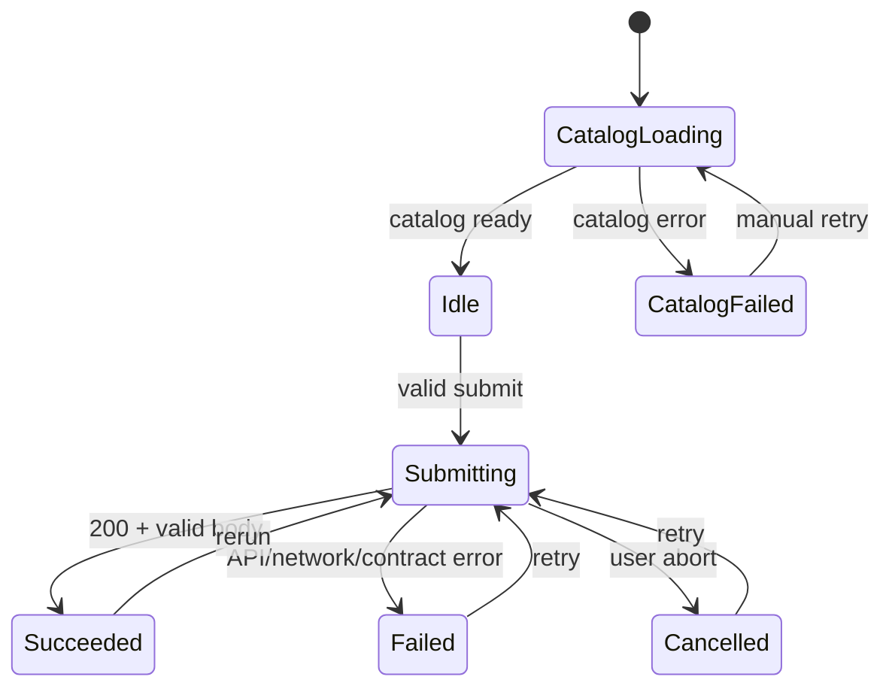

# コンポーネント・状態管理設計

## 1. 方針

- ページ全体の戦闘draftと実行状態は `BattleSimulatorPage` が所有する。
- 状態は関心ごとに3つのsliceへ分割し、それぞれ独立したreducer/hookが持つ（§4）。単一の巨大reducerへ統合しない。
  - Catalog load state: `useCatalogLoader`（`features/catalog-selection/catalog-loader.ts`）
  - 編成draftと選択dialog: `formationReducer`（`features/formation/formation-reducer.ts`）
  - 実行状態: `executionReducer` を内包する `useSimulationExecution`（`features/simulation/execution-reducer.ts`／`use-simulation-execution.ts`）
- ダイアログの検索文字列など一時的UI状態はダイアログ自身が所有する。詳細タブの選択状態も `BattleDetailsSection` のlocal stateとする。
- APIレスポンスは1箇所に保持し、サマリ・詳細表示モデルはselectorで導出する。
- 初期版で外部global state libraryを導入しない。`useReducer`とpure selectorで十分な構造にする。
- URL、localStorage、serverへ編成状態を保存しない。

## 2. コンポーネントツリー

```text
BattleSimulatorApp（API接続設定の検証。不正時はエラー表示のみ）
└── BattleSimulatorPage
    └── AppShell（topbar・main・footer。footerにUI build revisionを表示）
        ├── Panel（step 01: 戦闘パラメータ）
        │   ├── Catalog loading／failed表示（failed時は再読込button）
        │   ├── BattleSetupLayout（味方・VS区切り・敵の3列layout）
        │   │   ├── FormationEditor (side=ally)
        │   │   │   ├── UnitSlot × 6（FRONT 3・REAR 3）
        │   │   │   └── MemorySlot × 6
        │   │   └── FormationEditor (side=enemy)
        │   ├── ExecutionParameterForm
        │   ├── ValidationSummary
        │   └── SubmitControls
        ├── SubmissionFeedback
        ├── Panel（step 02: 戦闘サマリ）
        │   └── BattleSummarySection
        │       ├── OutcomeStrip
        │       └── UnitSummaryTable × 2
        ├── Panel（step 03: 戦闘詳細データ）
        │   └── BattleDetailsSection
        │       ├── Tabs（時系列イベント・状態遷移・レスポンスJSON・ユニット状態・因果ツリー）
        │       ├── EventTimeline
        │       ├── StateTransitionTable
        │       ├── RawJsonView
        │       ├── UnitActionStateSection
        │       └── EventCausalityTree
        ├── UnitSelectionDialog
        └── MemorySelectionDialog
```

- 汎用UI部品は `components/` の `AppShell`・`Panel`・`Button`・`Dialog`・`Tabs`・`DefinitionImage` とする。選択dialogは `Dialog` を、slot・dialogの画像表示は `DefinitionImage` を使う。
- error boundary専用componentは置かない。API接続設定の検証失敗は `BattleSimulatorApp` がエラー表示へ切り替える。
- DialogはDOM上でPage直下に置き、見た目の起点slotはstateで参照する。slot内へdialogをネストしない。

## 3. 主要コンポーネント責務

### `BattleSimulatorPage`

- reducer初期化
- 一覧APIの取得・再読込とCatalog load state管理
- API client composition
- submit/cancel orchestration
- derived validation、request、summaryのmemoization
- 成功時のfocus/scroll制御

### `FormationEditor`

Props：

```ts
interface FormationEditorProps {
  readonly side: Side;
  readonly slots: readonly FormationSlotInput[];
  readonly memoryDefinitionIds: readonly (string | undefined)[];
  readonly catalog: BattleSimulationCatalogResponse;
  readonly violations: readonly UiViolation[];
  readonly disabled: boolean;
  readonly imageMap?: Readonly<Record<string, string>>;
  readonly onOpenUnitSelection: (slotKey: string) => void;
  readonly onOpenMemorySelection: (side: Side, index: number) => void;
}
```

入力を直接変更せず、選択dialogを開くintentだけ通知する。

### `UnitSlot`

- 空/選択済み/警告/エラー/disabledを表示する。
- button要素を使用する。
- 選択済みでも表示名をaccessible nameへ含める。
- 適性外配置はwarning badgeを表示する。

### `UnitSelectionDialog`

- 開くたびに現在slotと選択値を受け取る。
- 検索、属性、ロール、適性、利用可否のfilterを持つ。
- filter結果はCatalog順または表示名順で安定表示する。
- 選択不可定義にはbuttonを出さないかdisabledにし、理由を同じitem内に表示する。
- 選択/解除後に閉じ、元のslotへfocusを戻す。

### `MemorySelectionDialog`

Unit版と同じ基本挙動とし、属性・ロールfilterは持たない。将来タグfilterを追加できる領域を残す。

### `SelectionDialogList`

Unit/Memory両dialogが共有するリスト部品。定義項目の描画・「この枠を空にする」操作・選択buttonのaccessible name生成を担う。「Unit版と同じ基本挙動」を1箇所で保証するため、選択可否の判定（unit側の5体上限など枠固有の事情を含む）は呼び出し側が `disabled` として組み立てて渡す。

### `SubmitControls`

- 実行開始
- 実行中のキャンセル要求
- submit可否の理由表示は `ValidationSummary` が担い、API endpointの読み取り専用表示は `ExecutionParameterForm` が担う

### `BattleSummarySection`

- API DTOを直接集計しない。
- `selectBattleSummary(response, catalog)`の結果だけ受け取る。
- 味方・敵の列構造を同じにする。
- summary projection warningがある場合、表の上に「一部イベントを集計できませんでした」を表示する。

### `EventTimeline`

- event listをsequence昇順表示する。
- 初期表示は簡潔な1行。展開時にdetailsを表示する。
- 100件を超える場合は初期50件、追加読込方式またはvirtualizationを使う。表示件数を黙って切り捨てない。
- filter導入は将来拡張とし、初期版は全件表示でよい。

### `RawJsonView`

- `JSON.stringify(response, null, 2)`の結果を表示する。
- Clipboard APIが使える場合にコピーbuttonを表示する。
- コピー失敗を戦闘失敗として扱わない。

## 4. State model

状態は3つのsliceへ分割し、`BattleSimulatorPage` が各hookを合成する。単一の `BattleSimulatorState` は持たない。

### Catalog load state（`catalog-loader.ts`）

```ts
type CatalogLoadState =
  | { readonly status: "loading" }
  | {
      readonly status: "ready";
      readonly response: BattleSimulationCatalogResponse;
      readonly etag?: string;
      readonly requestId?: string;
    }
  | { readonly status: "failed"; readonly error: UiApiError; readonly requestId?: string };
```

`useCatalogLoader(baseUrl)` が `{ state, reload }` を返す。mount時とreload時に取得する。

### 編成draftと選択dialog（`formation-reducer.ts`）

```ts
interface FormationState {
  readonly draft: BattleDraft;
  readonly selectionDialog: SelectionDialogState;
}

type SelectionDialogState =
  | { readonly kind: "closed" }
  | { readonly kind: "unit"; readonly slotKey: string }
  | { readonly kind: "memory"; readonly side: Side; readonly index: number };
```

### 実行状態（`execution-reducer.ts`／`use-simulation-execution.ts`）

```ts
type ExecutionState =
  | { readonly status: "idle" }
  | {
      readonly status: "submitting";
      readonly executionId: string;
      readonly request: BattleSimulationRequest;
      readonly startedAt: number;
      readonly allyUnitSlotKeys: readonly string[];
      readonly enemyUnitSlotKeys: readonly string[];
      readonly allyMemorySlotKeys: readonly string[];
      readonly enemyMemorySlotKeys: readonly string[];
      readonly previousSuccess?: SuccessfulExecutionSnapshot;
    }
  | {
      readonly status: "succeeded";
      readonly executionId: string;
      readonly request: BattleSimulationRequest;
      readonly response: BattleSimulationResponse;
      readonly requestId?: string;
      readonly completedAt: number;
    }
  | {
      readonly status: "failed";
      readonly executionId: string;
      readonly error: UiApiError;
      readonly requestId?: string;
      readonly allyUnitSlotKeys: readonly string[];
      readonly enemyUnitSlotKeys: readonly string[];
      readonly allyMemorySlotKeys: readonly string[];
      readonly enemyMemorySlotKeys: readonly string[];
      readonly previousSuccess?: SuccessfulExecutionSnapshot;
    }
  | {
      readonly status: "cancelled";
      readonly executionId: string;
      readonly previousSuccess?: SuccessfulExecutionSnapshot;
    };
```

- `executionReducer` はpure functionとし、AbortController・timeout・page unloadの副作用は `useSimulationExecution` が持つ。
- `previousSuccess`は再実行中・失敗・キャンセル後も前回結果を表示するための最小snapshotである。無制限な履歴配列をstateへ保持しない。
- `*SlotKeys` は送信時点のslot対応表である。422 violationsのJSON Pointerを、送信後に編集され得る現在のdraftではなく送信時のslotへ対応づけるため、`submitting`から`failed`へ引き継ぐ（UI-API-004）。
- 詳細タブの選択状態は `BattleDetailsSection` のlocal state（5タブ: `events`／`transitions`／`json`／`actionState`／`causalityTree`）とし、page reducerへ持ち上げない。

## 5. Reducer actions

Catalog load stateのaction（`started`／`succeeded`／`failed`）は `catalog-loader.ts` 内部に閉じ、外へは `reload()` だけを公開する。

```ts
type FormationAction =
  | { type: "unitSelected"; slotKey: string; unitDefinitionId: string }
  | { type: "unitRemoved"; slotKey: string }
  | { type: "memorySelected"; side: Side; index: number; memoryDefinitionId: string }
  | { type: "memoryRemoved"; side: Side; index: number }
  | { type: "turnLimitChanged"; value: number | "" }
  | { type: "logLevelChanged"; value: LogLevel }
  | { type: "selectionOpened"; selection: Exclude<SelectionDialogState, { kind: "closed" }> }
  | { type: "selectionClosed" };

type ExecutionAction =
  | {
      type: "submissionStarted";
      executionId: string;
      request: BattleSimulationRequest;
      startedAt: number;
      allyUnitSlotKeys: readonly string[];
      enemyUnitSlotKeys: readonly string[];
      allyMemorySlotKeys: readonly string[];
      enemyMemorySlotKeys: readonly string[];
    }
  | {
      type: "submissionSucceeded";
      executionId: string;
      response: BattleSimulationResponse;
      requestId?: string;
      completedAt: number;
    }
  | { type: "submissionFailed"; executionId: string; error: UiApiError; requestId?: string }
  | { type: "submissionCancelled"; executionId: string };
```

Reducer規則：

- `catalog.status !== "ready"`ではselection dialogとsubmissionを開始しない（`BattleSimulatorPage` がdialog描画とsubmit可否をguardする）。
- Catalog再取得で選択済み定義が消えた、または `selectable: false`になった場合はdraftから黙って削除せず、`validateDraft` が該当slotをerrorにして送信を禁止する。
- `submissionSucceeded/Failed/Cancelled`のexecutionIdが現在実行と異なる場合は無視する。
- 陣営の選択数が上限（5体）に達している状態での新規unitSelectedは、`formationReducer` がstateを変更せず無視する。あわせて `UnitSelectionDialog` へ `atCapacity` を渡し、選択自体をUI上で不可にして理由を表示する。Reducer内で通知副作用を行わない。
- selection dialogを閉じてもfilter状態はdialog componentのunmountで破棄する。
- draft変更で成功結果を即時破棄しない。結果に「この結果は変更前の条件です」とdirty indicatorを表示する。

## 6. State transition


```mermaid
stateDiagram-v2
    [*] --> CatalogLoading
    CatalogLoading --> Idle: catalog ready
    CatalogLoading --> CatalogFailed: catalog error
    CatalogFailed --> CatalogLoading: manual retry
    Idle --> Submitting: valid submit
    Submitting --> Succeeded: 200 + valid body
    Submitting --> Failed: API/network/contract error
    Submitting --> Cancelled: user abort
    Succeeded --> Submitting: rerun
    Failed --> Submitting: retry
    Cancelled --> Submitting: retry
```

入力検証失敗では `Submitting`へ遷移しない。

## 7. Derived selectors

次をpure functionとする。

```ts
validateDraft(draft, catalog): readonly UiViolation[]
buildBattleSimulationRequest(draft): RequestBuildResult
selectCanSubmit(violations): boolean
selectRoster(response, catalog): readonly RosterEntry[]
selectBattleSummary(response, catalog): SummaryProjection
selectDisplayedSuccess(executionState): SuccessfulExecutionSnapshot | undefined
selectIsCatalogRevisionMismatch(displayedSuccess, catalogRevision): boolean
selectIsResultDirty(latestRequest, displayedSuccessRequest): boolean
mapServerViolationsToUiViolations(violations, ...slotKeys): readonly UiViolation[]
```

`selectIsCatalogRevisionMismatch` は、表示中の成功結果の `catalogRevision` が保持中Catalogと異なる場合（Catalog再読込中・再読込失敗中を含む）にtrueを返し、矛盾した結果の表示を止めて再取得を促す。

Selectorは入力を変更しない。Catalog arrayやevents arrayをsortする場合はcopyを作る。

## 8. Filter state

Unit dialog内部：

```ts
interface UnitFilter {
  readonly query: string;
  readonly attribute?: string;
  readonly role?: string;
  readonly aptitude?: "FRONT" | "REAR";
  readonly availability: "all" | "selectable" | "unavailable";
}
```

- queryはtrimし大文字小文字を区別しない。
- 日本語displayNameとIDの両方を対象にする。
- debounceは初期不要。Catalog 70件程度を同期filterする。
- sortはselectable優先、次にdisplayNameのlocaleCompare、最後にIDとする。

## 9. UI内部エラー

```ts
interface UiViolation {
  readonly path: string;
  readonly slotKey?: string;
  readonly code: string;
  readonly message: string;
}
```

表示文言は `code`ごとの辞書に置き、validatorに長文を埋め込まない。サーバーから来た未知のruleId/messageは安全なtextとして表示し、HTMLとして挿入しない。

## 10. ファイル構成

実装の現状（test・CSS Moduleは各実装ファイルと同名でco-locateするため省略）:

```text
apps/ui/src/
├── main.tsx
├── vite-env.d.ts
├── app/
│   ├── BattleSimulatorApp.tsx
│   └── BattleSimulatorPage.tsx
├── components/
│   ├── AppShell.tsx
│   ├── Button.tsx
│   ├── DefinitionImage.tsx
│   ├── Dialog.tsx
│   ├── Panel.tsx
│   └── Tabs.tsx
├── features/
│   ├── formation/
│   │   ├── BattleSetupLayout.tsx
│   │   ├── ExecutionParameterForm.tsx
│   │   ├── FormationEditor.tsx
│   │   ├── MemorySlot.tsx
│   │   ├── SubmitControls.tsx
│   │   ├── UnitSlot.tsx
│   │   ├── ValidationSummary.tsx
│   │   ├── draft-validation.ts
│   │   ├── formation-reducer.ts
│   │   ├── request-mapper.ts
│   │   └── types.ts
│   ├── catalog-selection/
│   │   ├── MemorySelectionDialog.tsx
│   │   ├── SelectionDialogList.tsx
│   │   ├── UnitSelectionDialog.tsx
│   │   ├── catalog-filter.ts
│   │   ├── catalog-loader.ts
│   │   └── definition-image-map.ts
│   ├── simulation/
│   │   ├── SubmissionFeedback.tsx
│   │   ├── api-client.ts
│   │   ├── api-contract.ts
│   │   ├── error-normalizer.ts
│   │   ├── execution-reducer.ts
│   │   ├── response-validator.ts
│   │   ├── use-simulation-execution.ts
│   │   └── violation-mapper.ts
│   ├── summary/
│   │   ├── BattleSummarySection.tsx
│   │   ├── OutcomeStrip.tsx
│   │   ├── UnitSummaryTable.tsx
│   │   └── summary-projector.ts
│   └── details/
│       ├── BattleDetailsSection.tsx
│       ├── EventCausalityTree.tsx
│       ├── EventTimeline.tsx
│       ├── RawJsonView.tsx
│       ├── StateTransitionTable.tsx
│       ├── UnitActionStateSection.tsx
│       ├── action-state-projector.ts
│       ├── damage-event-formatters.ts
│       ├── delta-flattener.ts
│       ├── event-causality-tree.ts
│       ├── event-formatters.ts
│       └── event-presentation.ts
├── lib/
│   ├── aptitude.ts
│   ├── build-info.ts
│   ├── env.ts
│   └── unknown-narrowing.ts
├── assets/
│   ├── units/    # UNIT_*.webp
│   └── memories/ # MEM_*.webp
├── styles/
│   ├── tokens.css
│   └── global.css
└── test/
    └── setup.ts
```

同一featureでしか使わない型・CSS・testはfeature内にco-locateする。

## 11. コンポーネント受け入れ条件

- `UI-CMP-001`: draft、API response、summaryを重複したmutable stateとして持たない。
- `UI-CMP-002`: 遅れて到着した旧executionの結果が最新stateを上書きしない。
- `UI-CMP-003`: draft変更後も前回結果を保持しdirty表示する。
- `UI-CMP-004`: dialogを閉じた後、起点slotへfocusが戻る。
- `UI-CMP-005`: selection/filter/summaryの主要ロジックがpure functionとしてtest可能である。
- `UI-CMP-006`: 100件超のイベントも黙って切り捨てない。
- `UI-CMP-007`: 画像ロード失敗が親componentのerrorにならない。
- `UI-CMP-008`: 一覧APIのloading/failed/readyを判別し、failedから手動再読込できる。
- `UI-CMP-009`: Catalog未取得またはstale selectionがある状態で戦闘を送信しない。
