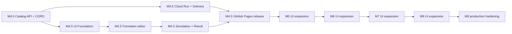

# UI実装・拡張計画

## 1. 目的

M4完了後、M5着手前にM4.5を設け、Unit・Memory一覧API、CORS、Cloud Run API配備、初期UI、GitHub Pages公開を完成させる。その後はDomainマイルストーンの進行に合わせて画面を拡張する。未実装機能を動作しているように見せず、利用可能になったデータだけを段階的に可視化する。

## 2. 依存関係

## 3. M4.5 Backend API・CORS

### 実装項目

- APIをHTTPSで到達可能な検証環境へ配備する。
- 全Unit・Memory、表示用metadata、推移的Capability可否を返すApplication queryを作る。
- `GET /api/v1/battle-simulation-catalog` のDTO、JSON Schema、OpenAPI、ETag/304を作る。
- main thread起動時に検証済みCatalogから不変の一覧read modelを構築し、戦闘実行Workerとは分離する。
- GitHub Pages originを限定許可するCORSをFastifyへ追加する。
- OPTIONS、GET、POST、`Content-Type`、`Accept`、`X-Request-Id`、`If-None-Match`を許可する。
- `X-Request-Id`、`Retry-After`、`ETag`をexposeする。
- 開発localhost originをproduction設定と分離する。
- CORS contract testを追加する。

### 完了条件

- 一覧APIがUnit・Memoryをdefinition ID昇順で返し、selectableとunavailableCapabilitiesがSimulationPreflightValidatorの判定と一致する。
- Skill/EffectAction/Formula等の完全定義をresponseへ公開しない。
- 同じCatalog revisionのETag条件付きGETが304を返す。
- `https://komei0727.github.io`相当の別originから一覧GET、preflight、最小POSTが成功する。
- 許可していないoriginにはCORS headerを返さない。
- credentialsなしで動作する。

UI実装だけではCORSを解決できない。proxy機能のないGitHub Pagesへ回避策を埋め込まない。

## 4. M4.5 Cloud Run・Delivery

### 採用構成

- APIはGoogle Cloud Run serviceへ配備する。
- regionは `asia-northeast1`、service名は `muvluvgg-battle-simulator-api` とする。
- container imageはArtifact Registryへ保存する。
- GitHub ActionsはWorkload Identity FederationでGoogle Cloudへ認証する。
- GitHub PagesはCloud Run serviceの公開HTTPS URLへ直接接続する。

### 実装項目

1. multi-stage Dockerfileとcontainer ignore設定を作る。
2. `apps/api/dist/`、production依存、Catalog、コンパイル済みWorkerだけをruntime imageへ含める。
3. non-root、Linux amd64、`0.0.0.0:$PORT`で起動する。
4. Cloud Runを1 vCPU、1 GiB、minimum 0、maximum 1、concurrency 2、timeout 40秒で構築する。
5. `WORKER_MAX_QUEUE=1`、`SHUTDOWN_GRACE_MS=8000`、production CORS originを設定する。
6. Artifact Registry pushとCloud Run deployのmain workflowを作る。
7. 新revisionでlive、ready、Catalog、simulation、CORS smoke testを実行する。
8. image digest／Git SHA／revisionを記録し、直前revisionへrollbackできるようにする。
9. Billing budget alertとログ保持期間を設定する。
10. Cloud Run service URLをGitHub EnvironmentのPages build設定へ渡す。

### 完了条件

- production containerがnon-rootで起動し、Cloud Run注入 `PORT`、Catalog、Worker、SIGTERMのtestを通る。
- Cloud Runはidle時にscale-to-zeroし、cold start後にCatalog GETと最小simulationを完了する。
- public invocationを許可する一方、CORSを認証とみなさず、bounded queue、timeout、maximum instanceで初期費用境界を持つ。
- 長期service account keyをGitHub Secretsへ保存しない。
- smoke test失敗時に新revisionへtrafficを確定せず、直前revisionへ戻せる。

## 5. M4.5 UI Foundation

### 実装項目

1. `ui/` workspaceを作成する（`#116` `M45-ARCH-001`で`apps/ui/`へ再配置済み）。
2. React、TypeScript、Vite、Vitest、Testing Library、E2E基盤を導入する。
3. GitHub Pages base pathとAPI URL設定を作る。
4. 採用モックからdesign tokens、AppShell、Panel、Button等を移植する。
5. 一覧API client、runtime validation、loading/error/manual retryを作る。
6. Catalog revisionとAPI Request IDを表示する。
7. PR CIへUI quality gateを追加する。

### 完了条件

- 空のUI shellをPages base pathでbuild・previewできる。
- 一覧APIからCatalogを取得するまで編成editorを有効にしない。
- 一覧API失敗・契約違反から手動再読込できる。
- UI bundleにCatalog/Skill/EffectAction定義を含めない。
- `battle-simulator-mock.html`をruntime dependencyにしない。

## 6. M4.5 Formation editor

### 実装項目

1. 味方・敵のFRONT 3 / REAR 3 slotを作る。
2. Unit selection dialog、検索、attribute/role filterを作る。
3. Memory 6 slotとselection dialogを作る。
4. 未対応Capabilityを選択不可表示する。
5. turnLimit/logLevelを作る。
6. draft validatorとrequest mapperを作る。
7. keyboard/focus/画像fallbackを実装する。

### M4.5時点の明示挙動

- 一覧APIが `selectable: true` と返したUnitだけ選択可能にする。
- 一覧APIが `selectable: false` と返したMemoryも表示し、unavailableCapabilitiesを理由として選択不可にする。
- HEAL列はまだ結果領域で0となるが、この段階では結果領域自体を実装しない。

### 完了条件

- 1～5体を各陣営へ設定できる。
- 6体目を拒否する。
- DTO preview testで座標、IDs、turn、logLevelが契約どおりになる。
- keyboardだけで設定できる。

## 7. M4.5 Simulation + Result

### 実装項目

1. API client、Abort、35秒UI timeoutを作る。
2. success/error runtime validationを作る。
3. submit、cancel、rerun、dirty result stateを作る。
4. Outcome stripを作る。
5. Roster、DAMAGE/DEFENSE/HEAL/STATUS projectorを作る。
6. Event formatter registryとgeneric fallbackを作る。
7. State transition tableを作る。
8. Raw JSON view/copyを作る。
9. Catalog revision mismatchを表示する。
10. error code/JSON Pointer/diagnosticId表示を作る。

### 完了条件

- M4最小1対1を画面から実行できる。
- responseの実HPダメージ集計と最終statusがAPI fixtureに一致する。
- event、transition、JSONを確認できる。
- 422、503、504、network/CORS候補を区別して表示する。
- unknown event fixtureでクラッシュしない。

## 8. M4.5 GitHub Pages release

### 実装項目

1. Pages workflowを作る。
2. production API URLをGitHub environment variableで設定する。
3. CSP meta、favicon、title、descriptionを設定する。
4. visual regression、accessibility、mobile E2Eを完了する。
5. deployed Pagesから実API smoke testを行う。
6. 運用手順へUI deploy/rollbackを追加する。

### 完了条件

- mainから自動deployされる。
- Pages URLでasset 404がない。
- HTTPS、CORS、最小simulationが成功する。
- 前回成功artifactへrollbackできる手順がある。
- UI build revision、UI/API Catalog revision、Request IDを確認できる。

## 9. M5 行動ライフサイクル拡張

API v1の既存shapeへM5イベント・状態が追加されることを前提に、詳細表示を追加する。

### 追加表示

- action queueの生成・並べ替え
- AP消費、EX消費、待機理由
- cooldown開始・減算・完了
- charge開始・解放・キャンセル
- finalStateのresources、cooldowns、charge

### UI変更方針

- サマリの基本列は変更しない。
- Event formatter registryへM5 typeを追加する。
- Unit詳細drawerまたはevent展開内にresource変化を追加する。
- action queue専用tabは情報量を確認してから追加し、初期から空tabを置かない。

### 完了条件

- M5追加イベントをgeneric fallbackではなく意味のある文言で表示する。
- cooldown/charge状態をbattleUnitId単位で追跡できる。
- M4 fixtureが引き続き表示できる。

## 10. M6 PSイベントエンジン拡張

### 追加表示

- passive trigger/candidate/resolutionの因果関係
- PP/EX変化
- event parent/root sequenceのtree表示
- memory効果発動

### UI変更方針

- Capabilityが `IMPLEMENTED`になったMemoryを一覧APIの次回取得で自動的に選択可能にする。
- PSイベントは通常の時系列と因果treeを切り替えられるようにする候補とする。
- DIAGNOSTIC固有情報は折りたたみ、既定表示を圧迫しない。

### 完了条件

- Memory選択から効果発動eventまで追跡できる。
- parent/root sequenceの欠番を許容する。
- 詳細ログ量が増えてもeventを黙って削除しない。

## 11. M7 効果・状態異常・回復拡張

### 追加表示

- `HEAL`の実回復量集計
- effect/statusの付与、重複、解除、失効
- stun/freeze/blind等の状態
- advanced target selection
- finalState effects/cooldowns/charge

### UI変更方針

- API契約で回復event type/detailsが確定した後にsummary adapterを追加する。
- HEALは要求量ではなく実HP回復量を集計する。
- effect一覧はUnit詳細へ追加し、サマリ列を無制限に増やさない。
- effectKindKeyの未知値を汎用表示する。

### 完了条件

- HEAL列がfixtureと一致する。
- 付与から失効までevent/transitionで辿れる。
- M4～M6 fixtureを後方互換表示できる。

## 12. M8 高度ダメージ拡張

### 追加表示

- shield吸収、HP damage内訳
- defense ignore
- sub unit、cover、link/intercept
- continuous damage
- 複数hitの内訳

### UI変更方針

- 基本DAMAGEは引き続き最終 `hitPointDamage`を表示する。
- 内訳はevent詳細またはUnit分析drawerへ追加する。
- shield absorbedをDEFENSE列へ混ぜない。別指標を追加する場合は名称と集計規則を新規ADRで定義する。
- DoTのsource attributionはAPI契約を正本とし、付与者をUIで推測しない。

### 完了条件

- calculated、shield absorbed、HP damageを混同せず表示する。
- subUnit/effect collection deltaを汎用JSONだけでなく意味のある表示へ変換する。
- 大量hit/eventで操作不能にならない。

## 13. M9 Production hardening

### 実装項目

- production Catalog/API/UI revisionの整合監視
- response size/99 turn performance検証
- rate limit/capacity UX調整
- browser compatibility最終確認
- CSP、dependency、supply-chain確認
- 運用・rollback・障害切り分け手順
- 一覧APIと戦闘APIのrevision整合・cache運用の最終確認

### 完了条件

- 最大編成・turn 99・DETAILEDの実データを操作可能時間内に表示する。
- UIがresponseを切り捨てず、段階描画する。
- API障害とPages障害の切り分け手順がある。
- 全UI acceptance、accessibility、live E2Eが成功する。

## 14. Issue分割案

| 順位 | Task ID         | Issue  | Milestone | 内容                                             | 依存                                       |
| ---: | --------------- | ------ | --------- | ------------------------------------------------ | ------------------------------------------ |
|    1 | `M45-API-001`   | [#90]  | M4.5      | Catalog一覧Application query・選択可否projection | M1 Catalog                                 |
|    2 | `M45-API-002`   | [#91]  | M4.5      | 一覧GET DTO・Schema・OpenAPI・ETag               | M45-API-001                                |
|    3 | `M45-API-003`   | [#92]  | M4.5      | Fastify CORS設定・contract test                  | M4 API                                     |
|    4 | `M45-INFRA-001` | [#105] | M4.5      | Production container・Cloud Run service基盤      | M45-API-002,003                            |
|    5 | `M45-INFRA-002` | [#106] | M4.5      | Cloud Run CI/CD・smoke test・rollback            | M45-INFRA-001                              |
|    6 | `M45-UI-001`    | [#93]  | M4.5      | UI workspace・CI・theme/AppShell                 | なし                                       |
|    7 | `M45-ARCH-001`  | [#116] | M4.5      | workspaceをapps/api・apps/ui構成へ再編           | M45-UI-001                                 |
|    8 | `M45-UI-002`    | [#94]  | M4.5      | 一覧API client・load state・filter               | M45-API-002,003, M45-UI-001, M45-ARCH-001  |
|    9 | `M45-UI-003`    | [#95]  | M4.5      | 編成editor・選択dialog・draft validation         | M45-UI-002                                 |
|   10 | `M45-UI-004`    | [#96]  | M4.5      | 戦闘API client・execution state・error表示       | M45-API-003, M45-UI-001, M45-ARCH-001      |
|   11 | `M45-UI-005`    | [#97]  | M4.5      | outcome・summary・event/transition/JSON          | M45-UI-004                                 |
|   12 | `M45-UI-006`    | [#98]  | M4.5      | responsive・accessibility・visual/E2E            | M45-UI-003～005                            |
|   13 | `M45-UI-007`    | [#99]  | M4.5      | GitHub Pages deploy・CSP・live smoke             | M45-API-002,003, M45-INFRA-002, M45-UI-006 |
|   14 | `M5-UI-001`     | [#100] | M5        | 行動Queue・AP/EX・Cooldown・Charge表示           | M4.5, M5 Domain                            |
|   15 | `M6-UI-001`     | [#101] | M6        | PS因果・Memory発動・PP/EX表示                    | M5-UI-001, M6 Domain                       |
|   16 | `M7-UI-001`     | [#102] | M7        | Heal集計・Effect/状態異常表示                    | M6-UI-001, M7 Domain                       |
|   17 | `M8-UI-001`     | [#103] | M8        | Shield・SubUnit・高度Damage内訳表示              | M7-UI-001, M8 Domain                       |
|   18 | `M9-UI-001`     | [#104] | M9        | 最大負荷・Security・運用hardening                | M8-UI-001, M9 release準備                  |

[#90]: https://github.com/komei0727/muvluvgg_battle_simulator/issues/90
[#91]: https://github.com/komei0727/muvluvgg_battle_simulator/issues/91
[#92]: https://github.com/komei0727/muvluvgg_battle_simulator/issues/92
[#93]: https://github.com/komei0727/muvluvgg_battle_simulator/issues/93
[#94]: https://github.com/komei0727/muvluvgg_battle_simulator/issues/94
[#95]: https://github.com/komei0727/muvluvgg_battle_simulator/issues/95
[#96]: https://github.com/komei0727/muvluvgg_battle_simulator/issues/96
[#97]: https://github.com/komei0727/muvluvgg_battle_simulator/issues/97
[#98]: https://github.com/komei0727/muvluvgg_battle_simulator/issues/98
[#99]: https://github.com/komei0727/muvluvgg_battle_simulator/issues/99
[#100]: https://github.com/komei0727/muvluvgg_battle_simulator/issues/100
[#101]: https://github.com/komei0727/muvluvgg_battle_simulator/issues/101
[#102]: https://github.com/komei0727/muvluvgg_battle_simulator/issues/102
[#103]: https://github.com/komei0727/muvluvgg_battle_simulator/issues/103
[#104]: https://github.com/komei0727/muvluvgg_battle_simulator/issues/104
[#105]: https://github.com/komei0727/muvluvgg_battle_simulator/issues/105
[#106]: https://github.com/komei0727/muvluvgg_battle_simulator/issues/106
[#116]: https://github.com/komei0727/muvluvgg_battle_simulator/issues/116

1つのPRでscaffold、CORS、全画面、deployを同時に完成させない。pure mapping/testをcomponentより先に固定し、各PRをレビュー可能な大きさにする。

## 15. AI実装時の指示

実装AIは各Taskで次を行う。

1. 本READMEの正本優先順位を確認する。
2. Taskに対応する `UI-AC`、`UI-ARCH`、`UI-API`、`UI-CMP`、`UI-NFR`、`UI-TEST`を列挙する。
3. 対象外機能を実装しない。
4. API/Catalog値をID文字列から推測しない。
5. 先にpure test、次にcomponent、最後にE2Eを追加する。
6. 採用HTMLモックを視覚比較に使うが、固定resultとmonolithic scriptをコピーしない。
7. 未知値fallbackと画像fallbackを維持する。
8. PR本文に満たしたTest IDと未完了項目を記載する。

## 16. UI初期リリース完了条件

- M4.5の `M45-API-001`～`003`、`M45-INFRA-001`～`002`、`M45-UI-001`、`M45-ARCH-001`、`M45-UI-002`～`007`が完了している。
- [01_UI要求・画面設計.md](./01_UI要求・画面設計.md) の `UI-AC-001`～`017`を満たす。
- GitHub PagesからM4 APIの最小戦闘を実行できる。
- 未対応Capabilityを動作済みに見せない。
- HTMLモックと意図しない主要レイアウト差異がない。
- Workload Identity Federation、Cloud Run deploy、Pages deploy、CORS、rollback手順がある。
- M5以降のevent追加で壊れないunknown fallbackがtestされている。
